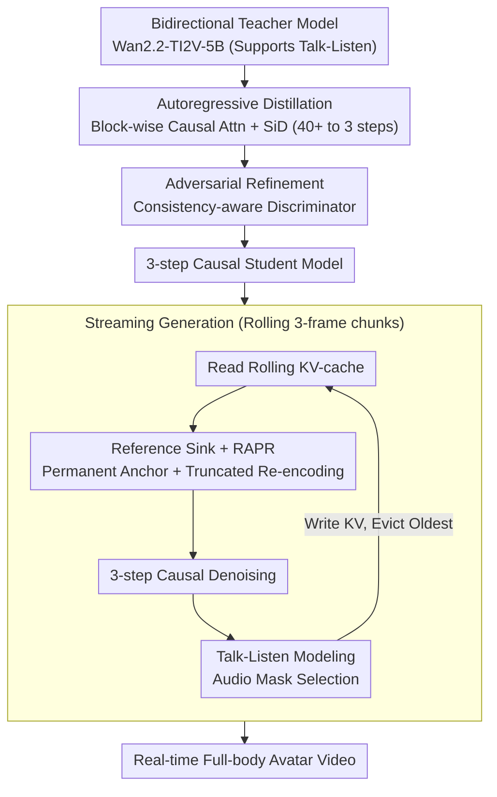

# StreamAvatar: Streaming Diffusion Models for Real-Time Interactive Human Avatars

**Conference**: CVPR 2026  
**arXiv**: [2512.22065](https://arxiv.org/abs/2512.22065)  
**Code**: [https://streamavatar.github.io](https://streamavatar.github.io)  
**Area**: Image Generation  
**Keywords**: Real-time digital human, streaming video generation, autoregressive distillation, talk-listen interaction, diffusion models

## TL;DR
A two-stage autoregressive adaptation framework (autoregressive distillation + adversarial refinement) is proposed to transform bidirectional human video diffusion models into real-time streaming generators. By utilizing Reference Sink, RAPR positional re-encoding, and a consistency-aware discriminator to ensure long-video stability, it achieves the first full-body real-time digital human supporting both talking and listening interactions.

## Background & Motivation

1.  **Background**: Diffusion models have achieved significant success in audio-driven talking avatar generation, producing high-quality videos from single images. Representative works include Hallo3, OmniAvatar, and HunyuanVideo-Avatar.

2.  **Limitations of Prior Work**: Three major challenges hinder practical application:
    *   **Real-time Streaming Generation**: Iterative denoising (25-50 steps) and long-context bidirectional attention in diffusion models require immense computation, and bidirectional attention inherently lacks streaming support. Existing methods require 7-74 minutes to generate 5 seconds of video.
    *   **Long-term Stability**: Streaming interactions require continuous generation of long videos, but autoregressive methods tend to accumulate errors, leading to identity drift and quality degradation.
    *   **Talk-Listen Interaction**: Current methods primarily model speaking behavior, neglecting the listening state. In conversational scenarios, failing to model listening makes interactions appear unnatural. The few methods that model listening are limited to the head-and-shoulder region and lack gesture/full-body expressiveness.

3.  **Key Challenge**: High quality requires powerful bidirectional diffusion models, whereas real-time streaming requires lightweight causal models. The contradiction between quality and speed is the core problem.

4.  **Goal**: Efficiently transform high-fidelity but non-causal human video diffusion models into real-time, streaming, and interaction-ready generators.

5.  **Key Insight**: First train a powerful bidirectional teacher model (supporting talk-listen interaction), then compress it into a 3-step causal autoregressive student model through two-stage distillation and adversarial refinement. Specialized attention mechanisms and positional encoding improvements are proposed for long-video stability.

6.  **Core Idea**: Denoising steps are compressed from 40+ to 3 via autoregressive distillation. Reference Sink and RAPR are introduced to resolve identity drift, enabling the generation of 5 seconds of 720p video in 20 seconds.

## Method

### Overall Architecture
The core contradiction addressed is that high-fidelity human video requires heavy bidirectional diffusion models (40+ denoising steps, sequence-wide bidirectional attention), while real-time streaming requires lightweight causal models. StreamAvatar adopts a "heavy-to-light" strategy: a bidirectional diffusion model supporting talk-listen interaction is first trained as a teacher, which is then compressed into a causal student capable of per-frame generation through two stages.

The backbone is Wan2.2-TI2V-5B (30 DiT blocks). The workflow consists of: Stage 1, where autoregressive distillation replaces bidirectional attention with block-wise causal attention and uses Score Identity Distillation (SiD) to cut denoising from 40+ steps to 3, resulting in a streaming student with some quality loss; Stage 2, where adversarial refinement uses a consistency-aware discriminator to restore the lost quality. During generation, the model is conditioned on a "reference frame + rolling context" and outputs frames in chunks ($C=3$), maintaining stability via Reference Sink and RAPR.

### Key Designs

**1. Autoregressive Distillation: Compressing 40+ steps to 3-step Causal Generation**

Bidirectional models require the full sequence for calculation, preventing streaming. In this approach, the generation window is divided into a reference chunk (1 frame) and several generation chunks (each $C=3$ frames). Causal attention is used between chunks, while bidirectional attention is kept within chunks to preserve local dynamics. A rolling KV-cache manages finite context.

Distillation involves two steps: First, ODE initialization, where the student learns to predict clean frames $\{x_t^0\}$ from noisy frames $\{x_t^n\}$ based on teacher trajectories. Second, Score Identity Distillation with student-forcing ensures the student predicts the next chunk based on its own previous outputs, aligning training and inference distributions. It was discovered that skipping KV-cache updates for clean predictions $\{x_t^0\}$ in favor of noisy $\{x_t^1\}$ as conditions saves a forward pass without quality loss.

**2. Reference Sink + RAPR: Anchoring Identity in Long Videos**

Rolling KV-caches suffer from identity drift as old reference information is evicted. Reference Sink permanently retains KV pairs of the reference frame and the first generated chunk in the cache. 

To address RoPE limitations (OOD indices in long sequences and long-distance decay), RAPR (Reference-Anchored Positional Re-encoding) is proposed. Raw keys are stored in the cache. When generating frame $x_t$, the distance to the reference is truncated to $\min(t, D)$ for some limit $D$. All cached key relative positions are adjusted accordingly before applying RoPE. This ensures the maximum distance is capped, preventing attention decay and OOD issues.

**3. Consistency-aware Discriminator: Dual-branch Refinement**

To restore quality lost during 3-step distillation (e.g., blurring, hand/teeth distortion), a discriminator is initialized from the teacher backbone. $N_Q=3$ Q-Formers extract deep features for two branches: a local authenticity branch for per-frame realism and a global consistency branch that uses cross-attention between reference and frame features to penalize identity deviation.

**4. Talk-Listen Interaction Modeling: Post-Wav2Vec Audio Masking**

Interaction stages are distinguished using an Audio Mask provided by TalkNet. To preserve feature quality, the mask is applied *after* Wav2Vec 2.0 feature extraction. The model incorporates dual audio attention modules: Talk Audio Attention for speech-driven expressions/gestures, and Listen Audio Attention for natural reactive movements.

### Key Experimental Results

#### Main Results (Talking Avatar Generation)

| Method | FID ↓ | FVD ↓ | IQA ↑ | Sync-C ↑ | HKV (Gesture) | HA ↑ | Steps | Res | 5s Speed |
|------|-------|-------|-------|----------|-----------|------|------|--------|---------|
| StableAvatar | 75.20 | 603.54 | 4.66 | 4.24 | 42.92 | 0.909 | 40 | 480p | 12min |
| OmniAvatar | 87.24 | 851.93 | 4.45 | 7.60 | 8.64 | 0.974 | 25 | 480p | 36min |
| HY-Avatar | 76.49 | 557.46 | 4.67 | 6.71 | 54.31 | 0.947 | 50 | 720p | 74min |
| EchoMimicV3 | 78.65 | 724.29 | 4.66 | 3.10 | 25.53 | 0.969 | 25 | 480p | 7min |
| **Ours** | **74.21** | **707.34** | **4.68** | **7.06** | 48.35 | **0.974** | **3** | **720p** | **20s** |

#### Ablation Study

| Configuration | FID ↓ | IQA ↑ | Sync-C ↑ | HA ↑ |
|------|-------|-------|----------|------|
| Baseline (Self Forcing) | 96.58 | 4.29 | 7.04 | 0.948 |
| + Reference Sink | 88.75 | 4.55 | 7.03 | 0.950 |
| + RAPR | 81.63 | 4.64 | 7.06 | 0.956 |
| + GAN w/o Consistency Disc. | 79.68 | 4.65 | 7.05 | 0.947 |
| **Full (Ours)** | **74.21** | **4.68** | **7.06** | **0.974** |

### Key Findings
*   Significant speedup: 3 steps vs. 25-50 steps allows generating 5s of video in 20s (21x faster than the fastest baseline) at 720p resolution.
*   Reference Sink and RAPR are critical for identity maintenance (FID improved from 96.58 to 81.63).
*   Global consistency branch in the discriminator explicitly constrains identity alignment across frames.
*   Listening state motion richness (LHKV) is 3.6x higher than the baseline, indicating successful learning of reactive movements.

## Highlights & Insights
*   RAPR is an elegant RoPE solution that simulates long-video inference environments during training by limiting the distance to reference anchors.
*   The discovery that skipping KV-cache updates for self-conditioning does not affect quality suggests autoregressive diffusion generation is robust to slight noise.
*   Applying audio masks post-Wav2Vec preserves pre-trained feature distribution, a better practice than modifying raw waveforms.

## Limitations & Future Work
*   Finite temporal context may cause inconsistencies in long-duration occluded regions.
*   Distillation inherently limits extremes of motion range.
*   Lack of fine-grained semantic control via text input.
*   VAE decoding remains a bottleneck, accounting for over half of the total latency.

## Related Work & Insights
*   **vs CausVid/Self-Forcing**: StreamAvatar adds Reference Sink, RAPR, and consistency-aware discriminators to solve identity stability.
*   **vs Hallo3/EchoMimicV3**: These are significantly slower and exhibit identity drift in long sequences.
*   **vs INFP/ARIG**: Previous talk-listen models were restricted to head/shoulders; StreamAvatar is the first full-body real-time model.

## Rating
*   **Novelty**: ⭐⭐⭐⭐ Solid two-stage framework, novel RAPR, and first full-body talk-listen model.
*   **Experimental Thoroughness**: ⭐⭐⭐⭐⭐ Comprehensive comparisons, detailed ablation, and real-time performance analysis.
*   **Writing Quality**: ⭐⭐⭐⭐ Clear structure and technical detail.
*   **Value**: ⭐⭐⭐⭐⭐ High demand for interactive avatars; achieves practical deployment speeds.

<!-- RELATED:START -->

## Related Papers

- [\[CVPR 2026\] FlashDecoder: Real-Time Latent-to-Pixel Streaming Decoder with Transformers](flashdecoder_real-time_latent-to-pixel_streaming_decoder_with_transformers.md)
- [\[CVPR 2026\] DreamStereo: Towards Real-Time Stereo Inpainting for HD Videos](dreamstereo_towards_real-time_stereo_inpainting_for_hd_videos.md)
- [\[CVPR 2025\] SemanticDraw: Towards Real-Time Interactive Content Creation from Image Diffusion](../../CVPR2025/image_generation/semanticdraw_towards_real-time_interactive_content_creation_from_image_diffusion.md)
- [\[CVPR 2026\] PortraitDirector: A Hierarchical Disentanglement Framework for Controllable and Real-time Facial Reenactment](portraitdirector_a_hierarchical_disentanglement_framework_for_controllable_and_r.md)
- [\[CVPR 2025\] MobilePortrait: Real-Time One-Shot Neural Head Avatars on Mobile Devices](../../CVPR2025/image_generation/mobileportrait_real-time_one-shot_neural_head_avatars_on_mobile_devices.md)

<!-- RELATED:END -->
