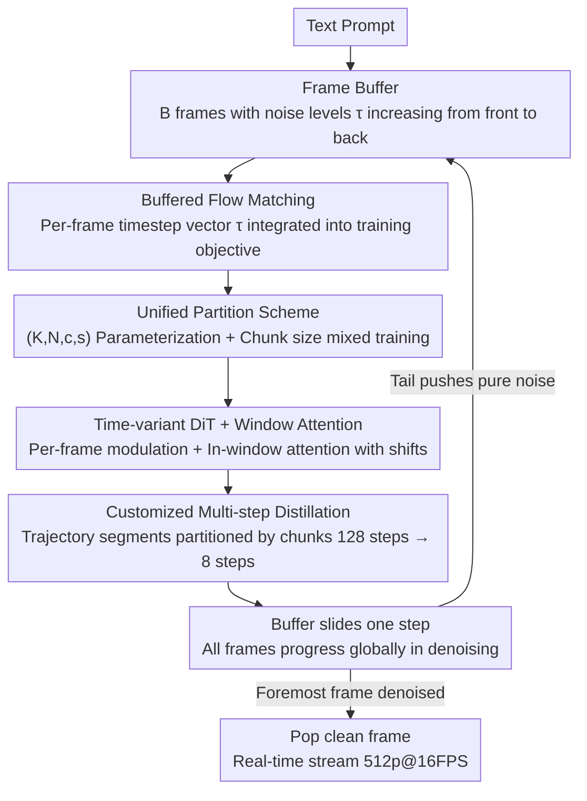

# StreamDiT: Real-Time Streaming Text-to-Video Generation

**Conference**: CVPR 2026  
**arXiv**: [2507.03745](https://arxiv.org/abs/2507.03745)  
**Code**: [https://cumulo-autumn.github.io/StreamDiT/](https://cumulo-autumn.github.io/StreamDiT/) (Project Page)  
**Area**: Diffusion Models / Video Generation  
**Keywords**: Streaming Video Generation, Diffusion Transformer, Real-time Inference, Sampling Distillation, Flow Matching

## TL;DR
StreamDiT proposes a comprehensive streaming video generation solution (including training, modeling, and distillation). By introducing a sliding buffer with progressive denoising in Flow Matching and a mixed partition training strategy, combined with a time-variant DiT architecture with window attention and a customized multi-step distillation method, a 4B parameter model achieves real-time streaming video generation at 512p@16FPS on a single GPU.

## Background & Motivation

1. **Background**: Current state-of-the-art text-to-video (T2V) models (e.g., MovieGen, Hunyuan, Step-Video) are based on the Diffusion Transformer (DiT) architecture. They use bidirectional attention to generate high-quality short videos but are restricted to offline generation of fixed-length clips, failing to support interactive and real-time applications.

2. **Limitations of Prior Work**:
    - Increasing video length is extremely costly due to the quadratic complexity of Transformers relative to sequence length.
    - Autoregressive (AR) approaches can generate long videos but use causal attention, resulting in significantly lower quality than bidirectional attention.
    - Existing training-free streaming methods (StreamDiffusion, FIFO-Diffusion) lack training support, leading to limited quality.
    - Sampling distillation methods (Step Distillation, Consistency Distillation) cannot be directly applied to the non-standard settings of streaming denoising.

3. **Key Challenge**: Low latency (streaming output), high throughput (batch processing), and high quality (bidirectional attention) form an "impossible trinity." AR provides low latency but poor quality; bidirectional diffusion provides high quality but cannot output in a stream.

4. **Goal**: Design a complete trainable and distillable streaming video generation scheme that balances quality and real-time performance.

5. **Key Insight**: Inspired by the diagonal denoising of FIFO-Diffusion, different noise levels are assigned to frames within a buffer, but the quality gap is bridged through a trainable scheme and a mixed partition strategy.

6. **Core Idea**: Incorporate uniform noise and progressive diagonal noise as special cases into a single framework via a unified frame partitioning scheme. Use mixed training to enhance consistency and customized multi-step distillation to achieve real-time inference.

## Method

### Overall Architecture
StreamDiT addresses the challenge of transforming a bidirectional diffusion model, originally designed for offline fixed-length generation, into a continuous streaming generator. The core component is a **frame buffer** containing $B$ frames, each at a different denoising stage: earlier frames are cleaner, while later frames are closer to pure noise. In each denoising step, all frames progress toward a "cleaner" state; once the foremost frame is fully denoised, it is popped from the buffer as the output frame, while a new pure noise frame is pushed into the tail. The buffer slides like a conveyor belt, producing a continuous video stream. Around this mechanism, the paper constructs three layers: **Buffered Flow Matching** to incorporate "different noise for different frames" into the training objective, a **Unified Partition Scheme** to parameterize noise assignment and perform mixed training, and a **Time-variant DiT + Window Attention** architecture to handle heterogeneous noise efficiently while compressing inference via **Customized Multi-step Distillation**.

### Key Designs

**1. Buffered Flow Matching: Integrating Sliding into the Objective**

Standard Flow Matching applies a single timestep $t$ to all frames, denoising the entire segment from noise to clean—inherently "offline and fixed-length." StreamDiT replaces this scalar with a vector of timesteps $\tau = [\tau_1, \dots, \tau_B]$ that increases monotonically along the frame dimension. Training samples are constructed as:

$$\mathbf{X}_\tau^i = \tau \circ \mathbf{X}_1^i + \big(1-(1-\sigma_{min})\tau\big) \circ \mathbf{X}_0$$

where $\circ$ denotes per-frame element-wise modulation, $\mathbf{X}_1$ is the clean video, and $\mathbf{X}_0$ is noise. This ensures the model expects heterogeneous noise levels within a single buffer, making the inference behavior (sliding and popping) perfectly consistent with the training distribution. This is the fundamental reason for its superior quality over training-free methods like FIFO-Diffusion, which suffer from distribution mismatch.

**2. Unified Partition Scheme: Generalizing Noise Patterns**

A fixed monotonic $\tau$ is insufficient as it may lead to overfitting. The paper parameterizes the buffer structure with four variables: $K$ reference frames, $N$ chunks, $c$ frames per chunk, and $s$ denoising micro-steps. The total buffer size is $B = K + N \times c$, and the total denoising steps per cycle are $T = s \times N$. This scheme encapsulates extremes: $c=B, s=1$ regresses to standard uniform noise, while $c=1, s=1$ regresses to diagonal noise (FIFO-style). During training, the **mixed training** strategy switches between chunk sizes $\{1,2,4,8,16\}$, forcing the model to learn a generalized denoising capability independent of specific buffer arrangements.

**3. Time-variant DiT + Window Attention: Architectural Adaptation**

Standard adaLN DiT uses shared temporal embeddings, which cannot differentiate between frames. StreamDiT decouples temporal embeddings along the frame dimension: after reshaping latents to $[F,H,W]$, scale and shift modulations are calculated independently for each frame. For efficiency, full attention is replaced with **window attention**, partitioning the 3D latent into non-overlapping windows $[F_w, H_w, W_w]$. Information propagates via shifted windows in alternate layers, reducing complexity to $\frac{F_w H_w W_w}{FHW}$, which is the primary lever for real-time throughput.

**4. Customized Multi-step Distillation: Segment-based Acceleration**

The teacher model requires many steps (e.g., $s \times N = 128$ steps) and CFG, which is too slow. Standard distillation methods assume a "whole-segment synchronous" trajectory. StreamDiT partitions the Flow Matching trajectory according to the $N$ chunks and performs step distillation **independently within each segment**. Guidance distillation is also integrated to collapse teacher "multi-step + CFG" paths into student "single-step + unconditional" forward passes. This reduces the total denoising steps from 128 to 8 without significant quality loss (0.8163 vs. 0.8185).

### Mechanism: A Complete Streaming Example
Using the distilled configuration: the buffer currently contains frames with noise levels $\tau \approx [0.0, 0.25, 0.5, 0.75, 1.0]$. The model performs **one** forward pass, advancing all frames one step toward 0. The foremost frame reaches 0, is popped for display, and a new noise frame ($\tau=1.0$) is pushed at the end. In actual tests, the distilled model on a single H100 generates 2 latent frames (corresponding to 8 video frames) in 482ms, achieving 16 FPS.

### Loss & Training
Three-stage training: (1) Task Learning—3K high-quality videos, learning rate $1e{-4}$, to adapt to streaming; (2) Task Generalization—2.6M pre-training videos, learning rate $1e{-5}$; (3) Quality Finetuning—High-quality data refinement. Each stage uses 128 H100 GPUs for 10K iterations. Distillation is performed on 64 H100s for 10K iterations.

## Key Experimental Results

### Main Results (VBench Metrics)

| Method | Subject Consistency | Background Consistency | Temporal Flickering | Motion Smoothness | Dynamic Degree | Aesthetic Quality | Total Score |
|------|-----------|-----------|---------|---------|---------|---------|-------|
| ReuseDiffuse | 0.9501 | 0.9615 | 0.9838 | 0.9912 | 0.2900 | 0.5993 | 0.8019 |
| FIFO-Diffusion | 0.9412 | 0.9576 | 0.9796 | 0.9889 | 0.3094 | 0.6088 | 0.7981 |
| StreamDiT (teacher) | 0.9622 | 0.9625 | 0.9671 | 0.9861 | **0.5240** | 0.6026 | **0.8185** |
| StreamDiT (distill) | 0.9491 | 0.9555 | 0.9649 | 0.9831 | **0.7040** | 0.5940 | 0.8163 |

### Ablation Study (Mixed Training Effect)

| Chunk Size Combination | Total Score | Description |
|----------------|-------|------|
| [1] | 0.8129 | Diagonal noise only (Progressive AR Diffusion) |
| [1,2] | 0.8100 | Mixed 2 types |
| [1,2,4] | 0.8080 | Mixed 3 types |
| [1,2,4,8] | 0.8076 | Mixed 4 types |
| [1,2,4,8,16] | **0.8144** | All mixed (Best performance) |

### Key Findings
- StreamDiT outperforms ReuseDiffuse and FIFO-Diffusion in quality and human preference across all dimensions.
- While baselines show higher consistency/smoothness, they produce largely static content (Dynamic Degree 0.29-0.31 vs. StreamDiT's 0.52-0.70).
- The distilled model maintains quality very close to the teacher (0.8163 vs. 0.8185) while reducing steps from 128 to 8.
- Mixed chunk size training is optimal, suggesting a regularization benefit from multi-task learning even if inference uses a fixed size.
- Real-time Performance: The distilled model generates 8 frames in 482ms on an H100, reaching 16 FPS.

## Highlights & Insights
- **Elegance of Unified Partitioning**: Utilizing $(K, N, c, s)$ to unify standard and diagonal diffusion under a single framework provides a highly clean abstraction.
- **Unexpected Benefits of Mixed Training**: Mixing all chunk sizes (including non-streaming chunk=16) improves the quality of streaming generation (chunk=1), indicating a regularization effect.
- **Segmented Distillation**: The idea of partitioning FM trajectories according to buffer segments could be generalized to other non-standard sampling paths.

## Limitations & Future Work
- 4B parameter capacity is limited; some artifacts exist (30B scaling shows significant improvement).
- Short context window—objects leaving the frame may change appearance upon re-entry.
- Window attention may sacrifice some global coherence.
- Future directions: KV cache for extended context, scaling to larger models, and increasing resolution.

## Related Work & Insights
- **vs. FIFO-Diffusion**: FIFO is training-free; StreamDiT significantly improves quality through specialized training and mixed strategies.
- **vs. Self-Forcing**: Self-Forcing is an AR video diffusion scheme with low latency but limited quality; StreamDiT balances both using bidirectional attention in a streaming setup.
- **vs. StreamingT2V**: Uses long/short-term memory blocks in an AR fashion; StreamDiT's unified partition framework is more architecturally unified.

## Rating
- Novelty: ⭐⭐⭐⭐ Unified partitioning and customized distillation are highly original.
- Experimental Thoroughness: ⭐⭐⭐⭐ VBench, human evaluation, and extensive ablations are provided.
- Writing Quality: ⭐⭐⭐⭐⭐ Clear framework, rigorous derivations, and excellent visualizations.
- Value: ⭐⭐⭐⭐⭐ First to achieve real-time streaming video generation, holding significant value for interactive applications.

<!-- RELATED:START -->

## Related Papers

- [\[CVPR 2026\] EgoEdit: Dataset, Real-Time Streaming Model, and Benchmark for Egocentric Video Editing](egoedit_dataset_real-time_streaming_model_and_benchmark_for_egocentric_video_edi.md)
- [\[CVPR 2026\] Endless World: Real-Time 3D-Aware Long Video Generation](endless_world_real-time_3d-aware_long_video_generation.md)
- [\[CVPR 2026\] Reasoning Diffusion for Unpaired Test Time Out-of-distribution Text-Image to Video Generation](reasoning_diffusion_for_unpaired_test_time_out-of-distribution_text-image_to_vid.md)
- [\[CVPR 2026\] U-Mind: A Unified Framework for Real-Time Multimodal Interaction with Audiovisual Generation](u-mind_a_unified_framework_for_real-time_multimodal_interaction_with_audiovisual.md)
- [\[CVPR 2026\] Real-Time Generation of Streamable Talking Portrait Video with Reference-Guided Deep Compression VAEs](real-time_generation_of_streamable_talking_portrait_video_with_reference-guided_.md)

<!-- RELATED:END -->
