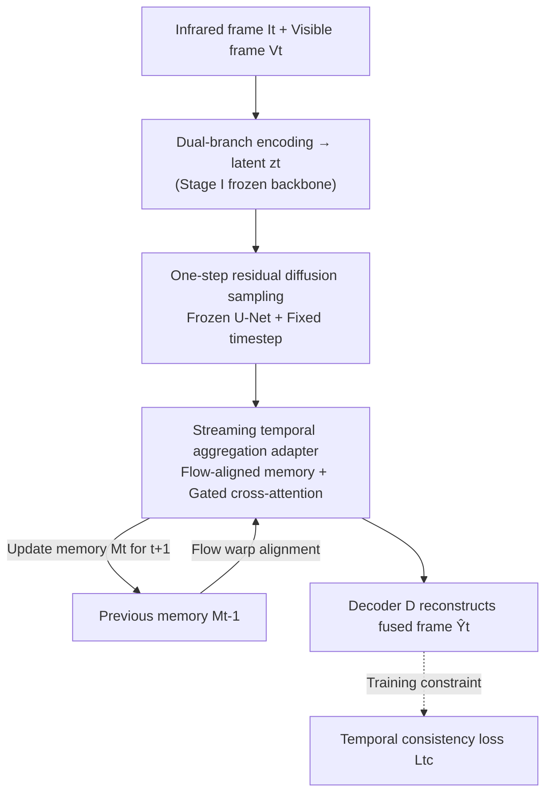

# Streaming Diffusion Model for Fast Infrared and Visible Video Fusion

**Conference**: CVPR 2026  
**Paper**: [CVF Open Access](https://openaccess.thecvf.com/content/CVPR2026/html/Liu_Streaming_Diffusion_Model_for_Fast_Infrared_and_Visible_Video_Fusion_CVPR_2026_paper.html)  
**Code**: https://github.com/DandanYoung/SDMFusion (Available)  
**Area**: Diffusion Models / Infrared and Visible Video Fusion / Low-level Vision  
**Keywords**: Video Fusion, One-step Diffusion, Streaming Memory, Temporal Consistency, Optical Flow Alignment

## TL;DR
SDMFusion distills a pre-trained diffusion model into a "one-step sampling + streaming memory" framework for infrared-visible video fusion. It utilizes single-step residual sampling for real-time speed, gated temporal aggregation adapters with optical flow-aligned memory for inter-frame coherence, and a temporal consistency loss to suppress flickering and ghosting, achieving SOTA quality and the fastest inference across four benchmarks.

## Background & Motivation
**Background**: The goal of infrared-visible fusion is to synthesize thermal radiation (unaffected by lighting, visible at night) and visible texture details into a single video stream, serving as a core technology for all-weather surveillance, autonomous driving, and night reconnaissance. This field has evolved through two stages: the mature "image-level fusion" (CDDFuse, DCEvo, etc.) and the recently rising "video-level fusion."

**Limitations of Prior Work**: Image-level methods process videos as independent frames, neglecting temporal dependencies and resulting in temporal flickering and ghosting/drift, which are detrimental to downstream tasks like tracking and action recognition. Although recent video-based methods introduce temporal modeling, they often rely on coarse mechanisms like temporal averaging or simple recurrent units, failing to capture complex non-linear motions and long-range dependencies, often leading to over-smoothed results or blurred trajectories.

**Key Challenge**: Diffusion models possess strong generative priors that could restore details and fix artifacts, but their iterative denoising process is prohibitively slow for long video sequences. Furthermore, existing one-step distillation techniques are "temporal-blind"—applying them directly produces high-quality but inconsistent frames. Thus, a fundamental dilemma exists between **high fidelity** and **temporal stability + real-time speed**.

**Goal**: To maintain real-time performance while preserving detail fidelity from diffusion priors and explicitly modeling temporal dynamics for inter-frame coherence.

**Core Idea**: Compress the generative prior of pre-trained diffusion models into a one-step sampling framework while introducing a memory-augmented latent pipeline. By using temporal aggregation adapters to align and propagate cross-frame features and a specialized temporal consistency loss, the tasks of "pursuing high fidelity" and "maintaining temporal stability" are decoupled.

## Method

### Overall Architecture
Given a pair of aligned infrared-visible video sequences $\{(I_t, V_t)\}_{t=1}^{T}$, the goal is to generate a temporally coherent fused sequence $\{\hat{Y}_t\}_{t=1}^{T}$. SDMFusion adopts a **two-stage** design: Stage I learns a cross-modal encoding-decoding backbone (image-level fusion backbone) on static image pairs; Stage II freezes this backbone and introduces the "Streaming Diffusion Model (SDM) + Flow-guided Feature Propagation" to refine temporal representations frame-by-frame in the latent space. This decoupling ensures stable training, leveraging strong image priors while enabling efficient video fusion.

For each frame: A dual-branch encoder extracts cross-modal features fused as $G_t = F(B(I_t), B(V_t))$, which is downsampled by a factor $s$ into a latent variable $z_t$ to reduce computational overhead. A pre-trained Stable Diffusion denoising U-Net (**frozen throughout**) is utilized, with adapters inserted after its decoding layers for single-step residual correction. Memory from the previous frame, warped and aligned via optical flow, is injected through adapters for temporal aggregation. Finally, the refined latent features are restored to the original resolution, and the fused frame is reconstructed by the image decoder $D$. A temporal consistency loss is applied during training to ensure stable feature propagation.

### Key Designs

**1. Two-stage Decoupling + Task-Adaptive VAE: Separating Fidelity and Temporal Stability**

Training a heavy video diffusion model directly is unstable and slow. The authors split the task: Stage I focuses on static image pairs to master image-level fusion priors; Stage II freezes this backbone and adds streaming diffusion and flow propagation for temporal processing. This decoupling ensures "achieving high fidelity" (via Stage I) and "maintaining temporal stability" (via Stage II) do not interfere with each other. Additionally, standard VAEs in latent diffusion are typically trained on the visible light distribution $P_V$. Encoding fused content ($P_F$ from both modalities) causes a distribution shift: $\mathrm{KL}(p_F(z_t)\,\|\,p_V(z_t))$ is large, leading to spatial misalignment and ghosting. To address this, the authors replace the standard VAE with a DCEvo-style task-adaptive encoder-decoder trained to align with the fused latent distribution.

**2. One-step Residual Diffusion Sampling: Replacing Iterative Denoising with Single Forward Pass**

Diffusion is slow because the reverse process iteratively denoises from $z_T$ (e.g., $z_{t-1} \leftarrow S(z_t, t, \epsilon_\theta(z_t,t,c))$). Borrowing from one-step latent diffusion paradigms, the authors distill the process into a single residual prediction at a fixed timestep $\hat{t}$: the denoiser predicts the residual $r_t = \epsilon_\theta(z_x; c, \hat{t})$ on downsampled latent features, followed by a closed-form one-step update:

$$z_y = \frac{z_x - \sqrt{1-\bar{\alpha}_{\hat{t}}}\, r_t}{\sqrt{\bar{\alpha}_{\hat{t}}}}$$

where $\bar{\alpha}_{\hat{t}} = \prod_{s=1}^{\hat{t}} \alpha_s$ follows a standard schedule. This replaces the entire sampling chain with a single forward pass, retaining generative priors for fidelity. The U-Net is **frozen**, and only the adapters inserted after decoding layers are trained, ensuring acceleration without damaging the pre-trained capability.

**3. Streaming Memory-augmented Temporal Aggregation Adapter: Cross-frame Alignment via Single Memory**

Multi-frame input schemes are memory-intensive and introduce latency. The authors employ a **streaming** approach: each step requires only the current frame, the previous frame, and a prior memory $M_{t-1}$. An optical flow estimator calculates $O_{t-1\to t}$, and the memory is warped to the current timestep: $\tilde{F}_{t-1\to t} = \mathcal{W}(M_{t-1}, O_{t-1\to t})$. Each adapter performs "lightweight cross-attention + gated residual fusion": query $Q^{(k)}$ is projected from current features $F_t^{(k)}$, while key/value pairs come from aligned memory $\tilde{F}_{t-1\to t}^{(k)}$. A learned gate is calculated:

$$\gamma^{(k)} = \sigma\!\left(\phi_g^{(k)}\big(\mathrm{Cat}(F_t^{(k)}, \tilde{F}_{t-1\to t}^{(k)})\big)\right)$$

followed by gated attention aggregation $A^{(k)} = \mathrm{Softmax}\!\big((Q^{(k)}\odot\gamma^{(k)})(K^{(k)}\odot\gamma^{(k)})^\top/\sqrt{C}\big)$ and $\hat{F}_t^{(k)} = F_t^{(k)} + A^{(k)}V^{(k)}$. The gate allows current features to **selectively** absorb complementary cues, suppressing motion artifacts and flickering. Finally, the state is updated as $M_t^{(k)} = \phi_m^{(k)}(\hat{F}_t^{(k)})$ and passed to the next frame.

**4. Temporal Consistency Loss: Pixel-level Stability via Motion Compensation**

To further ensure stability, the authors introduce a temporal consistency loss $L_{tc}$ in Stage II. Using a pre-trained SpyNet to estimate forward flow $O_{t-1\to t}$, the previous fused frame is warped to the current timestep, and differences are calculated only in valid regions (defined by a binary mask $M_t$):

$$L_{tc} = \frac{1}{T-1}\sum_{t=2}^{T} \frac{\big\|(\hat{Y}_t - \mathcal{W}(\hat{Y}_{t-1}, O_{t-1\to t}))\odot M_t\big\|_1}{\sum M_t + \varepsilon}$$

This forces the current frame to be consistent with the motion-compensated previous frame. The total loss is $L_{total} = \lambda_{V,I}L_{V,I} + \lambda_{fus}L_{fus} + \lambda_{deco}L_{deco} + \lambda_{tc}L_{tc}$.

### Loss & Training
Two-stage training: Stage I trains the image backbone (batch size 12); Stage II trains the streaming diffusion (batch size 1, sequence length 6, with $L_{tc}$ enabled). Both stages use AdamW with an initial learning rate of $1\times10^{-4}$ and cosine annealing down to $1\times10^{-5}$. Implementation via PyTorch on a single RTX 5090.

## Key Experimental Results

### Main Results
Evaluated on HDO, M3SVD, VTMOT, and NOT-156 benchmarks against 7 image-level and 2 video-level methods (UniVF, TemCoCo). Metrics include SCD (Spatial Consistency), VIF (Visual Fidelity), and mSSIM. SDMFusion achieved SOTA or competitive results:

| Dataset | Metric | Ours | DCEvo (CVPR'25) | UniVF (NeurIPS'25) | TemCoCo (ICCV'25) |
|--------|------|------|------|------|------|
| M3SVD | SCD↑ | **1.776** | 1.747 | 1.721 | 1.553 |
| M3SVD | VIF↑ | **0.926** | 0.871 | 0.914 | 0.678 |
| M3SVD | mSSIM↑ | **0.955** | 0.933 | 0.939 | 0.894 |
| VTMOT | VIF↑ | 1.026 | 1.026 | **1.068** | 0.716 |
| NOT-156 | VIF↑ | **0.937** | 0.913 | 0.912 | 0.455 |
| HDO | mSSIM↑ | **1.135** | 1.127 | 1.113 | 0.953 |

Downstream target tracking performance (NOT-156, ByteTrack + YOLOv11n) also verified the quality improvements:

| Metric | Ours | Mask-Dif | DCEvo | UniVF |
|------|------|----------|-------|-------|
| AUC↑ | **0.3799** | 0.3774 | 0.3673 | 0.3553 |
| SR@0.5↑ | **0.4350** | 0.4277 | 0.4200 | 0.3826 |
| SR@0.75↑ | 0.1700 | **0.1785** | 0.1550 | 0.1363 |
| DP@20↑ | **0.3900** | 0.3836 | 0.3800 | 0.3607 |

### Ablation Study
Ablation of key components on M3SVD and VTMOT (TFP=Temporal Feature Propagation, adapter=Post-decoding adapter, TC loss=Temporal Consistency loss):

| Config | M3SVD SCD↑ | M3SVD VIF↑ | M3SVD mSSIM↑ | VTMOT VIF↑ | Note |
|------|-----------|-----------|--------------|-----------|------|
| w/o TFP | 1.771 | 0.873 | 0.945 | 1.018 | Replaced temporal prior with current features |
| w/o adapter | 1.743 | 0.897 | 0.946 | 1.024 | Replaced adapter with standard convolution |
| w/o TC loss | 1.769 | 0.920 | 0.950 | 1.018 | Removed temporal consistency loss |
| Ours (Full) | **1.776** | **0.926** | **0.955** | **1.026** | Full model |

### Key Findings
- **Adapters contribute most to spatial consistency (SCD)**: Replacing them with standard convolutions significantly dropped SCD, proving that gated cross-attention is the primary source of inter-frame coherence.
- **TFP dominates visual fidelity (VIF)**: Removing memory injection caused the largest drop in VIF, confirming that propagating previous frame info helps recover details lost to motion or occlusion.
- **Efficiency lead**: Total inference time on VTMOT is 1.42× faster than the runner-up due to latent compression and one-step sampling.
- **Quality Analysis**: Frame difference visualizations show minimal fluctuations in static backgrounds and sharp motion boundaries.

## Highlights & Insights
- **"Frozen U-Net + Adapters + One-step Residual" Triad**: Leverages pre-trained generative priors while training only lightweight adapters, balancing speed and fidelity—a paradigm transferable to other video generation/restoration tasks.
- **Streaming Memory vs. Multi-frame Stacking**: Using "current frame + memory" avoids redundant computation and latency, a scalable approach for real-time video tasks.
- **Gated Cross-attention**: The learned gate $\gamma$ allows selective integration of motion-aligned memory, more effective at suppressing flicker than simple temporal averaging.
- **Distribution Mismatch Diagnosis**: Explicitly addressing the mismatch in single-mode VAEs for multi-modal fusion tasks provides a valuable lesson for latent-space architectures.

## Limitations & Future Work
- **Parameter Size**: The diffusion-based architecture has more parameters than competitors, potentially limiting deployment on extreme resource-constrained edge devices.
- **Dependence on Optical Flow**: Memory alignment and $L_{tc}$ rely on SpyNet; quality may degrade in scenes with extreme motion, occlusions, or poor texture where flow estimation fails.
- **SR@0.75 in Tracking**: Performance under strict overlap thresholds was slightly lower than Mask-Dif, suggesting room for improvement in high-precision localization.
- **Improvements**: Future work could explore lighter distillation or robust motion representations (e.g., self-learned implicit alignment) to reduce reliance on external flow estimators.

## Related Work & Insights
- **vs. Image-level Fusion (CDDFuse / DCEvo)**: These ignore temporal dependencies; SDMFusion explicitly models cross-frame reliance and solves flickering/ghosting.
- **vs. Iterative Diffusion Fusion (Mask-Dif)**: While iterative methods provide fidelity, they are slow. SDMFusion uses one-step residual sampling to maintain fidelity while achieving real-time speed.
- **vs. Video Fusion (UniVF / TemCoCo)**: UniVF uses multi-frame stacking which is computationally expensive. SDMFusion's streaming approach is 1.42× faster with superior quality.

## Rating
- Novelty: ⭐⭐⭐⭐ Combines one-step diffusion with streaming memory for video fusion effectively.
- Experimental Thoroughness: ⭐⭐⭐⭐ Exhaustive benchmarks and downstream tasks, though some tracking metrics are not optimal.
- Writing Quality: ⭐⭐⭐⭐ Clear motivation and methodology, though some notation in Eq. 4 is slightly ambiguous.
- Value: ⭐⭐⭐⭐ High practical value for all-weather perception in surveillance and autonomous driving.

<!-- RELATED:START -->

## Related Papers

- [\[CVPR 2026\] Taming Generative Diffusion Model for Task-Oriented Infrared Imaging](taming_generative_diffusion_model_for_task-oriented_infrared_imaging.md)
- [\[CVPR 2026\] StreamDiT: Real-Time Streaming Text-to-Video Generation](streamdit_real-time_streaming_text-to-video_generation.md)
- [\[CVPR 2026\] StreamAvatar: Streaming Diffusion Models for Real-Time Interactive Human Avatars](streamavatar_streaming_diffusion_models_for_real-time_interactive_human_avatars.md)
- [\[AAAI 2026\] Hierarchical Schedule Optimization for Fast and Robust Diffusion Model Sampling](../../AAAI2026/image_generation/hierarchical_schedule_optimization_for_fast_and_robust_diffusion_model_sampling.md)
- [\[CVPR 2026\] Diff-SemiER: Transparency-Aware Adaptive Fusion Diffusion Model with Generative Prior for Semi-Transparent Eyeglasses Removal](diff-semier_transparency-aware_adaptive_fusion_diffusion_model_with_generative_p.md)

<!-- RELATED:END -->
