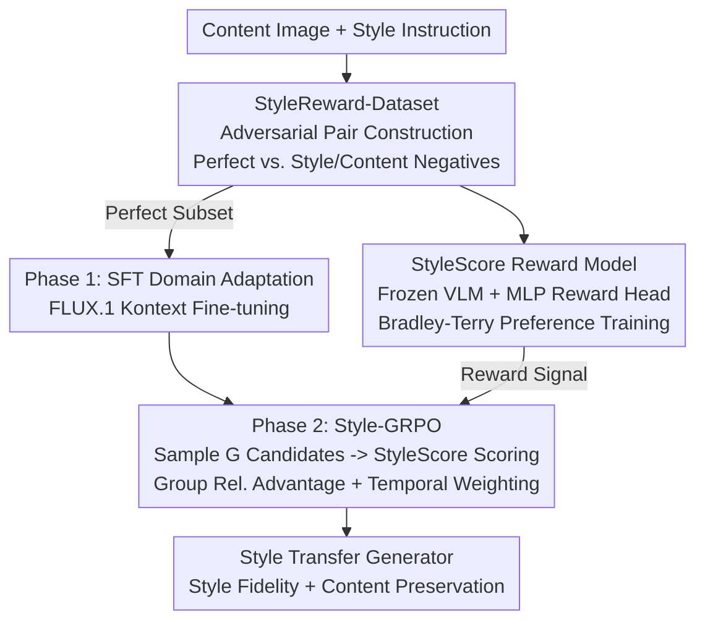

# Style-GRPO: Semantic-Aware Preference Optimization for Image Style Transfer Guided by Reward Modeling

**Conference**: CVPR 2026  
**Paper**: [CVF Open Access](https://openaccess.thecvf.com/content/CVPR2026/html/Zhao_Style-GRPO_Semantic-Aware_Preference_Optimization_for_Image_Style_Transfer_Guided_by_CVPR_2026_paper.html)  
**Code**: None  
**Area**: Image Generation / Style Transfer / Preference Optimization  
**Keywords**: Style Transfer, GRPO, Reward Modeling, Style-Content Decoupling, Diffusion Post-training

## TL;DR
Addressing the persistent "style leakage + semantic drift" issue in diffusion-based editing models for style transfer, this work constructs a preference dataset, StyleReward-Dataset, containing 300,000 adversarial image pairs. A multimodal reward model, StyleScore, is trained to simultaneously evaluate style consistency and content fidelity. By employing a two-stage "SFT Domain Adaptation + GRPO Preference Optimization" pipeline, FLUX.1[Kontext] is fine-tuned to achieve SOTA performance. It leads in both style fidelity and content preservation on ImgEdit/AnyEdit benchmarks and was selected as the top choice by 87.5% of participants in a user study.

## Background & Motivation
**Background**: Current instruction-guided style transfer is built upon flow-based diffusion editing models (e.g., FLUX.1[Kontext], Qwen-Image-Edit). Given a content image and a style instruction, the model aims to transform the entire image into the target style while preserving content semantics.

**Limitations of Prior Work**: Most models are optimized for **local editing** (object addition/deletion, local inpainting), excelling at "changing specific regions while keeping others unchanged." However, style transfer requires **global transformation**—the entire image must change style while maintaining the subject's identity. Directly applying local editing models to global style transfer often results in either insufficient stylization or corrupted content (semantic drift, e.g., structural collapse when converting a castle to watercolor or identity change when turning a chair into pop art).

**Key Challenge**: There exists a trade-off between style consistency and content fidelity. Strengthening style often sacrifices content structure, while stabilizing content can lead to inadequate stylization. Supervised Fine-Tuning (SFT) partially mitigates this but tends to overfit dataset biases and generalizes poorly to unseen compound styles.

**Core Problem**: Utilizing RL/preference optimization to align this trade-off is hindered by the **lack of reliable reward signals**. General VLM reward models (e.g., Qwen2.5-VL, ImageReward) fail to distinguish between "correct style but wrong content" and "correct content but wrong style," often conflating general aesthetics with style fidelity and failing to characterize fine-grained decoupling in style transfer.

**Core Idea**: This work first **teaches a reward model (StyleScore) to recognize this trade-off** using adversarially constructed preference data. This reward model then drives GRPO online optimization of the generator, allowing the model to learn directly from the "style vs. content" trade-off rather than relying on fixed supervision from SFT.

## Method

### Overall Architecture
The methodology consists of a three-part pipeline: ① Construction of **StyleReward-Dataset**, a preference dataset of 300,000 adversarial pairs where each content sample is paired with a "perfect" image (correct style and content) and negative examples ("style-only" or "content-only"), explicitly encoding style-content decoupling. ② Training of **StyleScore**, a multimodal reward model using a frozen Qwen2.5-VL-7B backbone with an MLP reward head, providing a scalar score to quantify style consistency, content preservation, and perceptual quality. ③ **Style-GRPO Two-Stage Post-training** to tune the base FLUX.1[Kontext] model—first performing SFT for domain adaptation on the perfect pair subset, followed by GRPO online reinforcement learning using StyleScore as the reward function. These components are interdependent: the dataset trains the reward model, the reward model acts as the judge for GRPO, and GRPO learns fine-grained trade-offs.

### Key Designs

**1. StyleReward-Dataset: Explicitly Encoding "Style-Content Decoupling" via Adversarial Pairs**

General style transfer datasets only provide positive pairs ("content image + target style image"), preventing the model from learning "what is wrong." This work generates a **perfect pair** and two types of **imperfect pairs** for each content sample, forcing the model to distinguish between failure dimensions through contrast. Specifically, content data is sampled from GenRef-wds (20k pairs), and style data includes real styles (WikiArt, Style30K, Omnistyle) and virtual styles (structured templates generated via GPT-5 + T2I synthesis). After multi-stage filtering (Aesthetic score / GPT-4o / Gemini), three types of samples are constructed: perfect pairs (Omnistyle, StyleID generated, expert-verified for style and semantics), "correct content but wrong style" (preserved content, deviated tone/texture), and "correct style but wrong content" (style match but semantic drift due to content prompt alteration). The final dataset comprises 300,000 adversarial pairs and 150,000 prompts. This adversarial construction enables the reward model to learn the decision boundaries for style and content independently rather than just a vague notion of "beauty."

**2. StyleScore: Frozen VLM + MLP Reward Head for a Unified Style-Content Judge**

General VLM reward models conflate aesthetics and style fidelity, failing to penalize results that sacrifice content for beauty. StyleScore uses Qwen2.5-VL-7B as the backbone, replacing the language modeling head with a two-layer MLP reward head that outputs a scalar reward. For a query $x=(c, x_c)$ (instruction $c$ + content image $x_c$) and a response image $y$, the multimodal input passes through the backbone to extract the final latent state $h_{final}$. The reward head calculates $l_{act}=\mathrm{SiLU}(W_1 h_{final}+b_1)$ and $r_\phi(y|x)=W_2 l_{act}+b_2$. The score at the last token is taken as the sequence scalar reward $r_i=R_i[-1]$. Training employs the Bradley-Terry preference model:

$$P(y_w \succ y_l \mid x) = \sigma\big(r_\phi(y_w \mid x) - r_\phi(y_l \mid x)\big)$$

$$\mathcal{L}_{Reward}(\theta) = \mathbb{E}_{(x, y_w, y_l)\sim D}\big[-\log \sigma(r_w - r_l)\big]$$

where $y_w$ is the perfect image and $y_l$ is the degraded image. The goal is to maximize the reward margin between them. Only the MLP reward head and light components are updated via LoRA (rank 64), while the backbone remains frozen. On a 500-pair test set, StyleScore achieved a preference accuracy of 98.6%, significantly higher than Qwen2.5-VL (65.2%) and ImageReward (48.7%).

**3. Style-GRPO: SFT Domain Adaptation + GRPO Preference Optimization**

Directly running RL on editing models often fails because standard optimization targets (e.g., PPO/DPO) fall within the pre-training distribution, whereas style transfer targets span numerous unseen artistic domains. Thus, **Phase 1 SFT** first fine-tunes FLUX.1[Kontext] on the perfect pair subset using the flow-matching objective $\mathcal{L}_{SFT}=\mathbb{E}_{t,z}\big[\lVert v_\theta(z,t,c)-u_t(z|c)\rVert_2^2\big]$ to adapt the model to the style transfer domain. **Phase 2 GRPO** then performs fine-grained decoupling. Following Flow-GRPO, deterministic ODE sampling is replaced with stochastic SDE to introduce exploration noise. For each instruction $c$, $G$ trajectories are sampled and scored by StyleScore. The group-normalized advantage is calculated as:

$$\hat{A}^i_t = \frac{R(\hat{x}^i_0; x^i_0, c) - \mathrm{mean}(\{R(\hat{x}^j_0)\}_{j=1}^G)}{\mathrm{std}(\{R(\hat{x}^j_0)\}_{j=1}^G)}$$

The policy is updated using a clipped objective with KL constraint: $\mathcal{L}_{Style\text{-}GRPO}(\theta)=\mathbb{E}\big[\frac{1}{G}\sum_i \frac{1}{T}\sum_t \min(r^i_t \hat{A}^i_t,\, \mathrm{clip}(r^i_t,1-\epsilon,1+\epsilon)\hat{A}^i_t) - \beta D_{KL}(\pi_\theta \Vert \pi_{ref})\big]$, where the probability ratio $r^i_t=\frac{p_\theta(x^i_{t-1}|x^i_t,c)}{p_{\theta_{old}}(x^i_{t-1}|x^i_t,c)}$. Additionally, the authors introduce a temporal-aware reward weighting $w(t)=\alpha^{t/T}$ (exponential decay), recognizing that **early denoising steps are more critical for global style**, thus assigning higher weights to reward signals in early timesteps.

### Loss & Training
- **Reward Model**: Qwen2.5-VL-7B + LoRA (rank 64), lr 5e-5, batch 32, Bradley-Terry loss.
- **SFT**: FLUX.1[Kontext] + LoRA (rank 128), batch 32, flow-matching objective, perfect subset only.
- **GRPO**: LoRA (rank 128), lr 5e-4, importance clip 1e-4, group size 16, KL coefficient 0.01; Reward signal = StyleScore + CLIP Score + Aesthetic Score; Resolution 1024×1024; Trained on 8×H200.

## Key Experimental Results

### Main Results
Comparison with SOTA on ImgEdit (GPT-4o / Gemini-2.5-Pro scoring) and AnyEdit (CLIP/DINO metrics):

| Method | ImgEdit GPT-4o↑ | ImgEdit Gemini↑ | CLIPimg↑ | CLIPtext↑ | L1 Dist↓ | DINO↑ | StyleScore↑ |
|------|------|------|------|------|------|------|------|
| InstructP2P | 3.55 | 2.65 | 0.8260 | 0.1717 | 0.1550 | 0.7104 | 3.21 |
| DiffStyler | 1.51 | 1.65 | 0.4900 | 0.1889 | 0.2395 | 0.5875 | 2.03 |
| StyleBooth | 4.33 | 3.88 | 0.8221 | **0.1986** | 0.2075 | 0.7230 | 3.46 |
| Omnistyle | 3.77 | 2.38 | 0.7590 | 0.1797 | 0.1907 | 0.6981 | 2.96 |
| FLUX.1 Kontext | 4.55 | 4.29 | 0.8215 | 0.1857 | 0.2457 | 0.7311 | 3.77 |
| **Ours** | **4.74** | **4.46** | **0.8452** | 0.1664 | **0.0944** | **0.7583** | **3.91** |

Ours leads across ImgEdit scores, CLIPimg, L1, DINO, and StyleScore. Notably, L1 distance dropped from 0.155 to 0.094 while DINO rose to 0.758, indicating significantly improved structure fidelity. The slightly lower CLIPtext is an expected trade-off: the model prioritizes fine-grained visual cues from the reference image over generic text priors.

Reward model preference accuracy and user study:

| Evaluation | Comparison | Result |
|------|--------|------|
| RM Preference Accuracy | Qwen2.5-VL / ImageReward / Ours | 65.2% / 48.7% / **98.6%** |
| User Study Rank-1 Ratio | FLUX Kontext / Ours | 10.3% / **87.5%** |

In a blind test with 36 participants on 50 prompts, Ours was chosen as rank-1 87.5% of the time, demonstrating alignment with human preferences for high-fidelity style transfer.

### Ablation Study
Contribution of SFT and GRPO phases (ImgEdit + StyleScore):

| Configuration | GPT-4o | Gemini | StyleScore | Description |
|------|--------|--------|------------|------|
| FLUX.1 Kontext (Baseline) | 4.55 | 4.29 | 3.77 | Original model |
| +SFT | 4.67 | 4.34 | 3.82 | Domain adaptation only |
| +Post-Training (GRPO only) | 4.68 | 4.30 | 3.85 | Direct GRPO on baseline |
| +SFT+Post-Training | **4.74** | **4.46** | **3.91** | Full two-stage pipeline |

### Key Findings
- **SFT or GRPO independently can surpass the baseline**, and GRPO alone can rival or slightly exceed SFT. This suggests that direct preference optimization guided by StyleScore is inherently powerful.
- **The two-stage combination is optimal**: SFT provides a stable, "style-aware" initial policy, enabling more effective exploration and convergence for GRPO.
- **Significant lead in L1/DINO**: Achieving the highest style scores while maintaining the stablest content structure addresses the core decoupling challenge in style transfer.

## Highlights & Insights
- **Explicit Trade-off Encoding via Adversarial Pairs**: Instead of letting the model learn trade-offs implicitly, this work exposes it to failures in two independent dimensions ("style-only" vs "content-only"). This is the root of the 98.6% preference accuracy. This approach is transferable to any generation task with competing objectives.
- **Specialized RM >> General VLM RM**: General VLMs conflate aesthetics and fidelity. A specialized StyleScore reaches 98.6%, suggesting that the bottleneck for RLHF/GRPO methods often lies in reward signal quality rather than policy optimization algorithms.
- **Temporal-Aware Reward Weighting**: Encoding the diffusion prior that "early steps determine global style" into $w(t)$ is a lightweight, physically intuitive trick applicable to other diffusion RL tasks.
- **SFT as a "Stable Foundation" for RL**: Ablations show that while GRPO can work alone, starting from a domain-adapted policy (SFT) leads to better exploration, mirroring the "SFT cold-start + RL" paradigm in LLM post-training.

## Limitations & Future Work
- Current support is limited to **text-guided** style transfer; future work aims to incorporate **image-guided** prompts for finer artistic control.
- ⚠️ The pipeline heavily relies on large-scale closed/open-source models (GPT-5, Gemini-2.5, GPT-4o, multiple Qwen2.5-VL sizes) and expert validation, posing questions regarding the cost and reproducibility of the 300k adversarial pairs.
- ⚠️ The 98.6% accuracy on the self-built test set might be an overestimation due to dataset homogeneity; cross-domain generalization needs further validation.
- RL reward signals combine StyleScore, CLIP, and Aesthetic scores; the optimal weighting and individual contributions of these components require more detailed investigation to avoid reward hacking.

## Related Work & Insights
- **vs FLUX.1[Kontext] (Baseline)**: Kontext excels at local edits but suffers from style inconsistency and semantic drift in global transfer; this work transforms it into a global style transfer engine via SFT+GRPO (L1 distance: 0.2457 → 0.0944).
- **vs Flow-GRPO**: Adapts the ODE-to-SDE approach for exploration noise but replaces generic rewards with a task-specific StyleScore and adds temporal weighting.
- **vs StyleBooth / Omnistyle (Dataset-focused)**: These provide high-quality positive pairs; this work advances to **adversarial negatives** to support preference learning.
- **vs DPO**: DPO assumes the optimization target lies within the pre-training distribution, which is restrictive for multi-domain artistic styles; this work sidesteps this via "SFT distribution shifting + GRPO online exploration."

## Rating
- Novelty: ⭐⭐⭐⭐ Systematizing "adversarial preference data + specialized RM + two-stage GRPO" for style transfer is a novel combination of existing successful paradigms.
- Experimental Thoroughness: ⭐⭐⭐⭐ Extensive benchmarks (public+internal), objective metrics, LLM scoring, and user studies; however, cross-domain RM validation is missing.
- Writing Quality: ⭐⭐⭐⭐ Clear motivation and trade-off analysis; minor issues with equation numbering.
- Value: ⭐⭐⭐⭐ Provides a practical reward-driven solution for style-content decoupling, offering significant insights for the diffusion post-training community.

<!-- RELATED:START -->

## Related Papers

- [\[CVPR 2026\] StyleGallery: Training-free and Semantic-aware Personalized Style Transfer from Arbitrary Image References](stylegallery_training-free_and_semantic-aware_personalized_style_transfer_from_a.md)
- [\[CVPR 2026\] Enhancing Spatial Understanding in Image Generation via Reward Modeling](enhancing_spatial_understanding_in_image_generation_via_reward_modeling.md)
- [\[CVPR 2026\] RegionRoute: Regional Style Transfer with Diffusion Model](regionroute_regional_style_transfer_with_diffusion_model.md)
- [\[CVPR 2026\] Harmonic Canvas: Inversion-Free Editing for Visually-Guided Music Style Transfer](harmonic_canvas_inversion-free_editing_for_visually-guided_music_style_transfer.md)
- [\[CVPR 2026\] Mixture of Style Experts for Diverse Image Stylization](mixture_of_style_experts_for_diverse_image_stylization.md)

<!-- RELATED:END -->
