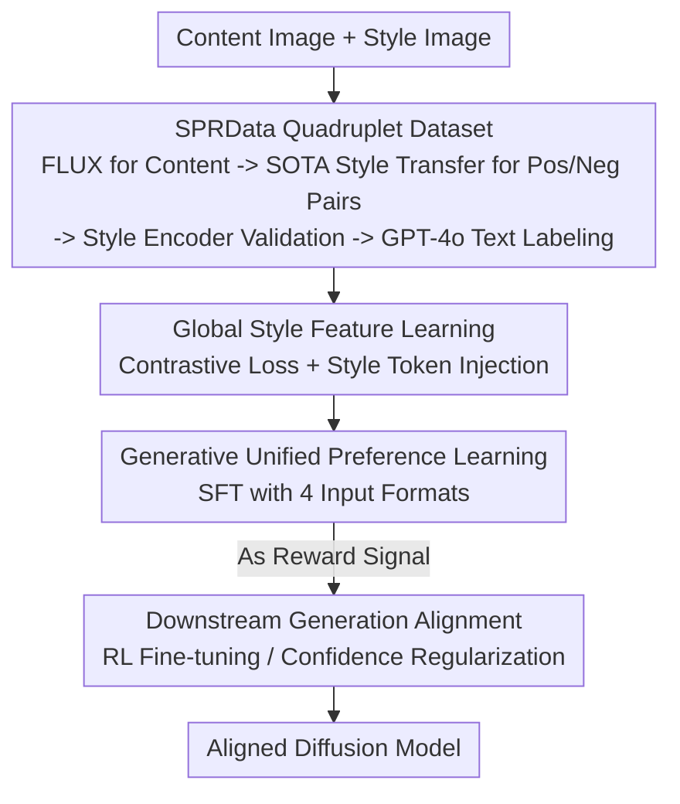

# StyleDoctor: Towards Specialist Reward Model for Style-centric Generation Tasks

**Conference**: CVPR 2026  
**Paper**: [CVF Open Access](https://openaccess.thecvf.com/content/CVPR2026/html/He_StyleDoctor_Towards_Specialist_Reward_Model_for_Style_centric_Generation_Tasks_CVPR_2026_paper.html)  
**Code**: https://github.com/Xilin-He/StyleDoctor (The paper states "Dataset and code are available"; please refer to the original text for the repository address ⚠️)  
**Area**: Image Generation / Style Transfer / Reward Models  
**Keywords**: Style Reward Model, Style Consistency, Reinforcement Fine-tuning, Multimodal Large Language Models (MLLM), Preference Learning

## TL;DR
StyleDoctor replaces general human preference reward models with a "specialist style reward model" based on a multimodal large language model (Qwen2.5-VL-3B). By constructing SPRData, a style preference dataset containing 400,000 "quadruplets," and employing a three-stage training process, the model learns to perceive both image style and text style semantics. It ultimately serves as a reward signal for the reinforcement fine-tuning of diffusion models, significantly enhancing style consistency in style-centric generation and transfer tasks.

## Background & Motivation
**Background**: Diffusion models have accelerated progress in style generation (rendering images into target styles). A recent trend involves applying "reinforcement fine-tuning (RL fine-tuning)" to these models—using a reward model learned from human preferences to score generated results and optimizing the model toward higher scores using methods like DPO or Flow-GRPO, which has shown significant success in general generation and editing tasks.

**Limitations of Prior Work**: The authors identified a critical mismatch: existing human preference reward models (e.g., HPSv2/v3) are trained to score "aesthetic quality," whereas style tasks prioritize "consistency between the generated result and the reference style." The example in Fig.2 of the paper is intuitive: an image with a high aesthetic score and one with a low score may have completely reversed rankings regarding "faithfulness to the reference style." Using such models directly as rewards leads to poor style alignment after RL fine-tuning. Alternative "style-aware models" (e.g., CSD/CLIP, which encode image-level style via contrastive learning) only model image-level features and lack cross-modal supervision (style image-text correspondence), failing to generalize to diverse text-based style prompts or support rewards for multimodal generation tasks.

**Key Challenge**: There is an inherent mismatch between the training objectives of general reward models (aesthetics/general preference) and the goals of style generation (style consistency). Specialized style-aware models lack joint image-text modeling, making them unsuitable as general reward functions.

**Goal**: To create a "specialist" reward model that satisfies two criteria: the ability to determine which of two images better fits a reference style, and the ability to determine if an image aligns with a style text—while being directly compatible with existing RL fine-tuning pipelines.

**Key Insight**: The authors bet on Multimodal Large Language Models (MLLMs), which are inherently proficient in visual understanding and text alignment. By injecting explicit "global style features" and providing the right data, the model can observe both local style cues (via image tokens) and global style characteristics (via dedicated style tokens).

**Core Idea**: Construct a generative reward model specialized for judging style consistency using "quadruplet style preference data + MLLM + three-stage training," and use its "positive case confidence" as the reward signal to align diffusion models.

## Method

### Overall Architecture
The StyleDoctor pipeline consists of three main components: **Data Construction** (SPRData, 400k quadruplets), **Three-stage Training** of an MLLM-based reward model, and **Downstream Generation Alignment**.

On the data side, the authors did not use standard triplets (content image + style image + one synthetic image). Instead, they constructed **quadruplets**: content image + style image + two synthetic style images, where one has significantly better style/content consistency (positive) and the other is worse (negative). This pairwise design allows the reward model to learn fine-grained preferences—essentially "which result is better under the same conditions"—which is the exact signal required for RL fine-tuning.

On the model side, the backbone is the lightweight Qwen2.5-VL-3B. Style perception is injected through three stages: ① Learning **global style features** using contrastive loss; ② Injecting global style features as a special "style token" alongside standard image tokens, followed by fine-tuning on image-text caption data for basic style understanding; ③ Reorganizing quadruplets into four input formats for **Unified Preference Learning**, enabling the model to judge style consistency across various paradigms (text-conditioned, reference-conditioned, multi-image comparison).

For alignment, the trained StyleDoctor can be used in two ways: either as a reward model integrated into formal RL pipelines like DPO/Flow-GRPO, or by using its output confidence for positive answers as a score/regularization term to be maximized (e.g., in conjunction with ReNeg/B-LoRA).

### Key Designs

**1. SPRData: Quadruplet style preference dataset providing pairwise "closer-to-style" signals**

Style reward learning is hampered by a lack of directly comparable pairwise data. Existing style datasets either focus on classification (WikiArt/Style30k/ArtBench, lacking content/synthetic images) or single-sample triplets (IMAGStyle/OmniStyle). SPRData resolves this with quadruplets: Content Image + Style Image + Positive Synthetic Image + Negative Synthetic Image. The construction is pipelined: ChatGPT generates ~500 object concepts, each expanded into 40 prompts; FLUX generates reference content images; style images are sampled from 1,000 categories in Style30k; positive cases are generated using SOTA style transfer methods like OmniStyle/CSGO, while negative cases use CSGO with **lowered style injection strength in the decoupled attention module** to intentionally weaken style alignment. A CSD style encoder validates that the positive case's style consistency score is higher. Text annotations include "multi-dimensional style analysis" reasoning (global style, color palette, texture/brushstrokes, composition) generated by GPT-4o with `<think>...</think>` tags, and generation instructions derived from style categories. The final dataset comprises 400k quadruplets and 200k image-text pairs across 1,000 styles.

**2. Global Style Feature Learning + Style Token Injection: Combining local and global style views**

Prior style-aware models focused on image-level modeling, while MLLMs typically process serialized image tokens and lack global style priors. The authors add a linear projection layer after the visual encoder $E_v$ and use a contrastive loss to learn global style embeddings:

$$\mathcal{L}_{con} = -\frac{1}{N}\sum_{i=1}^{N}\log\frac{\exp\!\big(\mathrm{sim}(z_i, z_i^{+})/\tau\big)}{\sum_{j=1}^{N}\exp\!\big(\mathrm{sim}(z_i, z_j^{-})/\tau\big)}$$

Where $z_i = E_v(x_i)$ is the visual embedding of image $i$, $z_i^{+}$ is a positive case of the same style, $\{z_j^{-}\}$ are negative cases of different styles, $\mathrm{sim}(\cdot,\cdot)$ is cosine similarity, and $\tau$ is the temperature. Once learned, this global feature is injected as a **specialized style token** (wrapped in `<STY_START>`/`<STY_END>`) and fed into the LLM alongside standard image tokens. In this stage, the model is fine-tuned with cross-entropy on the caption portion of SPRData to instill basic style understanding.

**3. Generative Unified Preference Learning: Training on four reorganized input formats**

Input paradigms for downstream style tasks vary (text-only, reference-image, comparison). To avoid fragmentation, the authors reorganize SPRData into four formats: ① Single image (judge if it matches {STYLE_CATE}); ② Image + Reference style image (judge consistency with reference); ③ Two images (judge which better fits {STYLE_CATE}); ④ Two images + Reference image (judge which better fits the reference). The first two are "conditional judgments," while the latter two are "preference selections." All are trained via SFT with cross-entropy, injecting fine-grained style analysis into the reward model.

**4. Generative Alignment: Using "Positive Confidence" as the reward signal**

Since StyleDoctor is a generative model and outputs text rather than a scalar score, its output cannot be used directly as a reward. The authors calculate the **average confidence of the positive answer in the output logit space** as a proxy for the reward. This value reflects StyleDoctor's certainty that "the style condition matches the sampled image." This is used in two ways: first, as a reward model directly integrated into RL fine-tuning (DPO/Flow-GRPO), providing interpretable signals (color, texture, etc.); second, as a regularization term to be maximized (e.g., using ReNeg to learn stylized negative embeddings or with B-LoRA for style customization).

## Key Experimental Results

### Main Results

**Style Perception (Retrieval + Multimodal Understanding)**: On a binary classification task ("same style?") using 10,000 image pairs from WikiArt and the SPRData-derived multimodal understanding test set, StyleDoctor outperforms general visual encoders and MLLMs.

| Method | Retri. Acc. | MM Und. Acc. |
|------|------|------|
| CLIP | 53.45 | 46.28 |
| CSD | 62.60 | 53.25 |
| SigLIP | 58.39 | 48.20 |
| Qwen-2.5-VL (3B) | 71.82 | 66.54 |
| **StyleDoctor** | **75.46** | **71.14** |

**Alignment for Generation**: Integrating StyleDoctor as a reward in the RL fine-tuning of models like OmniGen2 improved style metrics (CSD is style encoder similarity, GPT is the GPT-4o style score, Content is content preservation).

| Task / Method | Style Metrics | Content Preservation |
|------|------|------|
| Text-Control OmniGen2 | 65.42 / 58.85 (StyDoc./GPT) | - |
| + StyDoc. | **69.58 / 67.60** | - |
| Ref-Image OmniGen2 | 0.67 (CSD) | - |
| + StyDoc. | **0.72 (CSD)** | - |
| Instruction Flux-Kontext | 74.35 (GPT) | 0.67 |
| + StyDoc. | **78.54 (GPT)** | **0.68** |
| Style Transfer OmniStyle | 0.74 / 67.86 (CSD/GPT) | 0.66 |
| + StyDoc. | **0.78 / 72.25** | **0.72** |

**vs. Human Preference Reward Models**: Direct comparison with HPSv2/v3 shows StyleDoctor significantly better at style understanding and guiding generation, confirming that general preference rewards are unsuitable for style tasks.

| Method | Retri. | MM Und. | Style (Gen) | Content (Gen) |
|------|------|------|------|------|
| HPSv2 | 56.83 | 40.20 | 0.45 | 0.62 |
| HPSv3 | 68.75 | 63.45 | 0.64 | 0.63 |
| **StyleDoctor** | **75.46** | **71.14** | **0.78** | **0.69** |

### Ablation Study
Decomposing GSF (Global Style Feature) and UPL (Unified Preference Learning, denoted as USP) in style customization. MM Und. is multimodal understanding accuracy; Gen. is the CSD consistency score.

| Config | GSF | UPL | MM Und. | Gen. |
|------|------|------|------|------|
| Baseline | – | – | 66.54 | 0.69 |
| GSF only | ✓ | – | 69.63 | 0.72 |
| UPL only | – | ✓ | 69.70 | 0.73 |
| **StyleDoctor** | ✓ | ✓ | **71.14** | **0.78** |

### Key Findings
- Both components lead to improvements individually (~66 to ~69), but **only together do they reach 71.14 / 0.78**, indicating that global style priors and fine-grained preference judgments are complementary.
- Human preference models (HPSv2 retrieval at only 56.83) performed poorly, proving "aesthetic preference $\neq$ style consistency."
- An unintuitive finding: Raw OmniGen2 tends to "copy" the reference style image directly in guided generation, which required the specialist reward signal to correct.

## Highlights & Insights
- **Quadruplets > Triplets**: Moving from single synthetic images to positive/negative synthesis pairs addresses the core of preference learning—directly applicable to any task requiring pairwise evaluation.
- **Synthesizing Negatives by Modulating Injection**: Modulating style injection strength in a SOTA model (CSGO) to generate negative cases cheaply and controllably is a highly practical data trick.
- **Logits Confidence as Reward**: Using the average confidence of positive answers allows generative MLLMs to serve as scalar rewards in RL pipelines, a flexible approach for "LLM-as-a-Judge" scenarios.
- **Multi-dimensional Interpretable Rewards**: Breaking down signals into global style, color, brushstrokes, and composition provides far more diagnostic utility than binary or aesthetic scores.

## Limitations & Future Work
- The reliability and calibration of the "proxy reward" (logits confidence) from a generative model are not deeply analyzed; its behavior in out-of-distribution scenarios is uncertain ⚠️.
- The dataset heavily relies on existing SOTA style transfer methods; the upper bound of the positive cases is constrained by these methods.
- While covering 1,000 styles, the model's generalization to entirely unseen or mixed styles remains untested.
- Evaluation relies significantly on CSD and GPT-4o, creating a potential circularity risk; direct validation of correlation with subjective human style judgment is limited ⚠️.

## Related Work & Insights
- **vs. Human Preference Reward Models (HPSv2/v3)**: These score general aesthetics/alignment. StyleDoctor wins on style tasks due to objective-specific data but may not outperform them in general aesthetic scenarios.
- **vs. Image-level Style Models (CSD/CLIP)**: These lack cross-modal supervision. StyleDoctor uses MLLMs for joint image-text modeling, handling various paradigms at the cost of being a heavier model.
- **vs. Style Transfer Methods (OmniStyle/CSGO)**: These are the "generators" to be aligned. StyleDoctor is the "rewarder" that improves them, as demonstrated by the gain in scores when integrated.

## Rating
- Novelty: ⭐⭐⭐⭐ The "specialist style reward model" angle is clear, and the quadruplet data + confidence-based reward methodology is innovative.
- Experimental Thoroughness: ⭐⭐⭐⭐ Covers various tasks, alignment types, and comparisons, though proxy reward reliability analysis is thin.
- Writing Quality: ⭐⭐⭐⭐ The motivation regarding the reward mismatch is well-articued and intuitive.
- Value: ⭐⭐⭐⭐ Provides a missing reward model for RL alignment in style generation, supported by a large-scale dataset.

<!-- RELATED:START -->

## Related Papers

- [\[CVPR 2026\] Style-GRPO: Semantic-Aware Preference Optimization for Image Style Transfer Guided by Reward Modeling](style-grpo_semantic-aware_preference_optimization_for_image_style_transfer_guide.md)
- [\[CVPR 2026\] A Style is Worth One Code: Unlocking Code-to-Style Image Generation with Discrete Style Space](a_style_is_worth_one_code_unlocking_code-to-style_image_generation_with_discrete.md)
- [\[CVPR 2026\] OSPO: Object-Centric Self-Improving Preference Optimization for Text-to-Image Generation](ospo_object-centric_self-improving_preference_optimization_for_text-to-image_gen.md)
- [\[CVPR 2026\] Unified Customized Generation by Disentangled Reward Modeling](unified_customized_generation_by_disentangled_reward_modeling.md)
- [\[CVPR 2026\] Enhancing Spatial Understanding in Image Generation via Reward Modeling](enhancing_spatial_understanding_in_image_generation_via_reward_modeling.md)

<!-- RELATED:END -->
