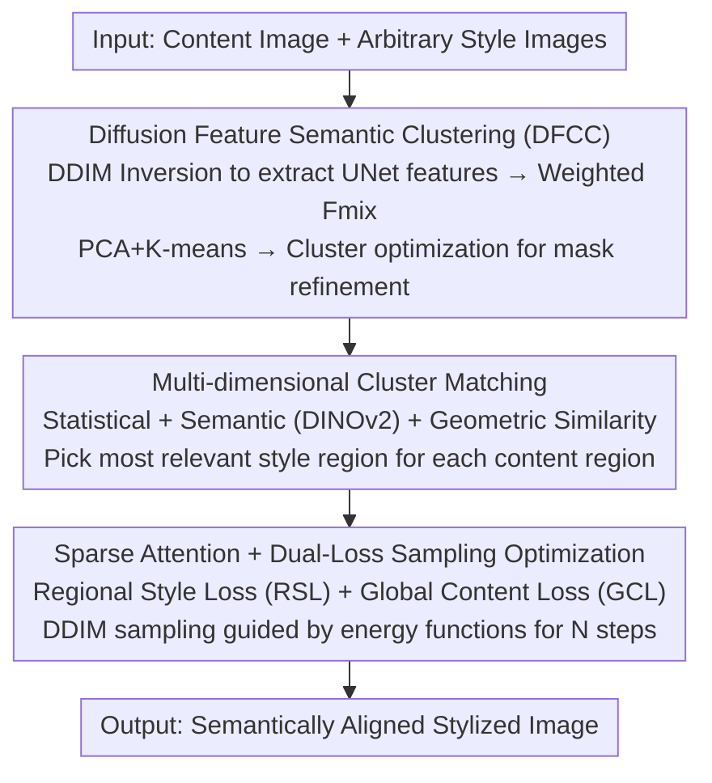

# StyleGallery: Training-free and Semantic-aware Personalized Style Transfer from Arbitrary Image References

**Conference**: CVPR 2026  
**Paper**: [CVF Open Access](https://openaccess.thecvf.com/content/CVPR2026/html/He_StyleGallery_Training-free_and_Semantic-aware_Personalized_Style_Transfer_from_Arbitrary_Image_CVPR_2026_paper.html)  
**Code**: https://github.com/iiiiiiiword/StyleGallery  
**Area**: Diffusion Models / Image Generation  
**Keywords**: Style Transfer, Training-free, Semantic-aware, Diffusion Feature Clustering, Regional Matching

## TL;DR
StyleGallery is a training-free semantic-aware style transfer framework. It first performs unsupervised semantic clustering on content images using intermediate diffusion features, then adaptively matches content regions with the most relevant regions from arbitrary style references across statistical, semantic, and geometric dimensions. Finally, it employs regional style loss to guide diffusion sampling, achieving interpretable and customizable fine-grained style transfer without requiring external masks.

## Background & Motivation
**Background**: Diffusion-based style transfer has gained significant attention. Prevailing training-free methods (e.g., StyleID, Attention Distillation/AD) primarily manipulate the self-attention modules of pre-trained diffusion models—either by injecting Style $K/V$ into attention layers or using energy functions to constrain denoising directions, treating style as a global feature applied uniformly to the content.

**Limitations of Prior Work**: This "global style application" neglects semantic correspondences, leading to three major issues. First, the **Semantic Gap**: the semantics of a single style image may not cover the content image (e.g., content contains "mountains" but style does not), causing incorrect stylization. Second, **Dependency on Extra Constraints**: semantic alignment often requires external segmentation masks (e.g., SCSA) or assumes similar semantic structures between content and style. Third, **Rigid Feature Association**: lack of adaptive global-local alignment fails to preserve fine-grained style and global structures simultaneously. Empirically, StyleID preserves content well but lacks stylization, while AD offers stronger stylization at the cost of content leakage.

**Key Challenge**: There exists a trade-off between style intensity and content preservation. The root cause is that existing methods treat style as a "single monolithic feature," lacking adaptive matching of "which content region corresponds to which style region."

**Goal**: To support arbitrary style references and achieve region-level, semantically aligned, interpretable, and customizable style transfer without any extra inputs (masks/segmentation) or training.

**Key Insight**: The authors hypothesize that semantic regions are the fundamental carriers of style features, and adaptive content-style regional matching is key to high-quality transfer. They observe that the intermediate UNet features of diffusion models (similar to DIFT) are sufficient for unsupervised semantic clustering, eliminating the need for external segmentation models.

**Core Idea**: Replace "global style application" with a "divide and conquer" strategy—first segment images into semantic regions using diffusion features, then select the best matching style region for each content region based on semantic relevance, and finally apply style loss specifically within matching attention pairs.

## Method

### Overall Architecture
Given a set of style images $I_s=\{I_1, I_2, \dots\}$ and a content image $I_c$, StyleGallery adaptively identifies matching style regions to perform stylization while preserving content structure and suppressing leakage. The pipeline consists of three sequential stages: semantic clustering, multi-dimensional region matching, and sampling optimization via loss guidance.

### Key Designs

**1. Diffusion Feature Semantic Clustering (DFCC): Segmenting images using intrinsic features**

To address the dependency on external masks, the authors leverage DIFT-inspired UNet features extracted during the forward noisy process. This process is unsupervised and requires no external networks. The four steps are: ① Perform $T$ steps of DDIM inversion on the content image to obtain noise feature maps $\{F_0, \dots, F_T\}$; ② Integrate these features into a unified $F_{mix}$ using time-step adaptive weighting; ③ Apply PCA dimensionality reduction and K-means clustering ($K$ is the cluster upper bound); ④ Refine masks via cluster optimization. The weighting function is a sigmoid curve $d(t)=\frac{1}{1+\exp(5\cdot(t/T-0.7))}$, normalized as $F_{mix}=\sum_t^T \frac{d(t)}{\sum_k^T d(k)}\cdot F_t$. The constants 5 and 0.7 control the slope and inflection point, assigning higher weights to features near $0.7T$ where semantic information is richest.

Cluster optimization (Figure 3 in the paper) addresses fragments from K-means: clusters with semantic distances below 0.85 are merged; depth features are used for "split-and-merge"; finally, isolated pixels are assigned to the nearest neighbor cluster. DFCC is formulated as $\text{Clusters}=\text{Optimization}(\text{K-means}(F_{mix},K), F)$, where $F$ represents VAE features.

**2. Multi-dimensional Cluster Matching: Adaptive content-style pairing**

Since content and style images differ in color, shape, and texture, single-metric similarity is error-prone. The authors use three dimensions for "adaptive optimal matching." **Statistical Features**: Aggregate regional features using self-attention over the masks to compute mean and variance. **Semantic Similarity** (Primary): Use DINOv2 to extract semantic tokens, aligning cluster masks to tokens for cosine similarity calculation. **Geometric Criteria**: When semantic correspondence is weak, use "minimum enclosing circles" of clusters to capture positional information.

The final similarity score is a weighted sum: $\text{Similarity}=\sum_i \lambda_i \cdot CS(feat_i^c, feat_i^s)$, where $CS$ is cosine similarity and weights are $\lambda_1=0.25, \lambda_2=1, \lambda_3=0.125$. The semantic dimension ($\lambda_2$) dominates, while geometry serves as a weak fallback. This allows any content region to pick the most relevant style region from arbitrary reference images.

**3. Sparse Attention + Dual-Loss Sampling Optimization: Enhancing style without leakage**

The third step "transports" style features to content regions without boundary leakage. $Q, K, V$ are extracted from the last 6 self-attention layers of the UNet and **sparsified** using semantic masks. By nullifying irrelevant points, each region only maintains attention weights related to its own semantics (Figure 4). Two losses are defined:
**Regional Style Loss (RSL)** computes L1 distance for each matching pair $(i, j)$: $\mathcal{L}_{RSL}=\sum_{i,j}\lVert \text{Mask}(\text{Self-Attn}(Q_i,K_i,V_i)) - \text{Self-Attn}(\text{Mask}(Q_i), K_j^s, V_j^s)\rVert_1$, matching content-side sparse queries with style-side $K_s, V_s$.
**Global Content Loss (GCL)** follows the AD constraint: $\mathcal{L}_{GCL}=\lVert Q-Q_c\rVert_1$, ensuring global structure preservation.

The total loss is $\mathcal{L}_{RST}=\mathcal{L}_{RSL}+\lambda_c\cdot\mathcal{L}_{GCL}$. Following the classifier guidance approach, $\mathcal{L}_{RST}$ acts as an energy function to guide DDIM sampling via Adam: $z_{t-1}=z_{t-1}-\eta\nabla_{z_{t-1}}L_{RST}(z_{t-1}, z_{t-1}^{ref})$ with step $\eta=0.05$. Sparsification prevents queries from attending to mismatched keys, effectively suppressing semantic leakage.

### Loss & Training
The framework is completely **training-free**, based on pre-trained Stable Diffusion 1.5. Forward diffusion takes 15 steps, and generation involves 150 optimization steps. Default hyperparameters: $K=10$, matching weights ratio $2:8:1$, global content loss weight $\lambda_c=0.26$, step size $\eta=0.05$, cluster merging threshold 0.85.

## Key Experimental Results

The authors constructed a "StyleGallery" benchmark consisting of 25 style families (e.g., Van Gogh, Chinese Ink) with 4–17 images per style. Content regions categorized into 5 classes. 750 stylized results were generated. Metrics include a block-level matching "Style" score (using Hungarian algorithm on VGG features), Gram Loss, FID, LPIPS, and ArtFID.

### Main Results

| Metric | StyTR-2 | StyleID | AD | StyleShot | Ours |
|------|---------|---------|-----|-----------|------|
| Style ↑ | 0.5219 | 0.4972 | 0.5249 | 0.5198 | **0.5337** |
| Gram Loss ↓ | 16.719 | 14.261 | 13.862 | 19.013 | **13.519** |
| FID ↓ | 17.623 | 18.987 | 17.677 | 20.638 | **16.889** |
| LPIPS ↓ | 0.3856 | 0.4496 | 0.4032 | 0.6615 | **0.3716** |
| ArtFID ↓ | 25.804 | 28.973 | 26.207 | 35.952 | **24.536** |

StyleGallery achieves the best performance across all five metrics: highest Style score (strongest stylization), lowest LPIPS (best structure preservation), and superior Gram/FID/ArtFID scores.

### Ablation Study

| Configuration | LPIPS ↓ | FID ↓ | Style ↑ | Description |
|------|---------|-------|---------|------|
| Full ($\lambda_c=0.26$) | **0.3716** | **16.89** | **0.5337** | Full Model |
| $\lambda_c=0.29$ | 0.3689 | 27.26 | 0.4172 | High content weight → Low style |
| $\lambda_c=0.22$ | 0.4354 | 21.84 | 0.4562 | Low content weight → Poor structure |
| w/o RSL | 0.5195 | 23.56 | 0.4387 | Missing RSL → Style failure, LPIPS up |
| w/o GCL | 0.6822 | 30.83 | 0.4150 | Missing GCL → Maximum leakage |

### Key Findings
- **Complementary Losses**: GCL preserves structure while RSL ensures stylization. Removing either degrades all metrics; removing GCL causes LPIPS to jump from 0.37 to 0.68, indicating severe content loss.
- **Mask Constraints Control Leakage**: Without masks, textures bleed into unrelated areas. Sparse attention restricts stylization to matched regional pairs.
- **Sensitivity to $\lambda_c$**: 0.26 is the "sweet spot" for automated mode.
- **Acceleration Compatibility**: Integrating LCM-LoRA or Hyper-SD reduces optimization steps from 150 to 28 (approx. 30s to 8s) with minimal quality loss.

## Highlights & Insights
- **Region-level Matching over Global Stylization**: The core insight is that style leakage stems from queries attending to mismatched keys. Using semantic masks to sparsify attention and transport style regionally improves interpretability and supports multi-reference customization.
- **Reusing Diffusion Features for Unsupervised Segmentation**: Extracting DIFT-like features for K-means clustering eliminates external dependencies and supports the "zero extra input" claim.
- **Robust Multi-dimensional Matching**: Using semantic (DINOv2) as primary and geometric as fallback effectively handles varied content-style scenarios.
- **Energy Function Paradigm**: Adapting the AD energy function to regional domains achieves high performance at a low modification cost.

## Limitations & Future Work
- **Clustering Errors**: Inaccurate semantic masks (due to fuzzy inputs) can lead to fragmented local stylization. Potential mitigation includes using external models like SAM for initial masks.
- **Abstract Style Reference**: The method's sensitivity to extremely abstract or faint style cues needs improvement.
- **Benchmark Scale**: The evaluation relies on a custom benchmark of 750 images; the scalability of "arbitrary" references (e.g., hundreds of images) in terms of computational overhead was not fully quantified.

## Related Work & Insights
- **vs. StyleID (CVPR2024)**: StyleID uses global attention injection, preserving content well but lacking style intensity in homogeneous areas. Ours uses regional sparse attention for better control.
- **vs. Attention Distillation / AD (CVPR2025)**: AD uses a global energy function and supports multiple styles but suffers from leakage. Ours constrains the loss to matching regions, significantly reducing leakage.
- **vs. SCSA**: SCSA requires external masks and similar semantic structures. Ours is training-free, needs no extra masks, and handles varied semantic layouts.

## Rating
- Novelty: ⭐⭐⭐⭐ Systematically transforms "global style" into "clustering -> matching -> regional loss" for training-free transfer.
- Experimental Thoroughness: ⭐⭐⭐⭐ Comprehensive metric analysis and ablation, though the benchmark is custom and smaller scale.
- Writing Quality: ⭐⭐⭐⭐ Clear three-stage pipeline explanation with informative diagrams.
- Value: ⭐⭐⭐⭐ Strong practical utility for multi-reference and personalized transfer with open-sourced code.

<!-- RELATED:START -->

## Related Papers

- [\[CVPR 2026\] Style-GRPO: Semantic-Aware Preference Optimization for Image Style Transfer Guided by Reward Modeling](style-grpo_semantic-aware_preference_optimization_for_image_style_transfer_guide.md)
- [\[CVPR 2026\] A Training-Free Style-Personalization via SVD-Based Feature Decomposition](a_training-free_style-personalization_via_svd-based_feature_decomposition.md)
- [\[CVPR 2025\] SaMam: Style-aware State Space Model for Arbitrary Image Style Transfer](../../CVPR2025/image_generation/samam_style-aware_state_space_model_for_arbitrary_image_style_transfer.md)
- [\[CVPR 2025\] HSI: A Holistic Style Injector for Arbitrary Style Transfer](../../CVPR2025/image_generation/hsi_a_holistic_style_injector_for_arbitrary_style_transfer.md)
- [\[CVPR 2026\] Harmonic Canvas: Inversion-Free Editing for Visually-Guided Music Style Transfer](harmonic_canvas_inversion-free_editing_for_visually-guided_music_style_transfer.md)

<!-- RELATED:END -->
## Related Papers

- [\[CVPR 2026\] Style-GRPO: Semantic-Aware Preference Optimization for Image Style Transfer Guided by Reward Modeling](style-grpo_semantic-aware_preference_optimization_for_image_style_transfer_guide.md)
- [\[CVPR 2025\] SaMam: Style-aware State Space Model for Arbitrary Image Style Transfer](../../CVPR2025/image_generation/samam_style-aware_state_space_model_for_arbitrary_image_style_transfer.md)
- [\[CVPR 2026\] HAM: A Training-Free Style Transfer Approach via Heterogeneous Attention Modulation for Diffusion Models](ham_a_training-free_style_transfer_approach_via_heterogeneous_attention_modulati.md)
- [\[CVPR 2025\] HSI: A Holistic Style Injector for Arbitrary Style Transfer](../../CVPR2025/image_generation/hsi_a_holistic_style_injector_for_arbitrary_style_transfer.md)
- [\[CVPR 2026\] A Training-Free Style-Personalization via SVD-Based Feature Decomposition](a_training-free_style-personalization_via_svd-based_feature_decomposition.md)

<!-- RELATED:END -->
