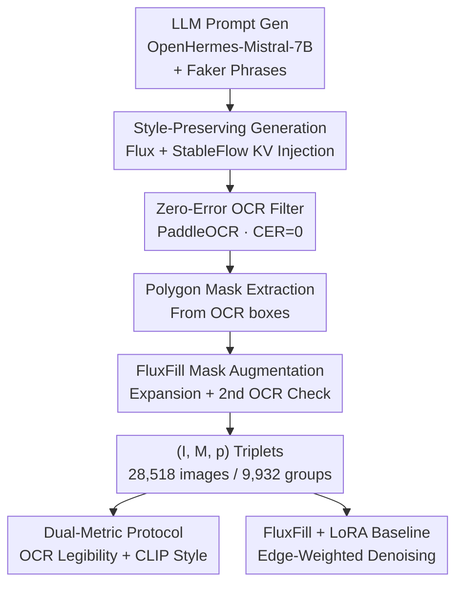

# StyleText: A Large-Scale Dataset and Benchmark for Stylized Scene Text Inpainting

**Conference**: CVPR 2026  
**arXiv**: [2605.17309](https://arxiv.org/abs/2605.17309)  
**Code**: The paper promises to open-source the pipeline code, metadata, and KV caches (no specific repository link provided).  
**Area**: Diffusion Models / Image Generation  
**Keywords**: Scene text inpainting, style preservation, synthetic data, OCR evaluation, CLIP consistency.

## TL;DR
To address the lack of specialized benchmarks for inserting new text into natural scenes while maintaining ambient lighting and texture, this paper proposes StyleText. It utilizes an automated pipeline—combining LLM-generated prompts, Flux/StableFlow KV injection, OCR filtering, and polygon mask extraction—to create a dataset of 28,518 image-mask-prompt triplets organized into 9,932 "scene groups." It defines a reproducible evaluation protocol covering OCR legibility and CLIP style consistency, and establishes a strong baseline using FluxFill+LoRA that improves character accuracy from 56% to 77%.

## Background & Motivation
**Background**: Diffusion models (e.g., Flux, FluxFill, StableFlow, TextDiffuser, AnyText) have enabled prompt-driven, spatially controlled high-resolution text editing in natural images—such as inserting text into signboards, posters, and street views for applications like translation, OCR data augmentation, and document restoration.

**Limitations of Prior Work**: Progress is hindered by the absence of suitable benchmarks. Detection and recognition datasets (e.g., COCO-Text, ICDAR 2015) provide only bounding boxes without region-level polygon masks, scene-style ground truth, or evaluation protocols for generative results. Synthetic pipelines like SynthText rely on heuristic pasting, leading to stylistic inconsistencies and a lack of controlled multi-instance scene structures. Methods focusing on rendering fidelity (e.g., TextDiffuser, AnyText) only measure character clarity without mechanisms to gauge visual coordination with the surrounding scene.

**Key Challenge**: Text inpainting involves two orthogonal objectives: **legibility** and **style preservation**. Existing protocols almost exclusively report OCR accuracy. A model can render clear text that remains visually jarring yet still achieve a high score. No existing resources provide OCR-derived polygon masks, style-consistent scene groupings, and a dual-metric protocol simultaneously.

**Goal**: To build a benchmark that allows researchers to answer: (1) Does the model learn style or just legibility? (2) On which samples does it fail and why? (3) Does it generalize to new words or memorize visual patterns? (4) How sensitive is it to the specific phrase being inserted?

**Key Insight**: Instead of expensive and uncontrollable manual labeling of real photos, the authors utilize **fully automated synthesis**. The key observation is that StableFlow’s KV injection preserves the lighting, texture, and layout of a reference image during generation. By applying different phrases to the same scene template, "scene groups" with fixed styles and varying text are created—a structure essential for controlled style analysis.

**Core Idea**: Construct a pipeline consisting of "LLM prompt generation → Flux+KV injection for source image generation → Zero-error OCR filtering → Polygon mask extraction → FluxFill mask-conditioned augmentation." This treats "scene groups" as first-class citizens and introduces a dual OCR+CLIP protocol to measure both legibility and style consistency.

## Method

### Overall Architecture
StyleText consists of three components: (1) **The Dataset**—28,518 HD images (1024×1024), each with a binary polygon mask and an uppercase phrase, clustered into 9,932 scene groups; (2) **An Automated Synthesis Pipeline**—A three-stage process converting zero-shot LLM prompts into validated $(I, M, p)$ triplets; (3) **Evaluation Protocol & Baseline**—A dual OCR/CLIP metric system and a FluxFill+LoRA baseline.

The synthesis pipeline operates in three serial stages: **(a) Style-Preserved Source Generation**: OpenHermes-Mistral-7B generates scene prompts with uppercase words, which are filled with random phrases using Faker. Flux, combined with StableFlow-style KV injection, produces candidate images that preserve texture and layout by injecting reference cache tensors into specific transformer blocks. **(b) OCR Filtering & Mask Extraction**: Using PaddleOCR, only samples with a Character Error Rate (CER) of 0 are retained. Polygon masks are then extracted from the OCR bounding boxes. **(c) FluxFill Mask-Conditioned Augmentation**: Mask-conditioned inpainting is performed on existing triplets to expand the dataset while maintaining local styles, followed by a final OCR validation.

### Key Designs

**1. Scene Group Structure: Making "Fixed Style, Variable Text" a Primary Structure**
This is the core differentiator of StyleText. Files are encoded by "background description + target phrase." Images sharing the same background description are grouped. This structure supports three unique analyses: ① **Intra-group CLIP similarity** to measure style consistency decoupled from legibility; ② **Scene-group-based splitting** for train/val/test to prevent data leakage from near-duplicate backgrounds; ③ **Intra-group variance analysis** to isolate "prompt sensitivity" from "scene difficulty."

**2. KV Injection Driven Style-Preserving Generation**
To avoid distorting unmasked regions, the authors adopt the progressive guidance of StableFlow. During Flux generation, reference key-value attention tensors are injected into predefined multimodal and single-stream blocks. This anchors lighting and layout without requiring per-image fine-tuning.

**3. Zero-Error OCR Filtering & Polygon Mask Extraction**
To ensure spelling accuracy—a primary requirement in text editing—the pipeline retains only samples with **normalized CER = 0** via PaddleOCR. Masks are extracted from detection boxes and augmented with dilation and slight deformation to ensure robustness against irregular layouts. The authors note this favors **legibility diversity** over **artifact diversity**.

**4. Dual-Metric Protocol & Hierarchical Diagnostics**
The protocol mandates reporting two orthogonal metrics: **OCR Metric** (PaddleOCR-based Word Accuracy and Character Accuracy $\text{Char Acc.} = 1 - \text{CER}$) and **CLIP Similarity** (Cosine similarity between generated and source images using CLIP ViT-B/32). This prevents "gaming" the benchmark with models that yield clear but uncoordinated text. Diagnostics are performed across three axes: Phrase Complexity (Easy/Medium/Hard), Mask Coverage (Small/Medium/Large), and Background Difficulty (Low/Medium/High).

### Loss & Training
The baseline is a mask-conditioned text inpainting model based on the Flux architecture. A frozen VAE encoder $\mathcal{E}$ encodes image $I$ into latent space $z=\mathcal{E}(I)$. Given binary mask $M$, context latents are defined as $z_{\mathrm{ctx}}=z\odot(1-M)$. Noise is added at timestep $t$:

$$z_t = z_{\mathrm{ctx}} + \sigma_t\,\epsilon,\qquad \epsilon\sim\mathcal{N}(0,\mathbf{I})$$

The transformer denoiser predicts $\hat{\epsilon}=\mathcal{F}_\theta(z_t,t,M,p)$, where $p$ is the T5-embedded prompt. The primary loss is denoising score matching with **edge-aware pixel weighting** to improve junction quality:

$$w(M)=1+\alpha\cdot\mathrm{Sobel}(M),\qquad \mathcal{L}=\mathbb{E}\big[w(M)\odot(\epsilon-\hat{\epsilon})^2\big]$$

## Key Experimental Results

### Main Results
Fine-tuning FluxFill+LoRA on StyleText significantly improves performance over the pre-trained checkpoint (Epoch 0). At Epoch 2, **Word Accuracy increases by +16.6 pp and Character Accuracy by +20.9 pp**, while maintaining a CLIP score of 66.03.

| Model | Word Acc.↑ (%) | Char Acc.↑ (%) | CLIP↑ (100×) |
|------|------|------|------|
| FluxFill (Pre-trained, Ep.0) | 27.84 | 56.17 | — |
| + LoRA on StyleText (Ep.2) | **44.48** | **77.03** | 66.03 |
| + Further Training (Ep.9) | 41.03 | 75.63 | — |

### Ablation Study
The "ablation" is conducted via training dynamics and hierarchical diagnostics:
- **Epoch 0 to 2**: Narrowing gap between Word and Char Accuracy suggests the model moves from rendering isolated characters to assembling full words.
- **Complexity Analysis**: Failures are concentrated in the "Hard" tier (long/multi-word), characterized by spacing collapse.
- **Scale Analysis**: Large masks result in "boundary bleed," suggesting a need for scale-aware mask conditioning.

### Key Findings
- **Plateau after Epoch 2**: Character structures are learned quickly, but robust typography under irregular masks remains challenging.
- **Predictable Failures**: Errors follow structured axes (complexity and coverage) rather than being random.
- **Style Consistency**: Intra-group results faithfully replicate lighting and texture, validating the KV-guided supervision.

## Highlights & Insights
- **Structural Contribution**: Treating "scene groups" as a primary data structure enables analyses (like prompt sensitivity) that were previously impossible.
- **Precision vs. Diversity Trade-off**: The use of CER=0 filtering is a deliberate choice prioritizing semantic Correctness over the stylistic diversity of "failed" renders.
- **Anti-Gaming Metrics**: The dual OCR+CLIP protocol forces models to balance legibility with environmental integration.

## Limitations & Future Work
- **Metric Blind Spots**: OCR may struggle with highly artistic fonts, and CLIP lacks fine-grained typographic awareness.
- **Scope**: Currently limited to English uppercase. Future work requires expanding to CJK, Arabic, and mixed-case scripts.
- **Synthetic Bias**: The dataset is bound by the generation priors of Flux. Cross-dataset evaluation on COCO-Text or ICDAR 2015 is needed to verify real-world generalization.

## Related Work & Insights
- **vs. SynthText**: StyleText replaces heuristic pasting with diffusion-based generation, ensuring geometric and stylistic coherence.
- **vs. TextDiffuser/AnyText**: While prior works focus on legibility, StyleText introduces the metric of scene coordination.
- **vs. StableFlow**: Adapts KV injection from a general style transfer context specifically for automated training data synthesis.

## Rating
- Novelty: ⭐⭐⭐⭐ (Fills a critical gap in benchmark structure).
- Experimental Thoroughness: ⭐⭐⭐ (Strong diagnostics, but needs more cross-model comparisons).
- Writing Quality: ⭐⭐⭐⭐ (Clear logical mapping between design and research questions).
- Value: ⭐⭐⭐⭐ (Provides essential infrastructure for stylized text editing).

<!-- RELATED:START -->

## Related Papers

- [\[CVPR 2026\] Pico-Banana-400K: A Large-Scale Dataset for Text-Guided Image Editing](pico-banana-400k_a_large-scale_dataset_for_text-guided_image_editing.md)
- [\[CVPR 2026\] 4KLSDB: A Large-Scale Dataset for 4K Image Restoration and Generation](4klsdb_a_large-scale_dataset_for_4k_image_restoration_and_generation.md)
- [\[CVPR 2026\] BioVITA: Biological Dataset, Model, and Benchmark for Visual-Textual-Acoustic Alignment](biovita_biological_dataset_model_and_benchmark_for_visual-textual-acoustic_align.md)
- [\[CVPR 2026\] CG-Floor: Centroid-Guided Diffusion for Large-Scale Floorplan Generation](cg-floor_centroid-guided_diffusion_for_large-scale_floorplan_generation.md)
- [\[CVPR 2026\] GenColorBench: A Color Evaluation Benchmark for Text-to-Image Generation](gencolorbench_a_color_evaluation_benchmark_for_text-to-image_generation.md)

<!-- RELATED:END -->
