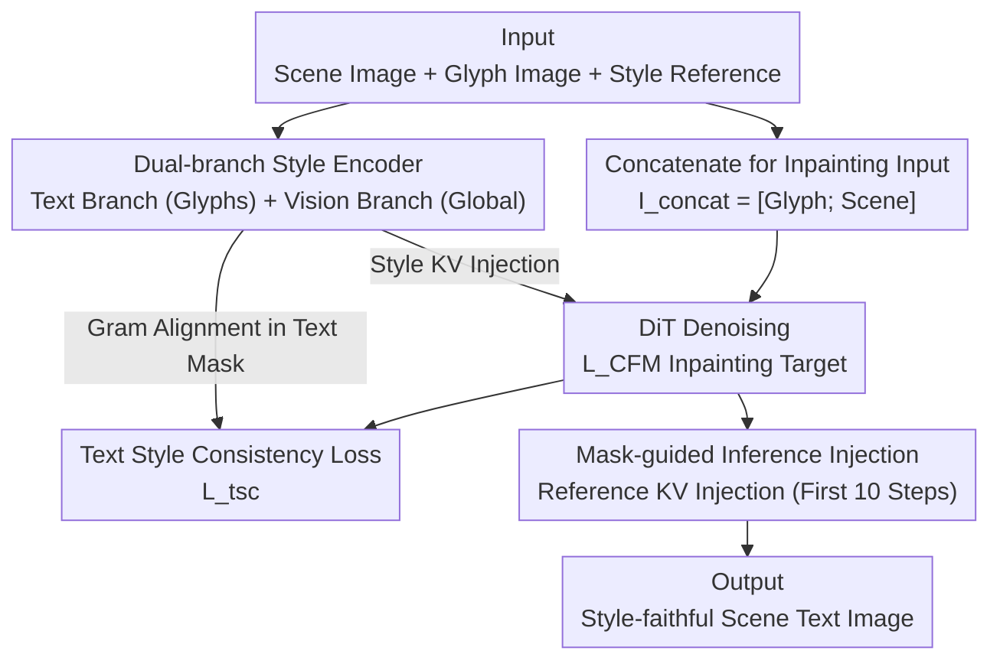

# StyleTextGen: Style-Conditioned Multilingual Scene Text Generation

**Conference**: CVPR 2026  
**arXiv**: [2605.14708](https://arxiv.org/abs/2605.14708)  
**Code**: None  
**Area**: Diffusion Models / Image Generation / Scene Text Generation  
**Keywords**: Style-conditioned generation, multilingual scene text, dual-branch style encoder, style consistency loss, diffusion inpainting  

## TL;DR
StyleTextGen models "generating scene text based on the style of a reference image" as a DiT diffusion inpainting task. It utilizes a **dual-branch style encoder** (a text branch for extracting glyph textures and a vision branch for capturing global tones) to extract style embeddings decoupled from the background. By incorporating a **style consistency loss** calculated exclusively within text regions and an inference strategy that **injects reference KV only during the first 10 steps**, it achieves SOTA results in style similarity and character accuracy for both monolingual and cross-lingual scene text generation in Chinese and English.

## Background & Motivation

**Background**: Text-to-image diffusion models (e.g., FLUX, SD series) can generate realistic images, but "writing" within images remains a challenge. Specialized scene text generation lines—such as AnyText, TextDiffuser, and GlyphControl—use glyph priors and layout masks to improve structural fidelity. GlyphByT5 and AnyText2 further encode font and color information into text encoders to achieve coarse-grained appearance control.

**Limitations of Prior Work**: These methods are limited to controlling relatively simple fonts and cannot **replicate artistic styles from an arbitrary reference image**. Scene text editing methods (e.g., TextCtrl, SRNet) typically only reuse the style of the original text in situ and cannot process external style references. While Calligrapher attempts free-style generation, its style extraction **lacks content awareness**, leading to entanglement between style and content—if the reference background is cluttered or lighting is variable, the style becomes contaminated.

**Key Challenge**: Style-conditioned scene text generation faces two major hurdles distinct from general image synthesis. First, **extracting "text-only style" from complex scenes is difficult**: reference images often have cluttered backgrounds and varied text layouts, causing general encoders to mistake background textures for text styles. Second, **maintaining fine-grained style consistency across multiple languages is even harder**: different writing systems (e.g., Latin, Chinese, Arabic) vary significantly in stroke structure and complexity. Without a robust cross-lingual style transfer mechanism, generated text in different languages suffers from appearance drift and structural distortion.

**Goal**: Decomposition into three sub-problems: (1) Designing an encoder that stably extracts text style from complex multilingual scenes; (2) Explicitly constraining the statistical alignment of style between generated and reference text within text regions; (3) Refining the style correspondence between reference and generation during the inference phase.

**Key Insight**: General vision encoders can be "short-circuited" by backgrounds, whereas encoders specifically pre-trained on multilingual text segmentation tasks can focus on glyphs. Therefore, a "text-aware" branch and a "global-aware" branch are used complementarily, with masks employed to strictly confine all style constraints to text pixels.

**Core Idea**: Utilizing "dual-branch text-aware style encoding + mask-constrained style consistency loss and inference injection" to achieve content-style decoupled multilingual scene text style transfer within an inpainting diffusion paradigm.

## Method

### Overall Architecture
StyleTextGen is built upon the diffusion inpainting paradigm. The input consists of a background scene image $I_{\text{scene}}$, a target text prompt (rendered as a binary glyph image $I_{\text{glyph}}$), and a text style reference image $I_{\text{style}}$. The output is a target text image generated within a specified mask region that faithfully replicates the reference style. The backbone is initialized with TextFlux (a multilingual text generation DiT based on FLUX.1-Fill-Dev). Specifically, the glyph image and scene image are **vertically concatenated** as $I_{\text{concat}}=[I_{\text{glyph}};\,I_{\text{scene}}]$ for inpainting. Along with the inpainting mask $M$, prompt $p$, and style image $I_{\text{style}}$, they form the condition set $c$. The DiT predicts the velocity field from a rectified-flow perspective, optimized by the conditional flow-matching loss $\mathcal{L}_{\text{CFM}}$.

Three contribution components are layered onto this backbone: The **dual-branch style encoder** encodes $I_{\text{style}}$ into text-aware style embeddings $z_{\text{style}}$, which are linearly projected into style key-values and injected into the DiT attention. During training, an additional **text style consistency loss** $\mathcal{L}_{\text{tsc}}$ aligns Gram matrices only within the generated/reference text masks. During inference, **mask-guided style injection** is used to inject KV features inverted from the reference image into the text regions during the first 10 steps to refine style correspondence. The entire process freezes the DiT and the backbone of the two encoders, training only the adapter modules and the style KV projection layer.

### Key Designs

**1. Dual-branch Style Encoder: Complementing Text-awareness with Global Context to Decouple Style from Background**

This design addresses the pain point of extracting styles solely from text in cluttered scenes. A single general vision encoder often fails by treating background textures or lighting as part of the style. The authors split this into two complementary paths. The **text style branch** captures text-specific cues like glyph structure, stroke texture, and color distribution. it consists of a text encoder $E_{\text{text}}$, a self-attention refinement transformer $S_{\text{text}}$, and a Q-Former adapter $Q_{\text{text}}$: $h_{\text{text}}=Q_{\text{text}}(S_{\text{text}}(E_{\text{text}}(I_{\text{style}})))$. Here, $E_{\text{text}}$ uses InternViT (initialized with TokenFD bilingual text-aware weights) and was pre-trained on a "style-preserving multilingual text segmentation" task, enabling it to lock onto text across complex backgrounds and diverse writing systems. The **visual prior branch** uses a general SigLIP encoder (insensitive to text) to extract global appearance and tone, preventing shortcuts in self-reference modes: $h_{\text{vis}}=P_{\text{vis}}(E_{\text{vis}}(I_{\text{style}}))+Q_{\text{vis}}(E_{\text{vis}}(I_{\text{style}}))$. The two are fused via cross-attention, using text features as queries and visual features as keys/values: $z_{\text{style}}=\mathrm{Attn}(h_{\text{text}},h_{\text{vis}},h_{\text{vis}})$. Finally, $z_{\text{style}}$ is projected into $(K_s, V_s)$ and merged into the DiT via an **additive style attention branch**: $F_{\text{style}}=\mathrm{SelfAttn}(Q,K,V)+\mathrm{StyleAttn}(Q,K_s,V_s)$. Compared to the single-path extraction in Calligrapher, this "division + fusion" explicitly separates text style from the background.

**2. Text Style Consistency Loss: Confining Style Constraints to Text Pixels**

Background clutter can obscure style cues, and without explicit text-region targets, style can drift. Following Gatys' neural style representation, the authors use a pre-trained visual encoder $\phi$ to extract multi-layer features. For each layer, $\phi_j(x)\in\mathbb{R}^{C_j\times H_j\times W_j}$ is reshaped into $F_j(x)\in\mathbb{R}^{C_j\times N_j}$ ($N_j=H_jW_j$), and the Gram matrix $G_j^{\phi}(x)=\frac{1}{N_j}F_j(x)F_j(x)^{\top}$ is calculated. The key innovation is **calculating this only within text regions**: using the generated text mask $M_{\text{gen}}$ and reference mask $M_{\text{ref}}$ to extract the text pixels, and then minimizing the Frobenius distance between Gram matrices:

$$\mathcal{L}_{\text{tsc}}=\sum_{j\in J}\left\|G_j^{\phi}(M_{\text{gen}}\odot\hat{x})-G_j^{\phi}(M_{\text{ref}}\odot I_{\text{style}})\right\|_F^2.$$

The total training objective is $\mathcal{L}=\mathcal{L}_{\text{CFM}}+\lambda_{\text{tsc}}\mathcal{L}_{\text{tsc}}$, with $\lambda_{\text{tsc}}=10$. This mask-guided loss forces the style statistics of all generated characters to align with the reference, preventing the model from copying color textures from the background.

**3. Mask-guided Inference Style Injection: Precision Injection in Early Denoising Steps**

While training constrains average behavior, fine-grained misalignment can still occur. During inference, a bilingual text segmentation model extracts $M_{\text{gen}}$ and $M_{\text{style}}$. The reference latent $x_s$ is **inverted** through the DiT to recover internal key-values $(K_s, V_s)$, with $M_{\text{style}}$ ensuring only text regions contribute to the style representation. AdaIN is then used for style adaptation: $\tilde{K},\tilde{V}=\mathrm{AdaIN}(K,V;K_s\odot M_{\text{style}},V_s\odot M_{\text{style}})$, fused with original KVs via $M_{\text{gen}}$: $K'=(1-M_{\text{gen}})\odot K+M_{\text{gen}}\odot\tilde{K}$. Attention outputs are similarly fused using AdaIN and $M_{\text{gen}}$. To maintain background consistency, **style injection is only applied during the first 10 denoising steps**—setting the tone early and allowing the model to refine details later without damaging readability.

### Loss & Training
- **Total Loss**: $\mathcal{L}=\mathcal{L}_{\text{CFM}}+\lambda_{\text{tsc}}\mathcal{L}_{\text{tsc}}$, where $\lambda_{\text{tsc}}=10$.
- **Freezing Strategy**: All parameters of the DiT and the two encoder backbones (InternViT/SigLIP) are frozen. Only the remaining modules of the two branches ($S_{\text{text}}$, $Q_{\text{text}}$, $P_{\text{vis}}$, $Q_{\text{vis}}$) and the linear projection layer for style KV are trained.
- **Hyperparameters**: Resolution $512\times512$, AdamW optimizer, learning rate $2\times10^{-5}$, batch size 2, 16-step gradient accumulation.
- **Data**: A synthetic bilingual style dataset was constructed (77 CJK/Latin TrueType fonts + 2,218 artistic prompts + 10k background images). The training set includes 10k high-quality bilingual images, 2,000 English style samples from Calligrapher, and 2,000 curated synthetic images.

## Key Experimental Results

### Main Results
On AnyWord-Eval (1000 Chinese, 1000 English images), comparing self-style editing (Sen.Acc↑, NED↑, FID↓, LPIPS↓):

| Setting | Metric | AnyText | Calligrapher | TextFlux | **Ours** |
|------|------|---------|--------------|----------|----------|
| English | Sen.Acc ↑ | 0.5613 | 0.6129 | 0.6542 | **0.7102** |
| English | NED ↑ | 0.7264 | 0.7637 | 0.8018 | **0.8575** |
| English | FID ↓ | 67.82 | 54.26 | 59.44 | **49.51** |
| English | LPIPS ↓ | 0.212 | 0.176 | 0.187 | **0.161** |
| Chinese | Sen.Acc ↑ | 0.4986 | 0.5153 | 0.6185 | **0.6524** |
| Chinese | NED ↑ | 0.6691 | 0.6847 | 0.7934 | **0.8187** |
| Chinese | FID ↓ | 71.35 | 63.28 | 57.12 | **52.43** |
| Chinese | LPIPS ↓ | 0.267 | 0.231 | 0.204 | **0.187** |

English Sen.Acc is 5.6 points higher than TextFlux, and Chinese is 3.4 points higher. FID decreased by 16.7% (EN) and 8.21% (CN).

On StyleText-CE (2021 multilingual images, supporting self/external reference), compared with Calligrapher (FID/LPIPS calculated only on cropped text regions):

| Ref Mode | Config | Metric (Sen.Acc/NED ↑) | Calligrapher | **Ours** |
|----------|------|--------------------|--------------|----------|
| Self | cn | Sen.Acc/NED | 0.51/0.67 | **0.66/0.81** |
| Self | en | Sen.Acc/NED | 0.64/0.78 | **0.70/0.85** |
| Self | cn→en | Sen.Acc/NED | 0.57/0.74 | **0.66/0.80** |
| Self | en→cn | Sen.Acc/NED | 0.49/0.66 | **0.64/0.77** |
| External | cn | Sen.Acc/NED | 0.49/0.67 | **0.60/0.79** |
| External | en | Sen.Acc/NED | 0.58/0.75 | **0.71/0.84** |

In external-style scenarios, Sen.Acc/NED improved by ~0.135/0.11, while FID/LPIPS decreased by ~15.1/0.028.

### Ablation Study
Ablation on StyleText-CE:

| Config | Sen.Acc ↑ | NED ↑ | FID ↓ | LPIPS ↓ | Description |
|------|-----------|-------|-------|---------|------|
| w/o Text Branch | 0.618 | 0.775 | 133.62 | 0.536 | FID spikes (+20) |
| w/o Vision Branch | 0.634 | 0.789 | 124.18 | 0.503 | Global coherence degrades |
| w/o $\mathcal{L}_{\text{tsc}}$ | 0.629 | 0.788 | 126.94 | 0.509 | Text copies background |
| w/o Inference Injection | 0.646 | 0.796 | 118.36 | 0.494 | Refinement missing |
| Full (Ours) | **0.659** | **0.804** | **113.47** | **0.482** | Full Model |

### Key Findings
- **Text branch contributes most**: Removing it caused FID to spike from 113.47 to 133.62, proving that "precise extraction of text-specific style cues" is vital.
- **Complementary roles**: Qualitative results show the text branch handles style extraction in complex backgrounds, while the vision branch maintains global tone and layout.
- **$\mathcal{L}_{\text{tsc}}$ prevents "copying background"**: Without it, generated text tends to inherit cues from the surrounding background rather than the reference.
- **Inference injection is the "cherry on top"**: While it contributes the least (FID only rose to 118.36 without it), it visibly improves stability and fine-grained alignment.

## Highlights & Insights
- **"Text-aware + Global" dual-encoder**: Using InternViT pre-trained on text segmentation to "find text" and SigLIP to "fill global context" is a robust decoupling strategy applicable to any task requiring both foreground detail and background context.
- **Mask-constrained constraints**: By calculating the Gram matrix and performing KV injection only within masks, style control is precisely restricted to the intended pixels, fundamentally avoiding style-background entanglement.
- **Early-stopping injection trick**: Applying style injection only in the first 10 steps balances global tone with local readability—a low-cost, reusable inference trick.
- **Honest cross-lingual evaluation**: The authors proactively note that higher cross-lingual FID/LPIPS results are artifacts of glyph differences rather than method failure.

## Limitations & Future Work
- **Dependence on segmentation quality**: Accuracy depends on external segmentation models (Hi-SAM); if segmentation fails, style alignment suffers.
- **Limited language scope**: While "multilingual" is claimed, experiments primarily cover Chinese and English. Generalization to scripts like Arabic or Devanagari is unverified.
- **Synthetic data bias**: Heavy reliance on synthetic style samples may limit the model's ability to replicate extreme real-world artistic styles.
- **Computational overhead**: Inference requires extra segmentation and DiT inversion steps, increasing latency.

## Related Work & Insights
- **vs Calligrapher**: StyleTextGen outperforms Calligrapher by ~0.135/0.11 in Sen.Acc/NED under external-style settings due to its content-aware extraction and mask-based decoupling.
- **vs TextFlux**: As the backbone, TextFlux lacks reference style support; StyleTextGen adds this capability, improving English Sen.Acc by 5.6 points.
- **vs AnyText / AnyText2 / GlyphByT5**: These use text-encoder-based coarse control; StyleTextGen's image-conditioned approach allows for much higher artistic fidelity.

## Rating
- Novelty: ⭐⭐⭐⭐ A clear new solution for scene text style transfer using dual-branch encoding and mask constraints.
- Experimental Thoroughness: ⭐⭐⭐⭐ Extensive benchmarks and ablations, though lacks more languages and human evaluation.
- Writing Quality: ⭐⭐⭐⭐ Clear motivation, complete formulas, and honest discussion of metrics.
- Value: ⭐⭐⭐⭐ Strong application potential in multilingual poster/sign design and data augmentation for OCR.

<!-- RELATED:START -->

## Related Papers

- [\[CVPR 2026\] A Style is Worth One Code: Unlocking Code-to-Style Image Generation with Discrete Style Space](a_style_is_worth_one_code_unlocking_code-to-style_image_generation_with_discrete.md)
- [\[CVPR 2026\] StyleText: A Large-Scale Dataset and Benchmark for Stylized Scene Text Inpainting](styletext_a_large-scale_dataset_and_benchmark_for_stylized_scene_text_inpainting.md)
- [\[CVPR 2026\] ScenDi: 3D-to-2D Scene Diffusion Cascades for Urban Generation](scendi_3d-to-2d_scene_diffusion_cascades_for_urban_generation.md)
- [\[ECCV 2024\] DCDM: Diffusion-Conditioned-Diffusion Model for Scene Text Image Super-Resolution](../../ECCV2024/image_generation/dcdm_diffusion-conditioned-diffusion_model_for_scene_text_image_super-resolution.md)
- [\[CVPR 2026\] StyleDoctor: Towards Specialist Reward Model for Style-centric Generation Tasks](styledoctor_towards_specialist_reward_model_for_style-centric_generation_tasks.md)

<!-- RELATED:END -->
