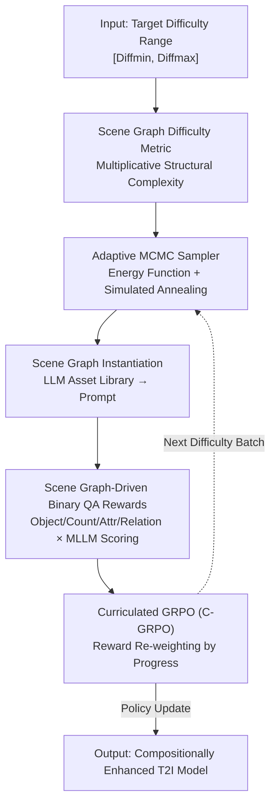

# Synthetic Curriculum Reinforces Compositional Text-to-Image Generation

**Conference**: CVPR 2026  
**Paper**: [CVF Open Access](https://openaccess.thecvf.com/content/CVPR2026/html/Wang_Synthetic_Curriculum_Reinforces_Compositional_Text-to-Image_Generation_CVPR_2026_paper.html)  
**Code**: None  
**Area**: Diffusion Models / Text-to-Image Generation / Reinforcement Learning  
**Keywords**: Compositional Generation, Curriculum Learning, Scene Graphs, MCMC Sampling, GRPO

## TL;DR
CompGen defines "compositional difficulty" through the structural complexity of scene graphs, utilizes adaptive MCMC to sample scene graphs within specified difficulty intervals to construct training prompts, and integrates "easy-to-hard" curriculum weights into the rewards of Group Relative Policy Optimization (GRPO). **Without requiring any ground-truth images**, this approach improves the compositional generation capabilities of diffusion and autoregressive T2I models by an average of 7~12 points.

## Background & Motivation
**Background**: Text-to-Image (T2I) generation has achieved high image quality, but "compositional generation"—the simultaneous appearance of multiple objects, each with distinct attributes and spatial/semantic relations (e.g., "a brown dog standing to the right of a white kitten")—remains a well-recognized challenge. Mainstream improvement routes include attention map modification (e.g., DenseDiffusion, CONFORM), introducing intermediate structures (layouts, skeletons), and fine-tuning (vision-language supervision or RL).

**Limitations of Prior Work**: Attention-based methods only work during inference, with limited scalability; planning-based methods require extra layout/VQA modules, increasing inference costs and risking attribute binding errors; training-based methods often require synthetic ground-truth images or intermediate skeletons, incurring high data preparation costs. Crucially, large-scale RL for compositional T2I is unstable because "compositional ability" is heterogeneous, involving object existence, attribute binding, relation understanding, and counting—mixing these during training leads to oscillation.

**Key Challenge**: Compositional difficulty lacks a **quantifiable and controllable** metric. Without the ability to precisely sequence "simple samples before complex samples," RL blindly optimizes on mixed-difficulty data, leading to instability and sub-optimal performance.

**Goal**: (1) Define a grounded metric for compositional difficulty; (2) Efficiently generate training data by difficulty; (3) Integrate a difficulty curriculum into RL without relying on ground-truth images.

**Key Insight**: Drawing from human cognitive development—learning single objects/attributes before complex multi-object relations—the "easy-to-hard" curriculum can be characterized by **scene graphs**. The structural density of objects, attributes, and relations naturally reflects compositional complexity.

**Core Idea**: Structural complexity of scene graphs serves as the difficulty yardstick. Adaptive MCMC samples scene graphs in target difficulty ranges to "synthesize a curriculum," and curriculum weights reshape GRPO rewards, coupling curriculum learning with ground-truth-free RL.

## Method

### Overall Architecture
CompGen is a two-stage "Synthetic Curriculum + Curriculated RL" framework. **Stage 1** defines difficulty and uses adaptive MCMC to sample scene graphs within the $[Diff_{min}, Diff_{max}]$ interval. **Stage 2** instantiates each scene graph into a text prompt for the T2I model and employs programmatically generated binary Question-Answering (QA) pairs + Multimodal LLM (MLLM) scoring as rewards. Finally, Curriculated GRPO (C-GRPO) updates the T2I model. The input is "text only," and the output is a "compositionally enhanced T2I model," **completely bypassing the need for reference images**.

### Key Designs

**1. Scene Graph Difficulty Metric: Quantifying Complexity Multiplicatively**

Compositional difficulty previously lacked a standard metric to drive curricula. This paper formalizes a scene graph as $G=(O,A,R)$ (Object set $O$, Attribute set $A$, Relation set $R$) and defines difficulty as:

$$\mathrm{Diff}(G) = \lVert O\rVert \cdot \max\!\left(1, \frac{\lVert A\rVert}{\lVert O\rVert}\right)\cdot \max\!\left(1, \frac{\lVert R\rVert}{\lVert O\rVert}\right)$$

The factors represent total object count, average attribute density, and average relational connectivity. The **multiplicative** form (rather than additive/average) captures the exponential nature of combinatorial explosions as components increase. Ablations show this outperforms additive baselines (e.g., $\lVert O\rVert+\lVert A\rVert+\lVert R\rVert$) by 4.56 points on average.

**2. Adaptive MCMC Scene Graph Sampling: Efficient Data Generation**

To sample graphs where difficulty falls within $[\mathrm{Diff}_{min},\mathrm{Diff}_{max}]$, the authors use an iterative sampling approach starting from a minimal graph $G_0$. Two reversible transformations, $T_{add}$ (adding a node/edge) and $T_{delete}$ (removing a node/edge), propose candidate graphs $G'$. The proposal distribution $q(G'|G)$ is designed to be symmetric. To target specific difficulties, an energy function measures the deviation:

$$\mathrm{Energy}(G) = \mathrm{Dist}\big(\mathrm{Diff}(G),\,[\mathrm{Diff}_{min},\mathrm{Diff}_{max}]\big)$$

Metropolis-Hastings is used for decisions, with the acceptance probability $\mathrm{Acc}(G'|G)=\min\!\big(1,\exp(\tfrac{\mathrm{Energy}(G)-\mathrm{Energy}(G')}{\tau})\big)$. A simulated annealing strategy for temperature $\tau$ allows broad exploration initially, later converging to the constraint, ensuring both accuracy and diversity.

**3. Scene Graph-Driven Binary QA Rewards: Fine-grained Feedback without Ground Truth**

Rewards are generated by using the same scene graph to produce both the prompt and the evaluation questions. A constrained LLM (DeepSeek-V3) converts the graph to a prompt, ensuring all elements are included. Four types of binary questions are programmatically generated from the graph—Object Existence $Q_{object}$, Counting $Q_{count}$, Attribute $Q_{attribute}$, and Relation $Q_{relation}$. An MLLM (LLaVA-v1.6-13B) calculates the probability of a "yes" answer: $r_j^{(i)}=p_{reward}(\text{answer}_j\mid I^{(i)},\text{question}_j)$. Averaging these provides a structural reward signal more granular than holistic scoring.

**4. Curriculated GRPO (C-GRPO): Sequencing Policy Optimization**

C-GRPO re-weights rewards across different difficulty levels based on training progress. The curriculated reward at step $t$ is $\hat r_j^{(i)}(t)=\sum_{j'}\hat p(t,j')\cdot r_j^{(i)}$, where $\hat p(t,j')$ is the sampling probability of difficulty level $j'$ at step $t$ (controlled by Easy-to-Hard or Gaussian scheduling). The overall reward $\hat r^{(i)}(t)$ for an image is the mean of all sampled questions. Advantages are normalized within each group of $G$ images to calculate $A_i(t)$, which is then plugged into the GRPO objective with clip and KL regularization:

$$J_{\text{C-GRPO}}(\theta)=\mathbb{E}_T\Big[\tfrac1G\sum_i \min\big(\tfrac{\pi_\theta}{\pi_{\theta_{old}}}A_i(t),\ \mathrm{clip}(\tfrac{\pi_\theta}{\pi_{\theta_{old}}},1-\epsilon,1+\epsilon)A_i(t)\big)-\beta\,\mathrm{KL}(p_\theta\Vert p_{ref})\Big]$$

This encourages the model to master simple concepts before tackling complex combinations.

## Key Experimental Results

### Main Results
On GenEval, DPG, TIFA, T2I-CompBench, and DSG, CompGen provides significant gains for both diffusion and autoregressive backbones:

| Model | Params | GenEval | DPG | TIFA | T2I-CompBench | DSG | Average |
|------|--------|---------|-----|------|---------------|-----|------|
| Stable-Diffusion-1.5 (Baseline) | 0.9B | 42.08% | 62.24% | 78.67% | 29.94% | 61.57% | 54.90% |
| Stable-Diffusion-2.1 | 0.9B | 50.00% | 65.47% | 82.00% | 32.01% | 68.09% | 59.51% |
| Playground-V2 | 2.6B | 59.00% | 74.54% | 86.20% | 36.13% | 74.54% | 66.08% |
| SimpleAR-SFT (Baseline) | 0.5B | 53.00% | 78.48% | 81.06% | 33.76% | 71.98% | 63.66% |
| Emu3 | 14B | 54.00% | 74.19% | 81.86% | 31.20% | 70.31% | 62.31% |
| **SD-1.5 w/ CompGen** (Ours) | 0.9B | 53.88% | 78.67% | 85.71% | 37.68% | 77.16% | **66.62%** (↑11.72) |
| **SimpleAR w/ CompGen** (Ours) | 0.5B | 63.24% | 81.20% | 85.53% | 40.27% | 86.11% | **71.27%** (↑7.61) |

The 0.9B SD-1.5 with CompGen outperforms the 2.6B Playground-V2. The 0.5B SimpleAR with CompGen achieves 71.27%, **surpassing all evaluated models, including the 14B Emu3**.

### Ablation Study

**Reward Model Impact** (SD-1.5 backbone, Average Score):

| Reward Model | Average |
|----------|---------|
| InstructBLIP | 57.22% |
| CLIP-FlanT5-XXL | 60.63% |
| LLaVA-v1.5-13B | 64.40% |
| **LLaVA-v1.6-13B (Selected)** | **66.62%** |

Performance scales linearly with the capability of the reward MLLM.

**Difficulty Metric Impact**:

| Difficulty Metric | Average |
|----------|---------|
| $\lVert O\rVert+\lVert A\rVert+\lVert R\rVert$ (Additive) | 62.06% |
| $(\lVert O\rVert+\lVert R\rVert)/2$ (Mean) | 61.34% |
| **Ours (Multiplicative)** | **66.62%** |

### Key Findings
- **Reward Model is the Ceiling**: Performance improves with MLLM power, providing a clear path for future scaling.
- **Multiplicative Metric is Key**: It characterises the combinatorial explosion better than additive metrics.
- **Curriculum Scheduling Strategy**: On GenEval, Gaussian scheduling reached 54.6% within 500 steps (a 30% relative gain). Curriculum learning extends the effective training duration for continuous improvement.
- **Difficulty Balance**: Focusing exclusively on easy or hard samples degrades generalization; a balanced progression is essential.

## Highlights & Insights
- **Dual Role of Scene Graphs**: The scene graph acts as both "questioner" (prompt gen) and "grader" (QA gen), grounding RL without needing reference images.
- **Difficulty as a Controllable Sampling Variable**: Using MCMC to hit precise difficulty targets allows for "data on demand."
- **Curriculum Integrated into Rewards**: C-GRPO re-weights rewards rather than changing architecture, making it easy to integrate into existing pipelines.

## Limitations & Future Work
- Complexity is currently structural; semantic complexity (e.g., visual realism requirements) is not yet factored into the difficulty metric.
- Curriculum scheduling is currently fixed (Easy-to-Hard/Gaussian) rather than adaptive to real-time model performance.
- Reliance on MLLM binary scoring: Systemic biases in the MLLM (e.g., specific relation errors) directly affect reward quality.
- Structural counts may not always align with human perception of difficulty (e.g., semantically unusual but structurally simple prompts).

## Related Work & Insights
- **Vs Attention Methods (DenseDiffusion)**: CompGen updates weights for zero-cost inference, whereas attention methods are inference-only.
- **Vs Planning Methods**: CompGen avoids the need for external layout modules during inference.
- **Vs SFT with GT Images**: CompGen only requires text and RL, bypassing expensive ground-truth image generation.
- **Vs Standard GRPO**: Standard GRPO oscillates on mixed-difficulty data; C-GRPO ensures healthier scaling via staged learning.

## Rating
- Novelty: ⭐⭐⭐⭐⭐ 
- Experimental Thoroughness: ⭐⭐⭐⭐ 
- Writing Quality: ⭐⭐⭐⭐ 
- Value: ⭐⭐⭐⭐⭐ 

<!-- RELATED:START -->

## Related Papers

- [\[CVPR 2026\] POCA: Pareto-Optimal Curriculum Alignment for Visual Text Generation](poca_pareto-optimal_curriculum_alignment_for_visual_text_generation.md)
- [\[CVPR 2026\] Curriculum Group Policy Optimization: Adaptive Sampling for Unleashing the Potential of Text-to-Image Generation](curriculum_group_policy_optimization_adaptive_sampling_for_unleashing_the_potent.md)
- [\[CVPR 2026\] Compositional Text-to-Image Generation Via Region-aware Bimodal Direct Preference Optimization](compositional_text-to-image_generation_via_region-aware_bimodal_direct_preferenc.md)
- [\[CVPR 2026\] HiCoGen: Hierarchical Compositional Text-to-Image Generation in Diffusion Models via Reinforcement Learning](hicogen_hierarchical_compositional_text-to-image_generation_in_diffusion_models_.md)
- [\[ICLR 2026\] Long-Text-to-Image Generation via Compositional Prompt Decomposition](../../ICLR2026/image_generation/long-text-to-image_generation_via_compositional_prompt_decomposition.md)

<!-- RELATED:END -->
