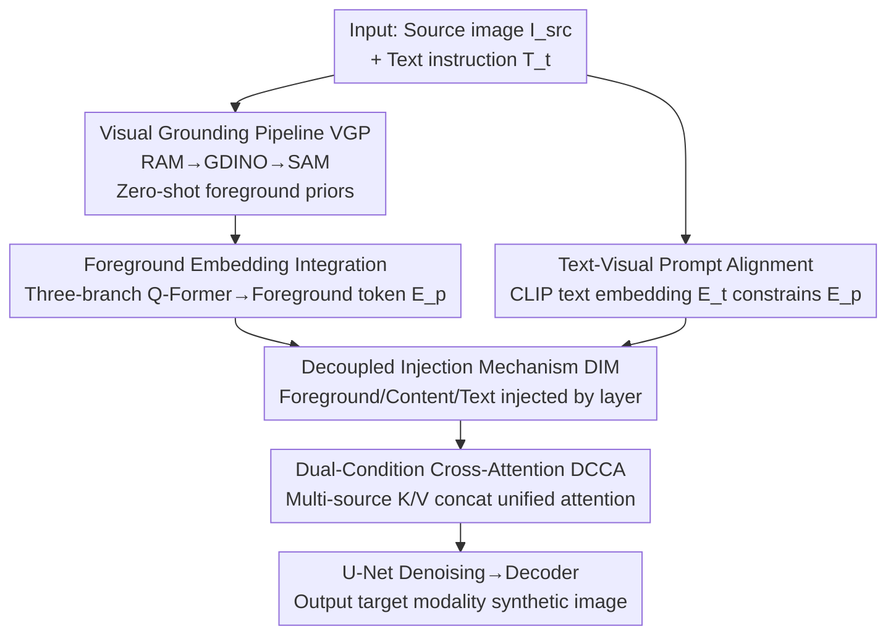

# SynthRGB-T: Language-Vision Guided Image Translation for Diversity Synthesis

**Conference**: CVPR 2026  
**Paper**: [CVF Open Access](https://openaccess.thecvf.com/content/CVPR2026/html/Ding_SynthRGB-T_Language-Vision_Guided_Image_Translation_for_Diversity_Synthesis_CVPR_2026_paper.html)  
**Code**: None  
**Area**: Image Generation / Diffusion Models / Cross-modal Translation  
**Keywords**: Infrared-Visible Translation, Language-Vision Guidance, Diffusion Models, Bidirectional Translation, Data Synthesis

## TL;DR
SynthRGB-T reformulates infrared $\leftrightarrow$ visible image translation as "vision-language guided denoising diffusion." It utilizes foundation models to automatically extract foreground semantic priors and injects decoupled foreground, content, and text conditions into different resolution layers of the U-Net. This enables a single model to perform bidirectional translation and generate diverse results based on text prompts, achieving SOTA on multiple real-world benchmarks for both I2V and V2I directions.

## Background & Motivation
**Background**: Paired infrared and visible image data are critical for scene understanding in night/low-light conditions (detection, tracking, multi-modal fusion). however, data acquisition requires specialized hardware and precise dynamic registration, leading to high costs for large-scale datasets and insufficient diversity in existing ones. Consequently, researchers employ image translation (GANs or Diffusion) for cross-modal data augmentation by mapping one modality to another.

**Limitations of Prior Work**: The authors summarize three main flaws in existing methods. First, **Unidirectionality**—most methods (e.g., DiffV2IR, various GANs) are deterministic one-to-one mappings that only perform V2I *or* I2V; changing directions requires retraining. Second, **Poor Generalization**—without explicit modeling of open scenes, models fail to learn the true correspondence between visible pixels and thermal signals, converging to sub-optimal solutions constrained by training benchmarks (e.g., an I2V-GAN trained on M3FD fails when applied to RoadScene/VisDrone). Third, **Lack of Diversity**—one-to-one mappings cannot characterize inherent one-to-many relationships, such as how different motion states of the same vehicle lead to thermal distribution variances, or how one infrared image may correspond to multiple visible appearances/environments.

**Key Challenge**: Deterministic mapping frameworks are naturally limited to outputting single, fixed-direction results, whereas cross-modal translation is essentially a generation problem that is "condition-controllable, direction-switchable, and one-to-many"—there is a fundamental mismatch between framework capacity and task requirements.

**Goal**: Solve three problems simultaneously with a unified framework—bidirectional translation (one model for both I2V and V2I), open-world generalization (not locked into training benchmarks), and controllable diversity (generating different plausible results for the same input based on different text prompts).

**Key Insight**: The authors discovered that the U-Net cross-attention layers in diffusion models respond hierarchically to "layout" and "details" (low-resolution layers handle global structure, high-resolution layers handle texture). If guidance conditions of different semantics can be injected into corresponding resolution layers in a decoupled manner, structural consistency can be preserved while allowing for controllable style/detail generation.

**Core Idea**: Formulate image translation as a "language-vision guided denoising diffusion process." Use foundation models (RAM+GroundingDINO+SAM) to automatically generate foreground semantic priors in a zero-shot manner, then **decouple and inject** foreground, content, and text conditions into different resolution layers of the U-Net, fusing multi-source conditions via a unified Dual-Condition Cross-Attention.

## Method

### Overall Architecture
SynthRGB-T is built upon Stable Diffusion v1.5. The input is a source image $I_{src}$ (infrared or visible) plus a text instruction $T_t$ (e.g., "translate the image from infrared to visible, night"), and the output is a synthesized image in the target modality. The entire pipeline is denoted as $\hat{I} = N_{tr}(I_{src}, T_t, P \mid \theta)$, where $P$ is the foreground prompt and $N_{tr}$ is the translation network.

The workflow follows three steps: ① The **Visual Grounding Pipeline (VGP)** uses three frozen foundation models to identify, locate, and segment foreground objects in the input image, passing them through CLIP/SAM encoders to obtain label and mask embeddings as "implicit translation priors"; ② These foreground embeddings, along with the text prompt, are integrated into foreground tokens via a Q-Former. Combined with content embeddings $E_c$ and text embeddings $E_t$, they form three branches of semantically aligned control vectors; ③ Inside the denoising U-Net, the **Decoupled Injection Mechanism (DIM)** allows these three conditions to follow different injection rules based on the resolution of the cross-attention layers. Fusion at each layer is handled by **Dual-Condition Cross-Attention (DCCA)**. Finally, the decoder restores $z_0$ to pixel space. The VGP and encoders are frozen; only the Q-Former, U-Net, and decoder are trained.

### Key Designs

**1. Visual Grounding Pipeline (VGP): Zero-shot foreground semantic priors using foundation models without manual annotation**

The pain point is straightforward: manually bounding and labeling foregrounds for every image is time-consuming, yet foregrounds (cars, people, buildings) are where thermal signals vary most and where precise guidance is most needed. VGP chains three **fully frozen** foundation models into a pipeline: Recognize Anything (RAM) extracts candidate categories $C=\{c_1,\dots,c_K\}$, Grounding DINO uses these text semantics for conditional localization to map categories to image regions, and SAM performs pixel-level segmentation to get mask sets $M=\{m_1,\dots,m_K\}$. Subsequently, text descriptions of each foreground are fed into a CLIP encoder and masks into a SAM encoder to establish one-to-one text-vision alignment, generating condition embeddings $E_{mask}^k$ and $E_{label}^k$ for each object in a zero-shot manner. Since these models are pre-trained on large-scale natural images and not updated, the prior extraction adds no training burden while injecting "world knowledge" into the translation process—this is key to its generalization on unseen open benchmarks.

**2. Decoupled Injection Mechanism (DIM): Layer-wise injection based on resolution to decouple "style" and "content"**

This is the core observation of the paper. Borrowing from the phenomenon in diffusion U-Nets where "different cross-attention layers control different attributes," the authors noted that low-resolution layers capture global structure and layout, while high-resolution layers handle texture and local realism. DIM injects foreground prompt embeddings $E_p$ into low-resolution layers to guide structural composition and category, injects image encoder output $E_c$ into high-resolution layers to enhance texture fidelity, while text guidance $E_t$ acts as a global constraint across all scales to ensure semantic consistency. Implementation-wise, across 16 cross-attention layers (0–15), layers 4–8 are designated as low-resolution for Prospect Guidance (foreground), with the remaining layers receiving Content Guidance. This "layer-wise decoupling" separates style from content, allowing the text to flexibly rewrite appearance without destroying the source geometry. Ablations show that removing DIM and fusing across all layers increases computation while degrading performance (FID drops from 38.7 to 62.1). Foreground embeddings are integrated via a three-branch Q-Former: $E_p = f_{Q\text{-}Former}(E_{mask}, E_{label}, Q_{query})$.

**3. Dual-Condition Cross-Attention (DCCA): Unified attention via multi-source condition concatenation**

To support decoupled injection, the U-Net requires an attention structure capable of processing "text+content" or "text+foreground" conditions simultaneously. Traditional methods calculate cross-attention for each modality branch separately and sum them, which the authors argue limits interaction and leads to sub-optimal global representation. DCCA instead uses two sets of trainable linear projections $W^{1,2}_{i/t}$ to process image features $C_i$ and text features $C_t$, then **concatenates** the keys and values of the multi-source features. A unified cross-attention is then initiated using the U-Net query feature $Z$:

$$K = \text{Concat}(C_i W^1_i, C_t W^1_t), \quad V = \text{Concat}(C_i W^2_i, C_t W^2_t)$$

$$Z_{out} = \text{Softmax}\left(\frac{Z W_Q K^T}{\sqrt{d}}\right) V$$

Concatenating K/V rather than adding results allows the query to be joint-weighted across modalities in a single softmax, enabling direct interaction between multi-source conditions to learn a more synergistic latent representation.

**4. Text-Visual Prompt Alignment $L_{cons}$: Bridging VGP foreground priors and user text in a shared space**

The query tokens $E_p$ from VGP originate from the visual side, while user text instructions $E_t = \varepsilon_t(T_{instr})$ from the CLIP text encoder originate from the language side. If unaligned, the text cannot effectively direct foreground generation. The authors use a **separate training stage** with MSE and cosine similarity loss to align them:

$$L_{cons} = \lambda_1 \underbrace{\lVert E_t - E_p \rVert^2}_{L_{mse}} + \lambda_2 \underbrace{\left(1 - \frac{E_t \cdot E_p}{\lVert E_t\rVert \lVert E_p\rVert}\right)}_{L_{cos}}$$

This step is vital for diversity: ablations show that removing $L_{cons}$ causes foreground guidance to "almost completely fail," with a significant drop in text responsiveness.

### Loss & Training
Two-stage training. Stage 1 focuses on prompt alignment $L_{cons}$. Stage 2 jointly optimizes three losses: diffusion loss $L_{diff} = \mathbb{E}\big[\lVert \epsilon - \epsilon_\theta(z_t, t, [E_c, E_p, E_t])\rVert_2^2\big]$ for text consistency; geometric loss $L_{geom} = 1 - \frac{\langle g(\hat{I}), g(I_{src})\rangle}{\lVert g(\hat{I})\rVert \cdot \lVert g(I_{src})\rVert + \epsilon}$ using the Sobel operator $g(\cdot)$ to preserve structure; and perceptual constraint $L_{perc} = \sum_i \lVert \phi_i(\hat{I}) - \phi_i(I_{target})\rVert_1$ using VGG features to enhance fidelity. Total loss: $L_{total} = L_{diff} + \lambda_{geom}L_{geom} + \lambda_{perc}L_{perc}$. Image/text encoders and VGP are frozen; only Q-Former, U-Net, and decoder are updated. Q-Former is initialized with BLIP-Diffusion weights using 16 query tokens. Trained on 4×RTX 6000 for 100K steps with batch size 8, AdamW, and lr $1\times10^{-4}$. To increase robustness, foreground or content branches are randomly dropped during training; DDIM with 30 steps is used for inference.

## Key Experimental Results

The authors constructed **RGBTSynth-86K** (86,141 infrared-visible-text pairs from LLVIP, M3FD, RoadScene, DroneVehicle, etc.) covering both directions. Generalization was tested on single-modality benchmarks like VisDrone, COCO, and IRSTD-1k. Evaluation metrics used include NIQE↓ (naturalness), LPIPS↓ (perceptual difference), FID↓ (distribution realism), and SSIM↑ (structural similarity).

### Main Results (Comparison with SOTA on M3FD / LLVIP)

| Task | Benchmark | Metric | Ours | CM-Diff | DiffV2IR | LG-Diff |
|------|-----------|------------------|-----------------|--------------|---------------|--------------|
| I2V | M3FD | FID↓ / SSIM↑ | **40.3 / 0.753** | 43.9 / 0.665 | 116.7 / 0.686 | 78.3 / 0.654 |
| I2V | LLVIP | FID↓ / SSIM↑ | **34.2 / 0.885** | 39.8 / 0.718 | 50.4 / 0.671 | 42.8 / 0.703 |
| I2V | LLVIP | LPIPS↓ | **0.057** | 0.101 | 0.123 | 0.108 |
| V2I | M3FD | FID↓ / SSIM↑ | **37.5 / 0.783** | 40.8 / 0.626 | 39.5 / 0.689 | 72.8 / 0.735 |
| V2I | LLVIP | FID↓ / SSIM↑ | **31.8 / 0.922** | 40.0 / 0.751 | 35.9 / 0.774 | 37.0 / 0.742 |

Ours ranks first in almost all paired and unpaired settings for both directions. GAN-based methods suffer from low SSIM and high LPIPS (weak cross-modal consistency); diffusion methods are more stable but often only learn macro target domain styles without semantic alignment—the simultaneous improvement in FID/LPIPS and SSIM proves that our method bridges the modal gap rather than just "re-skinning" the images.

### Ablation Study (Bidirectional Average)

| ID | VGP | DIM | DCCA | $L_{cons}$ | NIQE↓ | LPIPS↓ | FID↓ | SSIM↑ |
|----|-----|-----|------|-----------|-------|--------|------|-------|
| I | ✗ | ✗ | ✗ | ✗ | 7.96 | 0.356 | 144.2 | 0.407 |
| III | ✓ | ✓ | ✗ | ✓ | 5.58 | 0.154 | 60.3 | 0.699 |
| IV | ✓ | ✗ | ✓ | ✓ | 5.85 | 0.172 | 62.1 | 0.675 |
| V | ✓ | ✓ | ✓ | ✗ | 6.62 | 0.248 | 88.6 | 0.629 |
| VI（Full） | ✓ | ✓ | ✓ | ✓ | **4.22** | **0.085** | **38.7** | **0.793** |

### Diversity Ablation (LPIPS↑ is better here, measuring generation diversity)

| Configuration | I2V LPIPS↑ | I2V FID↓ | V2I LPIPS↑ | V2I FID↓ |
|---------------|------------|----------|------------|----------|
| w/o DIM | 0.132 | 38.9 | 0.102 | 35.5 |
| w/o DCCA | 0.158 | 38.0 | 0.098 | 35.1 |
| w/o $L_{cons}$ | 0.108 | 41.5 | 0.080 | 37.4 |
| SynthRGB-T | **0.179** | **36.9** | **0.126** | **34.5** |

### Key Findings
- **All four components are essential**: Adding each component consistently improves results from the baseline (FID 144.2 to 38.7). Removing DIM degrades FID to 62.1, and removing DCCA leads to 60.3.
- **$L_{cons}$ is critical for diversity and controllability**: Removing it causes FID to drop to 88.6 and diversity LPIPS to fall from 0.179 to 0.108. Foreground guidance "almost completely fails," proving text-vision alignment is the "switch" for text-driven generation.
- **Clever re-use of diversity metrics**: Drawing from existing work, LPIPS is used as a diversity metric (higher is better). 5,000 images were generated from 500 samples using random prompts to calculate average distance while capping FID to ensure quality.

## Highlights & Insights
- **Foundation models as "free world knowledge" for diffusion priors**: RAM+GroundingDINO+SAM are chained into VGP without training, injecting semantic foreground priors that allow for generalization on open benchmarks—a strategy transferable to other conditional generation tasks lacking annotations.
- **Decoupled injection by U-Net resolution is a highly transferable design**: It translates the observation that different layers handle structure vs. texture into an actionable rule (layers 4–8 for foreground, others for content, global text constraint). This achieved true separation of style and content, highly relevant for image editing and style transfer.
- **K/V concatenation DCCA vs. Branch summation**: Using a single softmax for multi-source interaction is a lightweight but effective improvement over simple addition.
- **Unified model for Bidirectional + Controllable Diversity**: Unlike methods requiring retraining for different directions or being limited to one-to-one mapping, SynthRGB-T supports I2V/V2I and one-to-many generation within one framework.

## Limitations & Future Work
- Expansion beyond IR-Visible modalities (e.g., to medical imaging) is planned.
- Heavy reliance on external foundation models (RAM/GDINO/SAM)—if these fail to identify categories in rare or low-quality scenes, the foreground prior becomes distorted.
- Using LPIPS as a "higher is better" diversity metric can be ambiguous, as high LPIPS can indicate either diverse plausible results or simple distortion; better differentiation is needed.
- The pipeline is computationally heavy, and the training cost for 100K steps on 4×RTX 6000 is non-trivial.

## Related Work & Insights
- **vs. DiffV2IR / LG-Diff**: These also integrate text semantics for V2I, but remain unidirectional and one-to-one. SynthRGB-T's VGP and DIM allow for bidirectional translation and more stable generalization (M3FD V2I FID 39.5 → 37.5).
- **vs. CM-Diff**: CM-Diff also supports bidirectional translation but primarily learns macro styles, often losing thermal signals for living objects. SynthRGB-T achieves higher SSIM (0.751 → 0.922 on LLVIP V2I) due to fine-grained guidance.
- **vs. GANs**: GAN-based methods suffer from poor pixel correspondence and overfit to specific domains; Diffusion + Foundation model priors significantly outperform them in generalization and visual realism.

## Rating
- Novelty: ⭐⭐⭐⭐ The combination of zero-shot priors and resolution-based decoupled injection for bidirectional diversity synthesis is clever.
- Experimental Thoroughness: ⭐⭐⭐⭐ Extensive coverage of five benchmarks, bidirectional tasks, and specific diversity/ablation studies.
- Writing Quality: ⭐⭐⭐⭐ Clear mapping between limitations and designs; technical details are well-documented.
- Value: ⭐⭐⭐⭐ High engineering value for data augmentation in multi-modal detection/tracking.

<!-- RELATED:START -->

## Related Papers

- [\[CVPR 2026\] VisionDirector: Vision-Language Guided Closed-Loop Refinement for Generative Image Synthesis](visiondirector_vision-language_guided_closed-loop_refinement_for_generative_imag.md)
- [\[CVPR 2026\] VOSR: A Vision-Only Generative Model for Image Super-Resolution](vosr_a_vision_only_generative_model_for_image_super_resolution.md)
- [\[CVPR 2026\] OpenDPR: Open-Vocabulary Change Detection via Vision-Centric Diffusion-Guided Prototype Retrieval for Remote Sensing Imagery](opendpr_open-vocabulary_change_detection_via_vision-centric_diffusion-guided_pro.md)
- [\[CVPR 2026\] TherA: Thermal-Aware Visual-Language Prompting for Controllable RGB-to-Thermal Infrared Translation](thera_thermal-aware_visual-language_prompting_for_controllable_rgb-to-thermal_in.md)
- [\[CVPR 2026\] Diversity over Uniformity: Rethinking Representation in Generated Image Detection](diversity_over_uniformity_rethinking_representation_in_generated_image_detection.md)

<!-- RELATED:END -->
