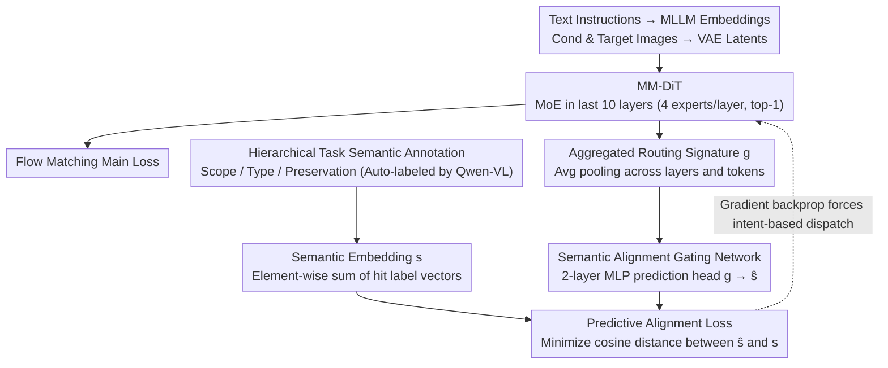

# TAG-MoE: Task-Aware Gating for Unified Generative Mixture-of-Experts

**Conference**: CVPR 2026  
**arXiv**: [2601.08881](https://arxiv.org/abs/2601.08881)  
**Code**: [Project Page](https://yuci-gpt.github.io/TAG-MoE/)  
**Area**: Image Generation / Diffusion Models / Image Editing  
**Keywords**: Mixture-of-Experts, Task-Aware Routing, Unified Image Generation and Editing, Diffusion Transformer, Task Interference

## TL;DR

Addressing the severe task interference problem in unified image generation and editing models, this paper proposes the TAG-MoE framework. By using a hierarchical task semantic annotation scheme and predictive alignment regularization, high-level task intent is injected into local MoE routing decisions. This evolves the gating network from a task-agnostic executor into a semantic-aware scheduling center, achieving state-of-the-art (SOTA) performance among open-source models across five benchmarks, including ICE-Bench, EmuEdit, GEdit, and DreamBench++.

## Background & Motivation

1. **Background**: The field of visual synthesis is rapidly converging toward unified image generation and editing models, aiming to integrate tasks such as subject customization, style transfer, high-fidelity inpainting, and instruction-based editing into a single framework. Representative methods include ACE++, Flux Kontext, BAGEL, OmniGen2, and Qwen-Edit, all based on large-scale Dense Diffusion Transformers (DiT).

2. **Limitations of Prior Work**: Unified models face severe **task interference**—the shared parameter space must simultaneously perform fundamentally contradictory goals. Local editing requires precise content preservation, while subject-driven generation demands expressive diversity and novel synthesis. This fundamental conflict forces the network into "mediocre compromises," hindering necessary representation specialization.

3. **Key Challenge**: Sparse MoE is a promising solution for scaling model capacity and mitigating task interference. However, standard MoE gating networks are **task-agnostic**, relying solely on local token features for routing without knowledge of global task intent (e.g., whether to "preserve identity" or "modify style"). This deep information gap between local gating and global objectives leads to spontaneous, inefficient expert specialization that fails to structurally decouple multi-task interference.

4. **Goal**: How to inject high-level global task semantics into local MoE routing mechanisms to achieve task-aware expert specialization?

5. **Key Insight**: The authors observe that "semantically similar generation tasks should trigger similar expert usage patterns," leading to the design of a regularization where routing signatures can predict task semantics.

6. **Core Idea**: Construct structured semantic supervision signals through hierarchical task annotation, then force the MoE routing strategy to align with task semantics via a predictive alignment loss. This enables the gating network to automatically learn to dispatch experts according to task intent.

## Method

### Overall Architecture

The core problem TAG-MoE aims to solve is that gating networks in unified models only consider local token features for routing, remaining unaware of whether a generation step is for "preserving identity" or "changing style," resulting in inefficient specialization. The approach treats high-level task intent as a learnable supervision signal, forcing the routing strategy to "predict" task semantics and indirectly infusing global intent into local routing.

The entire pipeline is built on MM-DiT (Multi-Modal Diffusion Transformer). Text instructions are encoded into text embeddings by an MLLM, while conditional and target images are compressed into latent representations via a VAE and fed into the DiT. In the last 10 Transformer blocks, the FFN of the image stream is replaced with MoE layers (4 experts per layer, top-1 routing). During training, a hierarchical annotation scheme assigns a structured task descriptor to each sample, and a semantic-aligned router aligns the "overall routing pattern of the model" with these descriptors. The system is trained end-to-end using a Flow Matching objective; during inference, no annotations are needed as VLM-rewritten instructions are utilized.

### Key Designs

**1. Hierarchical Task Semantic Annotation: Decomposing vague "editing" into orthogonal layers**

The most difficult aspect of unified models is that "editing" is too broad—"changing background to a beach" and "making a person smile" are both called editing, but the former requires major pixel changes while the latter requires strict identity preservation. TAG-MoE decomposes each task into three orthogonal dimensions: **Scope** (Global / Local / Customization), **Type** (Object / Style / Attribute), and **Preservation** (Identity / Background / Structure). Annotations are performed automatically by Qwen-VL using training triplets (source, instruction, target). This provides the structured supervision signal previously missing in MoE training.

**2. Semantic Alignment Gating Network: Making routing signatures "predict" task semantics**

To avoid requiring labels during inference, TAG-MoE uses an indirect constraint: requiring that the actual overall routing pattern (routing signature $\mathbf{g}$) can predict the macro task semantics (semantic embedding $\mathbf{s}$).

This is achieved in three steps. First, **Global Semantic Embedding**: A vocabulary $\mathcal{V}$ of $K$ atomic labels is defined, with each label having a learned embedding. The set of labels for a sample is aggregated into a semantic vector $\mathbf{s}$. Second, **Aggregated Routing Signature**: Routing scores from all MoE layers are averaged across layers and then token-wise pooled into a vector $\mathbf{g} \in \mathbb{R}^N$, encoding the expert usage pattern for the entire sample. Finally, **Predictive Alignment**: A 2-layer MLP prediction head maps $\mathbf{g}$ to the semantic space as $\hat{\mathbf{s}}$, and the cosine distance between $\hat{\mathbf{s}}$ and the ground truth $\mathbf{s}$ is minimized.

Crucially, gradients propagate through $\mathbf{g}$ to all MoE gating networks $\mathcal{G}$. To make the signature "task-predictable," each $\mathcal{G}$ must learn to dispatch tokens based on task intent. The gating thus evolves into a semantic-aware scheduler without needing labels at inference time.

**3. MoE in Last 10 Layers: Leveraging capacity for high-level semantics**

Not all layers benefit equally from capacity expansion. TAG-MoE replaces FFNs with MoEs only in the last 10 layers of the DiT (4 experts per layer, top-1 routing), while initial layers use standard FFNs. This follows the experience of DeepSeek-V3 and DiT-MoE: high-level semantic synthesis is most capacity-intensive, and concentrating sparse experts in deep layers significantly scales capacity without increasing active parameters.

### Loss & Training

The total loss is the sum of three terms: $\mathcal{L}_{total} = \mathcal{L}_{flow} + \lambda_{lbl}\mathcal{L}_{lbl} + \lambda_{align}\mathcal{L}_{align}$, where $\mathcal{L}_{flow}$ is the Flow Matching loss, $\mathcal{L}_{lbl}$ is the standard MoE load balancing loss, and $\mathcal{L}_{align}$ is the predictive alignment loss. Training data exceeds 11 million samples, including public data (2.2 million from InstructP2P, UltraEdit, OmniEdit, etc.) and self-constructed data (GPT-4o instructions, specialized model targets, and reverse task augmentation).

## Key Experimental Results

### Main Results

**ICE-Bench Evaluation** (Main benchmark covering 26 task types):

| Method | Aesthetic | CLIP-src | CLIP-cap | CLIP-ref | vllmqa |
|------|------|----------|----------|----------|--------|
| ACE++ | 5.219 | 0.851 | 0.263 | 0.713 | 0.637 |
| Kontext | 5.165 | 0.863 | 0.274 | 0.728 | 0.629 |
| OmniGen2 | 5.238 | 0.855 | 0.279 | 0.728 | 0.787 |
| Qwen-Edit | 5.358 | 0.840 | 0.279 | 0.671 | 0.774 |
| **Ours (TAG-MoE)** | **5.399** | 0.857 | **0.282** | 0.732 | **0.852** |
| GPT-4o (Closed) | 5.801 | 0.823 | 0.278 | 0.693 | 0.889 |

**Image Editing Specific Evaluation (EmuEdit-bench / GEdit-bench)**:

| Method | EmuEdit vllmqa | GEdit vllmqa |
|------|----------------|--------------|
| Step1X-Edit | 0.7893 | 0.8158 |
| Qwen-Edit | 0.9174 | 0.875 |
| **Ours (TAG-MoE)** | **0.9284** | **0.8854** |

**Subject-Driven Generation (DreamBench++ / OmniContext)**: TAG-MoE achieves SOTA in Face-ref (identity preservation) and the highest Style-ref score on DreamBench++.

### Ablation Study

| Configuration | DINO-ref | Face-ref | Style-ref | CLIP-src | CLIP-cap | vllmqa |
|------|----------|----------|-----------|----------|----------|--------|
| Dense Baseline | 0.7196 | 0.3544 | 0.5177 | 0.851 | 0.263 | 0.637 |
| MoE w/o $\mathcal{L}_{align}$ | 0.7355 | 0.3779 | 0.5251 | 0.863 | 0.274 | 0.677 |
| MoE w/ $\mathcal{L}_{align}$ | **0.7620** | **0.4642** | **0.5679** | **0.879** | **0.281** | **0.847** |

### Key Findings

- **MoE vs. Dense**: With equal active parameters, MoE significantly outperforms Dense models across all metrics and converges faster, verifying that sparse architectures are essential for mitigating task interference.
- **Decisive role of $\mathcal{L}_{align}$**: Removing the alignment loss leads to a significant drop in all metrics. MoE structure alone is insufficient; $\mathcal{L}_{align}$ is the key to semantic-guided routing.
- **Expert Specialization Visualization**: Different tasks (e.g., Change Material vs. Change Color) activate different expert combinations. Token heatmaps show that computation is concentrated on task-relevant regions (e.g., backpack pixels), while irrelevant backgrounds are routed to other experts.
- **User Study**: In a study with 65 participants across 50 cases, TAG-MoE received the highest selection rate for reference alignment, prompt alignment, and overall preference.

## Highlights & Insights

- **Predictive Alignment Regularization** is the core innovation—it does not directly feed task labels to the router (which would fail during inference) but requires the routing strategy itself to "predict" task semantics, allowing the router to naturally evolve task-aware capabilities.
- **Hierarchical Annotation Scheme** decomposes the vague concept of "editing" into three orthogonal dimensions: Scope, Type, and Preservation, providing structured supervision previously missing in MoE training.
- **Aggregated Routing Signature** design is effective—it captures sample-level expert usage patterns by aggregating routing scores across all layers and tokens into a global vector.

## Limitations & Future Work

- The model lacks unified input understanding; it relies on pre-processed intent descriptions and cannot jointly reason about intent and visual content (e.g., solving math problems within an image).
- Dependence on VLM for instruction rewriting during inference increases latency and complexity.
- Fixed expert count (4) and top-1 routing; more flexible configurations (e.g., top-2, dynamic expert counts) are worth exploring.
- The task label vocabulary is predefined; new types require extending the vocabulary and retraining.

## Related Work & Insights

- **vs. ICEdit**: ICEdit uses LoRA-based MoE modules in attention blocks, but LoRA experts have limited capacity, and routing remains task-agnostic. TAG-MoE uses full-scale experts and semantic-aligned routing.
- **vs. Dense DiT (e.g., Qwen-Edit)**: Dense models suffer from mediocre compromises in unified tasks, whereas TAG-MoE achieves "expert-level" processing via sparse activation and semantic-guided routing.
- **vs. DiT-MoE / HunyuanImage**: These apply MoE to single T2I tasks and do not face heterogeneous task conflicts. TAG-MoE is the first to address MoE routing for unified multi-task generation.

## Rating

- **Novelty**: ⭐⭐⭐⭐ The predictive alignment regularization is novel, using "routing predicts semantics" as a bridge to inject task intent.
- **Experimental Thoroughness**: ⭐⭐⭐⭐⭐ Comprehensive coverage across five benchmarks, three specialized evaluations, ablation studies, visualization, and user studies.
- **Writing Quality**: ⭐⭐⭐⭐ Clear logic and problem definition, though some mathematical notation could be simplified.
- **Value**: ⭐⭐⭐⭐ Provides a systematic solution for task interference in unified generation models; the semantic alignment routing concept is highly transferable.

<!-- RELATED:START -->

## Related Papers

- [\[CVPR 2026\] Mixture of Style Experts for Diverse Image Stylization](mixture_of_style_experts_for_diverse_image_stylization.md)
- [\[CVPR 2026\] CARE-Edit: Condition-Aware Routing of Experts for Contextual Image Editing](care-edit_condition-aware_routing_of_experts_for_contextual_image_editing.md)
- [\[CVPR 2026\] Taming Generative Diffusion Model for Task-Oriented Infrared Imaging](taming_generative_diffusion_model_for_task-oriented_infrared_imaging.md)
- [\[CVPR 2026\] PosterOmni: Generalized Artistic Poster Creation via Task Distillation and Unified Reward Feedback](posteromni_generalized_artistic_poster_creation_via_task_distillation_and_unifie.md)
- [\[ICLR 2026\] Multi-Subspace Multi-Modal Modeling for Diffusion Models: Estimation, Convergence and Mixture of Experts](../../ICLR2026/image_generation/multi-subspace_multi-modal_modeling_for_diffusion_models_estimation_convergence_.md)

<!-- RELATED:END -->
