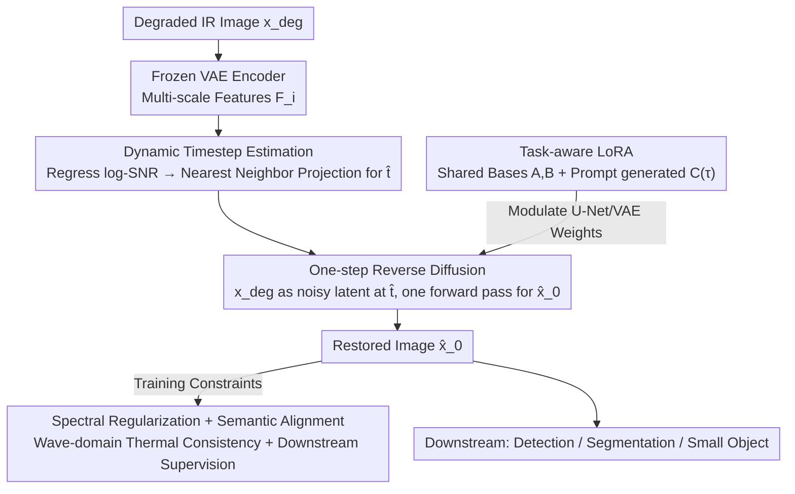

# Taming Generative Diffusion Model for Task-Oriented Infrared Imaging

**Conference**: CVPR 2026  
**Paper**: [CVF Open Access](https://openaccess.thecvf.com/content/CVPR2026/html/Ma_Taming_Generative_Diffusion_Model_for_Task_Oriented_Infrared_Imaging_CVPR_2026_paper.html)  
**Code**: https://github.com/csmty/InfraredIR  
**Area**: Diffusion Models / Infrared Image Restoration  
**Keywords**: Infrared Imaging, One-step Diffusion, Timestep Estimation, Task-aware LoRA, Spectral Regularization  

## TL;DR
Infrared image restoration is reformulated as "one-step diffusion" by using a lightweight predictor to align degraded inputs to the optimal timestep $\hat t$ on the diffusion trajectory. Combined with wave-domain spectral regularization to preserve thermal radiation characteristics and task-aware low-rank adaptation that switches between downstream tasks (detection/segmentation) via optimizing a few-hundred-dimensional prompt, the method outperforms existing approaches in restoration quality, semantic preservation, and efficiency.

## Background & Motivation

**Background**: Infrared (IR) imaging is critical for perception in harsh environments (autonomous driving, robotics). However, real-world IR images are severely contaminated by **dynamically coupled degradations** such as thermal noise, sensor non-uniformity, and atmospheric blur, which degrade visual clarity and destroy semantic accuracy for downstream tasks. Diffusion models offer strong generative priors and are naturally considered for IR restoration.

**Limitations of Prior Work**: Directly applying diffusion models to IR imaging faces three major hurdles. ① **Prior Mismatch**: Most diffusion priors are trained on visible RGB data, relying on reflectance textures, whereas IR images originate from thermal radiation. Forcing RGB priors can "hallucinate" textures or structures inconsistent with thermal physics. ② **Efficiency**: Diffusion inference requires multi-step iterative denoising, leading to high latency and computational costs. ③ **Adaptation Cost**: Downstream tasks (detection, segmentation, tracking) require rapid adaptation to changes in scenes, sensors, or degradation modes. However, the large parameter scale of diffusion models makes full-model fine-tuning for task customization practically infeasible under resource constraints.

**Key Challenge**: There is a tension between physical fidelity, computational efficiency, and task flexibility—fidelity demands large generative priors (which are RGB-based and slow), while flexibility requires task-specific fine-tuning (which is expensive).

**Goal**: To achieve restoration quality, semantic structure preservation, and cross-task generalization simultaneously within a single framework.

**Key Insight**: A key observation is that any degraded real-world input $x_{\text{deg}}$ can be viewed as a noisy latent state $\hat x_{\hat t}$ at an **unknown timestep** $\hat t$ during the forward diffusion process. Once $\hat t$ is estimated, a clean image can be calculated in a single step using the reverse prediction formula, compressing the entire iterative sampling chain into a single forward pass.

**Core Idea**: Reformulate IR restoration as "one-step diffusion" by dynamically estimating the timestep corresponding to the degradation for a single reverse pass, incorporating spectral regularization for thermal physical consistency, and utilizing prompt-driven low-rank adaptation for efficient cross-task migration.

## Method

### Overall Architecture

The framework is built upon a pre-trained diffusion prior (SD-Turbo), reformulating "iterative restoration" into "one-step restoration." The process starts when a degraded IR image $x_{\text{deg}}$ enters: it first leverages multi-scale features from a frozen VAE encoder to estimate its corresponding timestep $\hat t$ on the diffusion trajectory via a lightweight predictor. Treating $x_{\text{deg}}$ as the noisy latent state at $\hat t$, the restored image $\hat x_0$ is obtained through a single forward pass using the reverse prediction formula. Two dynamic conditioning mechanisms are attached to this backbone: **Dynamic Timestep Estimation** locates the input on the trajectory to invoke the appropriate timestep prior, and **Task-aware Low-Rank Adaptation** allows the same backbone to switch between different downstream tasks via prompts. During training, a **Wave-domain Spectral Regularization** ensures thermal radiation consistency, alongside semantic alignment losses instantiated for downstream tasks.

### Key Designs

**1. One-step Diffusion Reconstruction: Degradation as an Unknown Timestep**

This addresses the slow inference of diffusion models. Standard diffusion relies on forward noise addition $x_t=\sqrt{\bar\alpha_t}x_0+\sqrt{1-\bar\alpha_t}\epsilon$ and iterative reverse denoising. The authors establish an equivalence mapping between "real degradation" and "forward diffusion": assuming any degraded input $x_{\text{deg}}$ equals a noisy latent state $\hat x_{\hat t}$ at a specific but unknown timestep $\hat t$. Thus, the clean image is calculated in one step: $\hat x_0=\frac{1}{\sqrt{\bar\alpha_{\hat t}}}\big(\hat x_{\hat t}-\sqrt{1-\bar\alpha_{\hat t}}\,\epsilon_\theta(\hat x_{\hat t},\hat t)\big)$. This reduces FLOPs by an order of magnitude while retaining generative prior capabilities.

**2. Dynamic Timestep Estimation: Timestep Selection as a Learnable Inverse Problem**

The success of one-step restoration depends on the accuracy of $\hat t$. An overestimated $\hat t$ over-smooths the image, while an underestimated one fails to remove heavy noise. Instead of heuristic search, this is treated as an inverse problem under a noise schedule. Using log-SNR parametrization $\lambda(t)=\log(\bar\alpha_t/(1-\bar\alpha_t))$, which is a bijection between discrete timesteps and continuous information content, find the optimal $\hat t$ by estimating the intrinsic degradation level. Multi-scale features $F_i$ from the frozen VAE encoder are aggregated via a lightweight MLP head $f_\phi$ to regress the continuous log-SNR $\lambda_{gt}$ using Smooth L1 loss. During inference, the predicted $\hat \lambda$ is projected to discrete space $\hat t=\arg\min_t|\lambda(t)-\hat\lambda|$.

**3. Task-aware Low-Rank Adaptation: Shared Bases + Prompt-generated Task Modulation**

Different tasks have conflicting goals (restoration vs. semantic discrimination). The authors decouple the architecture: for a frozen layer $W_0^{(\ell)}$, a rank-$r$ update $\Delta W^{(\ell,\tau)}=A^{(\ell)}C^{(\tau)}B^{(\ell)}$ is introduced. $A^{(\ell)}$ and $B^{(\ell)}$ are **shared** projection bases across all tasks, while $C^{(\tau)}\in\mathbb{R}^{r\times r}$ is a task-specific bottleneck operator. To ensure scalability, dynamic prompts are used: task modulation is modeled as a continuous function of a learnable task embedding $p_\tau$, mapped via a lightweight hypernetwork $h_\phi$ to $C^{(\tau)}=h_\phi(p_\tau)$. This separates the general mechanism from task representation, allowing adaptation to new tasks by optimizing only the low-dimensional prompt $p_\tau$ (a $1\times512$ vector).

**4. Multi-scale Spectral Regularization: Thermal Consistency in the Wave-domain**

To prevent RGB priors from hallucinating reflective textures, a multi-scale spectral constraint is added in the wavelet domain. Rather than matching absolute power, it constrains the **energy distribution across sub-bands**. Let $W_s^b(x)$ be the 2D-DWT coefficients for scale $s$ and sub-band $b\in\{LH,HL,HH\}$. The normalized energy proportion is $p_s^b(x)=E_s^b(x)/(\sum_{b'}E_s^{b'}(x)+\varepsilon)$, and the loss is:

$$L_{\text{Spec}}=\sum_{s=1}^{S}\sum_{b\in\{LH,HL,HH\}}\big|p_s^b(\hat x_0)-p_s^b(x_0)\big|.$$

The final total objective is: $L_{\text{total}}=\underbrace{L_{\text{Base}}+\lambda_S L_{\text{Spec}}}_{\text{Visual Restoration}}+\underbrace{\lambda_S L_{\text{Sem}}(\hat x_0,x_{GT})}_{\text{Semantic Alignment}}$. Note: The original paper uses $\lambda_S$ for both weights in Eq. (3), likely a typo.

### Loss & Training
SD-Turbo is used as the generative prior. The prompt $p_\tau$ is a $1\times512$ vector, and $h_\phi$ is a 2-layer MLP. Training is conducted on an RTX 5090 with Adam, learning rate $2\times10^{-5}$, batch size 2, for 50k steps. Downstream tasks use YOLOv8 for detection and SegFormer for segmentation.

## Key Experimental Results

### Main Results

HM-TIR Composite Degradation Restoration (Normal / Hard):

| Setting | Metric | Ours | Second Best (PPFN) | Note |
|------|------|------|-----------|------|
| Normal | PSNR ↑ | **27.918** | 25.232 | Superior by 2.68 dB |
| Normal | LPIPS ↓ | **0.1372** | 0.3264 | Best perceptual quality |
| Normal | AHIQ ↑ | **0.4042** | 0.2633 | — |
| Hard | SSIM ↑ | **0.7572** | 0.7644(PPFN) | Competitiveness in heavy degradation |
| Hard | DISTS ↓ | **0.1233** | 0.2829 | Lowest |

Downstream Semantic Tasks (Detection M3FD mAP / Segmentation FMB mIoU):

| Task | Metric | Ours | Second Best | Gain |
|------|------|------|------|------|
| Detection M3FD | mAP | **0.718** | 0.611 (PPFN) | +10.7 points |
| Segmentation FMB | mIoU | **0.447** | 0.329 (ResShift) | Significant lead |

Efficiency (Compared to large generative prior methods):

| Metric | SUPIR | DiffBIR | ResShift | Ours |
|------|-------|---------|----------|------|
| FLOPs(T) ↓ | 32.577 | 11.796 | 1.354 | **1.191** |
| Params(B) | 3.950 | 1.682 | 0.174 | 1.329 |

The one-step strategy reduces FLOPs by 10-27x compared to large prior methods (e.g., from 32.577T for SUPIR to 1.191T for Ours).

### Ablation Study

Objective Function Ablation (HM-TIR):

| Configuration | PSNR ↑ | LPIPS ↓ | mIoU ↑ | Note |
|------|--------|---------|--------|------|
| Base ($L_{\text{Base}}$) | 24.152 | 0.315 | 0.403 | Basic reconstruction only |
| w/o Semantic | 25.703 | 0.224 | 0.417 | With Spectral; high visual/perceptual gains |
| w/o Spectral | 24.408 | 0.372 | 0.442 | With Semantic; improved downstream accuracy |
| Full | 25.684 | 0.1857 | 0.447 | Best overall performance |

### Key Findings
- **Division of Labor**: The spectral term governs visual quality while the semantic term governs downstream performance. Removing the spectral term worsens LPIPS but increases mIoU. The full model balances perceptual fidelity and task accuracy.
- **Dynamic Timesteps**: Fixed timesteps fail to generalize across degradation levels. Adaptive $\hat t$ ensures both detail preservation and artifact removal.
- **Prompt-only Transfer**: After training for restoration and detection, optimizing only $p_\tau$ while freezing shared LoRA allows segmentation performance to rise rapidly.

## Highlights & Insights
- **"Degradation = Trajectory Position" Mapping**: Converting the start point of reverse diffusion from a search into a regressible log-SNR problem using existing VAE features is an elegant solution for one-step restoration.
- **Decoupled LoRA with Hypernetwork**: Splitting LoRA into shared universal subspaces and prompt-generated task operators transforms task adaptation from full-weight training to low-dimensional latent optimization.
- **Spectral Energy Distribution Constraint**: Constraining sub-band energy proportions rather than absolute power prevents hallucination from RGB priors while maintaining generative flexibility.

## Limitations & Future Work
- The one-step assumption $x_{\text{deg}} = \hat x_{\hat t}$ may degrade for highly structured or non-Gaussian distortions (e.g., severe stripes or complex turbulence) not seen in training.
- The use of the same symbol $\lambda_S$ for different weights in Eq. (3) suggests a notation error. Automatic weight selection remains an open problem.
- Validation is mostly on public benchmarks; cross-sensor drift and temporal stability in real-time deployment need further study.

## Related Work & Insights
- **vs. DiffBIR / ResShift**: These use pre-trained priors for blind restoration but rely on multi-step sampling and suffer from RGB hallucination in IR. Ours uses one-step inference + spectral regularization for efficiency and fidelity.
- **vs. Restormer / AdaIR**: Regression methods often over-smooth and target single degradations. Ours restores clearer structures via generative priors across composite degradations.
- **vs. PPFN**: Both use prompts, but PPFN focuses on progressive fusion of multiple degradation factors; Ours uses prompt-level task modulation to switch between downstream semantic tasks.

## Rating
- Novelty: ⭐⭐⭐⭐⭐ 
- Experimental Thoroughness: ⭐⭐⭐⭐⭐ 
- Writing Quality: ⭐⭐⭐⭐ 
- Value: ⭐⭐⭐⭐⭐ 

<!-- RELATED:START -->

## Related Papers

- [\[CVPR 2026\] Streaming Diffusion Model for Fast Infrared and Visible Video Fusion](streaming_diffusion_model_for_fast_infrared_and_visible_video_fusion.md)
- [\[CVPR 2026\] TAG-MoE: Task-Aware Gating for Unified Generative Mixture-of-Experts](tag-moe_task-aware_gating_for_unified_generative_mixture-of-experts.md)
- [\[CVPR 2026\] DiP: Taming Diffusion Models in Pixel Space](dip_taming_diffusion_models_in_pixel_space.md)
- [\[CVPR 2025\] DoraCycle: Domain-Oriented Adaptation of Unified Generative Model in Multimodal Cycles](../../CVPR2025/image_generation/doracycle_domain-oriented_adaptation_of_unified_generative_model_in_multimodal_c.md)
- [\[CVPR 2026\] Taming Sampling Perturbations with Variance Expansion Loss for Latent Diffusion Models](taming_sampling_perturbations_with_variance_expansion_loss_for_latent_diffusion_.md)

<!-- RELATED:END -->
