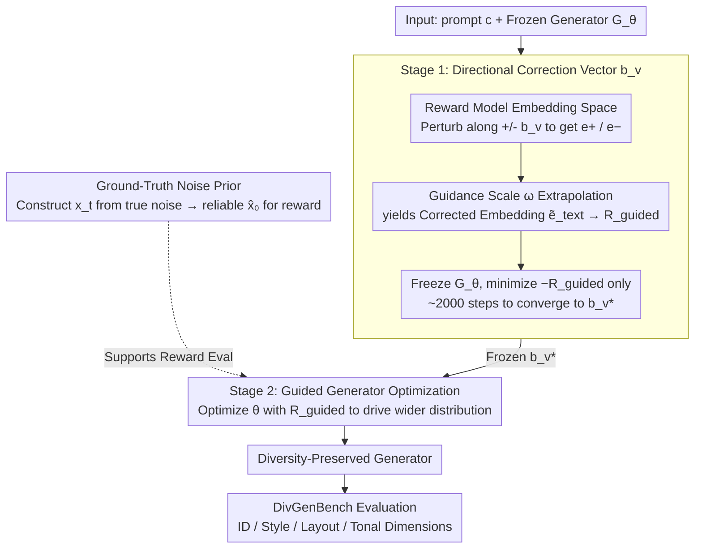

# Taming Preference Mode Collapse via Directional Decoupling Alignment in Diffusion Reinforcement Learning

**Conference**: CVPR 2026  
**arXiv**: [2512.24146](https://arxiv.org/abs/2512.24146)  
**Code**: None  
**Area**: Image Generation  
**Keywords**: Preference Mode Collapse, RLHF Alignment, Diffusion Models, Reward Correction, Generative Diversity

## TL;DR

The D2-Align framework is proposed to correct reward signals by learning directional correction vectors in the reward model's embedding space. This addresses the Preference Mode Collapse (PMC) issue in RLHF alignment for diffusion models—where over-optimization of rewards leads to a severe decline in generative diversity. Additionally, the DivGenBench benchmark is introduced to quantitatively evaluate generative diversity.

## Background & Motivation

RLHF has been widely used to align T2I diffusion models with human preferences, but existing methods produce serious side effects while pursuing high reward scores:

- **Preference Mode Collapse (PMC)**: Models converge to narrow modes preferred by the reward model—single styles, over-saturation/over-exposure, and facial homogenization, leading to a severe degradation of generative diversity. This is a specific manifestation of reward hacking in the diversity dimension.
- **Lack of Diversity Evaluation**: Existing work focuses primarily on reward hacking in the quality dimension and lacks attention to the collapse of generative diversity. Unlike fidelity, diversity is not easily quantified and lacks standardized evaluation metrics.
- **Existing Countermeasures Only Adjust Magnitude, Not Direction**:
    - KL regularization in Flow-GRPO requires extensive manual hyperparameter tuning and increases training overhead.
    - Multi-reward ensembles in DanceGRPO are sensitive to weights and training is unstable.
    - These methods essentially only regulate the **magnitude** of the reward without correcting the intrinsic bias **direction** of the reward model.
- **Core Hypothesis**: Reward models (e.g., HPS-v2.1) have inherent preference biases. The optimization process naturally drives the model to overfit these preferences, resulting in distribution collapse.

## Method

### Overall Architecture

D2-Align is a two-stage decoupling framework: Stage 1 learns a directional correction vector to debias the reward signal while the generator is frozen; Stage 2 utilizes the learned correction direction to guide generator optimization, preventing the model from falling into specific modes. The Core Idea is to **correct the direction of the reward rather than its magnitude**.

### Key Designs

**1. Directional Correction Vector $\bm{b}_v$: Learning a "Debiasing Direction" in the Reward Model's Embedding Space (Stage 1)**

The Limitations of Prior Work such as KL regularization and multi-reward ensembles involve only adjusting reward **magnitude**, but failing to change the **direction** of the reward model's intrinsic bias. HPS-v2.1 naturally favors over-rendered, over-saturated, and homogenized faces; the longer the optimization, the more the model hits these modes. The authors' Key Insight stems from a direct observation: manually adding words like "realistic" to a prompt for an over-rendered image actually lowers the reward score, making it closer to true human judgment. This indicates that small perturbations in the text side can offset the preference inflation of the reward model, but the discrete vocabulary space is too limited and requires manual selection. Thus, this process is moved to the continuous embedding space for **learning**.

Specifically, a learnable vector $\bm{b}_v \in \mathbb{R}^d$ is introduced in the text embedding space of the reward model (CLIP-based HPS-v2.1). Borrowing a mechanism similar to classifier-free guidance, a corrected reward is constructed. Starting from the original text embedding $\bm{e}_{\text{text}} = \Phi_{\text{text}}(c)$, perturbations are made in positive and negative directions along $\bm{b}_v$ to obtain positive/negative embeddings. Then, **extrapolation** (instead of interpolation) is performed using a guidance scale $\omega > 1$ to amplify the correction signal:

$$\bm{e}_+ = \text{normalize}(\bm{e}_{\text{text}} + \bm{b}_v), \quad \bm{e}_- = \text{normalize}(\bm{e}_{\text{text}} - \bm{b}_v)$$

$$\tilde{\bm{e}}_{\text{text}} = \bm{e}_- + \omega \cdot (\bm{e}_+ - \bm{e}_-)$$

The corrected text embedding is finally used to calculate the reward $R_{\text{guided}}(\bm{x}_0, c; \bm{b}_v) = \text{score}(\bm{e}_{\text{img}}, \tilde{\bm{e}}_{\text{text}})$. In this stage, the entire generator $G_\theta$ is frozen, and only $\mathcal{L}_{\text{stage1}}(\bm{b}_v) = \mathbb{E}[-R_{\text{guided}}]$ is minimized. Since only a low-dimensional vector is optimized, it converges in approximately 2000 steps. The learned $\bm{b}_v$ explicitly characterizes the bias direction of the reward model.

**2. Guided Generator Optimization: Forcing the Generator out of Single Modes Using the Corrected Reward (Stage 2)**

After learning $\bm{b}_v^*$ in Stage 1, it is frozen, and the corrected reward is used to optimize the generator parameters $\theta$:

$$\mathcal{L}_{\text{stage2}}(\theta) = \mathbb{E}_{c \sim \mathcal{D},\, \bm{x}_0 \sim G_\theta(c)}\big[-R_{\text{guided}}(\bm{x}_0, c; \bm{b}_v^*)\big]$$

The key is that the corrected reward has suppressed preference inflation, such as "inflated scores for oily images." The generator can no longer gain scores by simply catering to the single aesthetic of the reward model and is forced to explore a wider generative distribution. The reason for the two-stage approach, rather than joint training of $\bm{b}_v$ and $\theta$, is that joint optimization causes the correction direction to drift with the generator, leading to training instability. Fixing the direction first provides a stable and credible reference frame for optimization.

**3. Ground-Truth Noise Prior: Enabling Accurate Reward Evaluation on Noisy Latents**

This Design Motivation addresses an engineering contradiction: reward evaluation requires clean images $\bm{x}_0$, but optimization must occur on noisy latents. Standard one-step denoising predictions $\hat{\bm{x}}_0$ are highly inaccurate at high noise levels (large $t$), causing reward signals to fluctuate wildly. The authors' Mechanism is to reverse this: since the clean image $\bm{x}_0$ and its corresponding noise $\bm{\epsilon}_{\text{gt}}$ are known during training, the true noise is used to construct noisy samples $\bm{x}_t = \alpha_t \bm{x}_0 + \sigma_t \bm{\epsilon}_{\text{gt}}$, followed by a denoising step $\hat{\bm{x}}_0 = (\bm{x}_t - \sigma_t \bm{\epsilon}_\theta(\bm{x}_t, t)) / \alpha_t$. Because the true noise is used as a prior, reconstruction is always reliable, allowing $t$ to be sampled uniformly from $[0,1]$ without avoiding high-noise regions.

**4. DivGenBench: Making "Generative Diversity" a Quantifiable Benchmark**

Existing T2I alignment work almost exclusively targets fidelity, and PMC has been ignored due to the lack of standardized metrics for diversity collapse. DivGenBench fills this gap with a **keyword-driven** prompt design—actively using keywords to probe the boundaries of model generation rather than observing output variance from fuzzy prompts. The benchmark organizes diversity into four hierarchical levels: ID (high-level semantics, e.g., facial identity), Style (mid-level aesthetics, e.g., art style), Layout (structural relationships, e.g., spatial layout), and Tonal (low-level physics, e.g., tone and lighting), totaling 3200 prompts (800 per dimension). Each dimension is paired with a customized metric: IDS (Identity Dispersion Score), ASC (Aesthetic Style Coverage), SDI (Spatial Dispersion Index), and PVS (Photographic Variance Score), calculated using domain-specific extractors like ArcFace. This converts the subjective "visual variety" into comparable numerical values.

### Loss & Training

- **Stage 1 Loss**: $\mathcal{L}_{\text{stage1}}(\bm{b}_v) = \mathbb{E}_{c, \bm{x}_0 \sim G_{\theta_{\text{frozen}}}}[-R_{\text{guided}}]$. Only the low-dimensional vector $\bm{b}_v$ is optimized, ensuring training efficiency.
- **Stage 2 Loss**: $\mathcal{L}_{\text{stage2}}(\theta) = \mathbb{E}[-R_{\text{guided}}(\bm{x}_0, c; \bm{b}_v^*)]$. The generator is optimized using the frozen correction vector.
- **Base Model**: FLUX.1.Dev
- **Reward Model**: HPS-v2.1 (primary config), with additional tests on HPS-v2.1 + CLIP dual-reward config.
- **Training Efficiency**: D2-Align achieves higher scores in fewer training steps; DanceGRPO and Flow-GRPO require 250+ steps to reach similar levels.
- **Guidance Scale**: $\omega = 1.5$ is found to be the optimal hyperparameter.

## Key Experimental Results

### Main Results (Quality Evaluation, Table 1)

Based on FLUX.1.Dev with HPS-v2.1 single reward configuration:

| Method | Aesthetic ↑ | ImageReward ↑ | PickScore ↑ | Q-Align ↑ | HPS-v2.1 ↑ | CLIP ↑ | GenEval ↑ |
|------|------------|---------------|-------------|-----------|------------|--------|-----------|
| FLUX Baseline | 6.417 | 1.670 | 0.240 | 4.922 | 0.310 | 0.315 | 0.663 |
| DanceGRPO | 6.068 | 1.664 | 0.241 | 4.930 | **0.361** | 0.293 | 0.522 |
| Flow-GRPO | 5.888 | 1.703 | 0.239 | 4.969 | **0.367** | 0.283 | 0.517 |
| SRPO | 6.614 | 1.533 | 0.241 | 4.866 | 0.296 | 0.302 | 0.623 |
| **Ours (D2-Align)** | 6.450 | **1.771** | **0.246** | **4.969** | 0.343 | **0.323** | **0.636** |

DanceGRPO/Flow-GRPO show inflated HPS-v2.1 scores but a comprehensive decline in Aesthetic, CLIP, and GenEval—typical reward hacking. D2-Align leads in all metrics except the overfitted HPS-v2.1.

### Ablation Study (DivGenBench Diversity, Table 2)

| Method | IDS ↓ | ASC ↑ | SDI ↑ | PVS ↑ |
|------|-------|-------|-------|-------|
| FLUX Baseline | 0.280 | 0.179 | 0.563 | 0.408 |
| DanceGRPO | 0.348 | 0.130 | 0.488 | 0.259 |
| Flow-GRPO | 0.391 | 0.044 | 0.389 | 0.168 |
| SRPO | 0.259 | 0.234 | 0.580 | 0.352 |
| **Ours (D2-Align)** | **0.251** | **0.253** | **0.636** | **0.412** |

Flow-GRPO suffers the most severe diversity collapse (ASC 0.044 vs. FLUX 0.179), validating the PMC phenomenon. D2-Align is optimal across all diversity metrics, even surpassing the unaligned FLUX baseline.

### Key Findings

- **PMC Phenomenon Quantitatively Confirmed**: While DanceGRPO/Flow-GRPO achieve high HPS-v2.1 scores, their diversity collapses entirely, with IDS/ASC/SDI/PVS all deteriorating significantly.
- **$\bm{b}_v$ Converges in ~2000 Steps**: Once the correction effect stabilizes, it can be frozen for Stage 2.
- **$\omega = 1.5$ is Optimal**: Excessive guidance leads to over-correction and quality loss, while insufficient guidance provides inadequate correction.
- **Continuous Vectors Outperform Discrete Vocabulary**: Learned $\bm{b}_v$ outperforms manual word perturbations like "realistic" across all radar chart dimensions.
- **$\bm{b}_v^*$ is Transferable**: Applying the learned correction vector to other methods like DanceGRPO/Flow-GRPO also mitigates PMC.
- **Quality-Diversity is No Longer a Trade-off**: D2-Align simultaneously improves both quality and diversity, breaking the zero-sum game in traditional alignment.

## Highlights & Insights

- **First Systematic Definition and Quantification of PMC**: Re-examines the reward hacking problem from a diversity perspective, proposing a previously neglected but crucial research direction.
- **Directional Correction vs. Magnitude Adjustment**: Unlike KL regularization or multi-reward ensembles, D2-Align directly corrects the bias direction of the reward model, offering a more fundamental solution.
- **Efficient Two-Stage Design**: Stage 1 learns only a low-dimensional vector, and Stage 2 converges faster than baselines, resulting in low training costs.
- **DivGenBench Fills Evaluation Gap**: Keyword-driven prompt design and dimension-specific metrics provide a standardized tool for diversity assessment in the community.
- **Generality of Embedding Space Correction**: The concept of learning correction directions in a continuous embedding space can be extended to LLM alignment, video generation, and other reward-hacking scenarios.

## Limitations & Future Work

- Validated only on FLUX.1.Dev; the generalization to other architectures like SD3 or SDXL has not been tested.
- $\bm{b}_v$ is a single globally shared direction vector, which may not cover all bias modes of the reward model (e.g., bias directions might differ for different prompt types).
- The four dimensions of DivGenBench may not exhaust all aspects of diversity (e.g., texture, lighting variations).
- Currently only validates HPS-v2.1 as the reward model; other reward models may require re-learning $\bm{b}_v$ for their specific bias patterns.
- Applicability to other modalities such as video or 3D generation has not yet been explored.

## Rating

- Novelty: ⭐⭐⭐⭐⭐ — First to define PMC and propose a directional correction framework; both the problem discovery and solution design are highly novel.
- Experimental Thoroughness: ⭐⭐⭐⭐ — Dual-dimensional assessment of quality and diversity plus ablation and user studies; however, validation is limited to FLUX.
- Writing Quality: ⭐⭐⭐⭐ — Clear motivation guidance with a complete logical chain from observation to design.
- Value: ⭐⭐⭐⭐⭐ — PMC is a real-world pain point in deployment; $\bm{b}_v$ is transferable, and DivGenBench could become a standard benchmark.

<!-- RELATED:START -->

## Related Papers

- [\[CVPR 2026\] DiverseGRPO: Mitigating Mode Collapse in Image Generation via Diversity-Aware GRPO](diversegrpo_mitigating_mode_collapse_in_image_generation_via_diversity-aware_grp.md)
- [\[ICML 2026\] Escaping Mode Collapse in LLM Generation via Geometric Regulation](../../ICML2026/image_generation/escaping_mode_collapse_in_llm_generation_via_geometric_regulation.md)
- [\[CVPR 2026\] Refining Few-Step Text-to-Multiview Diffusion via Reinforcement Learning](refining_few-step_text-to-multiview_diffusion_via_reinforcement_learning.md)
- [\[CVPR 2026\] Goal-Driven Reward by Video Diffusion Models for Reinforcement Learning](goal-driven_reward_by_video_diffusion_models_for_reinforcement_learning.md)
- [\[CVPR 2026\] It's Never Too Late: Noise Optimization for Collapse Recovery in Trained Diffusion Models](its_never_too_late_noise_optimization_for_collapse_recovery_in_trained_diffusion.md)

<!-- RELATED:END -->
