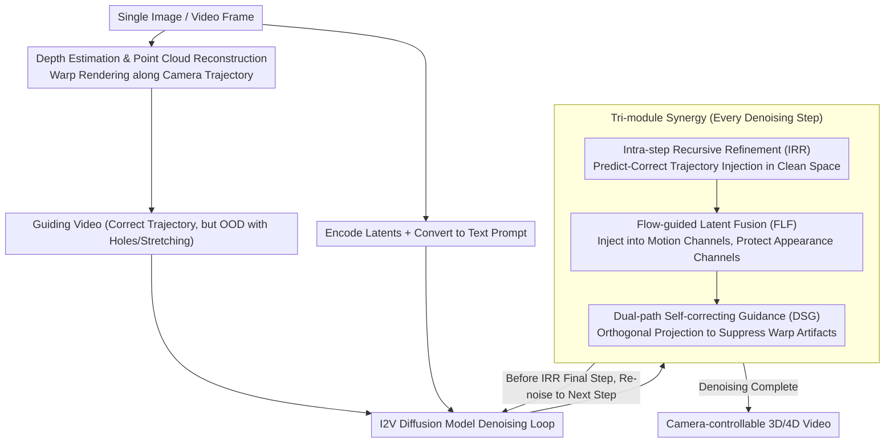

# Taming Video Models for 3D and 4D Generation via Zero-Shot Camera Control

**Conference**: CVPR 2026  
**arXiv**: [2509.15130](https://arxiv.org/abs/2509.15130)  
**Code**: [https://worldforge-agi.github.io](https://worldforge-agi.github.io) (Project Page)  
**Area**: Diffusion Models / 3D Vision  
**Keywords**: Video Diffusion Models, 3D Generation, 4D Generation, Camera Control, Training-free Inference  

## TL;DR
WorldForge proposes a completely training-free inference-time guidance framework that transforms pre-trained video diffusion models into 3D/4D generation tools with precise camera trajectory control through three synergistic components: Intra-step Recursive Refinement (IRR), Flow-guided Latent Fusion (FLF), and Dual-path Self-correcting Guidance (DSG), surpassing both training-based and inference-based baselines in trajectory accuracy and perceptual quality.

## Background & Motivation

1.  **Background**: Video Diffusion Models (VDMs), trained on massive video datasets, encode rich spatio-temporal priors and can generate realistic visual content. Researchers have begun leveraging VDMs for 3D/4D tasks (novel view synthesis, scene generation, dynamic re-rendering, etc.).

2.  **Limitations of Prior Work**:
    *   **Poor Controllability**: VDMs struggle to precisely follow 6-DoF camera trajectories, leading to spatial inconsistency.
    *   **Scene-Camera Motion Coupling**: Changing viewpoints often causes undesired object deformation and scene instability.
    *   **High Cost of Fine-tuning**: Fine-tuning on motion-conditioned data (e.g., LoRA, ControlNet) is computationally expensive, generalizes poorly, and may damage pre-trained priors.
    *   **Non-robust Warp-and-repaint**: Projecting frames along new camera paths followed by generative inpainting yields artifacts because warped inputs are Out-of-Distribution (OOD) for pre-trained models.

3.  **Key Challenge**: There is a fundamental contradiction between fine-grained camera controllability and generation quality/generalization—injecting control signals can disrupt model priors, while preserving priors hinders precise control.

4.  **Goal**: Inject precise trajectory control at inference time while fully preserving the VDM's world prior, without requiring any training or fine-tuning.

5.  **Key Insight**: Adopting a warp-and-repaint pipeline for trajectory guidance frames, but addressing inherent OOD issues through three carefully designed inference-time intervention mechanisms. Core observation: different channels of VAE latents encode different information (motion vs. appearance), allowing selective injection of control signals.

6.  **Core Idea**: Achieve training-free precise camera control by selectively injecting trajectory signals into motion-related channels, performing micro-corrections at each denoising step, and utilizing the difference between guided and unguided paths for self-correction.

## Method

### Overall Architecture
WorldForge addresses the challenge of making a pre-trained VDM, which naturally generates "free-form" content, follow a user-defined camera trajectory without damaging its encoded world prior and without fine-tuning. The pipeline works as follows: first, a scene point cloud is reconstructed from a single image (or video frame) using depth estimation and warped along the user-specified camera trajectory to render a "guidance video." While this guidance video follows the correct trajectory, it is OOD and of poor quality due to holes, stretching, and occlusion errors. Next, the original image is encoded into latents and converted into text prompts, which are fed into an Image-to-Video (I2V) diffusion model denoising loop. The key lies within the denoising cycle: IRR repeatedly injects trajectory information into the generation at each step; FLF identifies which latent channels to modify to protect appearance; and DSG suppresses artifacts from the warping process. These three modules work together during the denoising process to output 3D/4D videos that are both trajectory-accurate and visually clean.

### Key Designs

**1. Intra-step Recursive Refinement (IRR): Repeatedly "Predicting-Correcting" trajectory information at each denoising step rather than a one-time injection.**

If trajectory latents are only injected at the start of sampling, they are gradually washed away by noise over subsequent steps. IRR embeds a miniature "predict-correct" loop within each denoising step $t$: the model first estimates the clean image $\hat{\mathbf{x}}_0^{(t)}$, and then a fusion operator $\mathbf{F}$ overwrites the observable regions with trajectory latents $\mathbf{x}_{traj}$ (encoded from warped frames) according to a mask:

$$\mathbf{F}(\hat{\mathbf{x}}_0^{(t)}, \mathbf{x}_{traj}) = \mathbf{M} \cdot \mathbf{x}_{traj} + (1-\mathbf{M}) \cdot \hat{\mathbf{x}}_0^{(t)}$$

where $\mathbf{M}$ is the valid pixel mask provided by the warp. After fusion, the result is re-noised for the next step. Crucially, fusion is performed in the clean space $\hat{\mathbf{x}}_0^{(t)}$ rather than the noise space $\mathbf{x}_{t-1}$—clean space has clear semantics and computable optical flow, enabling the subsequent FLF module. Because of the repeated injection, the trajectory signal remains effective throughout the sampling process.

**2. Flow-guided Latent Fusion (FLF): Injecting trajectories only into "motion-related" latent channels while protecting "appearance" channels.**

If IRR overwrites all channels indiscriminately, image quality is degraded by noise from the warped frames. FLF observes that different channels in the VAE latent space have specialized roles—some encode motion, others appearance—and only the former should be modified by trajectory signals. Specifically, for each channel $c$ of $\hat{\mathbf{x}}_0^{(t)}$, the inter-frame optical flow $\mathcal{F}_{pred}^{(t,c)}$ is calculated and compared to the reference flow $\mathcal{F}_{gt}^{(t,c)}$ from the trajectory latents $\mathbf{x}_{traj}$. Motion similarity scores $S^{(t,c)}$ are derived using M-EPE, M-AE, and Fl-all metrics. A dynamic threshold is then used for selection:

$$\delta^{(t)} = \mu_S^{(t)} - \lambda^{(t)}\sigma_S^{(t)}$$

Channels with scores above the threshold are considered "motion-related" and receive the trajectory injection. $\lambda^{(t)}$ is scheduled from loose to tight: more channels are allowed in early steps to establish structure, while appearance channels are protected in later steps to ensure detail. Empirical results show stable channel roles—channel 13 is almost always filtered, while channel 8 is almost always retained.

**3. Dual-path Self-correcting Guidance (DSG): Using the orthogonal component of the guided direction relative to the unguided direction to suppress warp artifacts.**

Warped frames contain depth errors, occlusions, and poor alignment. DSG adopts a CFG-like form but addresses a different issue: running two paths at each step—an unguided path $\mathbf{v}_t^{ori}$ from the original $\mathbf{x}_t$ (high quality but no trajectory constraint) and a guided path $\mathbf{v}_t^{traj}$ from the corrected $\mathbf{x}_t'$ (follows trajectory but contains noise). The cosine similarity between these paths is only 0.3–0.6, much lower than the ~1.0 in standard CFG. Therefore, a standard subtraction would fail. DSG instead uses the orthogonal component of the guided direction relative to the unguided direction:

$$\mathbf{v}_t^{corr} = \mathbf{v}_t^{traj} + \rho \cdot \beta_t(\mathbf{v}_t^{traj} - \alpha_t \cdot \mathbf{v}_t^{ori})$$

where $\beta_t = \sqrt{1-\alpha_t^2}$ provides adaptive scaling: strong correction when paths diverge, and preservation of natural predictions when they align. Orthogonal projection avoids the divergence issues of direct subtraction.

### Inference Details
The framework utilizes the Wan2.1 I2V-14B model with 50-step UniPC sampling. IRR is applied during the first 20 steps (approximately 35-45%). FLF is disabled in very early steps (first 5) to preserve structural integrity and then tightened. It runs on a single GPU (≥69GB VRAM) and can generate videos up to 1280×720 resolution.

## Key Experimental Results

### Main Results (3D Static Scene Generation)

| Method | Training-free | FID ↓ | CLIP_sim ↑ | ATE ↓ | RPE-T ↓ | RPE-R ↓ |
| :--- | :--- | :--- | :--- | :--- | :--- | :--- |
| ViewCrafter | ✗ | 117.50 | 0.930 | 0.236 | 0.315 | 0.728 |
| TrajectoryCrafter | ✗ | 111.49 | 0.910 | 0.090 | 0.152 | 0.267 |
| NVS-Solver | ✓ | 118.64 | 0.937 | 0.224 | 0.268 | 1.056 |
| See3D | ✗ | 123.26 | 0.941 | 0.091 | 0.089 | 0.250 |
| **Ours** | **✓** | **96.08** | **0.948** | **0.077** | **0.086** | **0.221** |

### 4D Dynamic Scene Control

| Method | Training-free | FVD ↓ | CLIP-V_sim ↑ | ATE ↓ | RPE-T ↓ |
| :--- | :--- | :--- | :--- | :--- | :--- |
| ViewExtrapolator | ✓ | 108.48 | 0.913 | 1.040 | 1.208 |
| TrajectoryCrafter | ✗ | 97.31 | 0.923 | 0.431 | 1.078 |
| **Ours** | **✓** | **93.17** | **0.938** | 0.527 | **0.826** |

### Ablation Study

| Configuration | FID ↓ (3D) | CLIP_sim ↑ (3D) | FVD ↓ (4D) | CLIP-V_sim ↑ (4D) |
| :--- | :--- | :--- | :--- | :--- |
| w/o DSG | 109.43 | 0.943 | 95.69 | 0.937 |
| w/o FLF | 112.69 | 0.945 | 99.79 | 0.932 |
| w/o DSG & FLF | 113.12 | 0.943 | 103.17 | 0.931 |
| DSG (via CFG formula) | 120.91 | 0.936 | 109.10 | 0.919 |
| **Full Model** | **96.08** | **0.948** | **93.17** | **0.938** |

### Key Findings
- As a training-free method, WorldForge outperforms all training-based baselines in both generation quality and trajectory accuracy (FID 96.08 vs 111.49 for the runner-up).
- Each component is essential—removing IRR results in total loss of trajectory control; removing FLF produces unnatural outputs (FID rises to 112.69); removing DSG introduces warp artifacts (FID rises to 109.43).
- Using the standard CFG formula for DSG results in the worst performance (FID 120.91), validating the analysis that CFG fails under large-angle divergence.
- The method is transferable across models, proving effective on SVD and LongCat-Video.
- Channel roles are stable, with 4D scenes exhibiting more diverse channel scores compared to 3D scenes.

## Highlights & Insights
- **Sophisticated Selective Channel Injection**: The core insight is that VAE latent channels encode different information. FLF uses optical flow as a direct measure of motion relevance (rather than statistical methods like PCA), achieving motion-appearance decoupling without gradient optimization.
- **Solving CFG Divergence with Orthogonal Projection**: Standard CFG assumes conditional and unconditional directions are similar (angle ~0°). In this task, the paths diverge by 50-70°, making direct subtraction fail. Using orthogonal components bypasses this issue.
- **Generalization of Training-free Plug-and-play**: A single framework supports 12+ applications including 3D scene generation, 4D re-rendering, video editing, stabilization, and virtual try-ons, and is model-agnostic.

## Limitations & Future Work
- The iterative guidance process prevents real-time execution.
- Dependency on depth estimation quality—while VDM priors mitigate some errors, extreme depth inaccuracies still affect results.
- Single-channel scanning analysis may increase computational overhead for long contexts.
- Future Work: Distilling the guidance process into fewer steps, combining with stronger generative models, and increasing resolution.

## Related Work & Insights
- **vs ViewCrafter/See3D (Training-based)**: These require training on warped/fine-tuned data, which is expensive and potentially damages VDM priors; WorldForge preserves priors and generalizes better.
- **vs NVS-Solver (Training-free)**: Also uses inference guidance but lacks motion-appearance decoupling and self-correction, resulting in poor trajectory accuracy (ATE 0.224 vs 0.077).
- **vs ReCamMaster (Training-based 4D)**: Uses T2V models with specialized camera control modules but cannot accept warped inputs, limiting controllability and generalization.

## Rating
- Novelty: ⭐⭐⭐⭐⭐ 
- Experimental Thoroughness: ⭐⭐⭐⭐⭐ 
- Writing Quality: ⭐⭐⭐⭐ 
- Value: ⭐⭐⭐⭐⭐ 

<!-- RELATED:START -->

## Related Papers

- [\[CVPR 2025\] PreciseCam: Precise Camera Control for Text-to-Image Generation](../../CVPR2025/image_generation/precisecam_precise_camera_control_for_text-to-image_generation.md)
- [\[CVPR 2026\] DiP: Taming Diffusion Models in Pixel Space](dip_taming_diffusion_models_in_pixel_space.md)
- [\[CVPR 2026\] Adapter Shield: A Unified Framework with Built-in Authentication for Preventing Unauthorized Zero-Shot Image-to-Image Generation](adapter_shield_a_unified_framework_with_built-in_authentication_for_preventing_u.md)
- [\[CVPR 2026\] SeeThrough3D: Occlusion Aware 3D Control in Text-to-Image Generation](seethrough3d_occlusion_aware_3d_control_in_text-to-image_generation.md)
- [\[ICCV 2025\] AnyPortal: Zero-Shot Consistent Video Background Replacement](../../ICCV2025/image_generation/anyportal_zero-shot_consistent_video_background_replacement.md)

<!-- RELATED:END -->
