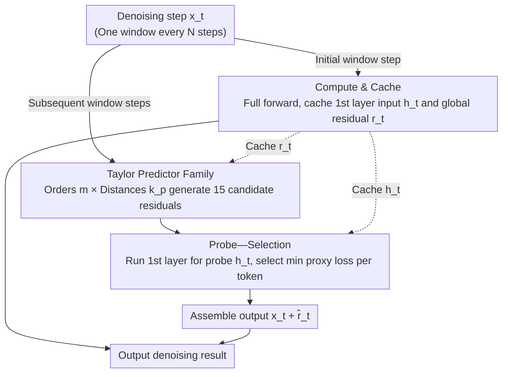

# TAP: A Token-Adaptive Predictor Framework for Training-Free Diffusion Acceleration

## Basic Information

- **Conference**: CVPR 2026
- **arXiv**: [2603.03792](https://arxiv.org/abs/2603.03792)
- **Code**: Not released
- **Area**: Image Generation / Diffusion Model Acceleration
- **Keywords**: Diffusion Acceleration, Token-Adaptive, Training-Free, Feature Caching, Taylor Predictor

## TL;DR

The TAP framework is proposed to adaptively select the optimal predictor (from the Taylor expansion family) for each token at every step through a first-layer probe. It achieves training-free diffusion acceleration, reaching a $6.24\times$ speedup on FLUX.1-dev with no perceptible quality loss.

## Background & Motivation

Diffusion Models have achieved top-tier results in image and video generation, but slow inference speed remains a core bottleneck, as each denoising step requires a full forward pass. Existing acceleration methods fall into two main categories:

**Reducing Sampling Steps**: High-order ODE solvers like DDIM and DPM-Solver reduce steps, but quality drops significantly under extreme acceleration.

**Reducing Per-step Computation**: Feature caching (DeepCache, Δ-DiT, TeaCache, ToCa) reuses intermediate features by exploiting temporal redundancy; prediction methods (TaylorSeer, FreqCa, SpeCa) predict future features.

**Limitations of Prior Work**: All previous methods apply a **single global prediction strategy** to all tokens and all timesteps, ignoring the fact that temporal evolution characteristics differ greatly across tokens:

- **Smooth background tokens**: Change slowly; low-order predictors are sufficient.
- **Edge/moving object tokens**: Change rapidly; require high-order or alternative predictors.
- A single global predictor leads to error accumulation and severe quality degradation under aggressive acceleration ratios.

Furthermore, existing adaptive methods (TeaCache, SpeCa) rely on **manually tuned thresholds**, lacking robustness.

## Method

### Overall Architecture

TAP addresses a neglected fact in diffusion acceleration: temporal evolution varies greatly across tokens. While smooth backgrounds change slowly and suit low-order predictors, edges and moving objects change rapidly and require higher-order or different predictors. Existing methods apply a fixed global strategy, leading to error accumulation and quality collapse under aggressive acceleration. TAP's Core Idea is to pick the most suitable predictor for each token individually at every step: in the first step of every $N$-step window, a full model pass is computed to cache key variables. Subsequent steps use a family of Taylor predictors for extrapolation, and a "first-layer probe" selects the predictor with the minimum proxy error for each token to assemble the output.

### Key Designs

**1. Computation & Caching: $O(1)$ overhead by storing only the first layer input and global residual**

To make "skip-step prediction" cost-effective, the cache itself must be lightweight. TAP executes a full forward pass at the first step of each $N$-step window, caching only two quantities: the modulated input of the first layer $\mathbf{h}_t = \text{Modulate}(\text{Norm}_1(\mathbf{x}_t), \mathbf{s}_t, \mathbf{g}_t)$ (for subsequent probe evaluation) and the model input-output residual $\mathbf{r}_t = f_\theta(\mathbf{x}_t, t) - \mathbf{x}_t$ (for prediction). Both are $O(1)$ and independent of model depth $L$, whereas TaylorSeer/ToCa require $O(L)$ layer-wise caching. This allows TAP to consume only 0.1 GB extra VRAM (~0.3%) and 0.015% extra FLOPs on FLUX.1-dev.

**2. Taylor Predictor Family: Creating candidates across order and distance dimensions**

A single predictor cannot accommodate both smooth and abrupt token dynamics. TAP prepares a family of candidates varying across two dimensions: Taylor expansion order $m \in [O_l, O_r]$ (low-order is more robust to abrupt changes, high-order is more precise for smooth ones) and prediction distance $k_p \in [k - \lambda, k]$ (different tokens have different convergence radii; high-order expansions diverge beyond this radius). The prediction formula is:
$$\mathcal{F}_{\text{pred}}(\mathbf{x}_{t-k}; m, k_p) = \sum_{i=0}^{m} \frac{\Delta^i \mathcal{F}(\mathbf{x}_t)}{i! \cdot N^i} (-k_p)^i$$
where $\Delta^i \mathcal{F}$ is the $i$-th order finite difference. With default $M=3$ (orders 0, 1, 2), $\lambda=4$, and $\delta=1$, a total of $\lfloor(4+1)/1\rfloor \times 3 = 15$ candidates are generated. The zero-order predictor is particularly crucial as it is the most stable for tokens with abrupt or discontinuous dynamics.

**3. Probe—Selection: Threshold-free selection using first-layer output as a proxy**

How to determine the best predictor without running the full model? TAP's Mechanism is to run only the first layer computation for the current step (extremely low cost) and use the first-layer modulated input $\mathbf{h}_t$ as a proxy for prediction quality—input perturbation is highly correlated with output error. For each token $(b,n)$, the proxy loss for each predictor is calculated as $\mathcal{L}_p^{b,n} = d(\widehat{\mathbf{h}}_{t,p}^{b,n}, \mathbf{h}_t^{b,n})$ (where $d$ is cosine distance). The predictor $p^{\star, b, n} = \arg\min_{p \in \mathcal{P}} \mathcal{L}_p^{b,n}$ is chosen, and its residual prediction is used to assemble the final output $\widehat{f}_\theta(\mathbf{x}_t, t) = \mathbf{x}_t + \widehat{\mathbf{r}}_t$. The selection relies on relative errors, eliminating the need for manual thresholds, making it more robust than TeaCache or SpeCa.

## Key Experimental Results

### Main Results: Text-to-Image Generation (FLUX.1-dev)

| Method | FLOPs Gain | ImageReward ↑ | CLIP ↑ | PSNR ↑ | SSIM ↑ | LPIPS ↓ |
|------|-----------|---------------|--------|--------|--------|---------|
| 50 steps (baseline) | 1.00× | 0.95 | 30.63 | - | - | - |
| FORA (N=7) | 6.24× | 0.80 | 30.42 | 13.43 | 0.60 | 0.55 |
| TeaCache (l=2.0) | 6.17× | 0.66 | 30.07 | 14.23 | 0.60 | 0.58 |
| TaylorSeer (N=8,O=2) | 6.24× | 0.91 | 30.62 | 14.72 | 0.61 | 0.50 |
| **Ours (N=8)** | **6.24×** | **0.99** | **31.19** | **16.11** | **0.64** | **0.44** |

At a high acceleration ratio ($6.24\times$), Ours achieves an ImageReward of 0.99, **surpassing the unaccelerated baseline (0.95)**, while PSNR is approximately 1.4 dB higher than TaylorSeer. TeaCache degrades significantly at this ratio.

### Main Results: Qwen-Image Text-to-Image

| Method | FLOPs Gain | ImageReward ↑ | CLIP ↑ | PSNR ↑ | LPIPS ↓ |
|------|-----------|---------------|--------|--------|---------|
| 50 steps (baseline) | 1.00× | 1.23 | 33.74 | - | - |
| FORA (N=3) | 2.94× | 0.92 | 32.25 | 14.12 | 0.50 |
| TeaCache (l=0.8) | 3.57× | 1.18 | 33.52 | 19.07 | 0.27 |
| TaylorSeer (N=4,O=2) | 3.57× | 1.18 | 33.44 | 18.02 | 0.30 |
| **Ours (N=4)** | **3.57×** | **1.23** | **33.80** | **20.13** | **0.22** |

On Qwen-Image, Ours maintains an ImageReward (1.23) consistent with the baseline, with a PSNR improvement of ~2 dB.

### Main Results: Video Generation (HunyuanVideo + VBench)

| Method | FLOPs Gain | VBench (%) ↑ |
|------|-----------|-------------|
| 50 steps | 1.00× | 66.61 |
| FORA (N=5) | 4.98× | 63.87 |
| TeaCache (l=0.4) | 4.55× | 65.13 |
| TaylorSeer (N=6,O=2) | 4.98× | 64.89 |
| **Ours (N=6)** | **4.98×** | **65.46** |

Ours achieves the best quality-efficiency trade-off in video generation, with VBench scores dropping only 1.7%.

### Ablation Study

**Impact of Order and Distance in Taylor Predictor Family**:

| Configuration | ImageReward ↑ |
|------|---------------|
| Only O=2 (Single global predictor) | ~0.89 |
| O=0,1,2 (Multi-order) | ~0.95 |
| O=0,1,2 + λ=4 (Multi-distance) | ~0.99 |
| δ=0.1 (Finer granularity) | ~0.995 (Minimal gain) |

Key Findings:
1. **Zero-order predictor (order 0) is vital**: It is more robust for abrupt, discontinuous token dynamics, providing a larger boost than using high-order predictors alone.
2. **Left-shifting prediction windows is effective**: Using earlier expansion points avoids exceeding the Taylor convergence radius; right-shifting yields no benefit.
3. **Comparison with Global Predictors**: The ImageReward of 30 candidate predictors distributed between 0.86–0.92; no single optimal predictor exists. Ours consistently outperforms any single predictor through adaptive fusion.
4. **Hyperparameter Insensitivity**: The default setting of $\delta=1$ is sufficient; finer granularity offers negligible gains.

## Highlights & Insights

- **Token-granularity Adaptation**: First to achieve step-by-step, token-wise adaptive predictor selection in diffusion acceleration, significantly outperforms global strategies.
- **Threshold-free Design**: Based on relative proxy error selection, completely eliminating the need for manual parameter tuning.
- **Minimal Overhead**: Adds only 0.3% VRAM and 0.015% FLOPs; overhead is nearly zero in practical inference.
- **Strong Framework Generality**: Compatible with various architectures like FLUX.1, Qwen-Image, and HunyuanVideo, and compatible with distilled models.
- **Quality can exceed baseline**: In some settings, ImageReward and CLIP scores are higher than the unaccelerated version.
- **$O(1)$ Storage**: Caches only residuals and first-layer inputs, independent of model depth.

## Limitations & Future Work

- The predictor family is currently limited to Taylor expansions, which may have limited coverage for highly non-linear token dynamics.
- The probe is based on first-layer output; it may fail if the correlation between the first layer and deeper features weakens.
- Combinations with orthogonal acceleration methods like knowledge distillation or model pruning have not been tested.
- Video generation experiments were only validated on the HunyuanVideo model.
- Code is not public, and reproducibility cannot yet be verified.

## Rating

⭐⭐⭐⭐ (4/5)

**Reasoning**: Clear motivation (token-level heterogeneity) and elegant design (probe-then-select). It is training-free with extremely low overhead. Experiments cover multiple models and tasks with thorough ablation. The core contribution—token-wise adaptive predictor selection—is a significant advancement in diffusion acceleration. One star is deducted as candidate predictors are limited to the Taylor family and lack theoretical guarantees (e.g., why the first layer is always a good proxy).

<!-- RELATED:START -->

## Related Papers

- [\[CVPR 2026\] When Safety Collides: Resolving Multi-Category Harmful Conflicts in Text-to-Image Diffusion via Adaptive Safety Guidance](when_safety_collides_resolving_multi-category_harmful_conflicts_in_text-to-image.md)
- [\[ICCV 2025\] MatchDiffusion: Training-free Generation of Match-Cuts](../../ICCV2025/image_generation/matchdiffusion_training-free_generation_of_match-cuts.md)
- [\[ICCV 2025\] LoRAverse: A Submodular Framework to Retrieve Diverse Adapters for Diffusion Models](../../ICCV2025/image_generation/loraverse_a_submodular_framework_to_retrieve_diverse_adapters_for_diffusion_mode.md)
- [\[ICCV 2025\] PanoLlama: Generating Endless and Coherent Panoramas with Next-Token-Prediction LLMs](../../ICCV2025/image_generation/panollama_generating_endless_and_coherent_panoramas_with_next-token-prediction_l.md)
- [\[CVPR 2025\] EasyCraft: A Robust and Efficient Framework for Automatic Avatar Crafting](../../CVPR2025/image_generation/easycraft_a_robust_and_efficient_framework_for_automatic_avatar_crafting.md)

<!-- RELATED:END -->
