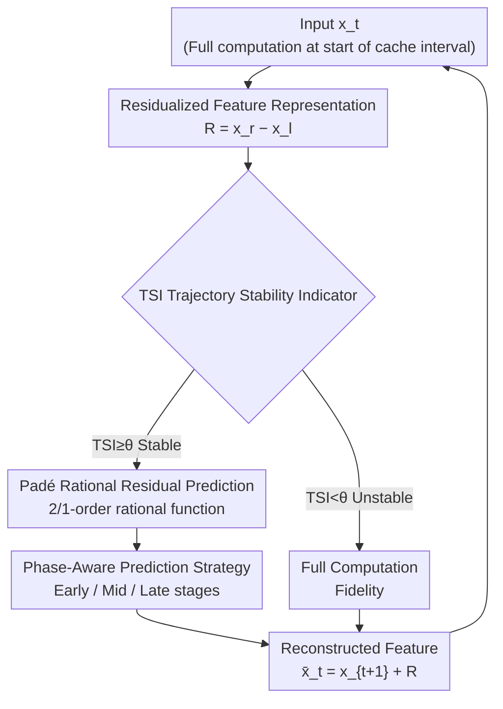

# TC-Padé: Trajectory-Consistent Padé Approximation for Diffusion Acceleration

**Conference**: CVPR 2026  
**Paper**: [CVF Open Access](https://openaccess.thecvf.com/content/CVPR2026/html/He_TC-Pade_Trajectory-Consistent_Pade_Approximation_for_Diffusion_Acceleration_CVPR_2026_paper.html)  
**Code**: None (Project page: https://dreamer-hsx.github.io/tc-pade-project)  
**Area**: Diffusion Models / Sampling Acceleration  
**Keywords**: Feature Caching, Padé Approximation, Diffusion Acceleration, Residual Prediction, Low-step Sampling

## TL;DR
Addressing the failure of feature caching in diffusion models during low-step sampling (20–30 steps), TC-Padé replaces the polynomial extrapolation of raw features in TaylorSeer with "rational function (Padé) extrapolation of residuals." Combined with a Trajectory Stability Indicator (TSI) for adaptive skip-calculation and a differentiated three-stage prediction strategy (early/mid/late), it achieves 2.88× acceleration on FLUX.1-dev with only a ~3% drop in FID.

## Background & Motivation

**Background**: While diffusion models produce high-quality results, they require dozens or hundreds of iterations for denoising, leading to slow inference. Training-free, plug-and-play "feature caching" is a mainstream acceleration strategy, divided into two types: ① Reuse-based (DeepCache / FORA / ToCa), which directly caches and reuses intermediate activations from adjacent steps; ② Prediction-based (TaylorSeer), which uses truncated Taylor expansion to actively extrapolate features to future timesteps, currently representing the SOTA.

**Limitations of Prior Work**: These methods perform well at high step counts (e.g., 50 steps) but completely fail in the **low-step regime (20–30 steps)** commonly used in industry. With fewer steps, the time interval between adjacent denoising steps increases, causing feature similarity to decay exponentially. This breaks the "near-invariance of adjacent features" assumption required for reuse-based methods, leading to misaligned cached activations and "trajectory drift." For prediction-based methods, the Taylor expansion's error is sharply amplified during large-interval extrapolation due to its inherent **finite convergence radius**. PCA visualizations (Fig. 2) show that the output velocity field trajectories of these methods significantly deviate from the ground truth.

**Key Challenge**: Taylor series can only approximate functions locally and diverge beyond their convergence radius. In low-step sampling, feature evolution is highly non-linear, and **different denoising stages exhibit distinct dynamics** (early phase for large-scale structure formation, late phase for detail refinement). Existing methods apply the **same** prediction strategy across the entire sampling trajectory, ignoring these stage-specific differences.

**Key Insight + Core Idea**: The authors leverage a classic conclusion from numerical approximation: **Padé approximation (the ratio of two polynomials) is superior to the same-order Taylor expansion at characterizing functions with poles, asymptotic behavior, and sharp non-linear transitions**, often converging faster with fewer historical points. Consequently, the core idea is to use Padé rational functions to extrapolate **residuals** (rather than raw features), supplemented by stability-aware adaptive coefficients and stage-aware strategies to maintain trajectory consistency in low-step sampling.

## Method

### Overall Architecture
TC-Padé is a **trajectory-consistent residual prediction framework** built upon Padé approximation. It segments the sampling trajectory into cache intervals of length $N$ (where $N=4$ in the paper). Within an interval, an adaptive computation strategy is utilized: **the first step of each interval performs full computation** to establish a reference state and cache residuals. For subsequent steps, a Trajectory Stability Indicator (TSI) first determines if the current trajectory is stable—if stable, the network computation is skipped in favor of Padé residual extrapolation with stage-specific corrections; if unstable, full computation is performed to ensure fidelity. Instead of predicting high-dimensional raw features, the model predicts "inter-layer residuals" $\mathcal{R}=x^r-x^l$ (as residual temporal similarity is significantly higher than that of raw features) and reconstructs output features via $\bar{x}_t = x_{t+1}+\mathcal{R}_{\text{Padé},t}$. This mechanism concentrates computational power on unstable trajectory segments while accelerating on smooth segments.

### Key Designs

**1. Residualized Feature Representation: Predicting "increments" rather than "absolute values" to bypass high-dimensional feature spaces**

A major pain point for prediction-based methods is the direct extrapolation of raw features $x_t$. As time intervals increase, absolute feature changes accumulate, causing exponential decay in similarity (Fig. 4(b) shows TaylorSeer's raw feature similarity dropping below 0.5). TC-Padé models the **inter-layer residuals** of each DiT block: defining the residual from layer $l$ to layer $r$ at timestep $t$ as $\mathcal{R}_t^{l:r} = x_t^r - x_t^l$. This represents the incremental update applied by these layers, stripped of absolute feature values. The authors empirically found that the temporal cosine similarity of residuals is **consistently significantly higher** than that of raw features (Fig. 4(a)), as residuals capture smoother, more structured evolution. Reconstruction only requires $\bar{x}_t = x_{t+1} + \mathcal{R}_{\text{Padé},t}$. Decoupling residual prediction from raw feature prediction allows the Padé approximation to focus on predictable residual dynamics rather than the entire high-dimensional feature space. Ablations show that caching residuals at the "full block" granularity is optimal.

**2. Padé Rational Residual Prediction: Replacing Taylor polynomials with rational functions to exploit convergence advantages for large-interval extrapolation**

This is the mathematical core of the paper, addressing the fundamental flaw of Taylor extrapolation (finite convergence radius and divergence beyond boundaries). An $[m/n]$ order Padé approximation is defined as the ratio of two polynomials:

$$\mathcal{P}_{[m/n]} = \frac{P_m(x)}{Q_n(x)} = \frac{\sum_{i=0}^{m} a_i x^i}{1 + \sum_{j=1}^{n} b_j x^j}$$

where the denominator $Q_n(0)=1$ ensures uniqueness. Rational forms naturally characterize functions with poles, asymptotic behavior, or sharp non-linear transitions. The authors construct a rational predictor using cached residuals from preceding full-computation steps. Balancing expressivity and overhead, they adopt a low-order $[2/1]$ approximation (with $k=3, m=1$):

$$\mathcal{R}_{\text{Padé},t} = \frac{b_0\,\mathcal{R}_{t+3} + b_1\,\mathcal{R}_{t+2}}{1 + a_1\,\mathcal{R}_{t+1}}$$

Crucially, coefficients are not solved analytically as in classic Padé—since diffusion residual trajectories are discrete and stochastic, they must be determined in an **adaptive, data-driven** manner. A stability factor measures the relative magnitude of recent changes:

$$\sigma_{stab} = \exp\!\left(-\lambda\,\frac{\lVert \mathcal{R}_{t+1}-\mathcal{R}_{t+2}\rVert}{\lVert \mathcal{R}_{t+1}+\mathcal{R}_{t+2}\rVert}\right)$$

As residuals change rapidly, $\sigma_{stab}\to 0$; when stable, $\sigma_{stab}\to 1$ (with $\lambda=10$). Coefficients are defined as $b_0 = 2\sigma_{stab}$, $b_1 = -\sigma_{stab}$, and $a_1 = \frac{1}{\lambda}\sigma_{stab}$. this provides smooth modulation during the transition from historical cache to the current residual, avoiding numerical instability.

**3. TSI (Trajectory Stability Indicator): Adaptively deciding "Skip or Compute" to optimize resource allocation**

Fixed skip rhythms during large intervals can degrade quality in unstable segments. TC-Padé calculates a TSI for every step aside from the first in a cache interval. First, adjacent residual differences are normalized into direction vectors $u_t = (\mathcal{R}_t - \mathcal{R}_{t+1})/\lVert \mathcal{R}_t - \mathcal{R}_{t+1}\rVert_2$, then:

$$\text{TSI} = \tfrac{1}{2}\lVert u_{t+1} - u_{t+2}\rVert_2$$

If $\text{TSI}\ge\theta$ (where $\theta$ is a preset threshold), the trajectory is deemed stable, and network computation is skipped in favor of Padé prediction. Otherwise, full computation is executed. The paper offers two presets: TC-Padé (slow) with $\theta=1.0$ and TC-Padé (fast) with $\theta=0.7$. ⚠️ Note: There is potential friction between the phrasing "TSI≥θ indicates stability" and the definition of TSI as the difference between direction vectors (where a larger value usually implies more drastic direction changes); this summary follows the paper's original formulas and thresholds.

**4. Phase-Aware Prediction Strategy: Stage-specific formulas to match diverse dynamics**

The effectiveness of feature caching varies across the denoising trajectory: early stages (high noise) involve rapid large-scale structure formation, while late stages (low noise) involve detail refinement. TC-Padé divides the denoising process into three segments based on total steps $T$, defining the final residual prediction target as:

$$\bar{\mathcal{R}}_t = \begin{cases} \alpha_1 \mathcal{R}_{t+1} + \alpha_2 \mathcal{R}_{t+2}, & t > 0.7T \\[4pt] \mathcal{R}_{\text{Padé},t}, & 0.2T \le t \le 0.7T \\[4pt] \mathcal{R}_{\text{Padé},t} + \beta(\mathcal{R}_{t+1} - \mathcal{R}_{t+2}), & t < 0.2T \end{cases}$$

For early stages where structures change drastically, a conservative weighted combination of the two most recent residuals is used ($\alpha_1+\alpha_2=1$). The middle stage uses full Padé approximation to exploit long-range dependencies. The late refinement stage overlays a first-order difference term $\beta(\mathcal{R}_{t+1}-\mathcal{R}_{t+2})$ onto the Padé prediction to capture subtle velocity changes.

### Loss & Training
This method is **fully training-free and plug-and-play**. It does not modify model architecture or introduce training objectives; it simply replaces caching/extrapolation logic during inference. Key hyperparameters: cache interval $N=4$, stability sensitivity $\lambda=10$, TSI threshold $\theta\in\{0.7, 1.0, 1.3\}$, and Padé order $[2/1]$. All tests were conducted with 20-step denoising.

## Key Experimental Results

### Main Results
Covering three task types: Text-to-Image (FLUX.1-dev / COCO 2017, 50k prompts), Text-to-Video (Wan2.1-1.3B / VBench-2.0), and Class-conditional generation (DiT-XL/2 / ImageNet 256×256). All tasks used 20 steps on L40 GPUs.

Text-to-Image (COCO 2017, FLUX.1-dev 20 steps) results:

| Method | Speedup | FID↓ | CLIP↑ | PSNR↑ | SSIM↑ | LPIPS↓ |
|------|--------|------|-------|-------|-------|--------|
| FLUX.1-dev (Baseline) | 1.00× | 23.38 | 32.10 | – | – | – |
| ToCa (N=5) | 1.81× | 24.18 | 31.48 | 17.29 | 0.613 | 0.481 |
| TeaCache (fast) | 2.15× | 23.90 | 31.50 | 18.02 | 0.690 | 0.419 |
| TaylorSeer (N=5,O=2) | 2.31× | †Collapsed | 31.52 | 17.46 | 0.525 | 0.616 |
| **TC-Padé (slow)** | 2.20× | **23.85** | **31.90** | **24.67** | **0.861** | **0.144** |
| **TC-Padé (fast)** | **2.88×** | 24.14 | 31.82 | 21.96 | 0.782 | 0.290 |

TaylorSeer's FID collapsed at 20 steps (marked †), while TC-Padé (fast) achieved the highest speedup (2.88×) while maintaining superior pixel-level and perceptual quality (PSNR 21.96 / LPIPS 0.290).

Text-to-Video and Class-conditional key metrics:

| Task / Model | Method | Speedup | Key Metric |
|-------------|------|--------|-----------|
| T2V Wan2.1-1.3B | Baseline | 1.00× | VBench-2.0 64.16% |
| | TaylorSeer (N=4,O=1) | 1.66× | VBench 54.50% (Significant drop) |
| | **TC-Padé (fast)** | **1.72×** | **VBench 60.38%** |
| Class-cond DiT-XL/2 | Baseline | 1.00× | FID 3.56 / IS 221.3 |
| | TaylorSeer (N=3,O=2) | 1.44× | FID 7.84 |
| | **TC-Padé (fast)** | 1.46× | **FID 6.93 / IS 185.1** |

### Ablation Study

| Experiment | Configuration | Speedup | Key Metric | Note |
|------|------|--------|---------|------|
| Residual Granularity | Double-stream | 1.36× | Aes 5.10 / ImgRwd 0.792 | Double-stream blocks only |
| | Single-stream | 1.94× | Aes 5.69 / ImgRwd 0.872 | Single-stream blocks only |
| | **Full Block** | **2.88×** | **Aes 5.76 / ImgRwd 0.918** | Optimal; ImgRwd Gain +15.9% |
| TSI Threshold θ | θ=1.3 | 1.63× | ImgRwd 0.956 | Conservative; highest quality |
| | θ=1.0 | 2.20× | ImgRwd 0.924 | Balanced |
| | θ=0.7 | 2.88× | ImgRwd 0.918 | Aggressive; highest speedup |

### Key Findings
- **"Full block" is the optimal residual granularity**: Caching residuals at the full-block level outperformed caching only double-stream blocks by 15.9% in Image Reward and 12.9% in Aesthetics, while achieving 2.88× speedup. Coarse-grained residuals are smoother and more predictable.
- **θ is a smooth quality-speed knob**: Reducing θ from 1.3 to 0.7 increased acceleration from 1.63× to 2.88×, while Image Reward only slightly decreased from 0.956 to 0.918, indicating a low quality cost for aggressive skipping.
- **Orthogonal with Quantization**: TC-Padé + Quantization on FLUX.1-dev increased throughput from 0.22 to 0.54–0.57 img/s (2.5×). At batch=1, latency dropped from 9s to 1.83s (~6×) with negligible quality loss.
- **Cost comparison: Prediction vs. Reuse**: While TaylorSeer can achieve higher FLOPs reduction in video tasks, it suffers from significant quality collapse. TC-Padé provides a more practical trade-off between acceleration and quality preservation.

## Highlights & Insights
- **Introducing Padé Approximation to Diffusion Caching**: The core insight is that Taylor extrapolation's finite convergence radius makes it unsuitable for low-step sampling. Replacing it with rational functions provides a robust mathematical solution for non-linearity, representing a high-quality cross-domain transfer.
- **Predicting Residuals over Raw Features**: This simple yet effective transformation leverages the higher temporal similarity of residuals, reducing high-dimensional feature prediction to a more structured residual dynamics problem.
- **Stability Factor Modulated Coefficients**: Using $\sigma_{stab}$ to encode trajectory stability into Padé coefficients allows for an elegant adaptive numerical stabilization—strong extrapolation when smooth, conservative combination when volatile.
- **Phase-Awareness**: Utilizing weighted averages in early stages, pure Padé in the middle, and Padé with first-order differences in late stages aligns with the physical intuition of "structure formation → long-range dependency → detail velocity."

## Limitations & Future Work
- **TSI Definition Friction**: The alignment between "TSI≥θ for stability" and the vector-difference-based TSI definition remains slightly ambiguous in the text; implementation details require careful verification.
- **Empirical Hyperparameters**: $N, \lambda, \theta, \alpha, \beta$ and stage split points ($0.2T/0.7T$) are largely empirical. Evidence for generalizability across models or schedulers is primarily relegated to the Appendix.
- **Acceleration Ceiling**: In video and class-conditional tasks, FLOPs reduction is less aggressive than TaylorSeer. TC-Padé prioritizes "consistent quality," which may not satisfy extreme low-compute constraints.
- **Potential Improvements**: Making the Padé order $[m/n]$ adaptive (by stage or TSI) or learning the TSI threshold online could further automate hyperparameter tuning.

## Related Work & Insights
- **vs. TaylorSeer (Prediction SOTA)**: Both involve active future feature extrapolation. TaylorSeer uses truncated Taylor on **raw features**, failing at 20–30 steps due to error explosion. TC-Padé upgrades this via **residual-based Padé rational extrapolation**.
- **vs. Reuse-based (ToCa / TeaCache)**: These depend on "feature near-invariance," which breaks in the low-step regime. TC-Padé models evolution trends instead and uses TSI to revert to full computation when needed.
- **vs. Solver/Distillation Approaches**: Solvers (DPM-Solver) and Distillation focus on "reducing steps." TC-Padé focuses on "reducing per-step cost," is training-free, and is orthogonal to distillation and quantization.

## Rating
- Novelty: ⭐⭐⭐⭐ (Clever combination of Padé approximation, residualization, and phase-awareness for low-step bottlenecks.)
- Experimental Thoroughness: ⭐⭐⭐⭐ (Solid coverage across image/video/class-cond tasks; TSI self-consistency needs more clarity.)
- Writing Quality: ⭐⭐⭐⭐ (Clear motivation and logic, though some technical details are deferred.)
- Value: ⭐⭐⭐⭐ (Directly addresses a practical industry pain point for 20-30 step sampling.)

<!-- RELATED:START -->

## Related Papers

- [\[CVPR 2026\] Forecast the Principal, Stabilize the Residual: Subspace-Aware Feature Caching for Diffusion Transformers](forecast_the_principal_stabilize_the_residual_subspace-aware_feature_caching_for.md)
- [\[CVPR 2026\] ResCa: Residual Caching for Diffusion Transformers Acceleration](resca_residual_caching_for_diffusion_transformers_acceleration.md)
- [\[CVPR 2026\] Adaptive Spectral Feature Forecasting for Diffusion Sampling Acceleration](adaptive_spectral_feature_forecasting_for_diffusion_sampling_acceleration.md)
- [\[CVPR 2026\] Denoising as Path Planning: Training-Free Acceleration of Diffusion Models with DPCache](dpcache_denoising_path_planning_diffusion_accel.md)
- [\[CVPR 2026\] GeoRK2: Geometry-Guided Runge-Kutta Integration for Diffusion Transformer Acceleration](geork2_geometry-guided_runge-kutta_integration_for_diffusion_transformer_acceler.md)

<!-- RELATED:END -->
