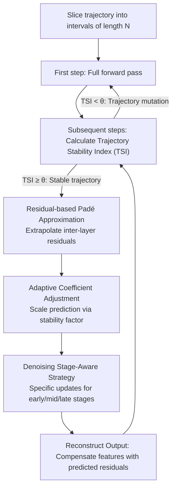

# TC-Padé: Trajectory-Consistent Padé Approximation for Diffusion Acceleration

**Conference**: CVPR 2026  
**arXiv**: [2603.02943](https://arxiv.org/abs/2603.02943)  
**Area**: Image Generation  
**Keywords**: Diffusion Model Acceleration, Feature Caching, Padé Approximation, Trajectory Consistency, Residual Prediction

## TL;DR

The authors propose TC-Padé, a feature residual prediction framework based on Padé rational function approximation. Through adaptive coefficient adjustment and stage-aware strategies, it achieves trajectory-consistent acceleration (2.88× for FLUX.1-dev, 1.72× for Wan2.1) in low-step (20-30 steps) diffusion sampling scenarios, significantly outperforming existing methods based on Taylor expansion.

## Background & Motivation

Diffusion Models have achieved SOTA performance in image and video generation, but their iterative denoising process requires dozens to hundreds of network forward passes, which is computationally expensive. Existing acceleration methods follow two main directions:

**Reducing Sampling Steps**: Solver methods such as DDIM and DPM-Solver, and distillation methods (Consistency Models, Adversarial Distillation).

**Reducing Per-step Computation**: Model compression (pruning, quantization) and feature caching.

Feature caching methods are attractive due to their **training-free and plug-and-play** nature. However, existing methods have key limitations:

- **Reuse-based methods** (ToCa, Δ-DiT, TeaCache): Performance is acceptable at higher step counts (50 steps), but when steps are reduced to 20-30, the time interval between adjacent steps increases, causing exponential decay in feature similarity. Direct reuse leads to severe trajectory shifts.
- **Prediction-based methods** (TaylorSeer): These rely on Taylor series expansion for polynomial extrapolation. However, Taylor expansion has a finite radius of convergence; as intervals increase, approximation errors amplify sharply.

The authors confirm through PCA visualization that existing caching methods exhibit significant deviations between the feature trajectory and the ground truth trajectory under 20-step sampling.

## Method

### Overall Architecture

TC-Padé addresses the failure of feature caching in low-step (20-30 steps) diffusion sampling. When steps are few, the interval between steps increases, causing exponential stability decay—reuse-based methods (ToCa, TeaCache) suffer from trajectory drift, while prediction-based methods (TaylorSeer) suffer from exploding errors due to the limited convergence radius of Taylor expansion. TC-Padé instead uses Padé rational functions to extrapolate **residuals** and partitions the sampling trajectory into cache intervals of length $\mathcal{N}$. Only the first step of each interval involves a full network pass; subsequent steps are adaptively determined to be skipped or recalculated based on the **Trajectory Stability Index (TSI)**:
$$\text{TSI}(\mathcal{R}_{t+3}, \mathcal{R}_{t+2}, \mathcal{R}_{t+1}) = \frac{1}{2}\|\mathbf{u}_{t+1} - \mathbf{u}_{t+2}\|_2$$
where $\mathbf{u}_t = (\mathcal{R}_t - \mathcal{R}_{t+1}) / \|\mathcal{R}_t - \mathcal{R}_{t+1}\|_2$ is the normalized residual difference vector. When $\text{TSI} \geq \theta$, the computation is skipped and the residual is predicted via Padé; otherwise, it falls back to full calculation to preserve quality.

### Key Designs

**1. Residual-based Padé Approximation: Rational Function over Polynomial Extrapolation**

TaylorSeer directly predicts raw high-dimensional features, where cosine similarity drops below 0.5 as intervals increase. TC-Padé shifts the prediction target to residuals (inter-layer increments $\mathcal{R}_t^{l:r} = x_t^r - x_t^l$), as residuals exhibit much higher temporal similarity than raw features. The predictor uses a Padé rational function $P_m(x)/Q_n(x)$ instead of a Taylor polynomial—polynomials have a finite convergence radius and diverge at large intervals, whereas rational functions can capture asymptotic behaviors and non-linear phase transitions. Specifically, a $[2/1]$ order ($k=3, m=1$) is used:
$$\mathcal{R}_{Pad\acute{e},t} = \frac{b_0 \mathcal{R}_{t+3} + b_1 \mathcal{R}_{t+2}}{1 + a_1 \mathcal{R}_{t+1}}$$
After predicting the residual, the output is reconstructed as $\bar{x}_t = x_{t+1} + \mathcal{R}_{Pad\acute{e},t}$.

**2. Adaptive Coefficient Adjustment: Scaling Prediction Intensity via Residual Stability**

Classic Padé coefficients are solved analytically, which can be overly aggressive during trajectory mutations. TC-Padé introduces a stability factor for dynamic adjustment:
$$\sigma_{stab} = \exp\left(-\lambda \frac{\|\mathcal{R}_{t+1} - \mathcal{R}_{t+2}\|}{\|\mathcal{R}_{t+1} + \mathcal{R}_{t+2}\|}\right)$$
When residuals change sharply, $\sigma_{stab} \to 0$ and coefficients become conservative; when stable, $\sigma_{stab} \to 1$ allowing for assertive prediction. The coefficients are adjusted as $b_0 = 2\sigma_{stab}$, $b_1 = -\sigma_{stab}$, and $a_1 = \frac{1}{\lambda}\sigma_{stab}$. This ensures the prediction strength is always linked to current trajectory reliability.

**3. Denoising Stage-Aware Strategy: Triple-Stage Residual Updates**

Dynamics vary across different diffusion stages; a single extrapolation cannot cover the whole process. TC-Padé switches strategies by stage: Early stage ($t > 0.7T$), where structure evolves rapidly, uses a weighted sum of the two most recent residuals $\alpha_1 \mathcal{R}_{t+1} + \alpha_2 \mathcal{R}_{t+2}$ ($\alpha_1 + \alpha_2 = 1$); Mid stage ($0.2T \leq t \leq 0.7T$) uses full Padé approximation $\mathcal{R}_{Pad\acute{e},t}$ to capture long-range dependencies; Late stage ($t < 0.2T$) adds a first-order difference term $\beta(\mathcal{R}_{t+1} - \mathcal{R}_{t+2})$ on top of Padé to capture subtle velocity changes.

### Loss & Training

As a training-free method, this does not involve loss function design. The core is the inference-time replacement of full network computation with Padé rational function approximations.

## Key Experimental Results

### Main Results: Text-to-Image Generation (FLUX.1-dev, 20 steps, COCO 2017)

| Method | Acceleration Ratio | FID↓ | CLIP↑ | PSNR↑ | SSIM↑ | LPIPS↓ |
|------|--------|------|-------|-------|-------|--------|
| FLUX.1-dev (Baseline) | 1.00× | 23.38 | 32.10 | - | - | - |
| ToCa (N=5) | 1.81× | 24.18 | 31.48 | 17.29 | 0.613 | 0.481 |
| TeaCache (fast) | 2.15× | 24.11 | 31.50 | 18.02 | 0.690 | 0.419 |
| TaylorSeer (N=5) | 2.31× | †Severe Degradation | 31.52 | 17.46 | 0.525 | 0.616 |
| **Ours (slow)** | **2.20×** | **23.85** | **31.90** | **24.67** | **0.861** | **0.144** |
| **Ours (fast)** | **2.88×** | **24.14** | **31.82** | **21.96** | **0.782** | **0.290** |

### Main Results: Text-to-Video Generation (Wan2.1-1.3B, 20 steps, VBench-2.0)

| Method | Acceleration Ratio | VBench-2.0↑ | PSNR↑ | SSIM↑ | LPIPS↓ |
|------|--------|-------------|-------|-------|--------|
| Wan2.1 (Baseline) | 1.00× | 64.16% | - | - | - |
| TeaCache (slow) | 1.17× | 60.73% | 27.19 | 0.867 | 0.107 |
| TaylorSeer (N=4) | 1.66× | 54.50% | 14.93 | 0.353 | 0.586 |
| **Ours (fast)** | **1.72×** | **60.38%** | **21.70** | **0.639** | **0.300** |

### Main Results: Class-conditioned Image Generation (DiT-XL/2, 20 steps, ImageNet)

| Method | Acceleration Ratio | FID↓ | IS↑ | Precision↑ | Recall↑ |
|------|--------|------|-----|-----------|---------|
| DiT-XL/2 (Baseline) | 1.00× | 3.56 | 221.27 | 0.78 | 0.58 |
| ToCa (N=3) | 1.35× | 10.72 | 164.40 | 0.69 | 0.49 |
| TaylorSeer (N=4) | 1.51× | 7.86 | 175.11 | 0.71 | 0.53 |
| **Ours (fast)** | **1.46×** | **6.93** | **185.12** | **0.72** | **0.54** |

### Ablation Study: Cache Residual Granularity (FLUX.1-dev)

| Granularity | Acceleration Ratio | Aesthetic↑ | CLIP↑ | ImgRwd↑ |
|------|--------|-----------|-------|---------|
| Double-stream | 1.36× | 5.10 | 31.31 | 0.792 |
| Single-stream | 1.94× | 5.69 | 31.66 | 0.872 |
| **Entire Block** | **2.88×** | **5.76** | **31.83** | **0.918** |

### Ablation Study: Impact of TSI Threshold $\theta$

| $\theta$ | Acceleration Ratio | Aesthetic↑ | CLIP↑ | ImgRwd↑ |
|---|--------|-----------|-------|---------|
| 1.3 | 1.63× | 5.80 | 32.02 | 0.956 |
| 1.0 | 2.20× | 5.77 | 31.97 | 0.924 |
| 0.7 | 2.88× | 5.76 | 31.83 | 0.918 |

### Deployment Efficiency: Synergistic with Quantization

| Configuration | FID↓ | CLIP↑ | Aesthetic↑ |
|------|------|-------|-----------|
| FLUX.1-dev | 23.38 | 32.10 | 6.25 |
| Ours | 24.14 | 31.82 | 6.11 |
| Ours + Quantization | 24.31 | 31.08 | 6.01 |

The combination of Ours and quantization reduces generation latency for FLUX.1-dev from 9s to 1.83s (approx. 6× acceleration) at batch=1, and increases throughput from 0.22 img/s to 0.54-0.57 img/s.

### Key Findings

- TC-Padé significantly outperforms all comparative methods in PSNR/SSIM/LPIPS under 20-step settings, indicating high consistency between its output and the full-step baseline.
- TaylorSeer suffers severe FID degradation (marked †) on 20-step FLUX.1-dev, while TC-Padé incurs only about a 3% FID loss.
- Combining with quantization techniques achieves approximately a 6× reduction in latency with minimal quality loss.

## Highlights & Insights

1. **Strong Mathematical Motivation**: The choice of Padé rational functions over Taylor polynomials is well-motivated—rational functions capture asymptotic behavior and poles, whereas polynomial expansions diverge at large intervals. This is an elegant migration from numerical analysis to deep learning.
2. **Focus on Residuals**: Predicting residuals (inter-layer increments) is more stable than predicting raw high-dimensional features, an observation that holds independent value.
3. **Rational Stage-Aware Strategy**: Using conservative reuse early, Padé prediction in the middle, and differential correction late aligns with the variable dynamics of diffusion models.
4. **Adaptive Stability Detection**: The TSI metric and adaptive coefficient design allow the method to perceive trajectory changes and fall back to full computation when unstable.
5. **Orthogonality to Quantization**: Experiments prove it can be effectively combined with other acceleration techniques like quantization, demonstrating high practical value.

## Limitations & Future Work

1. **Hyperparameter Sensitivity**: Parameters such as $\lambda$, $\theta$, $\alpha$, and $\beta$ require tuning, and different models/tasks likely require different configurations.
2. **Low-order Approximation**: For efficiency, a $[2/1]$ order Padé is used, which may lack precision in regions of high feature volatility.
3. **Focus on 20 Steps**: While targeting low-step scenarios, validation for extreme cases (e.g., 8-10 steps) is missing.
4. **Limited Acceleration Ratio**: The gain is 1.46× on DiT-XL/2 and 1.72× on video generation, which still lags behind distillation-based methods.
5. **Lack of Comparison with Distillation**: Comparisons are limited to feature caching methods without showing comparisons against consistency models or similar approaches.
6. **Heuristic Stage Division**: The division points (0.2T, 0.7T) for step-aware strategies are heuristic and lack theoretical derivation.

## Rating

⭐⭐⭐⭐ (4/5)

The mathematical motivation is clear, and the method design is elegant. Experiments sufficiently cover both image and video generation. It represents a significant advancement in feature caching acceleration for low-step count scenarios. However, the core of the method leans more towards engineering optimization, with room for improvement in theoretical depth and generalizability.

<!-- RELATED:START -->

### Related Papers
...

## Related Papers

- [\[CVPR 2026\] Denoising as Path Planning: Training-Free Acceleration of Diffusion Models with DPCache](dpcache_denoising_path_planning_diffusion_accel.md)
- [\[CVPR 2026\] LESA: Learnable Stage-Aware Predictors for Diffusion Model Acceleration](lesa_learnable_stage-aware_predictors_for_diffusion_model_acceleration.md)
- [\[CVPR 2026\] ResCa: Residual Caching for Diffusion Transformers Acceleration](resca_residual_caching_for_diffusion_transformers_acceleration.md)
- [\[CVPR 2026\] Adaptive Spectral Feature Forecasting for Diffusion Sampling Acceleration](adaptive_spectral_feature_forecasting_for_diffusion_sampling_acceleration.md)
- [\[CVPR 2026\] Image Diffusion Preview with Consistency Solver](image_diffusion_preview_with_consistency_solver.md)

<!-- RELATED:END -->
