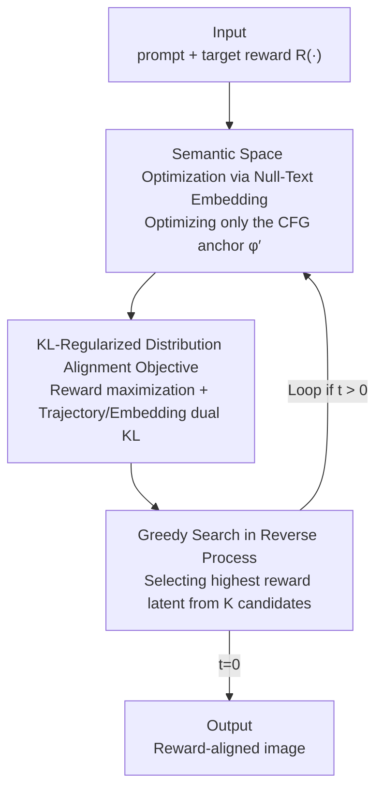

# Test-Time Alignment of Text-to-Image Diffusion Models via Null-Text Embedding Optimisation

**Conference**: CVPR 2026  
**Paper**: [CVF Open Access](https://openaccess.thecvf.com/content/CVPR2026/html/Kim_Test-Time_Alignment_of_Text-to-Image_Diffusion_Models_via_Null-Text_Embedding_Optimisation_CVPR_2026_paper.html)  
**Code**: None  
**Area**: Diffusion Models  
**Keywords**: Test-time alignment, reward alignment, null-text embedding, Classifier-Free Guidance, reward hacking

## TL;DR
Instead of modifying model weights or perturbing noise/latents, this method optimizes only the "null-text embedding" within Classifier-Free Guidance (CFG). This allows the diffusion model to align with target rewards during the inference phase. Since the text embedding space is a structured semantic manifold, this approach achieves SOTA rewards without "cheating" via non-semantic noise (reward hacking).

## Background & Motivation
**Background**: Aligning pre-trained diffusion models with human preferences or specific target rewards (e.g., Aesthetic Score, HPSv2, PickScore) currently follows two paths. One is fine-tuning, which directly modifies model weights to maximize rewards. The other is Test-Time Alignment (TTA), which keeps weights frozen during inference and instead optimizes noise/latent variables, uses SMC sampling, or employs discrete searches like MCTS to approximate high-reward samples.

**Limitations of Prior Work**: Fine-tuning is costly and prone to "reward over-optimisation," where the model fixates on the proxy reward and loses generalization across other rewards or sample diversity. TTA methods also face a trade-off: they either under-optimise (e.g., target rewards for DPS and TDPO barely increase) or over-optimise (e.g., DNO increases the target score but leads to the collapse of other metrics).

**Key Challenge**: The authors attribute the root cause to "which space the optimization occurs in." Whether in pixel-space $x$ or latent-space $z$, these are **high-dimensional, unstructured** spaces. Optimizers easily find **non-semantic noise perturbations** to satisfy the reward function $r(x)$—the score increases, but the image semantics do not improve or even deteriorate, creating a breeding ground for reward hacking. Search-based methods expand exponentially with diffusion steps, making them slow and sub-optimal.

**Goal**: To find a TTA framework that can stably achieve high target rewards without sacrificing cross-reward generalization or requiring weight updates.

**Key Insight**: The authors draw inspiration from Null-Text Inversion (NTI) in image editing, which proved that optimizing the null-text embedding $\phi$ in CFG enables fine-grained semantic control with high fidelity. A key observation is that the null-text embedding in CFG is a **geometric anchor for the entire conditional generation distribution**. Furthermore, it resides within a **structured semantic space** defined by the text encoder, which naturally possesses implicit manifold regularization.

**Core Idea**: Shift alignment from "tuning noise" to "optimizing the null-text embedding." By performing reward maximization on the semantic manifold paired with a KL regularization objective, the model's generation distribution is directly shifted towards the target reward rather than just patching individual samples.

## Method

### Overall Architecture
Null-TTA is a training-free TTA framework. The input is a prompt plus a target reward function $R(\cdot)$, and the output is an aligned image. Throughout the process, the **U-Net weights are not updated**; only a single vector—the null-text embedding $\phi'$ in CFG—is optimized. The process is embedded into the standard DDPM reverse denoising loop. At each denoising step $t$, several gradient ascent steps are performed on $\phi'$ (maximizing the combined "reward - KL regularization" objective). Then, a single DDPM transition is executed using the updated $\phi'$, followed by a lightweight greedy search to select the latent with the highest reward from $K$ candidates as $x_{t-1}$. The pipeline is a synergy of "semantic space optimization + trajectory-level KL constraints + stepwise greedy selection."

### Key Designs

**1. Semantic Space Optimization on Null-Text Embedding: Shifting Alignment from Unstructured Noise to Structured Manifolds**

This is the core of the paper. The pain point is that pixel/latent spaces are unstructured, allowing optimizers to exploit "non-semantic noise" to inflate scores (reward hacking). Null-TTA's mechanism is to leave the noise variables untouched and only optimize the null-text embedding $\phi$ in the CFG formula. Recalling CFG, the predicted noise is $\tilde{\epsilon}_\theta(x_t,t,c,\phi) = \epsilon_\theta(x_t,t,\phi) + s\,(\epsilon_\theta(x_t,t,c) - \epsilon_\theta(x_t,t,\phi))$, where $\phi$ is the null-text embedding for unconditional generation that "anchors" the model's generation distribution. Since $\phi$ resides in the semantic space defined by the text encoder, optimizing it is equivalent to moving within a space with **implicit manifold regularization**. Updates can only follow semantically coherent directions, preventing the use of noise artifacts to "cheat" as in latent optimization. Because $\phi$ is the anchor for the entire conditional distribution, modifying it **directly shifts the generation distribution itself** rather than repairing samples post-hoc.

**2. KL-Regularized Distribution Alignment Objective: Shifting the Distribution without Deviating from Pre-trained Behavior**

Simply maximizing rewards can still lead to distribution drift and reward hacking. Starting from the KL-regularized optimal target distribution $p_{tar}(x) = \frac{1}{Z}\,p_{pre}(x)\exp(r(x)/\alpha)$, the authors design a regularization objective for $\phi'$: $\max_{\phi'}\big(\lambda_1\,\mathbb{E}_{p(x_0|\phi')}[R(x_0)] - \lambda_2\,\mathrm{KL}(p(x_{0:T},\phi')\,\|\,p(x_{0:T},\phi))\big)$. Using the Markov property of the diffusion process, this trajectory-level KL is decomposed into two parts: the sum of local KL between adjacent denoising steps and the KL between embedding distributions. Since each step's conditional distribution is Gaussian, the local KL has a closed-form solution:

$$\mathrm{KL}\big(p(x_{i-1}|x_i,\phi')\,\|\,p(x_{i-1}|x_i,\phi)\big) = \frac{1-\alpha_i}{2\alpha_i(1-\bar{\alpha}_i)}\,\|\tilde{\epsilon}(x_i,\phi') - \tilde{\epsilon}(x_i,\phi)\|^2$$

The embedding term models $\phi, \phi'$ as Gaussians, yielding $\mathrm{KL}(p(\phi')\|p(\phi)) = \frac{1}{2\sigma_\phi^2}\|\phi-\phi'\|^2$. The interpretation is straightforward: the former forces the optimized denoising trajectory to remain consistent with the pre-trained trajectory, while the latter prevents $\phi'$ from straying too far from the original null-text embedding. In practice, a single denoising trajectory is used for Monte Carlo approximation, and the Tweedie formula is used to estimate $\mathbb{E}_{p(x_0|\phi')}[R(x_0)]$. An engineering detail is that $\lambda_2$ is annealed as $t\to 0$: strong regularization stabilizes optimization in high-noise early stages, while weak regularization allows fine-grained alignment in late stages.

**3. Greedy Search in the Reverse Process: Nudging the Trajectory toward High-Reward Regions**

Optimizing $\phi'$ alone is not enough, as the DDPM transition itself carries stochasticity. After updating $\phi'$ at each step, the authors sample $K$ candidates $\{x_{t-1}^{(k)}\}$ from the transition kernel $p(x_{t-1}|x_t,\phi')$. For each candidate, the corresponding clean sample $\hat{x}_0^{(k)}$ is estimated using the Tweedie posterior mean and scored by the reward model $R(\hat{x}_0^{(k)})$. Only the latent with the highest score is kept as $x_{t-1}$. This greedy selection acts as exploring $K$ paths at each step and choosing the best one, deterministically fine-tuning the reverse diffusion path toward high-reward regions. It complements the first two designs: optimization aligns the distribution anchor, while search utilizes the stochasticity of single-sample generation.

### Loss & Training
There is no training; it is entirely inference-time optimization. Successive gradient steps are performed to maximize the objective in Eq. (26). A key engineering advantage is that since only the null-text embedding $\phi'$ is optimized, backpropagation **only needs to pass through the cross-attention layers** rather than the entire U-Net. This results in minimal VRAM usage and stable runtime scaling with the number of optimization steps. For **non-differentiable rewards** (e.g., JPEG compression rate or molecular docking scores), zero-order gradient estimation is used: $\hat{\nabla}_\phi J(\phi) \approx \frac{1}{K\mu}\sum_{k=1}^{K}[J(\phi+\mu v_k)-J(\phi)]v_k$, where $v_k\sim\mathcal{N}(0,I)$.

## Key Experimental Results

Baselines cover various TTA branches: TDPO (fine-tuning), DNO/DPS (guidance-based), DAS (sampling-based), and DSearch (search-based). The base model is SD v1.5 with 100 inference steps on a single L40S, averaged across 3 random seeds.

### Main Results

Target scores and cross-reward generalization when using PickScore as the target reward (SD v1.5, $n_{max}=55$):

| Method | PickScore (Target) ↑ | HPSv2 ↑ | Aesthetic ↑ | ImageReward ↑ |
|------|------|------|------|------|
| SD-v1.5 | 0.218 | 0.279 | 5.232 | 0.339 |
| DNO | 0.289 | 0.290 | 5.075 | 0.396 |
| DAS | 0.258 | 0.289 | 5.382 | 0.871 |
| **Null-TTA** | **0.315** | **0.294** | **5.431** | **0.946** |

Ours leads in both target rewards and all held-out rewards, indicating that "pushing the score" does not collapse other metrics. The paper also plots Pareto frontiers for Aesthetic and HPSv2 targets (Fig. 1), where Null-TTA consistently pareto-dominates competitors. This holds for SDXL (Table 4): as $n_{max}$ increases from 25 to 45, target PickScore rises from 0.266 to 0.282 while other quality metrics remain stable.

### Ablation Study

Computational cost comparison (HPSv2 target, SD v1.5):

| Method | $n_{max}$ | HPSv2 ↑ | VRAM (MB) ↓ | Time per Image |
|------|------|------|------|------|
| DAS | – | 0.306 | 30595 | 4m48s |
| DNO | – | 0.375 | 20449 | 19m38s |
| Null-TTA | 25 | 0.347 | 17585 | 4m33s |
| Null-TTA | 55 | 0.375 | 17585 | 8m40s |
| Null-TTA | 115 | 0.428 | 17585 | 17m07s |

To reach an HPSv2 of 0.375, Null-TTA (8m40s) is more than twice as fast as the strongest baseline DNO (19m38s) and uses significantly less VRAM (17585MB) because it only backpropagates through cross-attention. Increasing the budget further raises the score to 0.428. In a user study (Table 2, 16 people, 800 pairs), Null-TTA achieved a mean rank of 1.81, outperforming DNO (2.04) and DAS (2.15).

### Key Findings
- **Cheating depends on the optimization space**: The root cause of baseline failure is identified as "optimizing in unstructured latent/noise space," leading to either over-optimization (DNO) or under-optimization (TDPO/DPS). Shifting optimization to the semantic manifold with KL trajectory constraints solves both issues simultaneously.
- **VRAM advantage from embedding optimization**: Since gradients only flow through cross-attention, memory usage does not scale linearly with the number of optimization steps, providing a structural resource advantage.
- **Scalable to non-differentiable rewards**: Using zero-order gradient estimation, the method can align with black-box rewards like JPEG compression while maintaining visual quality and prompt consistency.
- **Multi-objective control**: Using $R_{multi}=w\cdot\text{PickScore}+(1-w)\cdot\text{HPSv2}$, the Pareto frontier of Null-TTA clearly dominates DAS, proving the friendliness of semantic space optimization for multi-objective alignment.

## Highlights & Insights
- **Redefining "Alignment" as "Optimizing distribution anchors"**: The central insight is recognizing the null-text embedding in CFG as a geometric anchor of the conditional distribution. Modifying it shifts the distribution itself—allowing a vector with less than one-ten-thousandth the parameters of U-Net to perform distribution modification without fine-tuning.
- **Structured spaces naturally resist reward hacking**: Changing the optimization variable from unstructured noise to semantic embeddings provides "free" manifold regularization. This "change of space" strategy is transferable to any optimization scenario prone to exploiting proxy rewards.
- **Closed-form KL + Tweedie approximation** makes training-free trajectory-level regularization computationally feasible, avoiding the overhead of backpropagating through the entire trajectory.
- **Backpropagating only through cross-attention** is an engineering decision that yields a win-win in VRAM and speed.

## Limitations & Future Work
- Stepwise greedy search with $K$ candidates increases reward model forward passes. The sensitivity of $K$ and its trade-off with candidate quality was not deeply explored.
- The method still relies on existing reward models (HPSv2, PickScore, etc.); biases in these proxies are inherited. Semantic manifolds resist hacking, but they cannot resist biases inherent in the reward models themselves.
- Hyperparameters like $\lambda_2$ annealing and $n_{min}/n_{max}$ are set empirically; their robustness across different models or rewards requires more discussion.
- Validation was limited to SD v1.5 and SDXL. Transferability to larger or non-latent architectures (e.g., pixel-space diffusion, flow matching) remains to be investigated.

## Related Work & Insights
- **vs. DNO (Guidance-based TTA)**: DNO directly adjusts injected noise for reward maximization, which easily leads to over-optimization in unstructured space. Null-TTA optimizes in semantic embedding space with KL constraints, achieving similar or higher target scores with better generalization and speed.
- **vs. DAS (Sampling-based TTA / SMC)**: DAS assumes a fixed but intractable posterior and relies on particle sampling, focusing on sampling efficiency rather than modifying the distribution. Null-TTA explicitly modifies the generation distribution, making cross-task alignment more stable.
- **vs. DSearch / Search-over-Paths (Search-based TTA)**: Search-based methods treat TTA as a discrete search in noise space (e.g., MCTS). They handle non-differentiable rewards but scale exponentially with diffusion steps. Null-TTA performs optimization on a continuous semantic manifold, balancing efficiency with smooth control.
- **vs. Null-Text Inversion (NTI)**: NTI uses null-text embedding optimization for image editing/inversion. This paper extrapolates the same principle into a general mechanism for diffusion model reward alignment.
- **vs. Fine-tuning alignment (TDPO, etc.)**: Fine-tuning modifies weights, is expensive, and reduces diversity. Null-TTA is training-free and preserves the model's general utility and efficiency.

## Rating
- Novelty: ⭐⭐⭐⭐⭐ Shifting alignment from noise space to the "distribution anchor" of CFG null-text embedding is a clear and novel angle for TTA.
- Experimental Thoroughness: ⭐⭐⭐⭐ Broad coverage of objectives, models, costs, and human studies. However, sensitivity analysis for $K$ and hyperparameters is limited.
- Writing Quality: ⭐⭐⭐⭐ Clear logical chain from motivation to derivation, with complete closed-form solutions for KL terms.
- Value: ⭐⭐⭐⭐⭐ Training-free, memory-efficient, and resistant to reward hacking—highly attractive for practical alignment deployment.

<!-- RELATED:START -->

## Related Papers

- [\[CVPR 2026\] NEAF: Natural Image Editing with Attention Fusion for Generalizable Test-time Optimization in Text-Guided Image Editing](neaf_natural_image_editing_with_attention_fusion_for_generalizable_test-time_opt.md)
- [\[CVPR 2026\] Progress by Pieces: Test-Time Scaling for Autoregressive Image Generation](progress_by_pieces_test-time_scaling_for_autoregressive_image_generation.md)
- [\[CVPR 2026\] From Scale to Speed: Adaptive Test-Time Scaling for Image Editing](from_scale_to_speed_adaptive_test-time_scaling_for_image_editing.md)
- [\[CVPR 2026\] Premier: Personalized Preference Modulation with Learnable User Embedding in Text-to-Image Generation](premier_personalized_preference_modulation_with_learnable_user_embedding_in_text.md)
- [\[CVPR 2026\] TINA: Text-Free Inversion Attack for Unlearned Text-to-Image Diffusion Models](tina_text-free_inversion_attack_for_unlearned_text-to-image_diffusion_models.md)

<!-- RELATED:END -->
