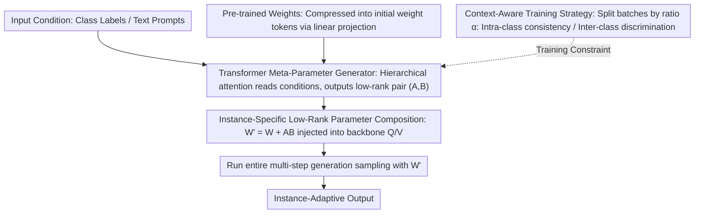

# Test-Time Instance-Specific Parameter Composition: A New Paradigm for Adaptive Generative Modeling

**Conference**: CVPR 2026  
**arXiv**: [2603.27665](https://arxiv.org/abs/2603.27665)  
**Code**: [https://github.com/tmtuan1307/Composer](https://github.com/tmtuan1307/Composer)  
**Area**: Image Generation / Diffusion Models  
**Keywords**: Adaptive Generative Models, Test-Time Parameter Composition, Low-Rank Updating, Dynamic Weights, Meta-Generator

## TL;DR

This paper proposes Composer, a plug-and-play meta-generator framework that dynamically generates low-rank parameter updates based on each input condition during inference and injects them into pre-trained model weights. With extremely low computational overhead (+0.2% time, +3.6% memory), it achieves instance-specific adaptive high-quality image generation, significantly enhancing performance across scenarios such as class-conditional generation, text-to-image, post-training quantization, and test-time scaling.

## Background & Motivation

**Background**: Diffusion models and visual autoregressive models have achieved great success in image generation but are essentially static models—a fixed set of pre-trained parameters must process all input prompts, scenes, and modalities.

**Limitations of Prior Work**: This rigidity limits model adaptability. Faced with complex or ambiguous generation conditions, static weights cannot specialize to the semantic features of each input, often leading to over-smoothed or inconsistent samples. Existing Test-Time Training (TTT) methods can adapt parameters during inference but require instance-wise gradient optimization, incurring extremely high computational overhead (over 540% increase in time and 180% in memory). MoE architectures provide conditional computation, but their routing granularity is coarse, they are bound to a fixed expert pool, and they require architectural changes and full retraining.

**Key Challenge**: How to provide pre-trained generative models with instance-specific adaptation capabilities without adding significant computational overhead?

**Goal**: (1) Enable instance-specific parameter specialization during inference without fine-tuning or retraining; (2) Compatibility with arbitrary pre-trained generative model backbones in a plug-and-play manner; (3) Maintain extremely low computational and memory overhead.

**Key Insight**: Inspired by how humans flexibly adjust internal generative representations to adapt to different perceptual/imaginary contexts, this work avoids iterative optimization and instead uses a lightweight auxiliary network to directly synthesize parameter updates from conditional signals.

**Core Idea**: A Transformer meta-generator maps input conditions to low-rank parameter updates $W' = W + AB$. Parameter composition is completed once before inference, achieving instance-specific adaptive generation with near-zero overhead.

## Method

### Overall Architecture

Composer addresses a specific problem: allowing a frozen pre-trained generative model to temporarily adopt weights "tailored for the input" when facing different conditions (class labels, text prompts) without the cost of test-time retraining. It attaches a lightweight meta-generator outside the backbone: during training, this Transformer learns to map "pre-trained weights + current condition" into a pair of low-rank matrices $(A, B)$. Consequently, certain backbone weights are overwritten in-place before inference as $W' = W + AB$, followed by a standard generation training pass using the modified weights. No gradients are needed during inference; the meta-generator calculates $(A, B)$ once using pre-stored tokens. Once $W'$ is assembled, it is reused throughout the multi-step sampling process, making the additional overhead nearly negligible.

### Key Designs

**1. Instance-Specific Low-Rank Parameter Composition: Replacing "One Size Fits All" with "One Set per Input"**

The fundamental flaw of static models is that the same parameters must handle all conditions, leading to averaged processing of complex or ambiguous inputs. Composer overlays a low-rank correction $W' = W + AB$ on the backbone's query matrix $W_Q$ and value matrix $W_V$, where $A \in \mathbb{R}^{d \times r}$, $B \in \mathbb{R}^{r \times d}$, and $r \ll d$ (default $r=8$). The low-rank constraint minimizes the number of parameters generated per step, ensuring that instance-wise generation does not slow down inference. While structurally similar to LoRA, it is fundamentally different: LoRA's $A, B$ are fixed after training and shared across all inputs, whereas Composer's $A, B$ are computed on-the-fly based on the input condition. One is a "global set of glasses," the other is "a new set of glasses for every input." Modifying only Q and V follows the observation from fine-tuning literature that Q/V corrections offer the best cost-performance ratio.

**2. Transformer Meta-Parameter Generator: An Attention Network to "Read" Conditions and Write Weights**

The key to generating $(A, B)$ on-the-fly is a network capable of translating condition signals into weights. During training, a linear projection layer compresses pre-trained weights into initial tokens $A^0, B^0$ ($\mathbb{R}^{d \times d} \to \mathbb{R}^{2r \times d_{model}}$), which are concatenated with input prompt tokens and fed into a Transformer. The attention mechanism is designed as a hierarchical structure: all component tokens attend to prompt tokens for context, local attention is used within blocks to reduce computation, and the first token of each block performs cross-block attention to capture correlations between different weight matrices. During inference, the linear projection layer is removed, and the trained $A^0, B^0$ tokens are reused directly, which is why inference time remains nearly unchanged—the expensive initialization happens only once during training.

**3. Context-Aware Training Strategy: Balancing Intra-class Consistency and Inter-class Discrimination**

If batches are sampled randomly during training, the meta-generator may fail to learn semantic relationships between conditions; however, if a batch contains only one category, the output may collapse. Composer splits batches using a ratio $\alpha \in [0,1]$: $\alpha \times b$ samples are taken from the same category to ensure consistent adaptations for similar inputs, while $(1-\alpha) \times b$ samples are from different categories to maintain discrimination (default $\alpha = 0.75$). For text-to-image tasks, "similarity" is defined by semantic distance in the CLIP embedding space rather than hard class labels.

### Loss & Training

Class-conditional generation utilizes the standard diffusion loss $\mathcal{L} = \mathbb{E}_{x,\epsilon,t}[\|\epsilon - \epsilon_\theta(x_t, t; W', P)\|_2^2]$, where $\epsilon_\theta$ uses the composed weights $W'$. For post-training quantization, a knowledge distillation loss $\mathcal{L}_{KD} = \|h - h_q\|_2^2$ is used to compensate for feature shifts caused by quantization. All experiments use AdamW (weight decay 0.05, lr 1e-4) for 50 epochs, with the low-rank dimension fixed at $r=8$.

## Key Experimental Results

### Main Results

ImageNet 256×256 Class-Conditional Generation:

| Backbone | Method | FID ↓ | IS ↑ | Inference Time | Memory |
|------|------|-------|------|---------|------|
| VAR d-16 | Standard | 3.55 | 274.4 | 0.4s | 2.37G |
| VAR d-16 | TTT | 3.22 | 277.2 | 40.52s (+10030%) | 4.58G |
| VAR d-16 | **Composer** | **3.15** | **280.4** | 0.42s (+5%) | 2.57G |
| VAR d-30 | Standard | 1.97 | 323.1 | 1.0s | 16.57G |
| VAR d-30 | TTT | 1.85 | 327.7 | 112.37s (+11137%) | 28.41G |
| VAR d-30 | **Composer** | **1.79** | **330.4** | 1.07s (+7%) | 16.97G |
| DiT-XL/2 | Standard | 2.27 | 278.2 | 45s | 6.1G |
| DiT-XL/2 | **Composer** | **2.06** | **285.6** | 45.03s (+0.07%) | 6.4G |

### Ablation Study

| Ablation Dimension | Setting | VAR d-16 FID |
|---------|------|-------------|
| Low-rank Dim $r$ | 4/8/16/32 | 3.32/3.15/3.10/3.08 |
| Sample Ratio $\alpha$ | 0.0/0.5/0.75/1.0 | 3.42/3.22/3.15/3.25 |
| Attention Mechanism | Standard/Global-Local | 3.55/3.15 |
| Generator Arch | CNN/MLP/Transformer | 3.35/3.32/3.15 |

### Key Findings

- **Extreme Efficiency**: Compared to the 10000%+ time overhead of TTT, Composer only adds 0.2%-7% inference time and 3.6%-5% memory.
- **Consistent Gains Across Backbones**: Stable FID reductions observed across VAR (d-16 to d-36), DiT (L/2 to XL/2), and SD2.1.
- **Quantization Recovery**: In extreme 2/8-bit quantization, it improves Q-Diffusion IS from 49.08 to 78.21 and reduces FID from 43.36 to 35.26.
- **Additivity**: Composer + ORM/PARM test-time scaling further enhances results (FID 13.45 to 12.82).
- **Optimal $\alpha = 0.75$**: Ratios too low (lack of consistency) or too high (lack of diversity) lead to sub-optimal results.

## Highlights & Insights

- **Paradigm Innovation**: The shift from static parameters to dynamic parameter composition is a natural evolution of LoRA—where LoRA is globally shared, Composer is instance-specific.
- **Strong Practicality**: Plug-and-play, model-agnostic, and near-zero overhead make it a rare "win-all" method.
- **Unique Value in Quantization**: Using low-rank updates to compensate for quantization errors is a clever application direction.
- **Cognitive Analogy**: The model learns to "adjust its mindset" before generating for each input, similar to human mental preparation for different creative tasks.

## Limitations & Future Work

- Adaptation is limited to Q and V matrices; the potential of other layers (e.g., FFN) remains unexplored.
- Training requires 50 epochs; the training cost of the meta-generator warrants more discussion.
- Improvements in Text-to-Image (FID 13.45→13.07) are relatively smaller than in class-conditional scenarios.
- Yet to explore more complex applications like video or 3D generation.

## Related Work & Insights

- LoRA is the conceptual predecessor—the comparison between shared vs. dynamic low-rank is highly insightful.
- MoE's coarse routing vs. Composer's fine-grained instance adaptation provides different perspectives on dynamic computation.
- HyperNetwork also performs parameter generation, but Composer's Transformer architecture and hierarchical attention are more efficient.

## Rating

- **Novelty**: ⭐⭐⭐⭐⭐ — Test-time instance-specific parameter composition is a new paradigm with significant impact.
- **Experimental Thoroughness**: ⭐⭐⭐⭐⭐ — Covers 5 backbones and 4 application scenarios with comprehensive ablations.
- **Writing Quality**: ⭐⭐⭐⭐ — Concepts are clearly explained with complete derivations and intuitive diagrams.
- **Value**: ⭐⭐⭐⭐⭐ — A universal, low-overhead framework with high practical utility across multiple scenarios.

<!-- RELATED:START -->

## Related Papers

- [\[CVPR 2026\] From Scale to Speed: Adaptive Test-Time Scaling for Image Editing](from_scale_to_speed_adaptive_test-time_scaling_for_image_editing.md)
- [\[CVPR 2026\] Generative Modeling of Weights: Generalization or Memorization?](generative_modeling_of_weights_generalization_or_memorization.md)
- [\[ICLR 2026\] GenCP: Towards Generative Modeling Paradigm of Coupled Physics](../../ICLR2026/image_generation/gencp_towards_generative_modeling_paradigm_of_coupled_physics.md)
- [\[CVPR 2026\] Progress by Pieces: Test-Time Scaling for Autoregressive Image Generation](progress_by_pieces_test-time_scaling_for_autoregressive_image_generation.md)
- [\[CVPR 2026\] Test-Time Alignment of Text-to-Image Diffusion Models via Null-Text Embedding Optimisation](test-time_alignment_of_text-to-image_diffusion_models_via_null-text_embedding_op.md)

<!-- RELATED:END -->
