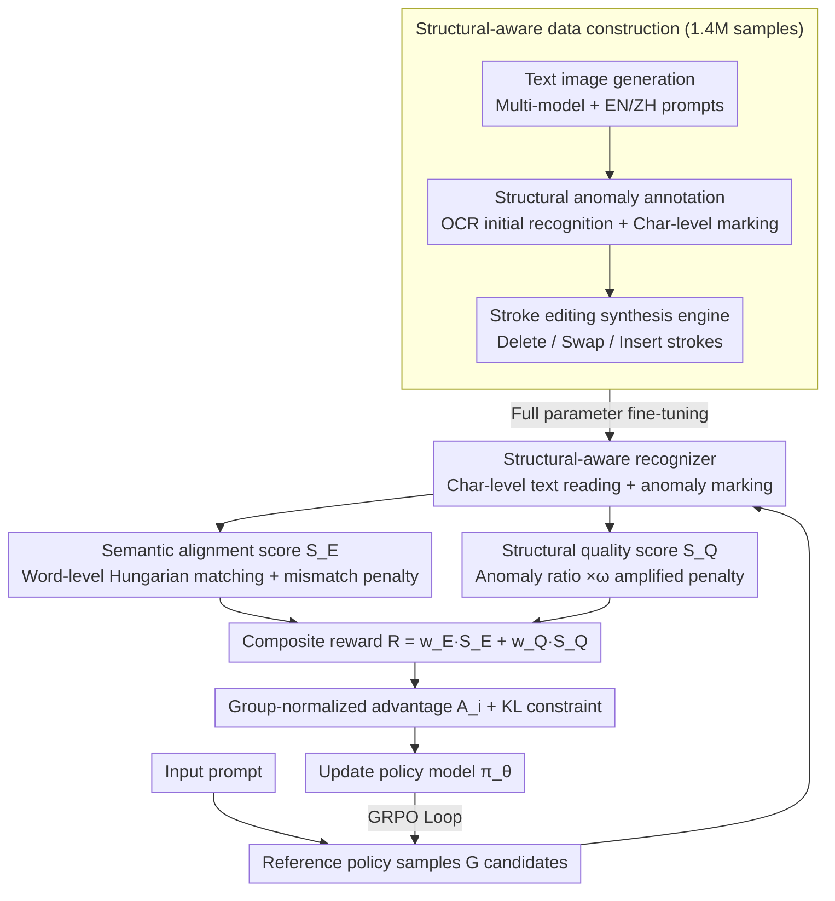

# TextPecker: Rewarding Structural Anomaly Quantification for Enhancing Visual Text Rendering

**Conference**: CVPR 2026  
**arXiv**: [2602.20903](https://arxiv.org/abs/2602.20903)  
**Code**: [GitHub](https://github.com/CIawevy/TextPecker)  
**Area**: Image Generation  
**Keywords**: visual text rendering, structural anomaly, reinforcement-learning, reward model, OCR

## TL;DR

TextPecker is proposed as a plug-and-play structural anomaly-aware RL strategy. By constructing a character-level structural anomaly annotation dataset to train a structural-aware recognizer, it replaces noisy OCR reward signals. This approach jointly optimizes semantic alignment and structural fidelity, significantly enhancing visual text rendering quality across multiple text-to-image models (FLUX, SD3.5, Qwen-Image).

## Background & Motivation

**Visual Text Rendering (VTR) remains a key challenge for T2I generation**: Even advanced models (e.g., FLUX, GPT-4o, BAGEL) frequently produce structural anomalies such as distortion, blurring, misalignment, or missing characters.

**OCR/MLLM as evaluators have fundamental flaws**: Existing evaluation and RL optimization pipelines rely on OCR models or MLLMs to recognize generated text and calculate edit distance rewards. However, these models cannot perceive fine-grained structural anomalies, manifesting in two types of failures: (a) **Over-interpretation**: excessive reliance on language priors to "correct" structural defects, ignoring glyph-level flaws like missing or misplaced strokes; (b) **Invisibility**: direct neglect of severely blurred or distorted regions as if they do not exist.

**Evaluator blind spots lead to misleading rewards**: The "auto-correction" of OCR lowers the edit distance $N_e$ and inflates reward scores $S$, causing RL optimization to deviate. Even highly optimized models like Qwen-Image and Seedream4.0 still struggle to render structurally faithful text.

**Scarcity of structural anomaly annotation data**: There is a lack of training data with character-level structural anomaly annotations, especially for Chinese characters, where 2D spatial combinations and a vocabulary of 8000+ characters cause a combinatorial explosion.

## Method

### Overall Architecture

TextPecker aims to address the following bottleneck: when T2I models use RL to optimize text rendering, reward signals come from OCR/MLLM, which are inherently "blind" to glyph-level structural defects—either "filling in" missing strokes based on language priors or skipping blurred regions entirely. This results in inflated rewards and misdirected optimization. The solution is to replace the unreliable OCR reward in the GRPO pipeline with a composite reward capable of perceiving structural anomalies.

The process follows a standard GRPO closed loop. For each prompt, $G$ candidate images $\{o_i\}_{i=1}^G$ are sampled from a reference policy $\pi_{\theta_{\text{ref}}}$. A specially trained "structural-aware recognizer" reads the generated text character-by-character and identifies structural anomalies. Based on this, a composite reward $\mathcal{R}_i$ (semantic alignment + structural quality) is calculated for each candidate. Sub-group rewards are normalized into relative advantages $A_i$, and the policy model $\pi_\theta$ is updated with KL constraints. Since modifications only occur in the "reward" phase, TextPecker is plug-and-play for any T2I model without altering the generator architecture.

### Key Designs

**1. Structural Quality Score $\mathcal{S}_Q$: Amplifying "rare but glaring" glyph defects into strong penalties**

For strong generators, structural errors are often sporadic—two or three bad characters out of a hundred, yet highly distracting to humans. If penalties are weighted linearly by the anomaly ratio, these sporadic defects barely affect the score, and the policy fails to learn to fix them. $\mathcal{S}_Q$ multiplies the anomaly ratio by a scaling factor greater than 1:

$$\mathcal{S}_Q = \text{clip}\left(1 - \omega \frac{N_a}{N_P},\ 0,\ 1\right)$$

Where $N_P$ is the total count of generated characters, $N_a$ is the count of characters marked as anomalous by the recognizer, and the scaling factor $\omega > 1$ (set to $\omega=5$ in experiments). $\omega$ amplifies the penalty for rare errors fivefold, effectively forcing the policy to address even minor glaring defects.

**2. Semantic Alignment Score $\mathcal{S}_E$: Word-level Hungarian matching + mismatch penalty**

Word order in generated images may not match the prompt. Calculating edit distance on the entire string might misclassify "correct content but wrong order" as a major error. $\mathcal{S}_E$ operates at the word level: an optimal Hungarian matching $\mathcal{M}$ is found between the target word set $\mathcal{T}$ and the generated word set $\mathcal{P}$ based on Normalized Edit Distance (NED). Unmatched words (additions or omissions) are penalized separately:

$$\mathcal{S}_E = 1 - \frac{\sum_{(t_i, p_j) \in \mathcal{M}} \text{NED}(t_i, p_j) + \text{Penalty}(\mathcal{T}, \mathcal{P}, \mathcal{M})}{\max(|\mathcal{T}|, |\mathcal{P}|)}$$

This ensures that correct content is not penalized for positional differences while accurately capturing omissions and extra words.

**3. Composite Reward $\mathcal{R}$: Balancing semantic and structural fidelity**

Since correct content and clean glyphs are both necessary, a weighted sum is used:

$$\mathcal{R} = w_E \mathcal{S}_E + w_Q \mathcal{S}_Q, \quad w_E + w_Q = 1$$

In experiments, $w_E = w_Q = 0.5$ is used to give equal importance to semantic accuracy and structural fidelity. This $\mathcal{R}$ replaces the standard OCR reward in GRPO.

**4. Structural-Aware Data Construction: Bypassing combinatorial explosion via stroke editing**

The recognizer requires character-level anomaly data, which is scarce for Chinese characters due to their 2D complexity. A three-step pipeline generates 1.4M samples:
1.  **Text Image Generation**: Diverse English and Chinese models generate images with various fonts and layouts.
2.  **Structural Anomaly Annotation**: OCR results are refined by human annotators who mark blur, distortion, and missing or extra strokes.
3.  **Stroke Editing Synthesis Engine**: This engine operates at the stroke level to create anomalies via **stroke deletion**, **stroke swapping** (swapping subsets of strokes after centroid alignment), and **stroke insertion**. This allows for massive coverage of rare glyph defects without manual effort.

| Data Type | Level | Samples | Ratio |
|-----------|-------|---------|-------|
| Human Annotated | Box | 559.6K | 39.32% |
| Human Annotated | Image | 131.1K | 9.21% |
| Synthetic Anomaly | Box | 452.5K | 31.80% |
| Synthetic Anomaly | Image | 100.0K | 7.03% |
| Synthetic Normal | Box | 150.0K | 10.54% |
| Synthetic Normal | Image | 30.0K | 2.10% |
| **Total** | – | **1.4M** | 100% |

### Loss & Training

The strategy is based on Flow-GRPO, extending GRPO to rectified-flow settings. By injecting randomness into deterministic sampling dynamics, it is formulated as a stochastic differential equation, enabling on-policy sampling and optimization on flow models:

$$dx_t = \left(v_t + \frac{\sigma_t^2}{2t}(x_t + (1-t)v_t)\right)dt + \sigma_t\,dw_t$$

The recognizer uses Qwen3-VL-8B and InternVL3-8B as backbones, supporting bounding box inputs, and is fine-tuned on the 1.4M samples for 2 epochs.

## Key Experimental Results

### Structural Anomaly Perception (TSAP) vs. Standard Text Recognition (CTR)

| Method | EN TSAP F1 | EN CTR Recall | ZH TSAP F1 | ZH CTR Recall |
|-----|-------------|----------------|-------------|----------------|
| PP-OCRv5 | 0.000 | 0.720 | 0.024 | 0.921 |
| GOT-OCR-2.0 | 0.000 | 0.610 | 0.008 | 0.853 |
| GPT-5 | 0.170 | 0.556 | 0.226 | 0.758 |
| Qwen3-VL-8B | 0.032 | 0.807 | 0.017 | 0.943 |
| InternVL3-8B | 0.183 | 0.759 | 0.153 | 0.927 |
| **TextPecker (InternVL3)** | **0.870** | **0.944** | **0.927** | **0.962** |
| **TextPecker (Qwen3-VL)** | **0.862** | **0.918** | **0.925** | **0.972** |

- Existing OCRs and MLLMs almost completely fail on TSAP (F1 ≈ 0), whereas TextPecker achieves 0.87+ F1.
- TextPecker simultaneously improves standard text recognition, exceeding 0.94 CTR Recall.

### Main Results: VTR RL Optimization

- **FLUX**: Compared to baseline, Sem. +38.3%, Qua. +31.6%. Compared to OCR rewards, GenTextEval Sem. +11.7%.
- **Qwen-Image (Chinese)**: Semantic alignment +8.7%, structural fidelity +4.0%, reaching new SOTA.
- **SD3.5-M**: Qua. improved from 0.671 to 0.959, Sem. from 0.265 to 0.506.

## Ablation Study

- Removing synthetic data significantly degrades Chinese recognition performance, validating the necessity of the stroke editing engine for covering structural anomalies.
- Training only with human annotations leads to poor generalization toward unseen anomaly types.
- $\omega=5$ provides the optimal balance in scaling factor ablations.

## Highlights & Insights

- Systematically identifies the critical bottleneck of structural anomaly perception in VTR, providing a new perspective for evaluation and optimization.
- Plug-and-play design; requires no changes to generator architecture and is compatible with any T2I model.
- The stroke editing synthesis engine effectively solves the combinatorial explosion of Chinese structural anomalies.
- achieves improvements even on highly optimized models like Qwen-Image.

## Limitations & Future Work

- High data annotation costs (559.6K box-level annotations).
- The structural-aware recognizer is based on 8B parameter VLMs, resulting in significant inference overhead.
- Primary validation on English and Chinese; other writing systems (e.g., Arabic, Japanese Kana) are not yet covered.

## Rating

⭐⭐⭐⭐

This paper provides an in-depth analysis and effective solution for the key pain point in VTR (the structural blind spot of OCR evaluators). The workflow—from the discovery that "OCR and MLLM F1 ≈ 0 on TSAP" to dataset construction, recognizer training, reward design, and RL optimization—is cohesive. The stroke editing synthesis engine demonstrates a deep understanding of Chinese character characteristics. Significant improvements on already optimized models like Qwen-Image further prove its practical value. The main drawbacks are the high annotation cost and inference overhead, but as work filling an evaluation gap, its contribution is prominent.

<!-- RELATED:START -->

## Related Papers

- [\[CVPR 2026\] GlyphPrinter: Region-Grouped Direct Preference Optimization for Glyph-Accurate Visual Text Rendering](glyphprinter_region-grouped_direct_preference_optimization_for_glyph-accurate_vi.md)
- [\[CVPR 2026\] Residual Decoder Adapter: ID-Preserving Tokenizer Adaption for Autoregressive Text Rendering](residual_decoder_adapter_id-preserving_tokenizer_adaption_for_autoregressive_tex.md)
- [\[CVPR 2026\] IntroSVG: Learning from Rendering Feedback for Text-to-SVG Generation via an Introspective Generator-Critic Framework](introsvg_learning_from_rendering_feedback_for_text-to-svg_generation_via_an_intr.md)
- [\[CVPR 2026\] Learning to Generate via Understanding: Understanding-Driven Intrinsic Rewarding for Unified Multimodal Models](learning_to_generate_via_understanding_understanding-driven_intrinsic_rewarding_.md)
- [\[CVPR 2026\] Evaluating Reasoning Fidelity in Visual Text Generation](evaluating_reasoning_fidelity_in_visual_text_generation.md)

<!-- RELATED:END -->
