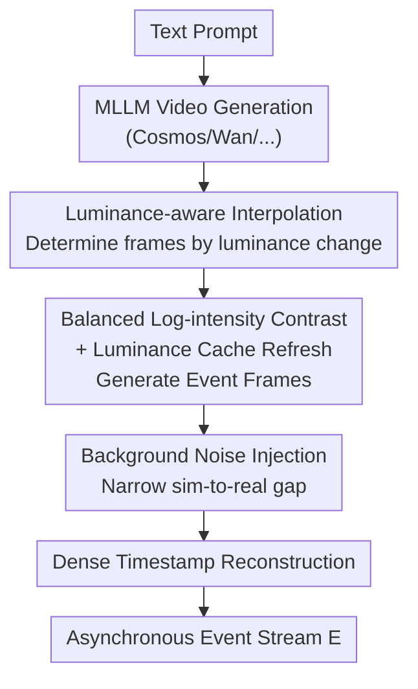

# Texvent: Asynchronous Event Data Simulation via Text Prompt

**Conference**: CVPR 2026  
**Paper**: [CVF Open Access](https://openaccess.thecvf.com/content/CVPR2026/html/Wang_Texvent_Asynchronous_Event_Data_Simulation_via_Text_Prompt_CVPR_2026_paper.html)  
**Code**: https://github.com/rfww/texvent  
**Area**: Image Generation / Event Camera Simulation  
**Keywords**: Event Camera, Text-to-event Simulation, Training-free, Frame Interpolation, Multi-modal Large Model

## TL;DR
Texvent directly generates asynchronous event camera data from text prompts. It first utilizes a Multi-modal Large Language Model (MLLM, e.g., Cosmos) to render text into video, then converts the video into an event stream via a novel training-free physical simulator. By employing "Luminance-aware Interpolation + Balanced Log-intensity Contrast + Luminance Caching," it achieves significantly higher fidelity than cascaded baselines while maintaining near-optimal generation speed.

## Background & Motivation
**Background**: Event cameras are bio-inspired visual sensors that outperform traditional cameras in latency, power consumption, and dynamic range, making them core components for various vision tasks. However, collecting real event datasets is extremely difficult, necessitating "event simulation." The mainstream approach is video-to-event (V2E), which calculates luminance changes between continuous frames to trigger events based on a threshold.

**Limitations of Prior Work**: The V2E route requires pre-existing videos, which are costly to collect and scale poorly in terms of viewpoint, motion, and lighting. Consequently, text-to-event (T2E) has been proposed to generate events directly from text. However, existing T2E pioneers require training dedicated "Text Encoder + Diffusion Model + Autoencoder" networks, necessitating massive paired "text-event" corpora, which are nearly impossible to obtain and often limited to specific domains like gestures.

**Key Challenge**: A naive training-free solution is a cascade of "Video Generator + Off-the-shelf V2E Simulator." This pipeline suffers from two major flaws: ① **Inefficiency**: Interpolation requires repeated bi-directional optical flow estimation, failing to support scenarios requiring large-scale training data or real-time generation. ② **Low Fidelity**: Current V2E simulators poorly model the physical reality of event cameras, leading to poor generalization of models trained on synthetic data. An ideal T2E method must address both efficiency and fidelity.

**Goal**: Develop a **training-free, general-purpose** T2E framework that is fast, realistic, and plug-and-play with different video generators and real cameras.

**Key Insight**: The authors observe that both the "interpolation count" and "event triggering" are essentially determined by luminance changes. Thus, the entire pipeline is redesigned around luminance changes—using them to both determine the number of interpolated frames (eliminating optical flow) and more accurately simulate the triggering and refreshing logic of event camera circuits.

**Core Idea**: Render videos using MLLMs instead of real filming, then use a luminance-driven physical simulator to simultaneously achieve interpolation efficiency and event-triggering fidelity without any training.

## Method

### Overall Architecture
Texvent takes a text prompt as input and outputs a stream of asynchronous event data $E=\{e_i\}_{i=1}^n$, where each event $e_i=(x_i,t_i,p_i)$ contains coordinates, timestamp, and polarity. The pipeline consists of two main stages: **High Frame-rate Video Generation** and **Event Data Simulation**.

The first stage uses a Text-to-Video MLLM to decode the prompt into low frame-rate sequences $I_{t\{1:N\}}=D(E(T;\theta_e);\theta_d)$, followed by "Luminance-aware Interpolation" to upsample temporal resolution as needed. The second stage is the core physical simulator: it calculates per-pixel luminance changes via "Balanced Log-intensity Contrast" to generate event frames, incorporating a "Luminance Cache" to simulate circuit behavior where the reference voltage only refreshes upon triggering. Finally, background activity noise is injected to narrow the sim-to-real gap, and dense timestamps are reconstructed based on luminance change rates.

### Key Designs

**1. Luminance-aware Interpolation: Replacing Optical Flow for Efficiency**

The core difficulty of interpolation is determining the number of intermediate frames. Existing V2E methods (VID2E/V2E/ESIM) use bi-directional optical flow, requiring displacements between frames to be less than 1 pixel—this collapses efficiency when videos contain chaotic lighting. Texvent discards optical flow and uses luminance differences: the number of frames $K_i$ between $I_{t_i}$ and $I_{t_{i+1}}$ is defined as $K_i=\max(|L(I_{t_i})-L(I_{t_{i+1}})|)\bmod\delta$, where $L(\cdot)$ is log-luminance and $\delta$ is the threshold. If significant changes occur, $K_i$ frames are interpolated using RIFE; if the change is below $\delta$, **no interpolation is performed**, ensuring temporal resolution only where events occur.

**2. Balanced Log-intensity Contrast: Correcting Sensitivity Bias**

Event cameras use logarithmic functions to simulate the human retina, but the log curve is naturally more sensitive to low light. Texvent introduces a balance parameter $\alpha$ into the log contrast calculation:

$$\prod_{i\in\{0:N-1\}}\prod_{j\in\{1:K_i\}}L(\alpha+I^{j}_{(t_i,t_{i+1})})-L(\alpha+\kappa\diamond I^{j-1}_{(t_i,t_{i+1})})>\delta$$

Adding $\alpha$ ensures that highlight areas only require approximately twice the luminance change of low-light areas to trigger (rather than four times), flattening sensitivity while preserving biological characteristics. Ablation results show that removing $\alpha$ drops the EQS from 0.8474 to 0.8309, confirming its role in recovering highlight boundaries.

**3. Luminance Cache Refresh: Preventing Missing Events**

The parameter $\kappa$ in the formula represents the Luminance Cache, and $\diamond$ denotes the update operation. In real circuits, the reference voltage **only updates when an event is triggered**. Typical V2E simulators calculate differences between consecutive frames, effectively refreshing the reference every frame and erasing potential events that accumulate over several frames. Texvent uses $\kappa$ to store historical luminance and compares the current frame against this "calibrated frame" rather than the previous one, refreshing only at coordinates where a trigger occurs.

**4. Noise Injection & Timestamp Reconstruction**

To bridge the sim-to-real gap, Texvent injects Poisson noise: $E=E\cdot(1-M)+M\cdot\mathrm{Poisson}(\lambda_1\lambda_2)$. The noise is applied preferentially to low-light background regions via a mask $M=(I_{t_{i+1}}<\sigma)\cdot(\Delta L<\delta)$. Finally, dense timestamps are reconstructed based on the assumption that larger luminance changes result in earlier triggers:

$$t_{x_i}=\gamma\times(t_{i+1}-t_i)\left(1-\frac{\Delta_{x_i}L-\min(\Delta L)}{\max(\Delta L)-\min(\Delta L)}\right)+t_i$$

where $\gamma$ is a scaling parameter to ensure microsecond-level triggering.

## Key Experimental Results

### Main Results

Comparison of Event Frame (E.F.) and Reconstructed Image (R.I.) quality on NT-ImageNet / ECD / DSEC:

| Metric | VID2E | V2E | V2CE | DVS-Voltmeter | SENPI | Texvent |
|------|-------|-----|------|---------------|-------|---------|
| MSE↓ (E.F.) | 0.116 | 0.142 | 0.082 | 0.276 | 0.186 | **0.045** |
| SSIM↑ (E.F.) | 0.430 | 0.299 | 0.552 | 0.085 | 0.095 | 0.488 |
| LPIPS↓ (E.F.) | 0.406 | 0.603 | 0.383 | 0.972 | 0.820 | **0.339** |
| SSIM↑ (R.I.) | 0.387 | 0.420 | 0.392 | 0.149 | 0.251 | **0.472** |
| LPIPS↓ (R.I.) | 0.381 | 0.422 | 0.451 | 0.354 | 0.561 | **0.296** |

Event Quality Score (EQS) and runtime per frame:

| Metric | VID2E | V2E | V2CE | DVS-Voltmeter | SENPI | Texvent |
|------|-------|-----|------|---------------|-------|---------|
| EQS↑ | 0.8597 | 0.8138 | 0.8642 | 0.8573 | 0.8824 | **0.8851** |
| Time(s)↓ | 2.1228 | 2.1652 | 0.0950 | 0.6919 | **0.0573** | 0.0653 |

### Ablation Study

| Configuration | EQS↑ | Description |
|------|------|------|
| Full (Texvent) | 0.8474 | Complete simulator |
| w/o Parameter α | 0.8309 | Highlight edge recovery worsens |
| w/o Luminance Cache | 0.8073 | Massive event losses, drop of 4.01% |

### Key Findings
- **Luminance Cache is the primary pillar of fidelity**: Removing it drops EQS by 4.01%, far exceeding the impact of the balance parameter. Precise modeling of circuit behavior is fundamental to event realism.
- **Efficiency stems from the interpolation strategy**: By avoiding optical flow, Texvent is over 30× faster than VID2E/V2E, matching the speed of SENPI while achieving higher EQS.
- **Minimal augmentation yields significant gains**: Supplementing only 5% synthetic data improved HyperE2VID's LPIPS by 31.6%, proving the statistical similarity of the synthetic data to real events.

## Highlights & Insights
- **Unified Luminance Perspective**: By using luminance changes as the sole metric for both interpolation and triggering, the framework achieves a dual benefit for efficiency and fidelity.
- **Hardware-aligned Cache Mechanism**: Simulating the "update-on-trigger" reference voltage logic fixes the physical errors inherent in frame-by-frame differencing methods used in conventional V2E.
- **Plug-and-play Utility**: The decoupling of the simulator and video generator allows for easy integration with various MLLMs (Cosmos, Wan, etc.) or real RGB camera feeds.

## Limitations & Future Work
- Fidelity is capped by the **Video Generator Quality**: MLLM-rendered videos are Low Dynamic Range (LDR) and may contain artifacts; highlight information loss can be mitigated by $\alpha$ but not fully resolved.
- Parameters like $\alpha$, $\lambda$, and $\gamma$ are manually set; their sensitivity across different sensors or scenes requires further investigation.
- Main evaluations focus on static object scenes (ImageNet-style); performance in extreme dynamic or multi-agent interaction scenarios remains to be validated.

## Related Work & Insights
- **vs Ott et al. (T2E Pioneer)**: Ott et al. require high-cost training on specific domains; Texvent is training-free and open-domain.
- **vs VID2E / V2E (Standard V2E)**: These rely on optical flow (slow) and frame-by-frame updates (low fidelity); Texvent is 30× faster and more accurate.
- **vs DVS-Voltmeter**: DVS-Voltmeter models voltage as Brownian motion, which often results in scattered noise; Texvent's deterministic cache approach produces cleaner, sharper boundaries.

## Rating
- Novelty: ⭐⭐⭐⭐
- Experimental Thoroughness: ⭐⭐⭐⭐
- Writing Quality: ⭐⭐⭐⭐
- Value: ⭐⭐⭐⭐

<!-- RELATED:START -->

## Related Papers

- [\[CVPR 2026\] AE2VID: Event-based Video Reconstruction via Aperture Modulation](ae2vid_event-based_video_reconstruction_via_aperture_modulation.md)
- [\[CVPR 2026\] Rethinking Prompt Design for Inference-time Scaling in Text-to-Visual Generation](rethinking_prompt_design_for_inference-time_scaling_in_text-to-visual_generation.md)
- [\[ICLR 2026\] Asynchronous Denoising Diffusion Models for Aligning Text-to-Image Generation](../../ICLR2026/image_generation/asynchronous_denoising_diffusion_models_for_aligning_text-to-image_generation.md)
- [\[CVPR 2026\] Semantics Lead the Way: Harmonizing Semantic and Texture Modeling with Asynchronous Latent Diffusion](semantics_lead_the_way_harmonizing_semantic_and_texture_modeling_with_asynchrono.md)
- [\[CVPR 2026\] VAR RL Done Right: Tackling Asynchronous Policy Conflicts in Visual Autoregressive Generation](var_rl_done_right_tackling_asynchronous_policy_conflicts_in_visual_autoregressiv.md)

<!-- RELATED:END -->
