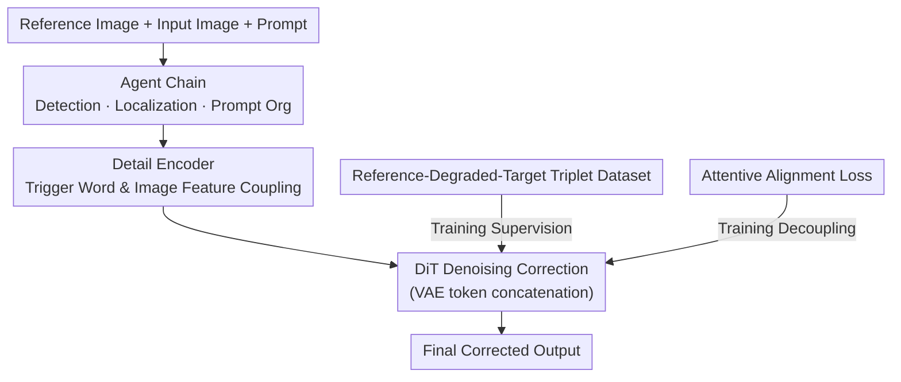

# The Consistency Critic: Correcting Inconsistencies in Generated Images via Reference-Guided Attentive Alignment

**Conference**: CVPR 2026  
**Paper**: [CVF Open Access](https://openaccess.thecvf.com/content/CVPR2026/html/Ouyang_The_Consistency_Critic_Correcting_Inconsistencies_in_Generated_Images_via_Reference-Guided_CVPR_2026_paper.html)  
**Code**: https://ouyangziheng.github.io/ImageCritic-Page/  
**Area**: Image Generation / Diffusion Models  
**Keywords**: Reference-guided editing, consistency correction, attentive alignment, detail encoder, Agent  

## TL;DR
ImageCritic formulates "fixing detail inconsistencies in customized generated images" as a reference-guided post-editing task. Specifically, it constructs 10k reference-degraded-target triplets using VLM screening and Flux-Fill active degradation. By introducing an attentive alignment loss and a detail encoder on Flux Kontext, the model precisely locates and aligns fine-grained details like text and logos. An Agent chain is further utilized to achieve automated multi-turn correction.

## Background & Motivation
**Background**: Reference-guided generation (virtual try-on, subject customization, image editing) has evolved from UNet to DiT, effectively maintaining overall subject consistency. This is currently one of the most active research directions.

**Limitations of Prior Work**: While global subjects can be aligned, existing models often fail on **fine-grained details**—such as incorrect text rendering, misplaced logos, and local blurring—due to distortions introduced by VAE encoding/decoding and the loss of shallow information in decoder-only structures. SOTA customization models like GPT-4o, Nano-Banana, Qwen-Image, and UNO often show inconsistencies in text/logo areas when zoomed in.

**Key Challenge**: Two naive approaches both prove ineffective. 1. Using reference-guided super-resolution (e.g., ReFIR) to fix blurred regions—consistency remains uncorrected and local areas may even worsen. 2. Using multi-image editing models (e.g., Qwen-Image) to follow text instructions for local repairs—the models cannot accurately locate the specific details needing modification. The authors attribute these failures to two points: **a lack of high-quality data focused on fine-grained details** (Subjects200K, UNO-1M, etc., focus only on global consistency) and **the model's inability to attend to, locate, and align fine-grained regions** for precise correction.

**Goal**: Given a reference image, correct the fine-grained consistency (especially text and logos) of a generated image without destroying the environment, lighting, or spatial relationships.

**Key Insight**: By visualizing the attention maps of the reference and input branches in noisy regions, the authors found them to be **strongly coupled**. Reference tokens and input tokens provide conflicting cues during local generation, causing the model to either ignore or miscorrect the details. Since the problem stems from attention entanglement, explicit supervision can be used to decouple them.

**Core Idea**: Treat consistency correction as a "Critic" post-editing task. Train a correction model capable of precise localization and alignment using triplet data, an attentive alignment loss, and a detail encoder. Use an Agent chain to automate the detection, localization, retrieval, and repair pipeline.

## Method

### Overall Architecture
ImageCritic uses Flux.1-Kontext-dev as its backbone. The pipeline distinguishes between "training" and "inference" but shares the same critic model. The input consists of a customized generated image to be repaired (input) and a reference image (reference); the goal is to correct inconsistent details in the input according to the reference. The flow is as follows: the reference and input images, along with the prompt, pass through a **Detail Encoder** to obtain text tokens. These tokens are concatenated with VAE-encoded image tokens and sent to the DiT for denoising. During training, an **Attentive Alignment Loss** is added to decouple and align attention between conditional inputs and noisy targets. During inference, an **Agent Chain** automatically identifies inconsistencies, locates patches, organizes prompts, and hands them to the critic model for repair. All training and inference use a unified prompt template: "Use the object in IMG1 as a reference to be corrected, replace, or enhance the object in IMG2.", where IMG1/IMG2 are trigger words for the reference and input images.

The "reference-degraded-target" triplet dataset is constructed from scratch and serves as the primary contribution.

### Key Designs

**1. Reference-Degraded-Target Triplets: Positive Samples via VLM Screening and Negative Samples via Flux-Fill**  
To address the lack of detail-focused data, the authors split the problem: obtaining consistent reference-target pairs and creating degraded images that reflect real model flaws. First, diverse scenes are generated using SOTA models (Flux Kontext, GPT-4o, etc.). Qwen-VL filters these for quality. Qwen and Grounding SAM define masks, which are then re-checked by Qwen to ensure high-quality reference-target pairs. Negative samples are created via **Flux-Fill active degradation**: random mask subsets are fed to Flux-Fill to inpaint or tamper with text/logos. Qwen discards unrealistic degradations. This results in **10k high-quality triplets** that accurately simulate common rendering errors and misalignments.

**2. Attentive Alignment Loss (AAL): Decoupling via Region Masks**  
Visualization revealed that reference and input branches share **strong coupling** in noisy regions, leading to conflicting cues. The goal is for input tokens to handle object-level details while reference tokens handle global elements like background and lighting. A binary object mask $B(p)=1$ (background) / $0$ (subject) is defined, and an MSE alignment term is added to the attention maps:

$$L_G = \frac{1}{n_l}\sum_{j=0}^{n_l-1}\left\| B\odot N(M_G^j)\right\|_2^2,\quad L_R = \frac{1}{n_l}\sum_{j=0}^{n_l-1}\left\| \bar{B}\odot N(M_R^j)\right\|_2^2$$

where $M = Q_{c_i}K_{tgt}^\top/\sqrt{d}$ ($i\in\{R,I\}$ for reference/input), $N(\cdot)$ is min-max normalization, and $\bar B$ is the complement of $B$. The total objective is $L = L_{diff} + L_R + L_G$. $L_G$ forces reference patches to ignore foreground objects, while $L_R$ prevents the input from over-influencing regions to be repaired. **AAL is only applied to double stream blocks** where attention is most concentrated.

**3. Detail Encoder (DE): Coupling Trigger Tokens with Image Features**  
T5 produces identical latent states for the same trigger words (IMG1/IMG2), causing ambiguity when the model needs to distinguish between two images. To fix this, the Detail Encoder couples trigger latents $P_R, P_I \in \mathbb{R}^{1 \times d_t}$ with CLIP flattened image features $C_i \in \mathbb{R}^{1 \times d_c}$ to form $P'_i = [P_i; C_i]$. A two-layer MLP projects this back to the original dimension $\tilde P_i$. This explicitly binds textual triggers to visual content, allowing the model to correctly distinguish between the reference and the input.

**4. Agent Chain: Automated Multi-turn Workflow**  
To utilize high-resolution reference patches and make interaction intuitive, a Qwen-Agent acts as a coordinator for specialized agents that evaluate consistency, identify regions, retrieve patches, and summarize prompts for the critic model. It supports both fully automated "one-click" repair and interactive adjustments (e.g., regenerating specific product text).

## Key Experimental Results

The base is Flux.1-Kontext-dev, LoRA rank=128, lr=1e-4, trained for 20,000 steps. Evaluation is performed on DreamBench++ and **CriticBench** (200 complex product images + 100 apparel/accessories) using CLIP-I, DINO, and DreamSim.

### Main Results

Correction performance on CriticBench for various models (Before ➟ After):

| Model Corrected | CLIP-I ↑ | DINO ↑ | DreamSim ↓ |
| :--- | :--- | :--- | :--- |
| Sora | 78.7 ➟ 79.6 (+0.9) | 68.4 ➟ 69.2 (+0.8) | 29.1 ➟ 28.7 (-0.4) |
| Nano-Banana | 79.2 ➟ 79.8 (+0.6) | 66.5 ➟ 66.9 (+0.4) | 32.0 ➟ 31.8 (-0.2) |
| XVerse | 76.5 ➟ 79.9 (+3.4) | 68.8 ➟ 71.9 (+3.1) | 34.3 ➟ 31.4 (-2.9) |
| DreamO | 77.8 ➟ 78.1 (+0.3) | 67.7 ➟ 68.2 (+0.5) | 29.6 ➟ 29.2 (-0.4) |
| MOSAIC | 74.6 ➟ 77.1 (+2.5) | 62.6 ➟ 65.0 (+2.4) | 35.2 ➟ 31.4 (-3.8) |
| OmniGen2 | 78.8 ➟ 79.3 (+0.5) | 70.0 ➟ 70.8 (+0.8) | 27.7 ➟ 27.0 (-0.7) |
| UNO | 77.6 ➟ 78.9 (+1.3) | 68.4 ➟ 69.3 (+0.9) | 33.6 ➟ 32.1 (-1.5) |
| Qwen-Image | 77.9 ➟ 78.2 (+0.3) | 69.2 ➟ 69.4 (+0.2) | 30.3 ➟ 30.1 (-0.2) |

**Key Trend**: Models with initially poor consistency (XVerse, MOSAIC) show the largest gains, while stronger models (Nano-Banana, Qwen-Image) show smaller incremental gains.

### Ablation Study

Ablation of AAL and DE on CriticBench (average gain):

| AAL | DE | CLIP-I | DINO | DreamSim |
| :--- | :--- | :--- | :--- | :--- |
| ✗ | ✗ | +0.3 | +0.4 | -0.2 |
| ✗ | ✓ | +0.7 | +0.7 | -0.9 |
| ✓ | ✗ | +0.7 | +0.9 | -0.9 |
| ✓ | ✓ | **+1.3** | **+1.2** | **-1.7** |

Agent Chain localization vs. Human Annotation:

| Metric | Mean IoU (%) | mAP@50 (%) |
| :--- | :--- | :--- |
| Agent Chain vs. Human | 75.3 | 88.4 |

### Key Findings
- **Data efficacy**: LoRA fine-tuning on triplets alone (AAL/DE off) yield positive gains, validating the dataset's importance.
- **Synergy**: AAL and DE solve different problems; combining them leads to a significant jump in performance (DreamSim improvement from -0.9 to -1.7).
- **Attention decoupling**: Visualization proves AAL concentrates reference/input attention on background/subject areas respectively.
- **Localization accuracy**: mAP@50 reached 88.4%, making the automated localization reliable for real-world use.

## Highlights & Insights
- **Post-editing positioning**: Treating consistency as a post-editing task allows the model to act as a "plug-and-play" critic for any open/closed source generator (Sora, Nano-Banana, etc.).
- **Active degradation**: Replicating "realistic errors" with Flux-Fill is a superior data strategy compared to random noise, ensuring supervision aligns with actual deployment scenarios.
- **Design via diagnosis**: The design of AAL—motivated by the coupling seen in double stream layers—provides a framework for targeted loss design in multi-condition DiTs.
- **Resolving trigger ambiguity**: Using CLIP features to resolve T5's fixed trigger latents is a practical trick applicable to any "multi-reference + trigger" framework.

## Limitations & Future Work
- Small absolute gains: For top-tier models, CLIP-I/DINO gains are marginal (+0.2~+0.6).
- Backbone dependency: Highly dependent on Flux Kontext; the observation that AAL works best in double-stream layers may not generalize to other DiT architectures without re-diagnosis.
- Scenario coverage: Focused heavily on products/text/logos; robustness on highly non-rigid objects (e.g., complex human poses) requires more quantitative evaluation.
- Pipeline cost: The inference cost and latent failure modes of the multi-agent chain are not fully quantified.

## Related Work & Insights
- **vs. ReFIR (Ref-SuperRes)**: ReFIR sharpens blurry areas but fails to fix semantic inconsistencies. ImageCritic performs semantic-level correction for text/logos.
- **vs. Qwen-Image**: Qwen-Image relies on text instructions for editing, which leads to poor localization. ImageCritic uses Agent chains for automatic localization and AAL for alignment.
- **vs. Subject Customization (DreamO, XVerse, MOSAIC)**: These focus on global consistency during the generation phase. ImageCritic acts as a subsequent refiner, significantly boosting their outputs (largest gains seen on XVerse and MOSAIC).

## Rating
- Novelty: ⭐⭐⭐⭐ Reframing consistency as post-editing and deriving AAL from attention visualization is solid and novel.
- Experimental Thoroughness: ⭐⭐⭐⭐ Covers 8 models, 2 benchmarks, and agent evaluations, though gains for top models are small.
- Writing Quality: ⭐⭐⭐⭐ Clear "Diagnosis-to-Solution" narrative.
- Value: ⭐⭐⭐⭐ High engineering practicality; CriticBench is a valuable resource for the community.

<!-- RELATED:START -->

## Related Papers

- [\[CVPR 2026\] PG-VTON: Single-Pass Training-Free Virtual Try-On via Patch-Guided Reference Alignment](pg-vton_single-pass_training-free_virtual_try-on_via_patch-guided_reference_alig.md)
- [\[CVPR 2026\] OrionEdit: Bridging Reference and Source Images for Generalized Cross-Image Editing](orionedit_bridging_reference_and_source_images_for_generalized_cross-image_editi.md)
- [\[CVPR 2026\] HiFi-Inpaint: Towards High-Fidelity Reference-Based Inpainting for Generating Detail-Preserving Human-Product Images](hifi-inpaint_towards_high-fidelity_reference-based_inpainting_for_generating_det.md)
- [\[AAAI 2026\] Beautiful Images, Toxic Words: Understanding and Addressing Offensive Text in Generated Images](../../AAAI2026/image_generation/beautiful_images_toxic_words_understanding_and_addressing_offensive_text_in_gene.md)
- [\[NeurIPS 2025\] Detecting Generated Images by Fitting Natural Image Distributions](../../NeurIPS2025/image_generation/detecting_generated_images_by_fitting_natural_image_distributions.md)

<!-- RELATED:END -->
