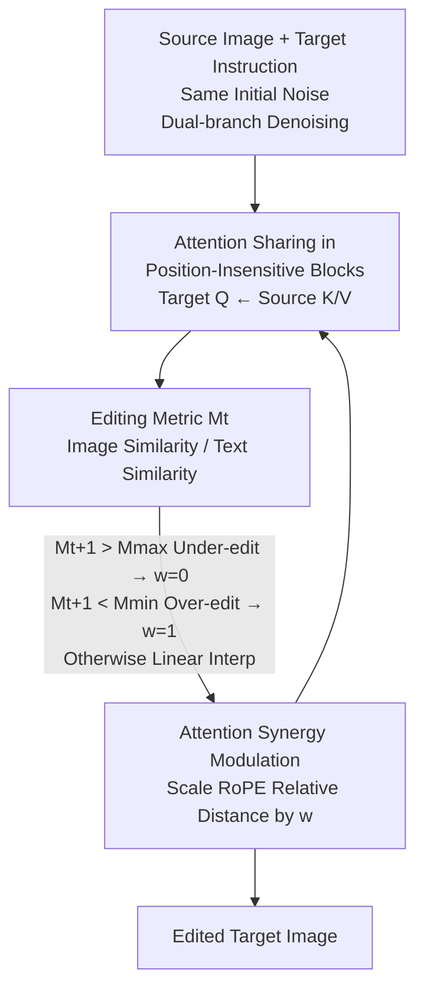

# The Devil is in Attention Sharing: Improving Complex Non-rigid Image Editing Faithfulness via Attention Synergy

**Conference**: CVPR 2026  
**Paper**: [CVF Open Access](https://openaccess.thecvf.com/content/CVPR2026/html/Chen_The_Devil_is_in_Attention_Sharing_Improving_Complex_Non-rigid_Image_CVPR_2026_paper.html)  
**Code**: [Project Page](https://synps26.github.io/)  
**Area**: Diffusion Models / Image Editing  
**Keywords**: Non-rigid Image Editing, Attention Sharing, Positional Encoding, RoPE, Training-free Editing  

## TL;DR
Addressing the "attention collapse" problem in training-free non-rigid image editing, this paper proposes SynPS: it first quantifies the editing degree per step via the ratio of image similarity to text similarity, and then **dynamically scales the relative distance of RoPE in attention sharing**. This adaptively balances "preserving source structure" and "following target semantics," achieving a new SOTA in MLLM scores on PIE-Bench and self-built benchmarks.

## Background & Motivation
**Background**: Training-free image editing based on RoPE-based MM-DiTs like FLUX has become practical—requiring no fine-tuning or datasets, only a source image and a target instruction. To ensure the target image captures the correct semantics without destroying the source appearance, the mainstream approach is **attention sharing**: when generating the target image, the target tokens act as queries to retrieve visual content from the source keys/values, thus "transferring" the source appearance to the target image.

**Limitations of Prior Work**: Whether or not to include positional encoding in the query during sharing determines success, yet both paths fail. Approaches like FreeFlux that **retain RoPE** cause queries to attend only to spatially adjacent tokens—e.g., when editing a horse's eye, it might attend to the arm of a woman nearby, resulting in an **under-edited replica (high fidelity but no edit)**. Approaches like CharaConsist that **remove or remap positions** rely purely on semantic features for queries, leading to the loss of structural information and **over-editing (failure to preserve source appearance)**, especially when the layouts of the source and pre-generated target images are inconsistent.

**Key Challenge**: The authors unify these failures as **attention collapse**—attention either collapses toward positional encoding (localized spatial attention) or toward semantics (prompt-dominated). Once this occurs during denoising, recovery is difficult. Positional signals (from the source, governing fidelity) and semantic signals (from the target prompt, governing editing) are inherently competing forces; fixedly using or discarding them entirely is suboptimal.

**Key Insight**: The authors found that the dependence on "position vs. semantics" varies across different editing instructions and even different denoising steps. Thus, attention sharing should be **prompt-adaptive and progressively adjustable**, rather than using a fixed strategy throughout. The key lies in **when and how** to introduce positional encoding.

**Core Idea**: Use a quantifiable "editing metric" to judge in real-time whether the current state is over- or under-editing, and then use a weight $w \in [0,1]$ to **continuously scale the relative displacement of RoPE**. This smoothly slides between "fully position-aware" and "fully position-independent," achieving a Synergy of Positional embedding and Semantics (SynPS).

## Method

### Overall Architecture
SynPS is a **training-free, inference-time** modification to attention sharing, using FLUX.1-dev as the backbone. The editing process involves dual-branch parallel denoising: the source branch uses the source prompt, and the target branch uses the target prompt, both **starting from the same initial noise** (to eliminate inversion error). Attention sharing is performed within "position-insensitive blocks"—target queries attend to the concatenated sequence of "target text keys + source image keys" to inject the source appearance.

SynPS adds a **closed-loop control** to this sharing mechanism: at each denoising step, it calculates cosine similarities for text tokens and image tokens from the attention outputs of both branches. Their ratio defines an **editing metric $M_t$**. In the next step, $M_{t+1}$ is passed through a piecewise linear function to determine a weight $w$. This $w$ directly **scales the position IDs used during RoPE injection**, which is equivalent to proportionally shortening or stretching the relative distance between tokens. If $M$ is high (under-editing), $w$ approaches 0; if $M$ is low (over-editing), $w$ approaches 1. Intermediate values use linear interpolation.

### Key Designs

**1. Editing Metric $M_t$: Real-time determination of over- vs. under-editing via a ratio**

The pain point is that previous methods used fixed strategies with no feedback on whether the edit was sufficient. SynPS calculates cosine similarities for **text tokens** and **image tokens** between branches at each step $t$ and block $l$: text similarity $S^l_{txt,t}=\cos(\text{Attn}^{l,src}_{txt,t}, \text{Attn}^{l,tgt}_{txt,t})$ measures semantic change demand, and image similarity $S^l_{img,t}=\cos(\text{Attn}^{l,src}_{img,t}, \text{Attn}^{l,tgt}_{img,t})$ measures visual resemblance to the source. The editing metric is:

$$M_t = \frac{1}{L}\sum_{l=1}^{L}\frac{S^l_{img,t}}{S^l_{txt,t}}.$$

High $M_t$ implies **under-editing**; low $M_t$ implies **over-editing**. The ideal state is $M_t \approx 1$.

**2. Attention Synergy Modulation: Scaling RoPE relative distance to slide between position-aware and position-independent**

SynPS observes that RoPE encodes **relative displacement**. Query $[Q]_{i,j}$ and key $[K]_{i',j'}$ attention scores depend on the displacement $(i'-i, j'-j)$:

$$\langle\text{RoPE}([Q]_{i,j},i,j), \text{RoPE}([K]_{i',j'},i',j')\rangle = [Q]_{i,j}^\top R_{i'-i, j'-j}[K]_{i',j'}.$$

By introducing a scaling factor $w \in [0,1]$ to **multiply the position IDs**, the effective relative distance is scaled to $w \cdot (i'-i, j'-j)$. $w=1$ maximizes positional preservation; $w=0$ flattens it for semantic flexibility.

**3. Piecewise Linear Adaptive Weight: Mapping $M_{t+1}$ to positional constraint strength**

SynPS sets $w$ for the current step based on the **previous** step's $M_{t+1}$:

$$w = \begin{cases} 0, & M_{t+1} > M_{max}\\[2pt] 1, & M_{t+1} < M_{min}\\[2pt] \frac{M_{max}-M_{t+1}}{M_{max}-M_{min}}, & \text{otherwise}. \end{cases}$$

This keeps $M_t$ stable near 1. In experiments, $M_{max}=1$ and $M_{min}=0.9$.

### Loss & Training
This method is **completely training-free**. It uses FLUX.1-dev with 50 sampling steps and a guidance scale of 3.5. Source and target branches share initial noise. Thresholds are set to $M_{min}=0.9$ and $M_{max}=1.0$.

## Key Experimental Results

### Main Results
Evaluated on PIE-Bench ChangePose and a self-built Non-Rigid Editing Benchmark (200 pairs generated by GPT-5).

| Method | PIE GPT-4o↑ | PIE GPT-5↑ | PIE Gemini↑ | PIE CLIPtxt↑ | Bench GPT-5↑ | Bench Gemini↑ | Bench CLIPtxt↑ |
|------|------|------|------|------|------|------|------|
| RF-Solver-Edit | 6.03 | 4.33 | 2.98 | 0.2664 | 5.59 | 4.24 | 0.2320 |
| FlowEdit | 4.82 | 2.81 | 1.32 | 0.2590 | 3.11 | 2.71 | 0.2260 |
| FreeFlux (Base) | 5.60 | 4.72 | 3.24 | 0.2614 | 5.97 | 4.23 | 0.2291 |
| CharaConsist | 6.32 | 4.84 | 3.49 | 0.2649 | 5.53 | 3.73 | 0.2329 |
| **SynPS (Ours)** | **6.99** | **5.82** | **4.17** | **0.2683** | **6.66** | **5.43** | **0.2344** |

### Ablation Study
(Gemini-2.5-Pro score on self-built benchmark):

| Config | Setting | Gemini↑ | Note |
|------|------|------|------|
| Fix Seed FLUX Default | – | 2.35 | No sharing, editing diverges |
| + Attention Sharing | w/ RoPE ($w=1$) | 4.23 | Sharing with position, tends to copy source |
| + Attention Sharing | w/o RoPE ($w=0$) | 4.79 | No position, follows semantics better |
| **+ SynPS Adaptive $w$** | $M_{min}=0.9,M_{max}=1.0$ | **5.43** | Best performance |

### Key Findings
- **Fixed strategies are insufficient**: Both pure RoPE ($w=1$) and zero RoPE ($w=0$) are significantly weaker than adaptive SynPS.
- **Adaptive weight drives the gain**: Switching from fixed to $M$-controlled $w$ improved the Gemini score from 4.79 to 5.43.
- **Metric curves validate the mechanism**: Statistical analysis shows SynPS tracks $M_t=1$ closely, while baselines drift.

## Highlights & Insights
- **Turning positional encoding into a knob**: Scaling position IDs to create a continuous spectrum between "position-aware" and "position-independent" is an elegant, training-free parameterization for RoPE-based DiTs.
- **Closed-loop control**: Mapping $M_t$ to $w$ transforms abstract "editing quality" into a monitorable feedback signal that directly drives positional constraint strength.
- **Diagnosis precedes design**: The method effectively addresses "attention collapse" confirmed through attention map visualization.

## Limitations & Future Work
- **Threshold dependency**: $M_{min}/M_{max}$ require empirical tuning and the method relies on pre-calibrated "position-insensitive" blocks.
- **Architecture binding**: Currently optimized for RoPE-based MM-DiTs; applicability to architectures with absolute positional encoding remains to be explored.
- **Feedback delay**: Using $M_{t+1}$ from the previous step to set current $w$ introduces a one-step lag.

## Related Work & Insights
- **vs. FreeFlux**: FreeFlux **fixes RoPE**, causing query collapse to spatial neighbors (under-editing); SynPS dynamically modulates RoPE intensity for a 28.6% gain in Gemini score.
- **vs. CharaConsist**: CharaConsist remaps positions based on semantic correspondence, which fails during layout misalignment; SynPS uses adaptive control to avoid such sensitivities.
- **vs. MasaCtrl**: While MasaCtrl focuses on structure-preserving edits, SynPS targets complex **non-rigid edits** by explicitly mitigating attention collapse.

## Rating
- Novelty: ⭐⭐⭐⭐ Elegant diagnostic-driven solution for RoPE-based editing.
- Experimental Thoroughness: ⭐⭐⭐⭐ Comprehensive evaluation across multiple benchmarks and MLLMs.
- Writing Quality: ⭐⭐⭐⭐⭐ Clear logical progression from observation to mechanism.
- Value: ⭐⭐⭐⭐ Training-free, plug-and-play, and achieves SOTA for non-rigid DiT editing.

<!-- RELATED:START -->

## Related Papers

- [\[CVPR 2026\] Gated Condition Injection without Multimodal Attention: Towards Controllable Linear-Attention Transformers](gated_condition_injection_without_multimodal_attention_towards_controllable_line.md)
- [\[CVPR 2026\] NEAF: Natural Image Editing with Attention Fusion for Generalizable Test-time Optimization in Text-Guided Image Editing](neaf_natural_image_editing_with_attention_fusion_for_generalizable_test-time_opt.md)
- [\[CVPR 2026\] Towards Robust Sequential Decomposition for Complex Image Editing](towards_robust_sequential_decomposition_for_complex_image_editing.md)
- [\[CVPR 2026\] FlowDC: Flow-Based Decoupling-Decay for Complex Image Editing](flowdc_flow-based_decoupling-decay_for_complex_image_editing.md)
- [\[CVPR 2026\] CompBench: Benchmarking Complex Instruction-guided Image Editing](compbench_benchmarking_complex_instruction-guided_image_editing.md)

<!-- RELATED:END -->
## Related Papers

- [\[CVPR 2026\] Gated Condition Injection without Multimodal Attention: Towards Controllable Linear-Attention Transformers](gated_condition_injection_without_multimodal_attention_towards_controllable_line.md)
- [\[CVPR 2026\] Towards Robust Sequential Decomposition for Complex Image Editing](towards_robust_sequential_decomposition_for_complex_image_editing.md)
- [\[CVPR 2026\] FlowDC: Flow-Based Decoupling-Decay for Complex Image Editing](flowdc_flow-based_decoupling-decay_for_complex_image_editing.md)
- [\[CVPR 2026\] CompBench: Benchmarking Complex Instruction-guided Image Editing](compbench_benchmarking_complex_instruction-guided_image_editing.md)
- [\[CVPR 2026\] Anchoring and Rescaling Attention for Semantically Coherent Inbetweening](anchoring_and_rescaling_attention_for_semantically_coherent_inbetweening.md)

<!-- RELATED:END -->
