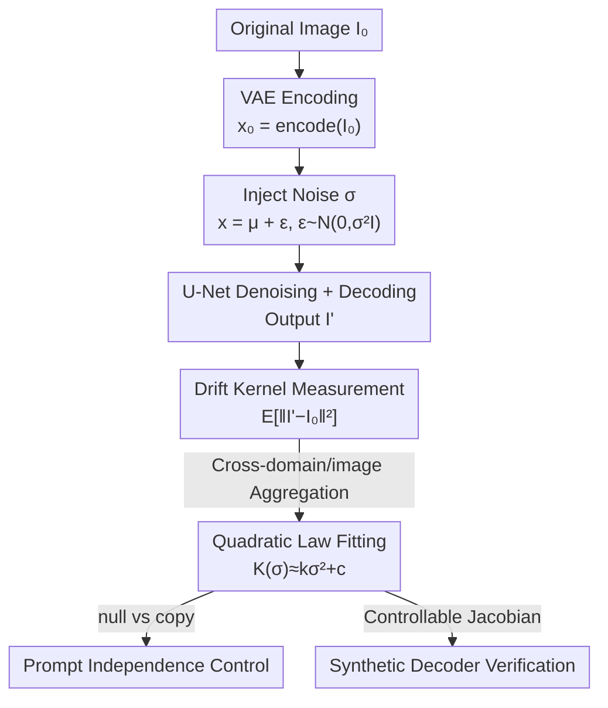

# The Drift Kernel: Why Diffusion Models Change Even When Told Not To

**Conference**: CVPR 2026  
**Paper**: [CVF Open Access](https://openaccess.thecvf.com/content/CVPR2026/html/Ram_The_Drift_Kernel_Why_Diffusion_Models_Change_Even_When_Told_CVPR_2026_paper.html)  
**Code**: Yes (NoOp-Bench, authors commit to release with the paper)  
**Area**: Diffusion Models  
**Keywords**: No-Op Drift, Drift Kernel, Identity Preservation, Decoder Jacobian, Diffusion Stability

## TL;DR
When a diffusion model is instructed to "change nothing," it still subtly modifies the input. This paper quantifies this "no-op drift" as a **Drift Kernel** $K_M(\sigma)\approx k_M\sigma^2+c_M$, which grows quadratically with noise strength $\sigma$. Based on the first-order Taylor expansion of the decoder Jacobian and verified on 120,000 image pairs, the study proves that drift is a structural property of the decoder rather than an issue with prompt phrasing.

## Background & Motivation
**Background**: Diffusion models (SD1.5/SD2.1/SDXL/InstructPix2Pix) are widely used for image editing. Many editing/inversion methods (Prompt-to-Prompt, Null-text inversion, SDEdit) implicitly assume that given a "null instruction" or precise inversion, unedited regions will maintain identity.

**Limitations of Prior Work**: The authors find this assumption to be incorrect—even with explicit prompts like "make no change / do nothing / identity," the model output exhibits measurable perceptual bias relative to the original image. In other words, "static is never truly static." Previous works focused on generation quality or identity-preserving editing; **none have systematically quantified this "no-op identity drift,"** nor explained its origin.

**Key Challenge**: Is drift caused by ambiguous prompt semantics (fixable via prompt engineering) or is it a structural product of the diffusion denoising process itself (unavoidable regardless of the prompt)? These two explanations lead to entirely different mitigation strategies.

**Goal**: (1) Define a measurable, model-agnostic scalar for "drift"; (2) Identify its governing laws; (3) Determine if it is structural or prompt-induced; (4) Provide a reproducible benchmark.

**Key Insight**: Inescapable variance in the reverse diffusion process is amplified by the decoder $D$ and projected into pixel space. Since variance injection is Gaussian and the decoder is approximately differentiable, a first-order Taylor expansion can predict how drift scales with noise strength—a hypothesis derivable from first principles and falsifiable through experiments.

**Core Idea**: Abstract "no-op drift" as a function of noise strength via a **Drift Kernel** $K_M(\sigma)=\mathbb{E}[\lVert I'-I_0\rVert_2^2\mid\sigma]$. For variance-driven models, this follows a quadratic $\sigma^2$ law where the coefficient $k_M=\mathrm{Tr}(J_DJ_D^\top)$ is determined solely by the decoder Jacobian, attributing the persistence of drift to decoder geometry rather than conditioning signals.

## Method
This paper proposes an **analytical framework + measurement protocol**: defining drift as a kernel function, deriving the quadratic $\sigma^2$ law from the first-order expansion of the decoder, verifying it on 120,000 image pairs across four models and four domains, and using control experiments (null vs. copy prompts) and synthetic decoders to prove the mechanism.

### Overall Architecture
Given an original image $I_0$, an image-to-image diffusion run is performed at a fixed noise strength $\sigma$ using a "no-op" prompt to obtain $I'$. Drift is defined as the squared pixel deviation $\lVert I'-I_0\rVert_2^2$, with the kernel $K_M(\sigma)$ being the expectation over random denoising trajectories. The pipeline is: Encoding image to latent space $x_0$ via VAE → Injecting noise of strength $\sigma$ → Denoising via U-Net → Decoding to pixel space $I'$ → Calculating drift metric → Aggregating across samples to fit the quadratic coefficients $k_M, c_M$. Theoretically, the latent space variance injected cannot be fully offset by the reverse process; the residual variance amplified by the decoder Jacobian $J_D$ becomes a pixel deviation scaling with $\sigma^2$.

### Key Designs

**1. Drift Kernel Definition and $\sigma^2$ Quadratic Law Derivation**

To address the lack of quantification for the "drift" phenomenon, the authors define it as $K_M(\sigma)=\mathbb{E}[\lVert I'-I_0\rVert_2^2\mid\sigma]$. The core theoretical result (Proposition 1) states that for a diffusion model with decoder $D$, the expected drift satisfies:

$$K_M(\sigma)=\mathrm{Tr}(J_DJ_D^\top)\,\sigma^2+c.$$

The derivation is straightforward: the forward process injects Gaussian noise $q(x_t\mid x_0)=\mathcal{N}(\sqrt{\bar\alpha_t}x_0,(1-\bar\alpha_t)I)$, which the reverse process cannot fully eliminate. Let the residual be $x_t=\mu+\epsilon,\ \epsilon\sim\mathcal{N}(0,\sigma^2 I)$. A first-order Taylor expansion of the decoder at the mean $\mu$ yields $I'=D(\mu+\epsilon)\approx D(\mu)+J_D(\mu)\epsilon$. Taking the expectation over $\epsilon$ gives $\mathbb{E}[\lVert J_D\epsilon\rVert_2^2]=\mathrm{Tr}(J_DJ_D^\top)\sigma^2$. The **drift-sensitivity coefficient** $k_M=\mathrm{Tr}(J_DJ_D^\top)$ measures the total squared sensitivity of the decoder to latent perturbations. Since $J_D$ is an architectural property independent of the prompt, this explains why phrasing cannot eliminate drift.

**2. NoOp-Bench Metric Protocol**

To move beyond anecdotal visual comparisons, the authors constructed a protocol covering four architectures: SD1.5, SD2.1, SDXL, and InstructPix2Pix. Parameters were fixed (15-step DDIM, guidance=5.0, strength=0.3) using three no-op prompts ("make no change" / "identity" / "do nothing"). The benchmark includes 120,000 pairs (10k images × 3 prompts × 4 models). Strength scans for $\sigma\in\{0.1, 0.2, 0.3, 0.4\}$ were performed on a 100-image subset. While individual model fitting $R^2$ was low (0.10–0.26) due to per-sample measurement noise, cross-domain aggregation clearly revealed the $\sigma^2$ law with an aggregated $R^2=0.97$.

**3. Prompt Independence Control (null vs copy)**

To test if detailed instructions could eliminate drift, "copy prompts" (explicit commands to maintain pixels) were used as an upper bound for user intent clarity. If drift were semantic, strong prompts should suppress it. Results showed that for variance-driven models, $k_M$ differed by < 17% between null and copy prompts (only 0.4% for SD1.5). This confirms that instructions do not mitigate drift, as variance amplification occurs in the decoder, independent of the conditioning signal's effect on the mean.

**4. Synthetic Decoder Verification and Two Regimes**

To ensure the quadratic trend wasn't a dataset artifact, the authors built decoders with controllable Jacobians. A linear decoder $D(x)=Ax$ perfectly replicated the quadratic $K(\sigma)=\mathrm{Tr}(AA^\top)\sigma^2$ ($R^2=0.9999$). A curved decoder $D(x)=Ax+\gamma\tanh(Bx)$ also maintained the trend ($R^2>0.99$). Conversely, an "editing-biased" decoder flattened the relationship ($R^2<0.1$), mimicking the behavior of InstructPix2Pix. This characterizes two regimes: SD models are "variance-driven" ($\sigma^2$ law), while InstructPix2Pix is "editing-driven" (drift is mean-flat but high-variance due to cross-attention dominance), where drift increases by only 8% compared to SD1.5's 207% across strengths.

## Key Experimental Results

### Main Results
Baseline drift at strength=0.3 across 120,000 comparisons (mean ± std):

| Model | MSE ↓ | MAE | PSNR ↑ | SSIM ↑ | Regime |
|-------|-------|-----|--------|--------|--------|
| SD1.5 | 0.0059 ±0.0061 | 0.0452 | 24.52 | 0.6976 | Variance-driven |
| SD2.1 | 0.0069 ±0.0064 | 0.0511 | 23.27 | 0.6654 | Variance-driven |
| SDXL | 0.0085 ±0.0072 | 0.0579 | 22.05 | 0.6304 | Variance-driven |
| InstructPix2Pix | 0.0052 ±0.0071 | 0.0426 | 25.89 | 0.7802 | Editing-driven |

Key Observation: **No model perfectly preserves identity under no-op instructions.** SDXL shows the highest mean drift (0.0085), suggesting larger models may amplify variance more.

### Quadratic Law and Prompt Independence
Fitting $K_M(\sigma)\approx k_M\sigma^2+c_M$ for null vs. copy prompts:

| Model | Prompt | $k_M$ | $c_M$ | $R^2$ | Null↔Copy Diff |
|-------|--------|-------|-------|-------|----------------|
| SD15 | null / copy | 0.0345 / 0.0346 | 0.0028 | 0.9605 / 0.9595 | 0.4% |
| SD21 | null / copy | 0.0685 / 0.0801 | 0.0016 / 0.0013 | 0.9790 / 0.9761 | 17.0% |
| SDXL | null / copy | 0.0710 / 0.0770 | 0.0024 | 0.9638 / 0.9669 | 8.5% |
| InstructPix2Pix | null / copy | — | — | 0.883 / 0.059 | Flat (Editing) |

Aggregated $R^2=0.97$ confirms the $\sigma^2$ scaling. Coefficients for null/copy prompts differ by < 17%, proving drift is independent of phrasing.

### Key Findings
- **Quadratic Drift Growth**: SD1.5 MSE rises from 0.0027 at $\sigma=0.1$ to 0.0083 at $\sigma=0.4$ (~3.1×). High noise levels cause disproportionately larger drift.
- **Domain Dependency**: Drift order is consistently aerial (0.0022) < faces (0.0029) < natural scenes (0.0090) < artwork (0.0124).
- ⚠️ **Pixel Metric Blind Spot**: Aerial images have the lowest MSE (0.0022) but exhibit the worst visual structural collapse. Low-texture regions bias MSE downward, highlighting limits of pixel-wise metrics.
- **Two Coexisting Mechanisms**: Variance-driven models are predictable ($\sigma^2$ law), while editing-driven models are unpredictable (strength-independent, high variance). $k_M$ serves as a design metric for model stability.

## Highlights & Insights
- **Formalizing an ignored phenomenon**: The authors term this the "Law of Generative Inertia" and anchor it to the decoder Jacobian trace—a significant leap from empirical observation to mechanistic explanation.
- **Theory-Experiment Closure**: Theory predicts variance amplification is independent of conditioning; experiments with copy prompts confirm that phrasing cannot stop drift. Theory attributes drift to the decoder; synthetic decoders replicate the regimes.
- **Diagnostic Utility**: The $k_M$ coefficient allows predicting identity drift before deployment, critical for high-stakes fields like medical imaging or forensics where even $\sigma=0.1$ might shift anatomical boundaries.

## Limitations & Future Work
- The study only covers four models at 512×512 resolution; resolution bias might affect drift magnitude. Performance under DDIM inversion remains uncharacterized.
- MSE/PSNR fail in low-texture domains (e.g., aerial), where low MSE masks structural collapse.
- ⚠️ Individual model fitting $R^2$ is low (0.10–0.26); the quadratic law is a statistical trend across populations rather than a reliable per-image predictor.
- Many proofs and metrics (LPIPS/CLIP) are relegated to the supplementary material, limiting immediate verification of all coefficients.

## Related Work & Insights
- **vs. Prompt-to-Prompt / Null-text inversion**: These methods assume null embeddings maintain identity. This paper proves drift persists even with perfect null instructions, challenging their underlying premise.
- **vs. Editing Methods (SDEdit / InstructPix2Pix)**: While others focus on "how to edit well," this work asks "how much it changes when not told to," identifying the unique "editing-driven" regime of instruction-tuned models.
- **vs. Identity Preservation (IP-FaceDiff, etc.)**: These propose preservation methods without quantifying baseline drift; this paper provides a **diagnostic abstraction** (kernel + coefficients) to measure their stability.

## Rating
- Novelty: ⭐⭐⭐⭐⭐ Formalizes "no-op drift" as a derivable kernel and Jacobian mechanism.
- Experimental Thoroughness: ⭐⭐⭐⭐ Extensive scale and controls, though some per-sample $R^2$ values are low.
- Writing Quality: ⭐⭐⭐⭐ Clear theory-to-experiment loop, though heavy reliance on supplementary material.
- Value: ⭐⭐⭐⭐ Provides diagnostic tools and benchmarks essential for identity-sensitive applications.

<!-- RELATED:START -->

## Related Papers

- [\[CVPR 2026\] When Pretty Isn't Useful: Investigating Why Modern Text-to-Image Models Fail as Reliable Training Data Generators](when_pretty_isnt_useful_investigating_why_modern_text-to-image_models_fail_as_re.md)
- [\[CVPR 2026\] When Anonymity Breaks: Identifying Models Behind Text-to-Image Leaderboards](when_anonymity_breaks_identifying_models_behind_text-to-image_leaderboards.md)
- [\[CVPR 2026\] When Local Rules Create Global Order: Self-Organized Representation Learning for Latent Diffusion Models](when_local_rules_create_global_order_self-organized_representation_learning_for_.md)
- [\[CVPR 2026\] RDF-MIG: A Robust Diffusion Framework for Masked Image Generation to Augment Semantic Segmentation and Change Detection](rdf-mig_a_robust_diffusion_framework_for_masked_image_generation_to_augment_sema.md)
- [\[CVPR 2026\] OpenDPR: Open-Vocabulary Change Detection via Vision-Centric Diffusion-Guided Prototype Retrieval for Remote Sensing Imagery](opendpr_open-vocabulary_change_detection_via_vision-centric_diffusion-guided_pro.md)

<!-- RELATED:END -->
