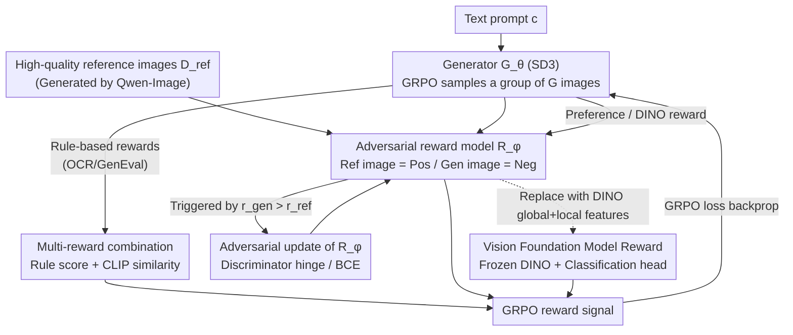

# The Image as Its Own Reward: Reinforcement Learning with Adversarial Reward for Image Generation

**Conference**: CVPR 2026  
**Paper**: [CVF Open Access](https://openaccess.thecvf.com/content/CVPR2026/html/Mao_The_Image_as_Its_Own_Reward_Reinforcement_Learning_with_Adversarial_CVPR_2026_paper.html)  
**Code**: https://github.com/showlab/Adv-GRPO  
**Area**: Image Generation / Diffusion Models / Reinforcement Learning Alignment  
**Keywords**: Text-to-Image, GRPO, Adversarial Reward, Reward Hacking, Vision Foundation Models

## TL;DR
To address the issue of reward hacking in scalar preference rewards for text-to-image reinforcement learning, this paper proposes Adv-GRPO. The framework treats the reward model as a discriminator and co-trains it adversarially with generated images, utilizing high-quality reference images as positive samples. Furthermore, it incorporates a frozen vision foundation model (DINO) as a dense reward. This significantly improves visual quality, aesthetics, and text-image alignment without sacrificing benchmark scores, achieving a human evaluation win rate of up to 85%+.

## Background & Motivation
**Background**: Online RL (especially GRPO introduced by DeepSeek-R1) has achieved great success in LLMs/MLLMs. Recently, it has been applied to text-to-image diffusion models—such as DanceGRPO and Flow-GRPO—which treat the denoising process as an MDP and guide the generator using scalar scores output by pre-trained preference reward models (e.g., PickScore, HPS, Aesthetic).

**Limitations of Prior Work**: These scalar reward models do not truly capture human perception and carry inherent biases (e.g., CLIP/PickScore-based rewards favor oversaturated colors, while OCR-based rewards overemphasize text). Generators exploit these biases to obtain higher scores without actual improvement, leading to **reward hacking**. As shown in Figure 2 of the paper, Flow-GRPO trained with PickScore yields worse image quality than the base model, while OCR rewards lead to a degradation in both aesthetics and quality.

**Key Challenge**: On one hand, there is a desire to fully optimize via RL; on the other hand, stronger optimization leads to higher susceptibility to hacking of the reward model. A common solution is adding KL divergence regularization to restrict parameter updates, but KL is a double-edged sword: a high coefficient limits optimization, while a low one fails to prevent hacking. This is essentially a compromise between "optimization strength" and "preventing hacking," which addresses the symptoms rather than the root cause.

**Goal**: To suppress reward hacking without relying on fragile KL regularization, to truly improve perceptual image quality, and to support both preference-based and rule-based rewards.

**Key Insight**: The authors observed a key phenomenon: many high-quality reference images actually receive low scores from existing reward models. This indicates that the distribution of the reward models themselves is biased. Therefore, instead of restricting the generator, it is better to **make the reward model dynamic**: treating reference images as supervisory signals of "what constitutes a good image" forces the reward model to continuously align with the true high-quality distribution.

**Core Idea**: Formulate the "reward model $\leftrightarrow$ generator" as an adversarial discriminator-generator pair (GAN-style minimax), using reference images as positive samples to update the reward model online. Going a step further, **the image itself is treated as the reward**—by using dense features extracted from a frozen vision foundation model (DINO) instead of a single scalar to provide more comprehensive and robust visual signals.

## Method

### Overall Architecture
Adv-GRPO extends standard GRPO into an **adversarially co-optimized generator and reward model system**. The generator $G_\theta$ (based on SD3) maximizes the reward using the GRPO loss as usual. Instead of being a frozen scorer, the reward model $R_\phi$ acts as a **discriminator**, co-trained adversarially with high-quality reference images as positive samples and generated images as negative samples, constantly calibrating the criteria for "good images" back to the real distribution. The proposed method proceeds along three main tracks: ① adversarial co-training for human preference rewards (PickScore/HPS) to suppress hacking; ② multi-reward combinations ("rule score + CLIP similarity") for rule-based rewards (OCR/GenEval, which are non-differentiable and cannot be trained adversarially) to stabilize image quality; ③ treating the vision foundation model DINO as a reward, utilizing global and local dense features instead of a single scalar for comprehensive visual quality enhancement.

### Key Designs

**1. Adversarial Reward: Treating the Reward Model as a Discriminator to "Pull" It Back to the High-Quality Distribution**

This directly addresses the pain point of reward hacking. The root of the problem is that the reward model is fixed, giving the generator plenty of time to find its loopholes, while KL regularization only constrains the generator without correcting the reward model itself. This paper conversely lets the reward model $R_\phi$ act as the discriminator in a GAN: given a reference high-quality image set $D_{ref}$ as positive samples and generated images as negative samples, it is updated according to the discriminative objective:

$$J_{reward}(\phi) = -\mathbb{E}_{x_r \sim D_{ref}}[\log R_\phi(x_r)] - \mathbb{E}_{x_g \sim G_\theta(c)}[\log(1 - R_\phi(x_g))]$$

The generator still uses the clipped GRPO objective $J_{gen}(\theta)$ in Eq.(3) to maximize the reward given by $R_\phi$. The two form a dynamic equilibrium: the generator strives to deceive the discriminator, while the discriminator continuously corrects errors by comparing the reference images with the generated images. The critical **trigger mechanism** is an intuitive signal: monitoring the average rewards of the generated and reference images, $\bar r_{gen}=\mathbb{E}[R(x_g)]$ and $\bar r_{ref}=\mathbb{E}[R(x_r)]$. Once $\bar r_{gen} > \bar r_{ref}$ (the generated image score surpasses the true high-quality images), hacking is determined to have started, and adversarial fine-tuning of the reward model is immediately triggered to calibrate it. Unlike KL, the reward here directly guides the generator **via visual output** rather than rigidly constraining parameter updates, allowing for thorough optimization without collapse.

**2. Multi-Reward Combination for Rule-Based Rewards: Using CLIP Similarity as a "Safety Net" for Non-Differentiable OCR/GenEval**

While preference rewards can be co-trained adversarially, certain rule-based rewards like OCR and GenEval are deterministic and non-differentiable, making them unsuitable as discriminators. Simply applying them to RL forces the generator to blindly cater to "reading text correctly / counting objects correctly" at the expense of overall image quality. This paper balances task-specificity and visual realism using a simple yet effective multi-reward combination:

$$R_{combined}(x_g, c) = \lambda R_{rule}(x_g, c) + (1-\lambda)\, \mathrm{sim}_{CLIP}(x_g, x_r)$$

where $\mathrm{sim}_{CLIP}$ is the CLIP similarity between the generated image and the reference image, and $\lambda \in [0,1]$ is a balancing weight. The role of this term is to prevent the rule-based objective from "monopolizing" optimization—the CLIP similarity with reference images anchors the generation results near the real high-quality distribution, ensuring OCR improves text accuracy without degrading aesthetics.

**3. Vision Foundation Model as Reward: Treating the Image Itself as the Reward by Replacing a Single Scalar with DINO's Global + Local Dense Features**

Even when hacking is suppressed, the inherent biases of preference rewards remain (PickScore sacrifices visual quality, OCR sacrifices aesthetics). The authors more fundamentally "treat the image as its own reward": employing a frozen vision foundation model $F_\psi$ (DINOv2) and attaching a lightweight binary classification head $h_\phi$ to its representations. For each image, global `[CLS]` features and patch-level features are extracted simultaneously. The reward consists of global and local parts:

$$R_{global}(x)=h_\phi(f_{cls}),\quad R_{local}(x)=\frac{1}{n}\sum_{j\in S} h_\phi(f_j),\quad R_\phi(x)=\lambda_g R_{global}(x)+\lambda_l R_{local}(x)$$

where $S$ is a set of $n$ randomly sampled patch tokens (random sampling encourages attention to diverse local structures and saves computation). The classification head is trained using the same adversarial objective (reference as positive, generated as negative), but here **hinge loss** is used to calculate global and local terms separately:

$$\mathcal{L}_{global}=\mathbb{E}_{x_r}[\max(0,1-h_\phi(f^r_{cls}))]+\mathbb{E}_{x_g}[\max(0,1+h_\phi(f^g_{cls}))]$$

The local term $\mathcal{L}_{local}$ is similarly averaged over the sampled patches, yielding the total loss $\mathcal{L}_{reward}=\lambda_g\mathcal{L}_{global}+\lambda_l\mathcal{L}_{local}$. Why this works: the global `[CLS]` captures high-level semantics and structural consistency, while the local patches capture texture details. Their complementarity provides **dense visual signals instead of a single scalar**. This high information dimensionality makes it difficult for the generator to hack the objective globally as it did with scalar bias, leading to joint improvements in visual quality, aesthetics, and text-image alignment.

### Loss & Training
- Base model is SD3, with 16 sampled images per prompt group. The generator learning rate is $3\times10^{-4}$, and the reward model learning rate is $5\times10^{-6}$. Only the last two layers of the PickScore visual branch are fine-tuned, converging in 1000 steps.
- Under the DINO setting, only the classification head is trained (learning rate $1\times10^{-4}$). Under the OCR setting, joint optimization is performed with OCR + CLIP similarity.
- Inference takes 10 steps, randomly sampling 2 timesteps from the 50–100% noise interval. Each prompt uses Qwen-Image to generate 8 reference images. Hardware used: 8×H100.

## Key Experimental Results

### Main Results
Base model is SD3, compared against Flow-GRPO; optimized independently under each corresponding reward and evaluated using the respective metrics.

| Reward/Metric | SD3 | Flow-GRPO | Adv-GRPO |
|---|---|---|---|
| PickScore ↑ | 21.70 | 22.82 | 22.78 |
| OCR Accuracy ↑ | 0.58 | 0.91 | 0.91 |

Key takeaways: Adv-GRPO is **virtually on par with Flow-GRPO on benchmark scores** (PickScore $\approx$ 22.8, OCR = 0.91, both far exceeding SD3), showing that adversarial training does not sacrifice quantitative metrics. The real difference lies in human evaluation—under the PickScore reward, the image quality win rate is 70%, and under the OCR reward, the aesthetic win rate is 85.3% (against Flow-GRPO); against SD3, the aesthetic win rate is 72.6% under PickScore, and the alignment win rate is 77.6% under OCR.

DINO reward generalization across tasks (vs SD3):

| Method | PickScore ↑ | OCR Acc ↑ | GenEval ↑ |
|--------|-------------|-----------|-----------|
| SD3 | 21.70 | 0.59 | 0.61 |
| Adv-GRPO (DINO) | 21.90 | 0.69 | 0.69 |

The DINO reward comprehensively improves SD3 (aesthetic win rate of 72.4%); compared to Flow-GRPO (with DINO similarity reward), it achieves a visual quality win rate of 66.3% and aesthetic win rate of 75.2%; compared to Flow-GRPO (PickScore), the visual quality win rate is as high as 93.5%.

### Ablation Study

| Configuration | PickScore ↑ | OCR Acc ↑ | Description |
|---|---|---|---|
| SFT | 21.60 | 0.68 | Supervised fine-tuning cannot target-optimize specific goals |
| Flow-GRPO (w/ KL) | 21.84 | 0.80 | KL regularization degrades both scores and image quality |
| Multi-Reward | 21.60 | 0.91 | Multi-reward combination, hard to balance weights |
| **Adv-GRPO** | **22.78** | **0.91** | Complete method |

Ablation on the number of reference images (DINO similarity): Using only 200 reference images achieves 0.621, almost identical to 500/1000 images (0.618/0.621), whereas SD3 only gets 0.592—indicating very low demand for reference image data; **200 images are sufficient**.

### Key Findings
- **Making the reward model "dynamic" is key**: A fixed reward model with KL (Flow-GRPO w/ KL) actually drops both scores and image quality. Treating the reward model as a discriminator to align with the reference distribution online preserves both quantitative scores and perceived quality.
- **Dense > Scalar**: The improvement using DINO global + local features as a reward is the most comprehensive (93.5% image quality win rate against Flow-GRPO PickScore), confirming the assertion that "scalar rewards have too low informational dimensionality and are easily exploited."
- **High data efficiency**: Only 200 reference images are needed, making it highly practical; the reference images are generated automatically by Qwen-Image without manual annotation.
- **Residual bias remains**: PickScore optimization still slightly scratches image quality, and OCR still slightly sacrifices aesthetics. The authors honestly admit that adversarial training only mitigates, but does not eradicate, the inherent biases of preference rewards.

## Highlights & Insights
- **"Treating the image as its own reward" is an elegant framing**: Instead of laboring to train a scalar preference model prone to reward hacking, directly using the dense representations of a frozen vision foundation model as the judge—with high informational complexity and strong visual priors—naturally resists hacking.
- **Using $\bar r_{gen} > \bar r_{ref}$ as a hacking trigger is clever**: It provides an actionable, monitorable quantitative signal for "when the reward model should be updated," instead of heuristically tuning the KL coefficient, making it easy to replicate in engineering.
- **A byproduct of adversarial co-training is style customization**: By changing the set of stylized reference images (e.g., anime/sci-fi), the same pipeline can transfer SD3 to the target visual domain. This represents the first RL-based T2I framework capable of style customization—this "pure image-input-driven RL" paradigm can be transferred to other controllable generation tasks.
- **Reusable trick**: Randomly sampling patch tokens to calculate local rewards both enhances attention to diverse local structures and saves computation, which can be adapted to other alignment scenarios requiring dense feature supervision.

## Limitations & Future Work
- **Inherent bias of preference rewards is not eradicated**: The authors acknowledge that after PickScore/OCR optimization, there is still a trade-off between image quality and aesthetics; adversarial training only mitigates this.
- **Dependency on reference image quality**: The definition of "high quality" in this framework comes from the reference image distribution. These reference images are generated by Qwen-Image; if the reference distribution itself is biased, the reward model will be misaligned (a common pitfall of GAN-style training).
- **Heavy reliance on human evaluation, limited objective metrics**: The core conclusions rely heavily on pairwise human evaluations from 12 experts (totaling 12,000 judgments) and lack distribution-level objective visual quality metrics like FID/CMMD for cross-verification, making win-rate conclusions difficult to compare horizontally with other papers.
- **Only validated on a single base model (SD3)**: It remains unknown whether it is equally effective on larger or different architectures of diffusion models (e.g., FLUX, SDXL).
- **Future directions**: Integrating adversarial rewards with multiple vision foundation models (SAM2, CLIP, DINO) into multi-perspective rewards or introducing distribution-level objective metrics for monitoring training could further suppress residual bias.

## Related Work & Insights
- **vs Flow-GRPO**: Flow-GRPO replaces ODE with SDE to enhance sampling diversity, keeping the reward model fixed with optional KL. This work retains the main GRPO structure but transforms the reward model into an online adversarial discriminator. The advantage is a significant increase in human-evaluated perceptual quality without sacrificing benchmark scores and avoiding fragile KL parameters; the trade-off is the introduced dependency on reference images and stability risks of adversarial training.
- **vs SFT**: SFT can only mimic reference images and cannot optimize towards specific reward targets (such as text readability) directly. This RL framework targets specific optimization while achieving >70% human-evaluated visual quality/aesthetic win rates.
- **vs Multi-reward combination / improved reward design (e.g., SRPO)**: These works rely on manual tuning of reward weights or semantic positive/negative samples to improve reliability, where weights are hard to balance. This paper uses adversarial co-training to automatically align the reward model with the reference distribution, eliminating manual tuning.
- **vs KL regularization approach**: KL constraints restrict generator parameter updates and are highly sensitive to coefficients. This work directly guides the generator via visual outputs, bypassing the compromise between "optimization strength" and "preventing hacking."

## Rating
- Novelty: ⭐⭐⭐⭐ The framing of "image as reward + adversarial co-training reward model" is clean and effective, representing the first instance of RL-based style customization.
- Experimental Thoroughness: ⭐⭐⭐⭐ Evaluations across three types of rewards, multiple ablations, and data efficiency checks are relatively comprehensive, but overly rely on human evaluation and lack distribution-level objective image quality metrics.
- Writing Quality: ⭐⭐⭐⭐ The logic flowing from motivation, method, to experiments is smooth; equations and figures are clear; and the limitations regarding residual bias are transparently addressed.
- Value: ⭐⭐⭐⭐ Directly tackling the pain point of reward hacking in T2I RL. The method is elegant, requires little data, and is open-sourced, making it highly reusable for subsequent works.

<!-- RELATED:START -->

## Related Papers

- [\[CVPR 2026\] PaCo-RL: Advancing Reinforcement Learning for Consistent Image Generation with Pairwise Reward Modeling](paco-rl_advancing_reinforcement_learning_for_consistent_image_generation_with_pa.md)
- [\[CVPR 2026\] PromptEnhancer: Taming Your Rewriter for Text-to-Image Generation via Fine-Grained Reward](promptenhancer_taming_your_rewriter_for_text-to-image_generation_via_fine-graine.md)
- [\[CVPR 2026\] Enhancing Spatial Understanding in Image Generation via Reward Modeling](enhancing_spatial_understanding_in_image_generation_via_reward_modeling.md)
- [\[CVPR 2026\] Goal-Driven Reward by Video Diffusion Models for Reinforcement Learning](goal-driven_reward_by_video_diffusion_models_for_reinforcement_learning.md)
- [\[CVPR 2026\] UniGen-1.5: Enhancing Image Generation and Editing through Reward Unification in RL](unigen-15_enhancing_image_generation_and_editing_through_reward_unification_in_r.md)

<!-- RELATED:END -->
