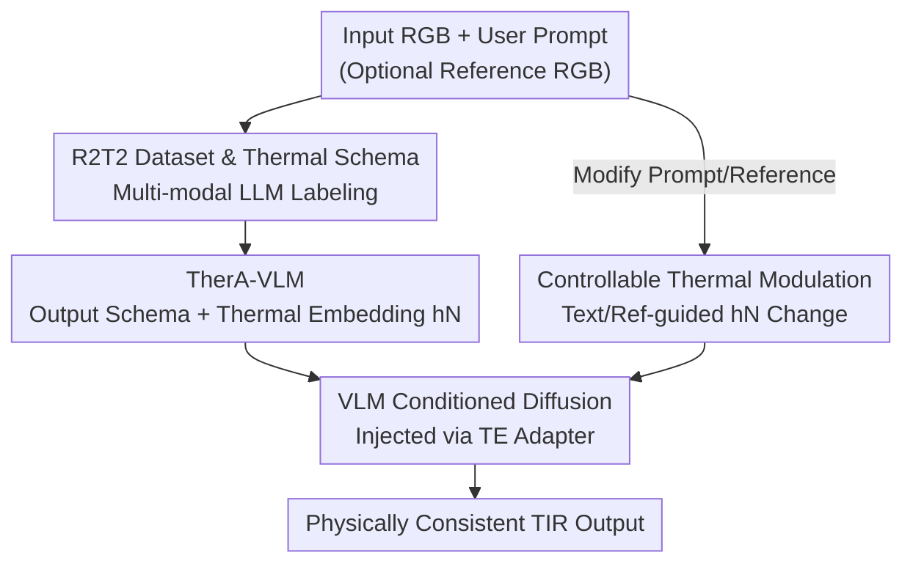

# TherA: Thermal-Aware Visual-Language Prompting for Controllable RGB-to-Thermal Infrared Translation

**Conference**: CVPR 2026  
**Paper**: [CVF Open Access](https://openaccess.thecvf.com/content/CVPR2026/html/Lee_TherA_Thermal-Aware_Visual-Language_Prompting_for_Controllable_RGB-to-Thermal_Infrared_Translation_CVPR_2026_paper.html)  
**Code**: https://github.com/donkeymouse/TherA  
**Area**: Image Generation / Image-to-Image Translation  
**Keywords**: RGB-to-TIR, Thermal Infrared, Vision-Language Models, Latent Diffusion, Controllable Generation

## TL;DR
TherA employs a "thermal-aware" Vision-Language Model (TherA-VLM) to infer structured thermal semantic embeddings—covering scene, object, material, and heat states—from RGB images. These embeddings are injected into a latent diffusion model for conditional TIR generation. This approach upgrades RGB-to-TIR translation from simple "style transfer" to "thermally-consistent" controllable synthesis, outperforming SOTA in zero-shot translation by up to 33%.

## Background & Motivation
**Background**: Thermal Infrared (TIR) imaging provides robust perception in low-visibility conditions. However, collecting and labeling large-scale TIR data is prohibitively expensive. A practical alternative is using image-to-image translation to synthesize pseudo-TIR data from existing RGB datasets, making RGB-to-TIR translation a crucial "data engine" for the thermal domain.

**Limitations of Prior Work**: Most RGB-to-TIR methods treat the task as pixel-level style transfer—focusing solely on RGB pixels to predict thermal intensity while ignoring thermal physics. The paper highlights a counterexample: InstructPix2Pix translates both a parked car and a moving car with hot exhaust pipes and wheels, violating physical common sense. Subsequent works tried to mitigate this using segmentation maps or scene indices, but these represent category and layout rather than the physics of "how heat is generated and conducted."

**Key Challenge**: TIR appearance depends on temperature-related factors—material emissivity, active heat sources, and environmental conditions (time, season, weather). Consequently, **a single RGB image can correspond to multiple valid TIR representations**. This is an inherently ill-posed one-to-many problem, yet existing methods force a deterministic one-to-one mapping, losing diversity and producing physically unrealistic images.

**Goal**: (1) Inject genuine thermal physics priors into the translation process to ensure reasonable heat distribution; (2) Enable controllable adjustment of thermal appearance (weather, time, object states) without altering scene geometry.

**Key Insight**: Pre-trained VLMs inherently possess common-sense knowledge of "what gets hot and why." What is missing is a way to extract this knowledge in a **structured, thermal-domain** format as a condition. Rather than feeding a vague prompt like "turn this into thermal," it is better to let a VLM output a structured thermal property schema and use its hidden states as semantic conditions.

**Core Idea**: Replace the standard CLIP text embeddings in diffusion models with "thermal-aware VLM embeddings." By infusing semantic-physical reasoning into the conditions, uncontrollable pixel translation is transformed into physically-grounded generation controllable via language or reference images.

## Method

### Overall Architecture
TherA is a two-stage serial controllable translation framework. In the first stage, TherA-VLM receives an RGB image (optionally with a user prompt or reference image), reasons through a structured thermal attribute schema, and outputs its final hidden state as a compact **thermal embedding $h_N$**. In the second stage, a latent diffusion UNet processes both the RGB guidance latent and this thermal embedding (injected into cross-attention via a TE Adapter) to denoise and generate a physically consistent TIR image. Controllability is derived from the mechanism where "changing VLM input changes $h_N$." Modifying text prompts or reference images alters the thermal embedding and the resulting thermal appearance while preserving scene geometry. This is supported by the R2T2 dataset (100k RGB-TIR-text triplets) specifically constructed to train the VLM to infer thermal attributes from RGB.

### Key Designs

**1. R2T2 Dataset and Thermal Attribute Schema: Creating Supervision for Thermal Inference**

To teach the VLM to infer thermal properties, paired "RGB-to-thermal semantic" supervision is required. Existing TIR datasets provide images but lack thermal descriptions. The authors constructed R2T2—100k triplets, each containing an RGB image, an aligned TIR image, and normalized text describing thermal characteristics (category, material, color, heat state). Labels were generated by a multimodal reasoning model (Gemini 2.5 Pro) looking at **both RGB and TIR** simultaneously to describe how the RGB scene appears in the thermal domain. These captions were then normalized into a keyword-oriented structured output to regularize the condition space and remove linguistic noise.

**2. TherA-VLM: Translating RGB to Structured Thermal Semantics via Hidden States**

To address the issue of vague language conditioning, TherA-VLM ($f_\theta$) is designed to output a **structured canonical schema** rather than free text. Given RGB input $I_{rgb}$ and user prompt $p_{user}$, it outputs $S = f_\theta(I_{rgb}, p_{user}) = \{s_{scene}, s_{object}, s_{material}, s_{heat}\}$. Based on LLaVA 1.5, it is fine-tuned with LoRA on the vision projector and language model using teacher forcing: $L_{TF} = -\sum_{n=1}^{N} \log p_\theta(y_n \mid y_{<n}, I_{rgb})$. Crucially, during inference, the **final hidden state $h_N$** of $f_\theta$ is used as the condition for the diffusion model, rather than the text string. This captures "how it radiates heat" in a dense representation suitable for multimodal grounding.

**3. VLM Conditioned Diffusion: Bridging VLM Hidden States to UNet Cross-Attention**

The latent diffusion UNet input is expanded to 8 channels: 4 for the noisy target TIR latent $z_t$ and 4 for the RGB guidance latent $z_{rgb}$ (where $x_t = \mathrm{concat}(z_t, z_{rgb})$). Since replacing CLIP embeddings with VLM hidden states is unstable, the authors utilize a **TE Adapter $\phi$** (a two-layer feed-forward network) to project $h_N \in \mathbb{R}^{L\times 4096}$ to the UNet attention width $E = \phi(h_N) \in \mathbb{R}^{L\times 768}$. During training, TherA-VLM is frozen, and only the UNet and adapter are optimized using the noise prediction loss $L_{diff} = \mathbb{E}_{t,\epsilon,E,M}[\|\hat\epsilon(x_t,t,E,M)-\epsilon\|_2^2]$.

**4. Controllable Thermal Modulation: Decoupled Geometry and Appearance**

TherA enables controllable RGB-to-TIR translation where changes to the VLM input modify $h_N$, resulting in directed changes to the output. It supports two levels of control: **Text Guidance**, where user instructions appended to $p_{user}$ update the global thermal embedding (e.g., cloudy, night); and **Reference Guidance**, where a different reference RGB image with desired attributes is fed to TherA-VLM. This allows for global scene attribute control and object-level control (e.g., changing a specific car from "parked" to "moving"). Inference utilizes dual CFG: $\tilde\epsilon_\theta = \epsilon_\theta(x_t,\varnothing,\varnothing) + s_V[\epsilon_\theta(x_t,c_V,\varnothing)-\epsilon_\theta(x_t,\varnothing,\varnothing)] + s_S[\epsilon_\theta(x_t,c_V,c_S)-\epsilon_\theta(x_t,c_V,\varnothing)]$, balancing visual structure ($s_V$) and thermal semantics ($s_S$).

### Loss & Training
The framework is trained in two stages. TherA-VLM is fine-tuned on the R2T2 canonical schema using $L_{TF}$ (LoRA with $r=128, \alpha=256$). The diffusion stage freezes the VLM and trains the UNet (SD 1.4 initialization) and TE Adapter (LLaMa-UNet Bridge initialization) using $L_{diff}$. Training used AdamW, a learning rate of $1\mathrm{e}-4$, and 100 epochs on 4 A6000 GPUs. Optimal dual CFG parameters were found to be $s_V=0.5$ and $s_S=1.5$.

## Key Experimental Results

### Main Results
Under standard fine-tuning on M3FD and FLIR, TherA outperforms existing methods across all four metrics.

| Dataset | Metric | TherA | Second Best (DiffV2IR) |
|--------|------|-------|----------------|
| M3FD | PSNR↑ | 19.54 | 18.97 |
| M3FD | SSIM↑ | 0.67 | 0.66 |
| M3FD | FID↓ | 87.08 | 92.57 |
| M3FD | LPIPS↓ | 0.21 | 0.23 |
| FLIR | PSNR↑ | 19.02 | 18.24 |

In zero-shot settings (trained only on R2T2), the performance gap widens significantly:

| Dataset | Metric | TherA | DiffV2IR | ThermalGen |
|--------|------|-------|----------|------------|
| M3FD | PSNR↑ | 18.24 | 11.77 | 12.84 |
| FLIR | PSNR↑ | 16.56 | 11.41 | 14.06 |
| CART | PSNR↑ | 15.38 | 10.92 | 12.17 |

### Ablation Study
The ablation verifies the impact of thermal embeddings vs. text schemas:

| Configuration | M3FD PSNR↑ | M3FD SSIM↑ | Description |
|------|-----------|-----------|------|
| InstructPix2Pix (Baseline) | 12.40 | 0.32 | RGB-centric |
| LLaVA (General VLM) | 11.85 | 0.47 | No thermal grounding |
| Lavi-LLama (Text Schema) | 13.23 | 0.51 | Normalized text only |
| TherA (Thermal Embedding $h_N$) | 18.24 | 0.65 | +4.66 dB over text schema |

### Key Findings
- **Hidden States are Crucial**: Moving from discrete text schemas (13.23 dB) to continuous thermal embeddings $h_N$ (18.24 dB) result in a +4.66 dB gain. This proves that thermal physics reasoning is better captured in VLM hidden states than discrete text.
- **Structured Conditions Enable Zero-Shot Generalization**: Regularizing the condition space into keyword-oriented structured embeddings reduces noise and stabilizes training.
- **Dual CFG Weights**: $s_V=0.5, s_S=1.5$ performs best, indicating that the model benefits from relying more on the thermal prior than the RGB latent.
- **Downstream Utility**: Pseudo-TIR data from TherA improves performance in downstream tasks like thermal segmentation and RGB-TIR matching.

## Highlights & Insights
- **Hidden States vs. CLIP**: Replacing CLIP text embeddings with VLM hidden states allows the injection of complex physical common sense into the diffusion process.
- **Emergent Controllability**: Controllability is a byproduct of the VLM conditioning; changing the VLM input naturally leads to redirected output at zero extra training cost.
- **Lineage-based Bridging**: Selecting LLaVA and a LLaMa-compatible UNet bridge simplifies alignment, allowing a lightweight adapter to map 4096-dim embeddings to the 768-dim UNet space.
- **Solving Thermal Inversion**: TherA bypasses the lack of information in night-time RGB by using daytime RGB paired with a "night" prompt to synthesize physically reasonable night-time TIR.

## Limitations & Future Work
- The method processes **relative thermal images** (pixel intensity as contrast) rather than absolute radiant values and cannot provide actual temperature readings.
- Text guidance is currently limited to **scene-level** attributes; object-level precision requires reference-image guidance.
- The schema quality is capped by the "teacher" model (Gemini 2.5 Pro) used for annotation.
- Future work includes modeling absolute radiance and exploring finer object-level text control.

## Related Work & Insights
- **vs. InstructPix2Pix**: While IPix2Pix is an instruction-based paradigm, it remains RGB-centric and often violates thermal physics. TherA ensures physically consistent heat distribution.
- **vs. DiffV2IR / F-ViTA**: These use segmentation or scene descriptions but lack understanding of heat generation. TherA outperforms them without explicit geometric priors.
- **vs. PID**: PID uses physics-based losses but has poor generalization. TherA's VLM reasoning generalizes better to zero-shot tasks.
- **vs. ThermalGen**: ThermalGen often loses fine-grained structure or creates artifacts; TherA maintains both structure and thermal appearance more reliably.

## Rating
- Novelty: ⭐⭐⭐⭐⭐ Replaces CLIP with structured VLM hidden states for physically-grounded synthesis.
- Experimental Thoroughness: ⭐⭐⭐⭐⭐ Comprehensive standard and zero-shot evaluations, plus downstream task validation.
- Writing Quality: ⭐⭐⭐⭐ Clear motivation and two-stage logic.
- Value: ⭐⭐⭐⭐⭐ Effectively addresses TIR data scarcity with an open-source dataset and weights.

<!-- RELATED:START -->

## Related Papers

- [\[NeurIPS 2025\] ThermalGen: Style-Disentangled Flow-Based Generative Models for RGB-to-Thermal Image Translation](../../NeurIPS2025/image_generation/thermalgen_style-disentangled_flow-based_generative_models_for_rgb-to-thermal_im.md)
- [\[CVPR 2026\] SynthRGB-T: Language-Vision Guided Image Translation for Diversity Synthesis](synthrgb-t_language-vision_guided_image_translation_for_diversity_synthesis.md)
- [\[CVPR 2026\] Improving Controllable Generation: Faster Training and Better Performance via x0-Supervision](improving_controllable_generation_faster_training_and_better_performance_via_x0-.md)
- [\[CVPR 2026\] Gated Condition Injection without Multimodal Attention: Towards Controllable Linear-Attention Transformers](gated_condition_injection_without_multimodal_attention_towards_controllable_line.md)
- [\[CVPR 2026\] Language-Free Generative Editing from One Visual Example](language-free_generative_editing_from_one_visual_example.md)

<!-- RELATED:END -->
