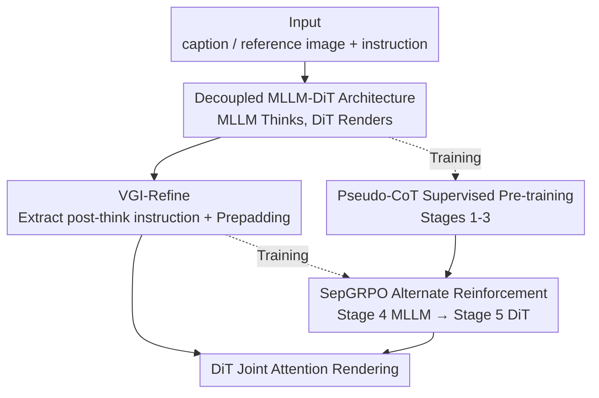

# ThinkGen: Generalized Thinking for Visual Generation

**Conference**: CVPR 2026  
**Paper**: [CVF Open Access](https://openaccess.thecvf.com/content/CVPR2026/html/Jiao_ThinkGen_Generalized_Thinking_for_Visual_Generation_CVPR_2026_paper.html)  
**Code**: https://github.com/jiaosiyuu/ThinkGen  
**Area**: Image Generation / Multimodal VLM  
**Keywords**: Chain-of-Thought Generation, MLLM, Diffusion Transformer, GRPO, Unified Generation Framework

## TL;DR
ThinkGen explicitly integrates the MLLM `<think>` Chain-of-Thought (CoT) into image generation. It utilizes a decoupled "MLLM thinking + DiT rendering" architecture and SepGRPO training that alternately reinforces the MLLM and DiT. This enables the model to **automatically** trigger CoT reasoning across various scenarios such as text-to-image, text rendering, image editing, and reasoning-based generation, achieving SOTA performance on benchmarks including GenEval (0.89), CVTG (0.84), and ImgEdit (4.21).

## Background & Motivation
**Background**: Migrating Chain-of-Thought (CoT) from understanding tasks to generation tasks is a recent research trend. Prior works either analogize step-by-step image token generation to text CoT or utilize MLLMs to rewrite generation instructions and decompose the generation process into stages to improve image quality in specific tasks.

**Limitations of Prior Work**: These CoT mechanisms are almost always **tailor-made for a single scenario**, such as reasoning-based generation. When applied to broader tasks (text rendering, image editing, stylization, etc.), these mechanisms often fail to provide gains or even lead to performance drops (as shown in Fig. 1 left of the paper). Consequently, users must **manually** decide whether to enable CoT for a given task, indicating a lack of cross-scenario flexibility.

**Key Challenge**: The authors attribute the root cause to the fact that existing generation frameworks lack the advanced reasoning capability to "think before drawing." CoT is often treated as an external plugin rather than a core driver of generation. Furthermore, the self-regressive thinking chains produced by MLLMs are often **filled with redundancy**, which can interfere with the diffusion model if fed directly.

**Goal**: To build a think-driven **generalized** visual generation framework that allows a single model to adaptively utilize CoT across all generation scenarios without task-specific designs or manual switching.

**Key Insight**: Rather than treating the MLLM as a pure feature extractor, the MLLM using the `<think>` format should be responsible for "understanding user intent + generating customized instructions," while the DiT focuses on "high-quality rendering according to instructions." The two are decoupled yet synergistic.

**Core Idea**: A decoupled architecture where "MLLM thinks and rewrites instructions → DiT generates accordingly," combined with SepGRPO reinforcement learning that **separately optimizes** the MLLM and DiT, unifying CoT reasoning across multiple generation tasks.

## Method

### Overall Architecture
ThinkGen is a think-driven unified generation model that completely decouples "thinking" and "rendering." The first stage is an MLLM (initialized with Qwen3-VL-8B-Think) responsible for receiving captions/reference images + editing instructions, performing reasoning within `<think>...</think>`, and producing rewritten generation instructions **tailored for the DiT**. The second stage is a standard DiT (initialized with OmniGen2-DiT-4B) that uses the instruction as a text condition and the reference image (encoded via VAE) as a visual condition, performing joint-attention image generation on noisy latents. A lightweight module, VGI-Refine, extracts and organizes **useful instruction information** from the MLLM thinking chain before passing it to the DiT.

Training consists of two major parts across five stages: first, supervised learning to align the DiT and MLLM and establish a high-quality generation foundation (Stages 1-3); then, SepGRPO reinforcement learning to alternately optimize the MLLM and DiT (Stages 4-5). During the supervised phase, a pseudo-CoT template is used to simulate thinking chains, avoiding the prohibitive cost of manually annotating `<think>` paths for massive datasets. In the reinforcement phase, the MLLM learns to produce "DiT-preferred instructions," and the DiT learns to "generate better images based on instructions."

### Key Designs

**1. Decoupled MLLM-DiT Architecture: Specializing "Thinking" and "Rendering"**

Addressing the issue where existing frameworks treat MLLMs merely as feature extractors without utilizing reasoning, ThinkGen splits understanding and generation into independent modules. The MLLM uses a specially designed system prompt `[SYS]` to guide user intent understanding and instruction rewriting. It then **takes the hidden states of the last two layers produced after the `</think>` token** as conditional inputs for the DiT—experiments indicate the last two layers are the most beneficial for generation. The DiT uses a **simple linear layer** as a connector to align multi-modal conditional features; experiments show this basic linear projection outperforms MLPs or complex transformer connectors. This decoupling offers three benefits: modules can be designed with separate rewards (flexibility), learning tasks are purer (MLLM focuses on instructions, DiT on rendering), and separate training significantly reduces VRAM usage (lower cost).

**2. VGI-Refine: Compressing Long Thinking Chains into Clean DiT Instructions**

CoTs generated by MLLMs are often long and redundant, which can interfere with DiT generation. VGI-Refine (Visual Generation Instruction Refinement) solves this in two steps: first, it **extracts only the instruction tokens following `</think>`** from the MLLM's text output, isolating the essence for downstream rendering. Second, it concatenates $K$ **learnable Prepadding States** before these instruction tokens. This concatenation adjusts the distribution of the output hidden states, which is particularly useful for **short instructions** like "generate a dog" or "remove the cat." Ablation studies show significant gains across short-prompt benchmarks when using Prepadding (GenEval 0.64→0.78, WISE 0.37→0.46, CVTG 0.24→0.28, ImgEdit 3.46→3.93), proving it effectively aligns MLLM output representations with the DiT distribution.

**3. SepGRPO: Separately Reinforcing MLLM and DiT Alternately**

This is the core for unifying CoT across multiple scenarios. Traditional RL methods optimize the entire model, which is expensive and difficult to converge. SepGRPO decouples text and visual rollouts: **Stage 4 (MLLM-GRPO)** freezes the DiT and performs GRPO on the MLLM. For a single input, it samples $N_1$ thinking chain trajectories $\{o_i\}$. The DiT produces one image for each trajectory using **the same initial noise** (eliminating generation randomness), and reward $R_i$ is calculated using rule models for each scenario. Advantages $\hat{A}_i=(R_i-\text{mean}(\{R_i\}))/\text{std}(\{R_i\})$ are calculated within the group, and the MLLM is updated via a clipped GRPO objective with KL regularization. **Stage 5 (DiT-GRPO)** conversely freezes the MLLM and strengthens the DiT's instruction-following via FlowGRPO. This "divide and conquer" approach allows for customized rewards, lower learning complexity, and drastically reduced memory usage. Stage 4 also selects five representative scenarios—semantic composition, reasoning generation, text rendering, image editing, and reflection—each with dedicated datasets and rule models (e.g., GenEval, HPSv3, Word Acc., SigLIP2, NED) for multi-task training.

**4. Pseudo-CoT Supervised Pre-training: Bypassing the Lack of Thinking Annotations**

Most generation datasets lack explicit `<think>` annotations. Rewriting thinking chains for over 54M samples is non-viable. The authors construct a pseudo-CoT template: it **leaves the space between** `<think>` and `</think>` empty, and the answer simply **repeats the original caption/editing instruction**, i.e., `[SYS]+[C]+<think> </think>+[C]`. This template allows the DiT to be pre-trained and optimized under a "reasoning-driven" input format. Supervised pre-training is divided into three steps: Stage 1 trains only the linear connector for alignment (≤512px), Stage 2 unfills all DiT parameters for large-scale pre-training on 60M samples, and Stage 3 uses a 0.7M high-quality subset for refinement (≤1024px) to enhance detail and aesthetics. This supervised foundation is essential for stable reinforcement in the SepGRPO stage.

### Loss & Training
The supervised stage uses the Rectified Flow's Flow Matching objective to regress the velocity field: $L(\theta)=\mathbb{E}_{t,x_0,x_1}\big[\lVert v-v_\theta(x_t,t)\rVert^2\big]$, where $v=x_1-x_0$ is the target velocity field. The GRPO objective in the reinforcement stage is a clipped surrogate with KL regularization: for each token, it takes $\min\big(r_{i,t}\hat{A}_i,\ \text{clip}(r_{i,t},1-\varepsilon,1+\varepsilon)\hat{A}_i\big)-\beta D_{KL}(\pi_\theta\Vert\pi_{ref})$, where $r_{i,t}$ is the probability ratio of the current token between the new and old policies. Stage 5 also employs Denoising Reduction (20 steps at 512px) to accelerate sampling and efficiently collect informative trajectories.

## Key Experimental Results

### Main Results
The use of CoT is denoted by `*` (where `*` indicates CoT reasoning is enabled during generation). ThinkGen achieves SOTA on multiple benchmarks, with **significant improvements in reasoning tasks when CoT is enabled**.

| Benchmark | Metric | ThinkGen (w/o think) | ThinkGen* (w/ think) | Representative Opponent |
|-----------|------|----------------------|----------------------|----------|
| GenEval | Overall | 0.88 | **0.89** | BAGEL 0.82 / OmniGen2 0.80 |
| DPG-Bench | Overall | 85.14 | **85.87** | BAGEL 85.07 |
| CVTG | Word Acc. | 0.80 | **0.84** | TextCrafter 0.76 |
| WISE | Overall | 0.55 | **0.76** | BAGEL* 0.70 / STAR 0.66 |
| RISEBench | Avg. | 3.6 | **13.0** | Gemini-2.0 13.3 / BAGEL* 11.9 |
| ImgEdit | Overall | 4.14 | **4.21** | GPT-4o 4.20 / OmniGen2 3.44 |

Most notable are the reasoning tasks: WISE jumps from 0.55 to 0.76 (+21%), and RISEBench increases from 3.6 to 13.0, approaching the closed-source Gemini-2.0. In image editing, the ImgEdit score of 4.21 is on par with GPT-4o (4.20).

### Ablation Study

**Decomposition of Training Stages** (GenEval / WISE / CVTG, `*` indicates CoT enabled):

| Stage | GenEval | WISE | CVTG | Description |
|------|---------|------|------|------|
| Stage 1: Connector Only | 0.78 | 0.46 | 0.28 | Insufficient alignment, poor text rendering |
| Stage 2: Large-scale Pre-train | 0.88 | 0.55 | 0.63 | Quality surge, CVTG +35% |
| Stage 3: High-quality Refine | 0.88 | 0.55 | 0.75 | Further detail enhancement |
| Stage 4: MLLM-GRPO* | 0.86* | **0.76*** | 0.79* | Reasoning surges 0.55→0.76 with CoT |
| Stage 5: DiT-GRPO* | **0.89*** | 0.76* | **0.84*** | Text rendering improves 0.79→0.84 |

**Prepadding States Ablation** (short prompts benefit significantly):

| Configuration | GenEval | WISE | CVTG | ImgEdit | DPG (long prompt) |
|------|---------|------|------|---------|------|
| w/o Prepadding | 0.64 | 0.37 | 0.24 | 3.46 | 80.90 |
| w/ Prepadding | **0.78** | **0.46** | **0.28** | **3.93** | 80.86 |

**Training Strategy Ablation** (on Stage 3 model, 10K reasoning data):

| Strategy | GenEval | WISE | CVTG | Key Findings |
|------|---------|------|------|----------|
| Stage 3 Baseline | 0.88 | 0.55 | 0.75 | — |
| SFT (10K reasoning) | 0.85 | 0.58 | 0.67 | SFT barely improves reasoning |
| MLLM-GRPO (10K reasoning) | 0.80 | **0.74** | 0.73 | WISE surges +0.19 |
| MLLM-GRPO (24K multitask) | 0.86 | **0.76** | 0.79 | Best multi-task performance |

### Key Findings
- **Reasoning capability stems from SepGRPO, not the reasoning data itself**: Directly applying SFT to DiT with reasoning data only moved WISE from 0.55 to 0.58, suggesting DiT cannot generalize world knowledge to unseen domains. MLLM-GRPO, however, pulled WISE to 0.74. This is the paper's core insight—**the "thinking" must be done by the MLLM, while the DiT merely executes**.
- **Prepadding States are critical for short instructions**: Long-prompt DPG scores were unaffected (80.90 vs 80.86), but all short-prompt benchmarks showed significant gains, confirming that Prepadding regulates MLLM output distributions under short instruction conditions.
- **MLLM-GRPO causes a slight drop in non-CoT generation**: Stage 4 introduced a minor representation shift (-0.01 in GenEval/WISE), but the gains far outweigh this loss once CoT is enabled.
- **SepGRPO Process Visualization**: As training progresses, the average CoT length increases, multi-task rewards rise steadily, and generated images (from step 50 to 300 to 700) show markedly improved detail and fidelity.

## Highlights & Insights
- **"Isolating reasoning for separate reinforcement"**: The brilliance of SepGRPO lies in recognizing that generation quality is capped by the MLLM's reasoning, not the DiT's rendering. Concentrating RL on the MLLM with light alignment for the DiT saves memory and targets the actual bottleneck—a paradigm applicable to any "planner-executor" model.
- **Pseudo-CoT Template**: Using a near-zero-cost template ("empty think + repeat instruction") allows massive unlabeled data to be included in reasoning-driven pre-training, cleverly bypassing the CoT annotation bottleneck.
- **Extracting last two hidden states post-`</think>`**: By focusing on the refined representations produced "after thinking" rather than raw text tokens or all layers, the model creates a clean interface between the LLM and the diffusion model that preserves reasoning while avoiding redundancy.
- **Unified framework with automatic CoT**: Unlike previous methods requiring manual switches, ThinkGen enables a single model to adaptively "think when necessary" across six scenarios, representing a significant step toward "generalized generation models."

## Limitations & Future Work
- **Reasoning-based editing remains weak**: Even with CoT, RISEBench scores only 13.0, and the logical reasoning sub-item (Log.) is a mere 1.1, indicating the model is far from reliably understanding physics/causality for editing.
- **Dependency on external rule models**: MLLM-GRPO requires specific rule models (GenEval, HPSv3, SigLIP2, etc.) for each scenario. Expanding to long-tail tasks involves the non-trivial cost of configuring new reward models.
- **Convergence and stability of two-stage alternate RL**: While Stage 4/5 alternate optimization is used, the paper does not fully discuss whether multiple alternate iterations (beyond one round) provide continuous gains or the absolute training cost of the RL phase.
- **Future Directions**: Replacing rule models with more generalized learnable reward models or implementing finer-grained alternate/joint RL between the MLLM and DiT may address difficult scenarios like reasoning-based editing.

## Related Work & Insights
- **vs BAGEL**: BAGEL also fuses autoregressive and diffusion models with CoT support, but its mechanism is more scenario-bound and less stable across tasks (e.g., ThinkGen* 0.76 vs BAGEL* 0.70 on WISE). ThinkGen's decoupling and SepGRPO make its CoT universally applicable across scenarios.
- **vs OmniGen2**: OmniGen2 primarily uses the MLLM as a feature extractor. ThinkGen reuses its DiT weights but allows the MLLM to explicitly `<think>`, leading to comprehensive leads in GenEval (0.89 vs 0.80) and ImgEdit (4.21 vs 3.44).
- **vs Token-level CoT (e.g., BiCoT-GRPO)**: Those methods optimize the "drawing process" at the token level. ThinkGen performs reasoning at the **instruction level** (thinking what to draw before drawing). The two are orthogonal, and this work proves instruction-level reasoning provides larger gains for world-knowledge tasks.

## Rating
- Novelty: ⭐⭐⭐⭐ First framework to unify explicit MLLM CoT for multi-scenario generation; SepGRPO's decoupled reinforcement is a robust new design.
- Experimental Thoroughness: ⭐⭐⭐⭐⭐ Covers six task categories with extensive benchmarking and per-stage ablation.
- Writing Quality: ⭐⭐⭐⭐ Architecture and training recipes are clear; some reward model details are relegated to the appendix.
- Value: ⭐⭐⭐⭐ Provides a reusable decoupling+separated reinforcement paradigm for "reasoning-driven unified generation."

<!-- RELATED:START -->

## Related Papers

- [\[CVPR 2026\] Thinking-while-Generating: Interleaving Textual Reasoning throughout Visual Generation](thinking-while-generating_interleaving_textual_reasoning_throughout_visual_gener.md)
- [\[CVPR 2026\] Seeing What Matters: Visual Preference Policy Optimization for Visual Generation](seeing_what_matters_visual_preference_policy_optimization_for_visual_generation.md)
- [\[CVPR 2026\] ProcessMaker: A Generalized Process Visualization Framework with Adaptive Sequence Steps on Diffusion Transformers](processmaker_a_generalized_process_visualization_framework_with_adaptive_sequenc.md)
- [\[CVPR 2026\] POCA: Pareto-Optimal Curriculum Alignment for Visual Text Generation](poca_pareto-optimal_curriculum_alignment_for_visual_text_generation.md)
- [\[CVPR 2026\] Learning What to Trust: Bayesian Prior-Guided Optimization for Visual Generation](learning_what_to_trust_bayesian_prior-guided_optimization_for_visual_generation.md)

<!-- RELATED:END -->
