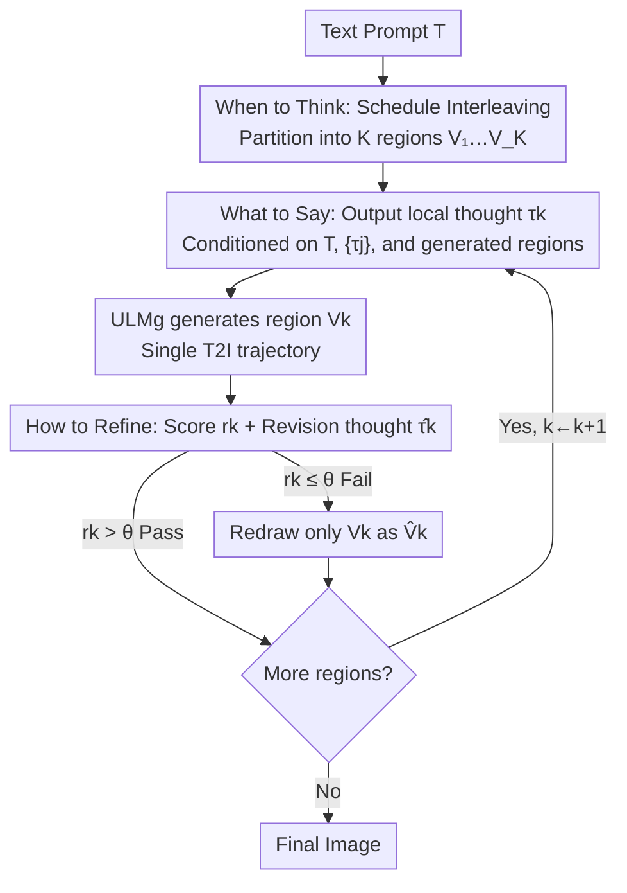

# Thinking-while-Generating: Interleaving Textual Reasoning throughout Visual Generation

**Conference**: CVPR 2026  
**Paper**: [CVF Open Access](https://openaccess.thecvf.com/content/CVPR2026/html/Guo_Thinking-while-Generating_Interleaving_Textual_Reasoning_throughout_Visual_Generation_CVPR_2026_paper.html)  
**Code**: https://github.com/ZiyuGuo99/Thinking-while-Generating  
**Area**: Image Generation / Multimodal Generation  
**Keywords**: Interleaved Reasoning, Text-to-Image, Unified Multimodal Models, GRPO, On-the-fly Reflection

## TL;DR
This paper proposes TWIG (Thinking-while-Generating), the first text-to-image framework where textual reasoning "intervenes during generation." By inserting textual thoughts regionally during autoregressive image generation, it provides local guidance for the next segment and performs scoring/error correction for segments just completed. Evaluated via zero-shot, SFT, and RL routes, it improves color binding on T2I-CompBench from 63.6 to 82.5 using Janus-Pro-7B.

## Background & Motivation
**Background**: While diffusion and autoregressive models have significantly improved text-to-image quality, they struggle with "long-range composition, multi-entity relations, and detailed instruction following." Consequently, works utilizing "reasoning-assisted generation" (the Generation-with-CoT lineage) have emerged, injecting Chain-of-Thought in the language modality to aid visual synthesis.

**Limitations of Prior Work**: Existing CoT methods can be categorized into two types based on "where reasoning is inserted," both having flaws. **Think-before-generation** first produces a structured plan (detailed captions, layouts, attribute relations) and conditions the generator on it—benefiting global coherence, but the **plan is fixed once generation starts**, preventing fine-grained intermediate guidance and correction. **Think-after-generation** generates the entire image first, then uses self-criticism or external verifiers to iterate—while it can fix local regions/attributes, the reasoning and generation trajectories are **only loosely coupled**, lacking timely fine-grained correction and requiring **expensive extra inference rounds** for each redraw.

**Key Challenge**: Reasoning and generation are segmented into two non-overlapping stages—either "think before painting" (cannot see the image while thinking) or "revise after painting" (too late and expensive). What is missing is multimodal interaction **during the generation process**.

**Key Insight**: The authors noted a complementary trend in visual understanding—Large Multimodal Models (LMMs) use "interleaved image-text reasoning," weaving visual evidence (boxes, crops, masks) into textual CoT to improve understanding. This paper asks: can we **reverse the modal flow** by weaving text into the unfolding visual generation process to provide "co-evolving" reasoning as the image progresses?

**Core Idea**: Within a **single generation trajectory**, the canvas is partitioned into local regions for sequential generation. Before each region, a textual thought is inserted as a local sub-prompt (what); after each region, a region-level scoring reflection is performed to decide if only that part needs redrawing (how); the timing and method of partitioning are pre-planned by the model (when)—allowing textual reasoning and visual modalities to **co-evolve**.

## Method

### Overall Architecture
TWIG transforms "one-pass generation" into "progressive generation with regional textual thinking." Given a text prompt $T$, the framework centers on three questions: **When to Think** decides the scheduling and partitioning into $K$ regions; **What to Say** produces local thinking as fine-grained guidance before each region; **How to Refine** performs scoring reflection after each region and local redrawing if the score is below a threshold. This entire pipeline is handled by a **single Unified Multimodal Model (ULM, e.g., Janus-Pro)**, where the understanding forward pass is denoted as $\text{ULM}_u$ and the generation forward pass as $\text{ULM}_g$.

The key engineering point is that the "Think-Generate-Reflect-Regenerate" loop **always remains within a single autoregressive trajectory** without starting new inference rounds. Visual context $\{V_j\}_{j<k}$ is not fed back as an image (meaning $\text{ULM}_g$ **only needs T2I capability, not I2I**); instead, the textual prefix is extended from $\{\tau_j\}_{j<k}$ to $\{\tau_j\}_{j\le k}$ at the sequence start, keeping previously generated visual tokens at the end to continue autoregressive generation.

### Key Designs

**1. When to Think: Scheduling image generation into K controllable sub-tasks**

Addressing the fixity of think-before plans, TWIG lets $\text{ULM}_u$ plan an interleaved reasoning schedule $S=\{V_k\}_{k=1}^{K}$ from prompt $T$: $S=\text{ULM}_u(T)$. $V_k$ represents target visual regions for reasoning (token spans in autoregressive/discrete diffusion, or timestep windows in continuous diffusion). This decouples "one-pass synthesis" into smaller sub-tasks, creating intervention points for textual guidance. Scheduling can be **static** (fixed $K$, uniform split) or **adaptive** (variable $K$, content-based). Experiments found **static $K=3$ optimal**, based on the heuristic that many images consist of "top background / central subject / bottom background." Adaptive scheduling was deferred due to current ULM stability issues (Future Work).

**2. What to Say: Local thinking as "fine-grained sub-prompts"**

Addressing the lack of intermediate refinement, $\text{ULM}_u$ outputs a textual thought $\tau_k$ at each schedule point **specifically for region $V_k$**. This acts as a local sub-prompt with higher granularity than global plans. $\tau_k$ is conditioned on the original prompt $T$, previous thoughts $\{\tau_j\}_{j<k}$, and existing visual content $\{V_j\}_{j<k}$: $\tau_k=\text{ULM}_u(T,\{\tau_j\}_{j<k},\{V_j\}_{j<k})$. Subsequently, $\text{ULM}_g$ synthesizes the region: $V_k=\text{ULM}_g(\{\tau_j\}_{j\le k},\{V_j\}_{j<k})$. This uses the extended text prefix + existing visual tokens trick to maintain the single trajectory.

**3. How to Refine: Regional instant reflection + local redrawing**

Addressing the expense of global rework in think-after methods, TWIG performs region-level revision immediately after $V_k$ is generated. $\text{ULM}_u$ produces a reflection tuple $c_k=(r_k,\hat{\tau}_k)=\text{ULM}_u(T,\{\tau_j\}_{j\le k},\{V_j\}_{j\le k})$, where $r_k\in[0,100]$ is a critic score (evaluating color accuracy, object completeness, detail, etc.) and $\hat{\tau}_k$ is a revision sub-caption. If $r_k < \theta$, the model **only redraws the sub-region**: $\hat{V}_k=\text{ULM}_g(\{\tau_j\}_{j<k},\hat{\tau}_k,\{V_j\}_{j<k})$. By replacing $\tau_k$ with $\hat{\tau}_k$ and regenerating only $\hat{V}_k$ within the same sequence, it corrects errors timely while saving significant computation.

### Loss & Training
TWIG explored three implementation routes:

- **Zero-shot prompting**: Designing three "interleaving-aware" prompts (for when/what/how) to trigger the ULM's latent capacity without parameter updates.
- **SFT (TWIG-50K Dataset)**: Decomposing the process into **nine sub-tasks** (3 thinking, 3 scoring/revision, 3 generation for $K=3$). A dataset of 50k instances was built using GPT-4o for sub-captions and partition-based image generation to reduce visual hallucination and improve instruction following.
- **RL (TWIG-GRPO)**: Customized GRPO where a single rollout involves multiple forward passes but **calculates a shared reward based only on the final image and input prompt**. This optimizes the policy for all thinking/generation/reflection passes simultaneously. The reward is a weighted average of four models (HPS v2, GroundingDINO, GIT VQA, and an ORM LMM) to mitigate reward hacking.

## Key Experimental Results
Baseline: Janus-Pro-7B. Benchmark: T2I-CompBench(++). Default: $K=3$, uniform split, max 1 reflection round.

### Main Results: Progressive Improvement across Routes (T2I-CompBench)

| Model | Color↑ | Shape↑ | Texture↑ | Spatial↑ | Complex↑ |
|------|--------|--------|----------|----------|----------|
| Janus-Pro-7B (Baseline) | 63.59 | 35.28 | 49.36 | 20.61 | 35.59 |
| TWIG-ZS (Zero-shot) | 73.11 | 41.55 | 64.77 | 21.98 | 36.65 |
| TWIG-SFT | 74.58 | 52.42 | 67.95 | 27.02 | 38.22 |
| TWIG-RL | **82.49** | **61.28** | **73.19** | **34.06** | **40.31** |

Zero-shot prompting alone gains +9.52 in Color and +15.41 in Texture. RL pushes Color to 82.49, significantly outperforming specialized methods like T2I-R1 in attribute binding and Spatial categories.

### Ablation Study

| Config | Color↑ | Texture↑ | Spatial↑ | Note |
|------|--------|----------|----------|------|
| Think-before-Gen. | 65.12 | 51.05 | 20.88 | Pre-planning only |
| Think-after-Gen. | 64.72 | 50.62 | 21.05 | Post-refinement only |
| **Thinking-while-Gen.** | **73.11** | **64.77** | 21.98 | Interleaved (Ours) |
| $K=2$ | 72.79 | 64.64 | 21.97 | 2 regions |
| **$K=3$** | 73.11 | 64.77 | 21.98 | 3 regions (Best) |
| $K=4$ | 72.95 | 64.70 | 22.03 | 4 regions |
| w/o Reflection | 73.11 | 64.77 | 21.98 | No reflection |
| 1 Round Reflection | **73.90** | **66.10** | **24.50** | Spatial surge |

Key RL discovery: **Simultaneously optimizing $\text{ULM}_u$ and $\text{ULM}_g$ (TWIG-GRPO)** is superior to optimizing either part individually (82.49 vs. 80.12 / 78.36).

### Key Findings
- **Interleaved > Before/After thinking**: Under zero-shot settings, TWIG leads significantly in Color and Texture, proving that "intervention during generation" provides fine-grained guidance that static pre-planning or global post-revision cannot.
- **"Three-part semantics" hypothesis holds**: $K=3$ is the sweet spot, matching the spatial structure of background/subject/background.
- **One reflection round is enough**: One round boosts Spatial from 21.98 to 24.50; additional rounds provide no gain, suggesting zero-shot ULM revision capacity is exhausted in one round.
- **SFT data balance**: Excessively adding reflection data causes drops (Reflect-heavy 71.88) because the model over-corrects; a balanced approach is best.

## Highlights & Insights
- **"Reversing Modal Flow" Perspective**: While interleaved reasoning usually inserts visual evidence into text CoT for understanding, this paper reverses it to insert textual CoT into visual generation, filling a paradigm gap.
- **Single Trajectory Engineering**: Using extended text prefixes and preserved visual tokens allows $\text{ULM}_g$ to utilize visual context without needing native image-to-image capabilities or multiple redraw rounds—a trick transferable to any autoregressive generator.
- **Shared Reward GRPO**: Calculating a single reward from the final image to optimize all passes avoids the complexity of per-subtask rewards and allows global information to flow across paths.

## Limitations & Future Work
- **Adaptive Scheduling**: Current ULMs cannot reliably output content-adaptive splits, necessitating static $K=3$.
- **Verified only on T2I + Autoregressive**: While theoretically compatible with diffusion or T2V, this pilot study is limited to Janus-Pro autoregressive T2I.
- **Reflection Data Challenges**: SFT reflection data occasionally caused performance drops, indicating the "critique-and-revise" training recipe is still an open problem.

## Related Work & Insights
- **vs Think-before-Generation (GoT / Planning)**: TWIG provides local sub-prompting that evolves with the image, unlike their fixed pre-plans.
- **vs Think-after-Generation (PARM / Self-Correction)**: TWIG performs region-level instant reflection and redrawing within a single trajectory, reducing cost compared to global rework.
- **vs Parallel work IRG / Uni-CoT**: These treat visual synthesis as a single block; TWIG interleaves reasoning **inside** the generation process for higher granularity.

## Rating
- Novelty: ⭐⭐⭐⭐⭐ Reversing modal flow for "thinking while generating" opens a clear new paradigm.
- Experimental Thoroughness: ⭐⭐⭐⭐ Three implementation routes and comprehensive ablations, though limited to one ULM.
- Writing Quality: ⭐⭐⭐⭐⭐ Clear breakdown of when/what/how; well-explained single-trajectory mechanism.
- Value: ⭐⭐⭐⭐ Provides a transferable framework and a low-cost correction trick for compositional T2I.

<!-- RELATED:START -->

## Related Papers

- [\[CVPR 2026\] ThinkGen: Generalized Thinking for Visual Generation](thinkgen_generalized_thinking_for_visual_generation.md)
- [\[CVPR 2026\] UniVerse: Empower Unified Generation with Reasoning and Knowledge](universe_empower_unified_generation_with_reasoning_and_knowledge.md)
- [\[CVPR 2026\] Evaluating Reasoning Fidelity in Visual Text Generation](evaluating_reasoning_fidelity_in_visual_text_generation.md)
- [\[CVPR 2026\] Prompt Yourself: Awakening Textual Semantics in 1D Visual Tokenizers](prompt_yourself_awakening_textual_semantics_in_1d_visual_tokenizers.md)
- [\[CVPR 2026\] BioVITA: Biological Dataset, Model, and Benchmark for Visual-Textual-Acoustic Alignment](biovita_biological_dataset_model_and_benchmark_for_visual-textual-acoustic_align.md)

<!-- RELATED:END -->
