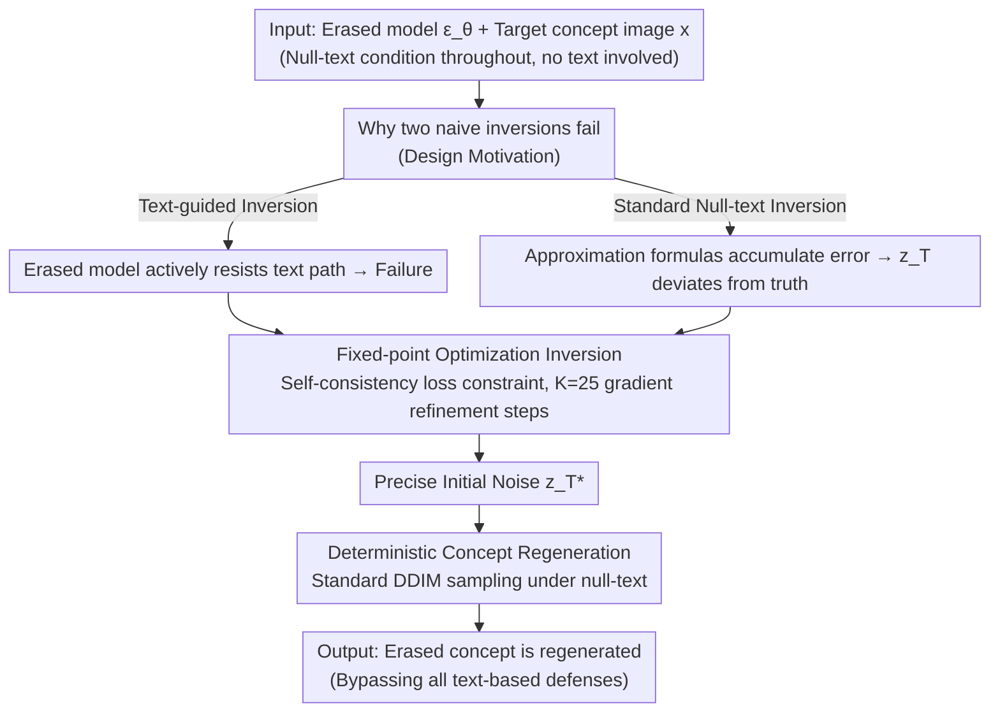

# TINA: Text-Free Inversion Attack for Unlearned Text-to-Image Diffusion Models

## Basic Information

**Conference**: CVPR 2026  
**arXiv**: [2603.17828](https://arxiv.org/abs/2603.17828)  
**Code**: [GitHub](https://github.com/qianlong0502/TINA)  
**Area**: Image Generation / AI Security / Concept Erasure Attack  
**Keywords**: Concept Erasure, Machine Unlearning, DDIM Inversion, Text-to-Image Diffusion, Adversarial Attack  

## TL;DR

Ours proposes TINA (Text-free INversion Attack), which identifies precise initial noise by optimizing DDIM inversion under the null-text condition. This bypasses all text-based concept erasure defenses and demonstrates that current erasure methods only sever text-to-image mappings without truly deleting internal visual knowledge from the model.

## Background & Motivation

The current field of Concept Erasure for text-to-image diffusion models (e.g., Stable Diffusion) contains a fundamental blind spot: all erasure methods and adversarial attacks revolve around the **text-conditional pathway**. Erasure methods (ESD, UCE, AdvUnlearn, etc.) achieve "forgetting" by severing the mapping between text prompts and target concepts; attack methods (P4D, UDA, CCE, etc.) attempt to find alternative texts or embeddings to reactivate these concepts.

This "text-centric co-evolution" brings a fatal assumption: **severing the text-to-image link = deleting visual knowledge**. The authors argue this is incorrect—even if the text path is blocked, the **visual knowledge** corresponding to the erased concept still exists within the model's parameter space. To verify this hypothesis, an attack method that completely bypasses text conditions is needed.

Key Hypothesis: Even when text-to-image mappings are removed, a **deterministic generation path** for the erased concept still remains in the model and can be rediscovered under completely text-free conditions.

## Method

### Overall Architecture

TINA aims to demonstrate that current concept erasure only severs the mapping from text to image without truly removing visual knowledge from the model. To bypass all "text-based" defenses, it designs an attack that does not touch text conditions: the first stage is **Text-free Inversion**, where given an erased model $\epsilon_\theta$ and a target image $x$ representing the erased concept, the initial noise $z_T^*$ capable of deterministically generating the image is optimized under the null-text condition $c_\text{null}$; the second stage is **Deterministic Concept Regeneration**, where $z_T^*$ is fed back into the same erased model to run standard DDIM sampling, still under $c_\text{null}$, to regenerate the erased concept. The entire process involves no text conditions, thereby skipping all defenses on the text path. The base model is SD v1.4, with $T=50$ steps and CFG=7.5.

### Key Designs

**1. Why Standard Text-free Inversion Fails: Rapid Error Accumulation under Null-text**

DDIM sampling is deterministic—given a model, condition $c$, and initial noise $z_T$, the output $z_0$ is uniquely determined. The update formula is:
$$z_{t-1} = \sqrt{\alpha_{t-1}} \hat{z}_0(z_t) + \sqrt{1-\alpha_{t-1}} \cdot \epsilon_\theta(z_t, t, c)$$
where $\hat{z}_0(z_t) = \frac{z_t - \sqrt{1-\alpha_t} \epsilon_\theta(z_t, t, c)}{\sqrt{\alpha_t}}$. The ideal precise inversion relationship is $z_t = C_1(t) z_{t-1} + C_2(t) \cdot \epsilon_\theta(z_t, t, c)$ (where $C_1(t) = \frac{\sqrt{\alpha_t}}{\sqrt{\alpha_{t-1}}}$ and $C_2(t) = \sqrt{1-\alpha_t} - \sqrt{\frac{\alpha_t(1-\alpha_{t-1})}{\alpha_{t-1}}}$). However, since $z_t$ appears on both sides of the equation, the standard practice of using $\epsilon_\theta(z_{t-1}, t-1, c)$ to approximate $\epsilon_\theta(z_t, t, c)$ introduces cumulative error. Two naive schemes fail: using the erased concept's prompt for **text-guided inversion** is actively resisted by the model (proving text defenses are indeed effective on the text path); while **null-text inversion** lacks text guidance, causing small errors in each step of the approximation to accumulate rapidly, such that $\hat{z}_T$ deviates from the true $z_T^*$, failing to reconstruct the concept.

**2. Turning Inversion into Fixed-point Optimization: Precise Trajectory Tracking via Self-consistency Constraints**

TINA abandons approximation formulas and treats the precise inversion relationship directly as a fixed-point constraint: every $z_t$ on the true trajectory must satisfy:
$$z_t = f_\theta^*(z_t, z_{t-1}, t, c) = C_1(t) z_{t-1} + C_2(t) \cdot \epsilon_\theta(z_t, t, c)$$
Thus, at each timestep, solving for $z_t$ becomes the minimization of a self-consistency loss:
$$\mathcal{L}_t(z_t) = \| f_\theta^*(z_t, z_{t-1}, t, c_\text{null}) - z_t \|_2^2$$
Specifically: a standard DDIM inversion is first used to calculate an initial estimate $\tilde{z}_t$ under $c_\text{null}$, which then serves as the starting point for $K$ steps of gradient descent to refine $z_t$. This proceeds sequentially for $t=1,\dots,T$, eventually yielding the precise $z_T^*$. The inner optimization loop uses $K=25$ iterations with AdamW and $\eta=0.001$. Ablation shows that insufficient optimization (TINA-Less) results in an ASR of only 46%, while full optimization to self-consistency raises it to 70%, highlighting that precise trajectory tracking relies on these iterations.

**3. Deterministic Concept Regeneration: Null-text Sampling Restores Erased Concepts**

After obtaining $z_T^*$, the regeneration phase requires no sophisticated tricks—simply input it into the same erased model and run standard DDIM sampling under $c_\text{null}$ to deterministically reconstruct the erased concept. t-SNE analysis shows that while $z_T^*$ itself is indistinguishable by concept in the noise space, its activations in the UNet mid_block clearly cluster by concept. This indicates that concept-specific visual knowledge within the model is precisely activated—direct evidence that "text erasure $\neq$ visual knowledge deletion."

## Key Experimental Results

### Main Results: Attack Success Rate (ASR) on Nudity Concept Erasure

| Attack Method | ESD | FMN | UCE | MACE | RECE | AdvUnlearn | SalUn | STEREO |
|----------|-----|-----|-----|------|------|------------|-------|--------|
| MMA | 13.1 | 67.0 | 32.6 | 6.0 | 22.8 | 1.7 | 1.7 | 5.5 |
| P4D | 69.0 | 97.9 | 76.1 | 75.4 | 66.2 | 18.3 | 15.5 | 24.7 |
| UDA | 76.1 | 97.9 | 78.9 | 81.7 | 63.4 | 23.2 | 13.4 | 25.4 |
| RAB | 50.5 | 97.9 | 29.5 | 6.3 | 10.5 | 2.1 | 0.0 | 8.4 |
| CCE | 74.7 | 55.0 | 49.3 | 50.0 | 66.9 | 76.8 | 2.8 | 16.9 |
| **TINA** | **82.4** | **97.9** | **82.4** | **93.0** | **80.3** | **78.9** | **71.1** | **81.0** |

Key Findings: TINA achieves the highest ASR across all 8 defenses. Particularly for robust defenses like AdvUnlearn (78.9%), SalUn (71.1%), and STEREO (81.0%), where text-based attacks almost fail (e.g., UDA only 23.2%/13.4%/25.4%), TINA maintains a high attack rate.

### ASR on Style Erasure (Van Gogh)

| Attack Method | ESD | FMN | AC | MACE | SPM | RECE | AdvUnlearn | STEREO |
|----------|-----|-----|-----|------|-----|------|------------|--------|
| P4D | 30.0 | 54.0 | 68.0 | 42.0 | 78.0 | 62.0 | 0.0 | 0.0 |
| UDA | 32.0 | 56.0 | 77.0 | 56.0 | 88.0 | 64.0 | 2.0 | 0.0 |
| CCE | 8.0 | 18.0 | 14.0 | 26.0 | 36.0 | 40.0 | 44.0 | 4.0 |
| **TINA** | **70.0** | **72.0** | **74.0** | **72.0** | **80.0** | **74.0** | **70.0** | **44.0** |

### ASR on Object Erasure (Tench Class)

| Attack Method | ESD | EraseDiff | SalUn | Scissorhands | STEREO |
|----------|-----|-----------|-------|--------------|--------|
| P4D | 32.0 | 8.0 | 18.0 | 6.0 | 0.0 |
| UDA | 46.0 | 2.0 | 12.0 | 6.0 | 2.0 |
| CCE | 40.0 | 34.0 | 58.0 | 0.0 | 2.0 |
| **TINA** | **70.0** | **68.0** | **72.0** | **78.0** | **72.0** |

### Ablation Study

| Method | ASR (%) | Description |
|------|---------|------|
| Standard Inv. | 30 | Erasure methods actively oppose text conditions |
| TINA-Less | 46 | Insufficient error correction |
| **TINA** | **70** | Full optimization reaching self-consistency ($K=25$) |

The 24% ASR Gain from TINA-Less to TINA proves that sufficient optimization iterations are crucial for precisely tracking the generation trajectory.

### Comparison with DDIM Reconstruction Methods (EasyInv)

| Method | ESD | EraseDiff | SalUn | Scissorhands | STEREO |
|------|-----|-----------|-------|--------------|--------|
| EasyInv | 24.0 | 26.0 | 30.0 | 34.0 | 24.0 |
| **TINA** | **70.0** | **68.0** | **72.0** | **78.0** | **72.0** |

General DDIM reconstruction methods significantly underperform compared to TINA's specialized optimization scheme in concept restoration tasks.

### Key Findings

1. **Text Erasure $\neq$ Visual Knowledge Deletion**: TINA efficiently bypasses all 12 erasure defenses across all three task categories (nudity/style/object), proving that visual knowledge of erased concepts remains in the model parameters.
2. **Robust Defenses are Ineffective against TINA**: Defenses reinforced by adversarial training, such as AdvUnlearn and STEREO, effectively block text attacks but pose almost no barrier to TINA.
3. **Latent Embedding Analysis** (t-SNE): Optimized noise $z_T^*$ is indistinguishable in the noise space, but its activations in the UNet mid_block cluster clearly by concept, proving precise activation of internal concept-specific visual knowledge.
4. **Architectural Generality**: TINA is equally effective on DiT architectures (PixArt-XL-2), suggesting the vulnerability is not limited to UNet.

## Highlights & Insights

- **Paradigm Shift**: First to question the effectiveness of concept erasure from a visual perspective, revealing fundamental flaws in the "text-centric" paradigm.
- **Clever Method**: Converts the approximation error problem in DDIM inversion into a fixed-point optimization problem, requiring no additional models or text information.
- **Experimental Thoroughness**: Covers 12 erasure methods × 5 baseline attacks × 3 concept task categories, providing robust evidence.
- **Value**: Provides a critical warning for the AI security community, driving a shift toward erasure paradigms that manipulate internal visual representations.

## Limitations & Future Work

- Requires a **reference image** of the target concept as the starting point for inversion; it is not a completely zero-shot attack.
- ASR for STEREO in the style erasure task is only 44%, indicating that adversarial training can partially perturb internal visual representations.
- High computational overhead (requires $K=25$ optimization iterations per timestep, totaling $T \times K = 1250$ forward passes).
- Evaluated primarily on SD v1.4, not covering larger models like SDXL.
- The paper primarily diagnoses the problem without proposing a corresponding defense solution.

## Rating

⭐⭐⭐⭐ — An important paradigm-alerting work in the field of concept erasure. It reveals the fundamental inadequacies of current erasure methods through an elegant text-free inversion attack, supported by rigorous and comprehensive experiments. The requirement for a reference image and the lack of a defense solution are minor drawbacks.

<!-- RELATED:START -->

## Related Papers

- [\[CVPR 2026\] Neighbor-Aware Localized Concept Erasure in Text-to-Image Diffusion Models](neighbor-aware_localized_concept_erasure_in_text-to-image_diffusion_models.md)
- [\[CVPR 2026\] CTCal: Rethinking Text-to-Image Diffusion Models via Cross-Timestep Self-Calibration](ctcal_rethinking_text-to-image_diffusion_models_via_cross-timestep_self-calibrat.md)
- [\[CVPR 2026\] Beyond Text Prompts: Precise Concept Erasure through Text–Image Collaboration](beyond_text_prompts_precise_concept_erasure_through_text-image_collaboration.md)
- [\[CVPR 2026\] Test-Time Alignment of Text-to-Image Diffusion Models via Null-Text Embedding Optimisation](test-time_alignment_of_text-to-image_diffusion_models_via_null-text_embedding_op.md)
- [\[AAAI 2026\] Copyright Infringement Detection in Text-to-Image Diffusion Models via Differential Privacy](../../AAAI2026/image_generation/copyright_infringement_detection_in_text-to-image_diffusion_models_via_different.md)

<!-- RELATED:END -->
