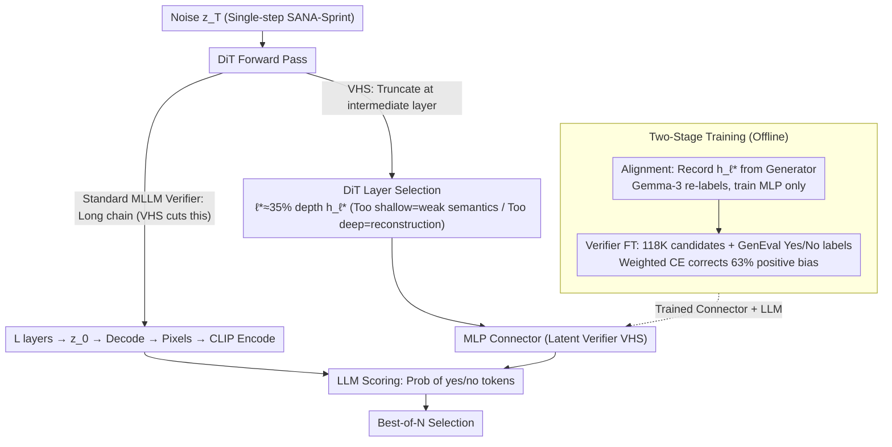

# Tiny Inference-Time Scaling with Latent Verifiers

**Conference**: CVPR 2026 Findings  
**arXiv**: [2603.22492](https://arxiv.org/abs/2603.22492)  
**Code**: [https://aimagelab.github.io/VHS](https://aimagelab.github.io/VHS)  
**Area**: Diffusion Models / Image Generation / LLM Efficiency  
**Keywords**: Inference-time scaling, Latent verifier, Single-step generation, DiT, MLLM

## TL;DR
This paper proposes VHS (Verifier on Hidden States)—a verifier operating directly on the intermediate hidden states of a DiT generator. By bypassing the decoding-re-encoding overhead, it reduces joint generation-verification time by 63.3% and FLOPs by 51% in single-step image generation scenarios, while achieving a 2.7% performance gain on GenEval under the same time budget.

## Background & Motivation

1.  **Background**: Inference-time scaling has emerged as an effective method to improve generative model quality—by generating multiple candidate samples and selecting the best via a verifier. The standard Best-of-N strategy is widely used in text-to-image generation.

2.  **Limitations of Prior Work**: Current verifiers are typically based on Multimodal Large Language Models (MLLMs). The process involves: Generator creates samples in latent space → Decode to pixel space → MLLM visual encoder (e.g., CLIP) re-encodes → LLM scores. Two issues exist: (a) Decoding-re-encoding is a redundant operation—the latent space implicitly contains semantic information that is decoded only to be re-encoded; (b) Literature often counts only function evaluations (sampling steps) while ignoring verifier overhead, which is comparable to the generation cost for **single-step generators** (e.g., SANA-Sprint).

3.  **Key Challenge**: In practical deployment (e.g., commercial image generation services), typically only 2-4 candidates are returned, defined as a "tiny budget" setting. Under such tight constraints, the MLLM verifier's overhead is non-negligible. While diffusion models operate in compressed latent spaces to save computation, verification reverts to pixel space, creating a computational contradiction.

4.  **Goal**: Design a more efficient verifier capable of evaluating generation quality directly in the generator's latent space, eliminating the decoding-re-encoding overhead.

5.  **Key Insight**: Intermediate hidden states of DiT generators already encode rich semantic information (understandable by LLMs) without needing prior decoding. Directly using intermediate features instead of CLIP visual encoder outputs as LLM visual inputs is feasible.

6.  **Core Idea**: The verifier directly consumes intermediate hidden states of the DiT generator as visual input, skipping subsequent DiT layers, autoencoder decoding, and CLIP re-encoding to achieve efficient verification within the latent space.

## Method

### Overall Architecture
This study addresses the issue where the "decoding-re-encoding" overhead of MLLM verifiers becomes prohibitively expensive under the tight budget of single-step generation. The solution is to move the verifier directly into the generator's latent space.

In standard MLLM verifiers, the pipeline is long: noise $z_T$ passes through all $L$ DiT layers to obtain $z_0$, which is decoded by an autoencoder into pixels $x_0$, then re-encoded by a CLIP visual encoder before scoring by an LLM. VHS truncates this: $z_T$ only passes through the first $\ell^*$ layers of the DiT. The intermediate state $h_{\ell^*}$ is extracted and fed to the LLM via an MLP connector. Decoding, CLIP re-encoding, and DiT layers beyond $\ell^*$ are skipped, compressing verification into the latent space.

### Key Designs

**1. Latent Verifier VHS: Direct LLM Access to DiT Intermediate Layers**

Standard MLLM verifier scoring is denoted as $s = \text{LLM}(\mathcal{C}(\mathcal{V}(\mathcal{D}(z_0))), p)$, where $\mathcal{D}$ is the decoder, $\mathcal{V}$ the visual encoder, $\mathcal{C}$ the connector, and $p$ the prompt. VHS simplifies this to:

$$s = \text{LLM}(\mathcal{C}(h_{\ell^*}), p)$$

By taking the hidden state $h_{\ell^*}$ at layer $\ell^*$ and passing it through an MLP connector to the LLM, the model omits $\mathcal{D}$ and $\mathcal{V}$, and truncates $L-(\ell^*+1)$ DiT layers. This is possible because diffusion models utilize latent semantics to reconstruct images; these semantics already exist in intermediate layers. Ablations confirm that while AE latents are perceptually rich, they lack semantic strength compared to DiT features conditioned on generation prompts.

**2. DiT Layer Selection: Balancing Semantics and Reconstruction**

Selection of the hidden state layer follows a non-monotonic trade-off. Evaluated across 20 DiT layers ($h_1, h_5, h_7, h_9, h_{19}$), $h_1$ is too close to noise input, while $h_{19}$ approaches the AE reconstruction space. Optimal performance is found at approximately 35% depth ($h_7$), where GenEval overall score is 2.8% higher than $h_5$ and 2.2% higher than $h_9$. Since 13 subsequent layers are truncated, latency is significantly reduced.

**3. Two-Stage Training: Alignment and Verifier Fine-tuning**

Stage one involves **Alignment**, similar to LLaVA, training the MLP connector with image-text pairs but using generator latents instead of real images. To avoid generation bias, Gemma-3-4B is used to re-describe generated images before training the connector. Stage two involves **Verifier Fine-tuning**, using 118K samples (20 candidates per prompt from Reflect-DiT) labeled with binary Yes/No values from GenEval. Both connector and LLM parameters are fine-tuned. During inference, the "yes"/"no" token probabilities serve as continuous scores.

To address class imbalance (63% positive labels), **Weighted Cross-Entropy** is employed based on class frequency. This prevents the verifier from defaulting to high scores and maintains its ability to reject low-quality samples, improving performance by 4.2% over standard XE.

### Loss & Training
The alignment phase follows LLaVA-style training for the connector only. The verifier fine-tuning phase utilizes weighted cross-entropy for both connector and LLM. Qwen2.5-0.5B is used as the LLM base, with SANA-Sprint as the single-step generator.

## Key Experimental Results

### Main Results
SANA-Sprint + Qwen2.5-0.5B on GenEval (Best-of-N within matching time budgets):

| Time Budget | Verifier | Best-of-N | GenEval Overall |
| :--- | :--- | :--- | :--- |
| 550ms | MLLM w/ CLIP | Bo2 | 75.4% |
| 550ms | **VHS** | **Bo4** | **78.1%** (+2.7%) |
| 1100ms | MLLM w/ CLIP | Bo4 | 78.8% |
| 1100ms | **VHS** | **Bo9** | **80.5%** (+1.7%) |
| 1650ms | MLLM w/ CLIP | Bo6 | 80.4% |
| 1650ms | **VHS** | **Bo15** | **80.9%** (+0.5%) |

Latency and Resource Comparison (Bo1 baseline):

| Verifier | Time | Gain (Time) | Gain (FLOPs) | Gain (VRAM) |
| :--- | :--- | :--- | :--- | :--- |
| MLLM w/ CLIP | 277ms | - | - | - |
| MLLM w/ AE | 138ms | 50.2% | 51.0% | 14.5% |
| **VHS on $h_7$** | **102ms** | **63.3%** | **62.9%** | **14.5%** |

### Ablation Study

| Configuration | GenEval Overall (1100ms) | Description |
| :--- | :--- | :--- |
| VHS $h_7$ + Weighted XE | **80.5%** | Optimal configuration |
| VHS $h_1$ + Weighted XE | 71.3% | Too shallow, insufficient semantics |
| VHS $h_{19}$ + Weighted XE | 76.5% | Too deep, biased toward reconstruction |
| VHS $h_7$ + XE | 76.3% | Std XE, sensitive to class imbalance |
| VHS $h_7$ + Focal | 80.0% | Focal loss is also effective |
| MLLM w/ AE + Weighted XE | 74.7% | Weak semantics in AE latent |
| VHS $h_7$ + Qwen2-1.5B | 78.4% | Larger LLM offers no gain; vision is the bottleneck |

### Key Findings
- VHS holds a core advantage in "tiny budget" scenarios: within the same timeframe, VHS can evaluate 4 candidates while MLLM w/ CLIP evaluates 2, translating efficiency into quality.
- Layer selection is non-monotonic: $h_7$ (~35% depth) is optimal. The poor performance of AE latents confirms that "perceptual features $\neq$ semantic features."
- Scaling LLM size (0.5B to 1.5B) provides minimal benefit, suggesting the bottleneck lies in visual representation rather than linguistic reasoning.
- Weighted XE > Focal loss > XE; handling class imbalance is critical for verifier training.

## Highlights & Insights
- **"Less is More" in Verifier Design**: Removing the visual encoder improves performance—DiT latents are conditioned semantic representations, which are better for judging generation quality than generic CLIP features.
- **Latency-to-Candidate Conversion**: The value of VHS is not just speed, but the ability to assess a larger candidate pool within the same budget.
- **Semantic Analysis of DiT Layers**: The transition of DiT features from noise to semantics to perception provides theoretical insight into generative model internal representations.

## Limitations & Future Work
- Currently specialized for single-step generators; multi-step latents vary per step and require adaptation.
- Evaluation is limited to GenEval, lacking other benchmarks like T2I-CompBench or DrawBench.
- Architecture dependence—non-DiT models (e.g., U-Net) require redesign.
- Uses a fixed layer $\ell^*$ without exploring adaptive layer selection.
- Requires training (alignment + fine-tuning), unlike training-free methods.

## Related Work & Insights
- **vs VQA-Score**: VQA-Score requires full pixel images. VHS evaluates in latent space, suited for low-latency needs.
- **vs Vision-Reward**: Vision-Reward uses pixel-based binary Q&A. VHS skips the pixel conversion.
- **vs Multi-step SANA-Sprint**: 8-step SANA-Sprint (74.0%) is outperformed by VHS Bo4 (78.1%), confirming that Best-of-N is more efficient than increasing sampling steps.

## Rating
- Novelty: ⭐⭐⭐⭐⭐ Elegant latent-space verification with insightful DiT layer analysis.
- Experimental Thoroughness: ⭐⭐⭐⭐ Comprehensive latency/performance analysis, though benchmark variety is limited.
- Writing Quality: ⭐⭐⭐⭐⭐ Clear motivation and detailed efficiency analysis.
- Value: ⭐⭐⭐⭐ High utility for real-world image generation services.

<!-- RELATED:START -->

## Related Papers

- [\[CVPR 2026\] Rethinking Prompt Design for Inference-time Scaling in Text-to-Visual Generation](rethinking_prompt_design_for_inference-time_scaling_in_text-to-visual_generation.md)
- [\[NeurIPS 2025\] Inference-Time Scaling for Flow Models via Stochastic Generation and Rollover Budget Forcing](../../NeurIPS2025/image_generation/inference-time_scaling_for_flow_models_via_stochastic_generation_and_rollover_bu.md)
- [\[CVPR 2026\] From Scale to Speed: Adaptive Test-Time Scaling for Image Editing](from_scale_to_speed_adaptive_test-time_scaling_for_image_editing.md)
- [\[CVPR 2026\] Progress by Pieces: Test-Time Scaling for Autoregressive Image Generation](progress_by_pieces_test-time_scaling_for_autoregressive_image_generation.md)
- [\[ICML 2026\] Simple Approximation and Derivative Free Inference-Time Scaling for Diffusion Models via Sequential Monte Carlo on Path Measures](../../ICML2026/image_generation/simple_approximation_and_derivative_free_inference-time_scaling_for_diffusion_mo.md)

<!-- RELATED:END -->
