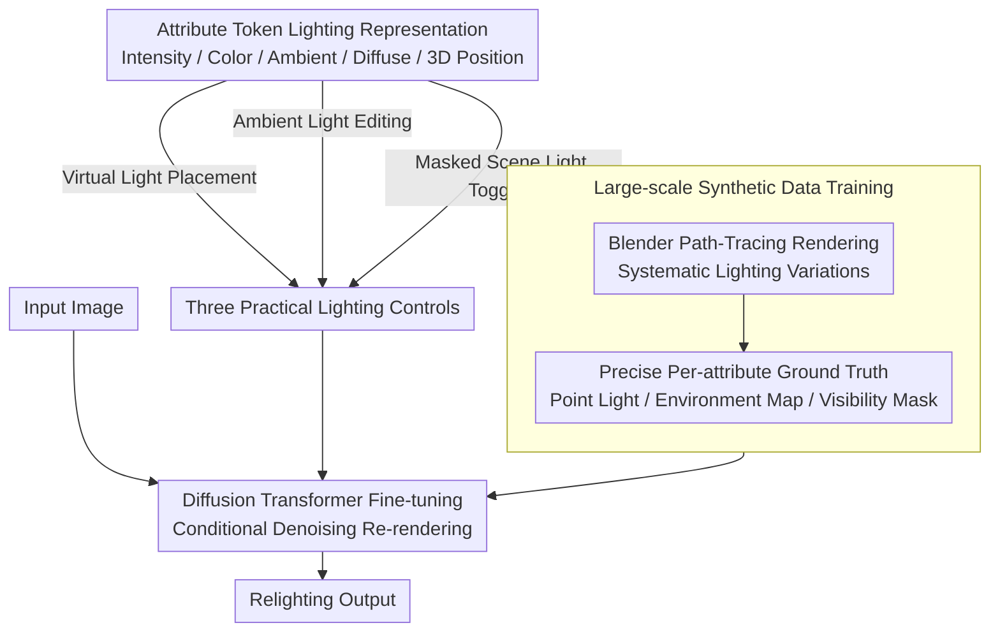

# TokenLight: Precise Lighting Control in Images using Attribute Tokens

**Conference**: CVPR 2026  
**arXiv**: [2604.15310](https://arxiv.org/abs/2604.15310)  
**Code**: [vrroom.github.io/tokenlight/](https://vrroom.github.io/tokenlight/)  
**Area**: Image Generation / Relighting  
**Keywords**: relighting, attribute tokens, diffusion transformer, lighting control, synthetic data

## TL;DR

Ours proposes TokenLight, formulating image relighting as an end-to-end generation task conditioned on attribute tokens (intensity, color, ambient light, diffuse level, and 3D light position). It achieves precise, continuous, and interpretable lighting control within a Diffusion Transformer framework.

## Background & Motivation

Lighting representations in existing relighting methods have inherent limitations: text-driven approaches lack precision; background images provide limited information; panoramic environment maps cannot model near-field illumination; and inverse rendering methods rely on high-quality 3D reconstruction. There is a lack of a representation that is both precise/interpretable and spatially flexible for direct lighting manipulation in the 2D image domain. The core requirement is to combine the intuitive flexibility of 3D lighting tools with the accessibility of 2D image editing without requiring 3D reconstruction.

## Method

### Overall Architecture

TokenLight addresses the problem of "precise lighting control directly on 2D images without 3D reconstruction." It reformulates relighting as a conditional image generation task: fine-tuning a pre-trained Diffusion Transformer (foundation model for text-to-image/video) by feeding a set of attribute tokens describing the illumination along with the input image. The model then directly re-renders the result under the target lighting. The training data primarily consists of a large-scale Blender synthetic dataset supplemented by a small amount of real-world captures; the former provides precise ground truth for each lighting attribute, while the latter ensures realism and generalization.

### Key Designs

**1. Attribute Token Lighting Representation: Decomposing Light into Independently Tunable Physical Quantities**

Text is too vague, background images offer limited info, panoramas cannot model near-field light, and inverse rendering requires clean 3D geometry—these representations are either imprecise or inflexible. TokenLight decomposes lighting into a set of tokens with clear physical meanings, each encoding an attribute: intensity, color (temperature), diffuse level, 3D spatial position, and ambient parameters. Each attribute is continuously adjustable and mutually independent, naturally enabling decoupled editing such as "changing color temperature without moving the light source." This transforms the control process from a black box into interpretable physical manipulation.

**2. Large-scale Synthetic Data Training: Utilizing Path-Tracing for Precise Attribute Ground Truth**

For attribute tokens to be controllable, the model must observe paired supervision during training where "slight attribute changes lead to slight image changes." Such labels are nearly impossible to obtain in real-world data. The authors use the Blender path-tracing renderer to image 3D assets under systematically varied lighting conditions, providing precise ground truth supervision for each attribute. The dataset includes single-light renderings, environment maps, and light visibility masks, covering all signals required for the three control modes.

**3. Three Practical Lighting Controls: A Unified Representation for Adding Lights, Environment Tuning, and Scene Light Toggling**

The decomposed representation enables three types of freely combinable operations: placing a new virtual light source at any 3D position, editing or diffusing global ambient light, and using spatial masks to toggle existing emitters within the scene. Combined with the continuous tunability of attribute tokens, these allow for diverse creative lighting effects—such as placing a virtual light inside an object to create a "Jack-o'-lantern" effect.

### Loss & Training

Training follows the standard denoising objective of diffusion models, preserving the visual priors of the pre-trained foundation model during fine-tuning. In addition to synthetic data, a small amount of real-world data (real captures of the same scene with lights on/off) is used for supplementary training to enhance realism and generalization to real-world scenes.

## Key Experimental Results

### Main Results

Validated on synthetic and real images, and compared with prior methods such as GenLit and LightLab:

| Task | Metric | Prev. SOTA | TokenLight |
|------|------|---------|-----------|
| Virtual Light Addition | Quant. + Qual. | Inferior | **SOTA** |
| Ambient Light Editing | Quant. + Qual. | Inferior | **SOTA** |
| In-scene Light Control | Quant. + Qual. | Inferior | **SOTA** |

### Key Findings

- Without inverse rendering supervision, the model demonstrates an intrinsic understanding of light-scene interactions.
- Virtual lights can be placed inside objects (e.g., the Jack-o'-lantern effect).
- Relighting of transparent materials produces believable shadows.
- Inference capabilities learned solely from synthetic data transfer effectively to real-world scenes.

## Highlights & Insights

- Attribute tokens transform lighting control from a black box into interpretable physical manipulation.
- The end-to-end approach demonstrates 3D lighting understanding without requiring explicit 3D reconstruction.
- The scaling strategy for synthetic training data serves as a guide for other generative tasks requiring precise labeling.

## Limitations & Future Work

- 3D light positions are coupled with the camera viewpoint; multi-view consistency is not guaranteed.
- Robustness under extreme lighting conditions (e.g., high dynamic range scenes) needs further testing.
- Inference speed for real-time interactive editing may be limited by the diffusion model framework.

## Related Work & Insights

- The decomposed control design of attribute tokens can be generalized to other conditional generation tasks.
- The "synthetic + sparse real" training strategy balances precision and generalization.
- The lighting inference capability of the Diffusion Transformer suggests the possibility of end-to-end physical understanding.

## Rating

8/10 — The representation design is elegant, and both control precision and visual quality are excellent, marking a significant advancement in the field of relighting.

<!-- RELATED:START -->

## Related Papers

- [\[CVPR 2026\] SIGMA: Selective-Interleaved Generation with Multi-Attribute Tokens](sigma_selective-interleaved_generation_with_multi-attribute_tokens.md)
- [\[CVPR 2026\] Camera Control for Text-to-Image Generation via Learning Viewpoint Tokens](camera_control_for_text-to-image_generation_via_learning_viewpoint_tokens.md)
- [\[CVPR 2026\] Omni-Attribute: Open-vocabulary Attribute Encoder for Visual Concept Personalization](omni-attribute_open-vocabulary_attribute_encoder_for_visual_concept_personalizat.md)
- [\[CVPR 2026\] MagicQuill V2: Precise and Interactive Image Editing with Layered Visual Cues](magicquill_v2_precise_and_interactive_image_editing_with_layered_visual_cues.md)
- [\[CVPR 2026\] Beyond Pixel Simulation: Pathology Image Generation via Diagnostic Semantic Tokens and Prototype Control](beyond_pixel_simulation_pathology_image_generation_via_diagnostic_semantic_token.md)

<!-- RELATED:END -->
