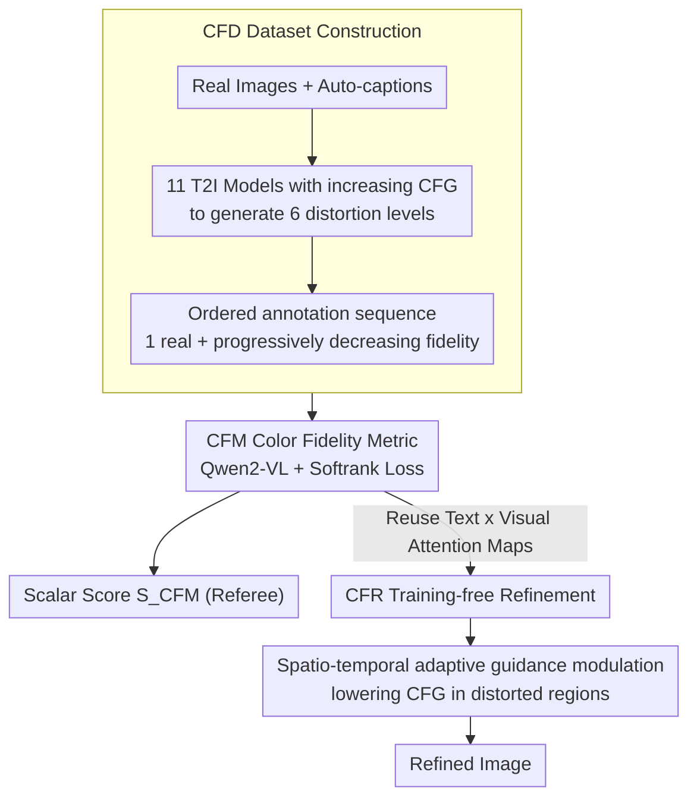

# Too Vivid to Be Real? Benchmarking and Calibrating Generative Color Fidelity

**Conference**: CVPR 2026  
**arXiv**: [2603.10990](https://arxiv.org/abs/2603.10990)  
**Code**: [GitHub](https://github.com/ZhengyaoFang/CFM)  
**Area**: Image Generation  
**Keywords**: color fidelity, text-to-image evaluation, guidance scale, realistic generation, evaluation bias

## TL;DR

Addressing the issue where T2I generated images are "too vivid to look like real photos," this paper proposes the Color Fidelity Dataset (CFD, 1.3M images), the Color Fidelity Metric (CFM, based on Qwen2-VL + softrank loss), and Color Fidelity Refinement (CFR, a training-free spatio-temporal adaptive guidance modulation), forming an integrated evaluation-improvement framework.

## Background & Motivation

**T2I models are overly vivid**: Statistical analysis shows that almost all T2I models, when prompted to generate "photorealistic" images, produce results with significantly higher saturation and contrast than real photographs—"too vivid to be real."

**Amplification of evaluation bias**: Existing metrics (PickScore, ImageReward, HPSv3, MPS) and human ratings all prefer vivid, high-contrast images. Controlled experiments show these metrics systematically assign higher scores to over-saturated images, creating a positive feedback loop.

**Lack of color fidelity evaluation**: Existing metrics measure semantic alignment or aesthetic preference but lack a dedicated dimension for measuring whether the color distribution is close to real photography.

**The double-edged sword of CFG**: A larger Classifier-Free Guidance scale $s$ leads to stronger text alignment but more severe color distortion (over-saturation + high contrast). This controllable relationship provides a tool for constructing ordered color datasets.

## Method

### Overall Architecture

This paper addresses a neglected issue: "realistic" images generated by T2I models are often too vivid, and existing metrics not only fail to detect this but actually prefer over-saturation. It bridges "evaluation" and "improvement" into a single chain: utilizing the monotonic relationship between CFG scale and color distortion to build an ordered annotated dataset (CFD), training a dedicated color fidelity metric (CFM) on it, and then directly reusing CFM's internal attention maps for a training-free refinement module (CFR). CFM acts as both the referee and the source of refinement signals.

### Key Designs

**1. Color Fidelity Dataset (CFD): Automatic ordered annotation using CFG monotonicity**

Color fidelity has not been systematically annotated in the past, and manual ranking is expensive. The authors leverage a key observation: a larger Classifier-Free Guidance scale $s$ enhances text alignment while worsening color distortion (over-saturation + high contrast). This monotonic relationship provides "free" labels for distortion levels.

| Step | Operation | Scale |
|---|---|---|
| Real Image Collection | COCO/Open Images + CLIPIQA + Qwen2.5-VL(72B) filtering | 189,490 images |
| Auto-captioning | Text descriptions generated via Qwen2.5-VL | — |
| CFG-controlled Synthesis | 11 T2I models × 12 categories, generating 6 levels of distortion by increasing CFG | 7 images per set |
| Data Splitting | Training 160K sets / Testing 30K sets | ~1.33M images |

By using 11 T2I models (SDXL, SD3, SD3.5, PixArt-Σ, Kolors, CogView4, Hunyuan-DiT, Flux-dev, Qwen-Image, Playground-v2.5, SRPO) across 12 semantic categories, each set forms an ordered sequence of "1 real + progressively decreasing fidelity." A human-annotated subset, CFD-Human (6690 images × 3 annotators, Spearman consistency > 0.85), is used for validation.

**2. Color Fidelity Metric (CFM): Learning ordered sequences via Softrank loss**

With ordered data, the goal is for the metric to learn "which is more real" within a set rather than simple pairwise comparisons. CFM is based on Qwen2-VL, encoding images and text into a joint sequence:

$$\mathbf{F} = [\mathbf{f}_1^v, \ldots, \mathbf{f}_M^v, \mathbf{f}_1^t, \ldots, \mathbf{f}_N^t] \in \mathbb{R}^{(M+N) \times d}$$

The MLP head outputs token-level logits, and a scalar score $S_{\text{CFM}}$ is extracted from the `<|Reward|>` token. Training employs a Differentiable Softrank Loss: for each set of $K$ images (1 real + $K-1$ levels of distortion), pairwise probabilities and soft ranks are calculated and regressed to the ground truth ranking $R=[1,2,\ldots,K]$ (where the real image is ranked first):

$$P_{ij} = \sigma\left(\frac{r_j - r_i}{\tau}\right), \quad \hat{R}_i = 1 + \sum_{j=0}^{K-1} P_{ij}$$

$$\mathcal{L} = \frac{1}{K} \sum_{i=0}^{K-1} (\hat{R}_i - R_i)^2$$

Compared to pairwise loss, softmasking models the continuous ordinal structure of the entire group, improving accuracy by 7.4% (SynPairs) and Spearman by 6.6. The text branch provides semantic context for "how this scene should look," without which SynPairs accuracy drops by 6.5% and Spearman by 6.0.

**3. Color Fidelity Refinement (CFR): Turning CFM attention into a pixel-level guidance field**

CFR leverages CFM to pinpoint distortions. It uses CFM's attention maps to locate color-distorted regions and adaptively reduces guidance only in those areas during diffusion denoising. Pixel-level attention is first extracted from CFM:

$$\mathbf{A} = \text{softmax}\left(\frac{\mathbf{F}^t (\mathbf{F}^v)^\top}{\kappa}\right) \in \mathbb{R}^{N \times M}$$

The pixel-level attention map $\mathbf{a}'$ is obtained by averaging across the text token dimension, followed by spatio-temporal guidance modulation:

$$s_t(u,v) = s_0 \left[1 - \lambda \alpha(t) \mathbf{a}'(u,v)\right]$$

where $\lambda \in [0,1]$ is the modulation intensity and $\alpha(t) = 1 - t/T$ is a temporal decay factor. Guidance is automatically lowered in high-attention regions with significant color deviation to suppress over-saturation. This process is entirely training-free, plug-and-play, and does not modify model parameters.

### Loss & Training

The training objective for CFM is the Differentiable Softrank Loss described above. CFR does not involve training; it is a spatio-temporal modulation of guidance during inference.

## Key Experimental Results

### CFM Color Fidelity Discrimination Accuracy

| Method | CFD-SynPairs | CFD-Real&Syn |
|---|---|---|
| MUSIQ | 53.4% | 21.5% |
| ImageReward | 44.3% | 42.7% |
| PickScore | 51.4% | 48.5% |
| HPSv3 | 57.5% | 58.3% |
| **CFM (Ours)** | **83.6%** | **80.1%** |

### Correlation with Human Judgment (CFD-Human)

| Metric | Spearman | Pearson | Kendall |
|---|---|---|---|
| ImageReward | 62.8 | 63.5 | 49.2 |
| HPSv3 | 74.4 | 76.0 | 62.8 |
| **CFM (Ours)** | **84.9** | **85.4** | **71.4** |

### CFR Color Refinement Performance

| Model | Setting | FID↓ | CLIPScore↑ | ΔSat.↓ | CFM↑ |
|---|---|---|---|---|---|
| SD3.5 | Original | 13.3 | 28.2 | 0.15 | 4.9 |
| SD3.5 | CFR_HPSv3 | 13.2 | 28.1 | 0.11 | 5.6 |
| SD3.5 | **CFR_CFM** | **13.1** | **28.2** | **0.07** | **6.9** |
| PixArt-Σ | Original | 16.5 | 27.2 | 0.09 | 4.4 |
| PixArt-Σ | **CFR_CFM** | **16.4** | **27.5** | **0.02** | **6.4** |
| Hunyuan | Original | 22.1 | 27.5 | 0.14 | 0.8 |
| Hunyuan | **CFR_CFM** | **19.9** | **27.5** | **0.03** | **2.1** |

- Saturation deviation decreased by 0.08–0.11, CFM increased by 1.3–2.0.
- FID/CLIPScore remains largely unchanged—color refinement does not sacrifice quality or semantics.

### Ablation Study: Spatio-temporal Modulation

| Setting | FID | CLIPScore | ΔSat. | CFM |
|---|---|---|---|---|
| Baseline | 13.3 | 28.2 | 0.15 | 4.9 |
| Time-only | 18.0 | 25.9 | 0.18 | -1.3 |
| Space-only | 13.2 | 28.2 | 0.12 | 6.8 |
| **Full Spatio-temporal** | **13.0** | **28.2** | **0.07** | **6.9** |

- Time-only modulation is harmful (FID +4.7, negative CFM)—globally decaying CFG strength disrupts semantics.
- Spatial modulation is the core of improvement, with temporal decay play a complementary stabilizing role.

### CFM Ablation Study

| Variant | CFD-SynPairs | CFD-Real&Syn | Spearman | Kendall |
|---|---|---|---|---|
| Pairwise loss | 76.2% | 74.8% | 78.3 | 66.1 |
| Visual-only | 77.1% | 74.3% | 78.9 | 67.0 |
| **Ours (softrank+multimodal)** | **83.6%** | **80.1%** | **84.9** | **71.4** |

## Highlights & Insights

1.  **Evaluation bias deserves attention**: Current "human preference alignment" may be leading T2I models away from realism. The preference of alignment metrics for over-saturated images is subtle but persistent.
2.  **Dataset construction via CFG**: Leveraging the monotonic relationship between guidance scale and color distortion to build ordered annotation data avoids expensive manual labeling—a very clever methodology.
3.  **Softrank > Pairwise**: Continuous modeling of ordinal relationships is superior to discrete comparisons, particularly for perceptual quality tasks with inherent ordinal structures.
4.  **Spatio-adaptive guidance**: Generalizing the global CFG scale into a pixel-level adaptive guidance field is a universal technique transferable to other guidance modulation scenarios.

## Related Work & Insights

| Dimension | PickScore/ImageReward/HPSv3/MPS | IQA Methods (MUSIQ/CLIPIQA) | **CFM (Ours)** |
|---|---|---|---|
| Goal | Semantic alignment / Aesthetics | Real image degradation | Color fidelity |
| Training Data | Human preference pairs | Real image distortion labels | CFG-controlled ordered sequences |
| Over-saturation | Systematic preference (high score) | Near random | Correct penalty |
| Human Consistency | Spearman 62.8–74.4 | — | **84.9** |
| Refinement Utility | Weak (attention unrelated to color) | No | Strong (CFR leverages attention) |

## Limitations & Future Work

- Assumes color distortion primarily stems from CFG.
- CFR cannot handle models that do not use CFG.
- Color fidelity is only one dimension of "realism."

## Rating

- Novelty: ⭐⭐⭐⭐ Color fidelity is systematically defined and quantified for the first time; using CFG to build ordered datasets is ingenious.
- Experimental Thoroughness: ⭐⭐⭐⭐⭐ 11-model benchmark + human validation + 3-model CFR experiments + full ablation.
- Writing Quality: ⭐⭐⭐⭐ Clear logic, well-motivated problem, rich visualizations.
- Value: ⭐⭐⭐⭐ Fills a gap in T2I evaluation; training-free refinement is highly practical.

<!-- RELATED:START -->

## Related Papers

- [\[CVPR 2026\] MatPedia: A Universal Generative Foundation for High-Fidelity Material Synthesis](matpedia_a_universal_generative_foundation_for_high-fidelity_material_synthesis.md)
- [\[CVPR 2025\] GCC: Generative Color Constancy via Diffusing a Color Checker](../../CVPR2025/image_generation/gcc_generative_color_constancy_via_diffusing_a_color_checker.md)
- [\[CVPR 2026\] GenColorBench: A Color Evaluation Benchmark for Text-to-Image Generation](gencolorbench_a_color_evaluation_benchmark_for_text-to-image_generation.md)
- [\[CVPR 2026\] Leveraging Multispectral Sensors for Color Correction in Mobile Cameras](leveraging_multispectral_sensors_for_color_correction_in_mobile_cameras.md)
- [\[CVPR 2026\] It's Never Too Late: Noise Optimization for Collapse Recovery in Trained Diffusion Models](its_never_too_late_noise_optimization_for_collapse_recovery_in_trained_diffusion.md)

<!-- RELATED:END -->
