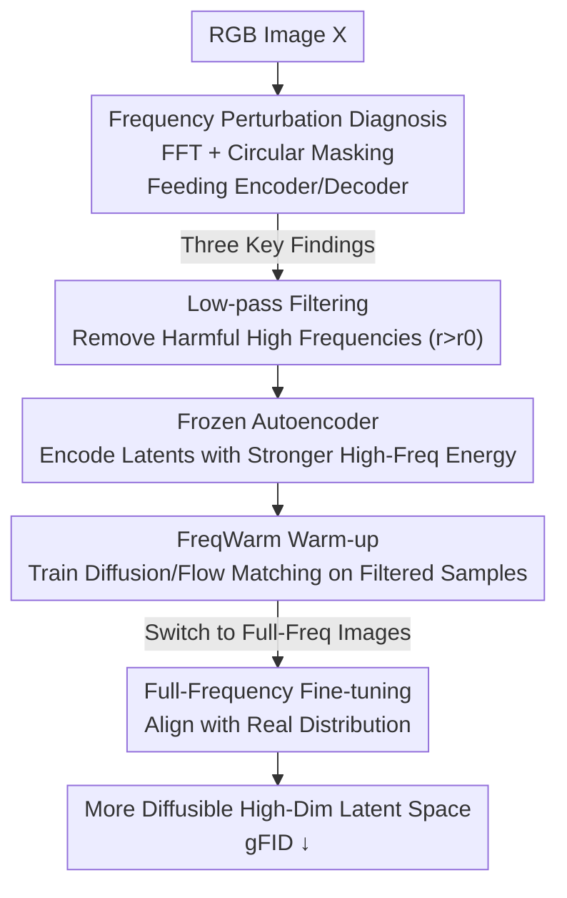

# Toward Diffusible High-Dimensional Latent Spaces: A Frequency Perspective

**Conference**: CVPR 2026  
**Paper**: [CVF Open Access](https://openaccess.thecvf.com/content/CVPR2026/html/Lai_Toward_Diffusible_High-Dimensional_Latent_Spaces_A_Frequency_Perspective_CVPR_2026_paper.html)  
**Code**: Project Page https://bolinlai.github.io/projects/FreqWarm (Official repository not yet available)  
**Area**: Diffusion Models / Image Generation  
**Keywords**: Latent Diffusion, High-Dimensional Latent Spaces, Frequency Analysis, Autoencoders, Plug-and-Play Curriculum

## TL;DR
The authors use frequency perturbation experiments to dissect the high-dimensional trade-off in latent diffusion—where better reconstruction often leads to worse generation. The root cause is identified as the decoder's extreme reliance on high-frequency latent components, while the encoder tends to discard them. Based on this, FreqWarm is proposed: a curriculum that feeds low-pass filtered images to the diffusion model during early training for high-frequency "warm-up" before switching back to full-frequency fine-tuning. This approach reduces the gFID of several high-dimensional VAEs by 4–14 points without modifying any autoencoders.

## Background & Motivation

**Background**: Latent diffusion has become the default paradigm for visual generation, where quality depends heavily on whether the latent space defined by the autoencoder is "diffusible." To reduce token count and improve efficiency, recent tokenizers continuously increase spatial compression rates (from 8× to 32×, 64×, or even 128×) and compensate for capacity by increasing the number of latent channels—examples include DC-AE, Wan2.2-VAE, and LTX-VAE.

**Limitations of Prior Work**: The authors observe a persistent **reconstruction-generation trade-off**: as latent dimensions (channels) increase, reconstruction fidelity (rFID) improves, but generation quality (gFID) first improves and then degrades. Essentially, high-capacity autoencoders reconstruct images better, but diffusion models struggle to learn the distribution within these latent spaces. Low-dimensional spaces (4 or 32 channels) remain more stable, forcing a retreat to lower dimensions and hindering higher compression rates.

**Key Challenge**: gFID is influenced by both reconstruction fidelity (determined by the autoencoder) and the synthesis quality of latent embeddings (determined by the diffusion model). In high dimensions, while the former improves, the latter collapses, indicating the issue lies in the diffusion model's ability to synthesize latent embeddings rather than the autoencoder itself. However, prior improvements (semantic alignment, hierarchical tokenization, 1D serialization) were largely intuition-driven, lacking detailed analysis of which part of the latent space is failing.

**Key Insight**: Following the frequency analysis initiated by SE-VAE (Skorokhodov et al.), the authors employ a more granular perspective—rather than looking at the latent space spectrum as a whole, they investigate the responses of the encoder and decoder to different frequency bands **separately**. This marks the first study of the "cross-space frequency correspondence" between RGB and latent spaces.

**Core Idea**: Frequency perturbation experiments are used to locate the "lesion" (the decoder relies on high frequencies while the encoder discards them). The authors kemudian propose FreqWarm, a plug-and-play curriculum that provides the diffusion model with more high-frequency latent signals during early training, making high-dimensional latent spaces more diffusible without retraining the autoencoder.

## Method

### Overall Architecture

The paper follows a two-step approach: **diagnosis followed by prescription**. The diagnosis (Section 3) uses frequency perturbation experiments to identify the frequency-based cause of the "reconstruction-generation trade-off." The prescription (Section 4) introduces FreqWarm, a plug-and-play curriculum for existing training pipelines.

The diagnosis involves performing a 2D FFT on signals in either RGB or latent space, using a circular mask with radius $r$ to split the spectrum into low/high frequency halves, and observing the outputs after inverse transformation. Key findings: the decoder **heavily relies on high-frequency latent components** for detail, yet the encoder **struggles to encode high frequencies** (extreme high-frequency RGB signals even crowd out the encoding capacity for other high frequencies). This leads to low high-frequency energy in the latent space and "under-exposure" of high-frequency bands during diffusion training.

FreqWarm follows this diagnosis: since "excessive high-frequency RGB input" reduces latent high-frequency energy, these harmful frequencies are **proactively filtered out** during early training. This allows the encoder to produce latent embeddings with stronger, more balanced high-frequency energy, ensuring the diffusion model is sufficiently exposed to the high-frequency distribution early on. After this warm-up, the model is fine-tuned on full-frequency images to align with the real distribution. This process does not modify the autoencoder and can be applied to existing checkpoints.

### Key Designs

**1. Cross-space Frequency Perturbation Diagnosis: Locating the Mismatch**

The authors analyze latent embeddings $Z=E(X)\in\mathbb{R}^{C\times H'\times W'}$ by performing channel-wise 2D FFT: $Z_{freq}=\mathrm{Shift}(\mathrm{FFT}(Z))$. Using a circular mask $M$ with radius $r$, the spectrum is split:

$$Z_{low}=\mathrm{IFFT}(\mathrm{IShift}(M\odot Z_{freq})),\quad Z_{high}=\mathrm{IFFT}(\mathrm{IShift}((1-M)\odot Z_{freq}))$$

Findings: **Finding 1**: Reconstructions using only $Z_{low}$ are blurry, while $Z_{high}$ recovers details and semantics. **Finding 2**: Most RGB information is concentrated in a narrow low-frequency band. **Finding 3**: Increasing RGB high frequencies beyond a point **reduces** high-frequency amplitude in the latent space, likely due to aliasing. This explains why high-dimensional diffusion models fail: they are under-exposed to the high-frequency latent components the decoder requires.

**2. FreqWarm: Warm-up with "High-Frequency Rich" Latent Samples**

Based on Finding 3, FreqWarm **filters out RGB frequencies where $r>r_0$** early in training. By removing harmful high frequencies that crowd encoding capacity, the frozen encoder produces latent embeddings with **stronger and more balanced high-frequency components**. The diffusion or flow-matching model undergoes early warm-up on these samples to avoid underfitting the high-frequency distribution.

**3. Two-stage Curriculum + Threshold $r_0=0.2$**

FreqWarm is a **curriculum**; after the warm-up, the model switches back to full-frequency images for fine-tuning. The optimal threshold is found to be $r_0=0.2$ (normalized radius). This value acts as a sweet spot, removing harmful frequencies with minimal impact on image quality while significantly boosting latent energy.

### Loss & Training
The method maintains the original loss functions and training objectives of the diffusion/flow-matching models. Training uses a batch size of 4096, $r_0=0.2$, and is conducted on face-blurred ImageNet using 32 A100 GPUs for 5–7 days.

## Key Experimental Results

### Main Results

On ImageNet 512×512, using USiT-H across three high-dimensional autoencoders (w/o CFG):

| Autoencoder | Configuration | gFID ↓ | IS ↑ |
|----------|------|--------|------|
| Wan2.2-AE-f16c48 | Baseline | 43.67 | 33.48 |
| Wan2.2-AE-f16c48 | +FreqWarm | 29.56 (**-14.11**) | 46.16 (+12.68) |
| LTX-AE-f32c128 | Baseline | 24.18 | 61.60 |
| LTX-AE-f32c128 | +FreqWarm | 18.05 (**-6.13**) | 76.06 (+14.46) |
| DC-AE-f32c128 | Baseline | 13.84 | 85.40 |
| DC-AE-f32c128 | +FreqWarm | 9.42 (**-4.42**) | 108.80 (+23.40) |

The improvement is consistent across four denoisers (DiT-XL, UViT-H, USiT-H, USiT-2B). Notably, high-dimensional AEs with FreqWarm can outperform lower-dimensional AEs (e.g., DC-AE-f32c128+FreqWarm beats original DC-AE-f32c64).

### Ablation Study

**Channel Analysis** (DC-AE, gFID):

| Configuration | Baseline | FreqWarm | Gain ∆ |
|------|--------|----------|--------|
| f32c32 | 5.75 | 5.74 | 0.02 |
| f32c128 | 13.84 | 9.42 | 4.42 |
| f32c512 | 54.84 | 42.66 | 12.18 |

**Threshold $r_0$ Ablation** (DC-AE-f32c128 + USiT-H):

| $r_0$ | gFID ↓ | IS ↑ |
|-------|--------|------|
| 0.05 | 23.11 | 65.50 |
| **0.20** | **9.42** | **108.80** |
| 0.40 | 12.88 | 90.49 |

### Key Findings
- **Gain scales with dimensionality**: The more latent channels, the larger the benefit of FreqWarm. This aligns with the discovery that higher dimensions suffer more from high-frequency suppression.
- **Single-peaked threshold**: $r_0=0.2$ is the sweet spot; lower values lose detail, while higher values fail to clear harmful frequencies.
- **Saving generation without retraining VAEs**: Since the autoencoder remains frozen, all improvements stem from better high-frequency exposure on the diffusion side.

## Highlights & Insights
- **Attributing an old trade-off to an actionable frequency mechanism**: The study moves beyond the vague consensus that "high dimensions are hard" to a specific mismatch where decoders demand high frequencies that encoders suppress.
- **Cross-space frequency perspective**: Perturbing RGB while measuring the latent spectrum reveals aliasing effects invisible to latent-only analysis.
- **Lightweight and transferable**: FreqWarm is a data curriculum that requires no architectural changes or VAE retraining, making it easy to integrate into any DiT/UViT pipeline.
- **Authenticity vs. Amplitude**: The authors clarify that the goal is not merely to increase high-frequency amplitude but to enable the model to learn **authentic** high-frequency distributions required by the decoder.

## Limitations & Future Work
- **Evaluation limited to ImageNet**: While Wan2.2 and LTX are video tokenizers, experiments were conducted on single-frame images; video generation performance remains unexplored.
- **Static thresholding**: The use of a fixed circular low-pass mask is a hard cutoff; adaptive or scheduled thresholds were not investigated.
- **Speculative mechanism**: The attribution of high-frequency drops to aliasing is a hypothesis without definitive proof in the text.

## Related Work & Insights
- **Comparison with SE-VAE**: While SE-VAE looked at latent spectra, this work separates the encoder/decoder responses and introduces cross-space analysis.
- **Standard AE scaling**: Unlike DC-AE or ReaLS which modify the VAE architecture, FreqWarm is orthogonal and can be used to improve already scaled models.
- **Fourier Diffusion Analysis**: Unlike works analyzing the diffusion process itself, this focus is on the autoencoder-induced frequency mismatch.

## Rating
- Novelty: ⭐⭐⭐⭐⭐ 
- Experimental Thoroughness: ⭐⭐⭐⭐ 
- Writing Quality: ⭐⭐⭐⭐⭐ 
- Value: ⭐⭐⭐⭐⭐ 

<!-- RELATED:START -->

## Related Papers

- [\[CVPR 2026\] Frequency-Aware Flow Matching for High-Quality Image Generation](freqflow_frequency_aware_flow_matching.md)
- [\[ICML 2026\] The Latent Color Subspace: Emergent Order in High-Dimensional Chaos](../../ICML2026/image_generation/the_latent_color_subspace_emergent_order_in_high-dimensional_chaos.md)
- [\[CVPR 2026\] FreqEdit: Preserving High-Frequency Features for Robust Multi-Turn Image Editing](freqedit_preserving_high-frequency_features_for_robust_multi-turn_image_editing.md)
- [\[ECCV 2024\] FouriScale: A Frequency Perspective on Training-Free High-Resolution Image Synthesis](../../ECCV2024/image_generation/fouriscale_a_frequency_perspective_on_training-free_high-resolution_image_synthe.md)
- [\[CVPR 2026\] Latent Diffusion Inversion Requires Understanding the Latent Space](latent_diffusion_inversion_requires_understanding_the_latent_space.md)

<!-- RELATED:END -->
