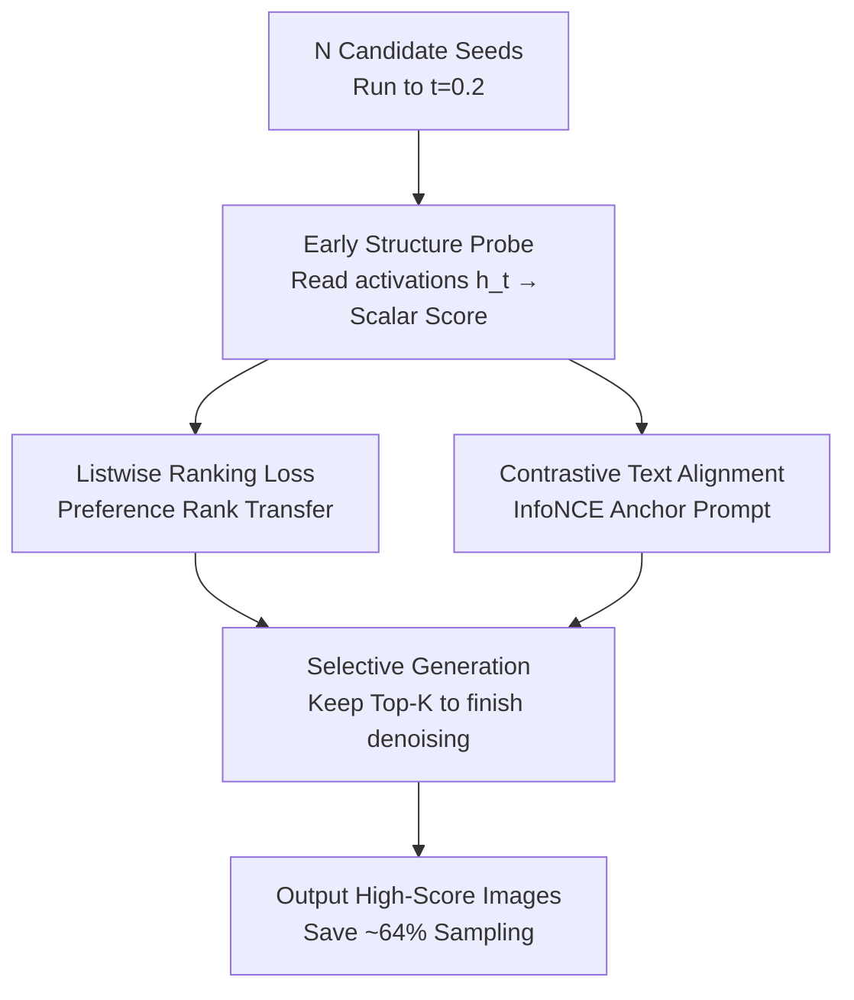

# Toward Early Quality Assessment of Text-to-Image Diffusion Models

**Conference**: CVPR 2026  
**Paper**: [CVF Open Access](https://openaccess.thecvf.com/content/CVPR2026/html/Guo_Toward_Early_Quality_Assessment_of_Text-to-Image_Diffusion_Models_CVPR_2026_paper.html)  
**Code**: https://github.com/Guhuary/ProbeSelect (Available)  
**Area**: Diffusion Models / Image Generation  
**Keywords**: Early Quality Assessment, Text-to-Image Diffusion, Intermediate Activation Probes, Selective Generation, Sampling Acceleration

## TL;DR
This paper proposes Probe-Select, a lightweight probe attached to the intermediate activations of diffusion denoisers. By running only 20% of the generation trajectory, it predicts the final quality score of an image, allowing for the early pruning of unpromising random seeds. This approach reduces the sampling overhead of the "generate-then-select" pipeline by approximately 64% while simultaneously improving the quality of the retained images.

## Background & Motivation
**Background**: In current text-to-image (T2I) diffusion and flow-matching models, the "generate-then-select" paradigm is widely adopted in engineering. This involves generating multiple candidate images using different random seeds for the same prompt and then using automated evaluators like CLIPScore, ImageReward, PickScore, or HPS to select the best one or two.

**Limitations of Prior Work**: This process is extremely computationally wasteful. Each candidate must undergo dozens to hundreds of denoising steps to complete generation, yet all quality evaluators (CLIPScore / ImageReward / HPS…) are **post-hoc**—they can only process "fully denoised final products." Consequently, significant compute is wasted on low-quality candidates destined for elimination: one must fully render a poor image before knowing it is poor.

**Key Challenge**: Quality signals are only readable at the **end** of the trajectory, but the most cost-effective time for elimination decisions is at the **beginning**. Post-hoc evaluators inherently cannot consume "still noisy" intermediate latent variables or activations, preventing early pruning. Previous work such as HEaD attempted to use cross-attention maps to predict object hallucinations for binary "continue/stop" decisions, but this remains relatively coarse.

**Goal**: Define and solve **Early Quality Assessment (EQA)**—predicting the final image quality using only a small initial segment of denoising steps to timely interrupt unpromising paths.

**Key Insight**: The authors' key observation (Fig. 1 / Fig. 3) is that although early latent variables $z_t$ are still very noisy, certain **internal** intermediate activations of the denoiser already encode stable coarse structures—object layout, spatial arrangement, and semantic grouping. These structures appear early (at 20% of the trajectory) and change slowly over time. Since final quality is largely determined by these coarse structures, predicting final quality from early activations is feasible.

**Core Idea**: Use a lightweight probe to read early denoiser activations and align its output with external evaluator scores. This allows for "fortelling" the final quality to implement an early pruning gate for the "generate-then-select" process—without modifying the generator, sampler, or scheduler.

## Method

### Overall Architecture
Probe-Select is a **plug-in evaluator** attached to a frozen diffusion denoiser $f_\theta$. During the training phase (Fig. 2), for each caption in MS-COCO, 5 seeds are used to generate images. Intermediate activations $h_t$ at an early time point $t$ (e.g., 0.2) are cached, and 8 offline evaluators provide "ground truth" scores for the finished images. The probe reads $h_t$ and timestep $t$ to output a scalar predicted score $\hat y_t$, using a ranking loss to align with the relative preferences of the evaluators and a contrastive loss to align with prompt semantics. During the inference phase, $N$ candidate seeds are run only to the early checkpoint $t=0.2$, activations are extracted and scored by the probe, and only the Top-$K$ candidates are allowed to complete the denoising process, while the rest are discarded.

The pipeline consists of three components: **Early Structure Probe** (extracting quality signals from noisy activations), **Dual-Objective Training** (aligning scores with evaluator rankings and prompt sensitivity), and **Selective Generation** (reducing compute during inference).

### Key Designs

**1. Early Structure Probe: Extracting Final Quality from Noisy Activations**

The pain point is that post-hoc evaluators can only process finished images. Probe-Select does the opposite: it attaches lightweight probes to selected blocks of the denoiser $f_\theta$ at an early checkpoint $t$ (e.g., 20% of total steps). It consists of: **feature taps** to extract intermediate activations $h_t \in \mathbb{R}^{C\times H\times W}$; a **probe encoder $g_\phi$** (a miniature vision encoder) that processes $h_t$ and timestep embeddings to produce $u_t = g_\phi(h_t, t) \in \mathbb{R}^{d_h}$ via global pooling; and a **projection head $p_\phi$** (a small MLP) that maps $u_t$ to a scalar score $\hat y_t = p_\phi(u_t)$. Formally, a predictor is learned such that $E_\phi(h_t, t) = p_\phi(g_\phi(h_t,t)) \to \hat y_{t,m} \approx R_m(x_1)$, approximating the score of an external evaluator $R_m$ on the finished image $x_1$.

This is feasible because PCA visualization (Fig. 3) reveals that in the SD2 denoiser, **middle-to-late layers** (especially the 3rd upsampling block Up-3) stably retain identifiable shapes and boundaries even when the upstream input is heavily corrupted. The probe uses these stable layers as default taps. The probe has minimal parameters and does not alter $f_\theta$ or the sampler, making it **backbone and scheduler agnostic** and compatible with SD2, SD3, FLUX, etc.

**2. Listwise Ranking Loss: Transferring Relative Preferences Rather Than Absolute Scores**

Directly regressing $u_t$ to absolute evaluator scores is unstable and often ignores textual semantics. However, only the **ranking** is needed—selecting the best among 5 candidates. The authors use a softmax listwise loss (Eq. 5): for $B$ samples in a batch, it ensures the early prediction $\hat y_t^i$ produces a ranking consistent with the ground truth $y_i$:

$$\mathcal{L}_{\text{list}} = -\frac{1}{B}\sum_i^B \log \frac{\exp(\hat y_t^i / \tau_{\text{list}})}{\sum_{j:\, y_j + \alpha < y_i} \exp(\hat y_t^j / \tau_{\text{list}})}$$

The denominator sums only over samples where the ground truth is significantly worse ($y_j + \alpha < y_i$), teaching the probe to rank good seeds above poor ones. The temperature $\tau_{\text{list}}$ and margin $\alpha$ are annealed over training epochs $e$ to bridge coarse-to-fine ranking. This loss focuses on relative order, forcing the probe to identify discriminative structural cues.

**3. Contrastive Textual Alignment (InfoNCE): Anchoring Probe Representations to Prompts**

Ranking alone is insufficient; the probe might learn a "universal aesthetic" score independent of the text. To maintain prompt sensitivity, the probe embedding $u_t$ is aligned with the prompt embedding $e_p = W_p E_{\text{text}}(p)$ (from a frozen text encoder like CLIP) using an InfoNCE loss (Eq. 6):

$$\mathcal{L}_{\text{Align}} = -\frac{1}{B}\sum_{i=1}^B \log \frac{\exp(\cos(u_i, e_p^i)/\tau_{\text{Align}})}{\sum_{j=1}^B \exp(\cos(u_i, e_p^j)/\tau_{\text{Align}})}$$

The total loss is $\mathcal{L} = \mathcal{L}_{\text{list}} + \lambda_{\text{Align}}\mathcal{L}_{\text{Align}}$ with $\lambda_{\text{Align}}=10$. This ensures the probe "knows" what the image is supposed to be, allowing the predicted score to reflect prompt-image alignment.

**4. Selective Generation: Pruning Unpromising Seeds during Inference**

With a probe that can score at $t=0.2$, inference becomes a pruning task. For $N$ seeds per prompt, all run to $t_e=0.2$ to extract activations and get scores $\{\hat y_t^i\}$. Only the Top-$K$ ($K \ll N$) proceed to full denoising. The expected computational cost is approximately:

$$\text{Cost Ratio} \approx \eta + (1-\eta)\frac{K}{N}$$

Where $\eta$ is the early checkpoint ratio (0.2). For $K=1, N=5$, the ratio is $0.36$, saving ~64% compute.

## Key Experimental Results

### Main Results
**Spearman Correlation: Early Prediction vs. Final Quality (Table 1, excerpt $t=0.2$)**: Correlations across four backbones are already high at 20% and remain stable through $t=0.6$.

| Backbone | CLIPScore | PickScore | BLIP-ITM | ImageReward | HPSv2.1 |
|----------|-----------|-----------|----------|-------------|---------|
| SD2 | 0.71 | 0.79 | **0.99** | **0.99** | 0.64 |
| SD3-M | 0.78 | 0.84 | **0.99** | **0.99** | 0.79 |
| SD3-L | 0.79 | 0.84 | **0.99** | **0.99** | 0.77 |
| FLUX.1-dev | 0.75 | 0.86 | **0.99** | **0.99** | 0.78 |

**Selective Generation Results (Table 2, excerpt)**: Using Top-1 ($K=1, N=5$) selection vs. baseline average.

| Configuration | ImageReward | HPSv2.1 | CLIPScore |
|------|-------------|---------|-----------|
| SD2 (Baseline Avg) | 0.49 | 26.95 | 31.95 |
| SD2-IR (Ours) | **1.59** | **29.03** | 33.50 |
| SD3-M (Baseline) | 1.12 | 29.64 | 32.43 |
| SD3-M-IR (Ours) | **1.83** | 31.17 | 34.15 |
| FLUX.1-dev (Baseline) | 0.92 | 29.14 | 30.92 |
| FLUX.1-dev-IR (Ours) | **1.79** | 31.47 | **33.04** |

Performance improves across all backbones. FID also improves (e.g., SD3-M 25.26 → 25.01).

### Ablation Study
- **Time Stability**: $t=0.1$ signals are weak, but by $t=0.2$, Spearman correlation saturates, identifying 20% as the "sweet spot" for cost-efficiency.
- **Candidate Trade-offs**: Quality increases with $N$ but plateaus around $N \approx 50$. The gains come from the probe's ability to rank early rather than simply increasing the number of seeds.

### Key Findings
- **20% is the Golden Inflection Point**: Coarse structures stabilize by the one-fifth mark of the trajectory.
- **Evaluator Variance**: Metrics focusing on global composition (ImageReward) align better with early activations than those focusing on fine textures (CLIPScore).
- **Gains from Ranking**: The value lies in identifying high-quality seeds early rather than brute-forcing more generations.

## Highlights & Insights
- **Shifting "Evaluation" to an Online Process**: Quality scores move from being end-of-process judges to in-process navigators.
- **New Use for Internal Representations**: Leverages the "emerge early, change slowly" nature of U-Net activations for quality assessment.
- **Ranking Loss with Annealing**: A robust paradigm for tasks requiring relative preference under noisy conditions.
- **Zero-Invasive Plugin**: No changes required to architecture or samplers, enabling easy deployment.

## Limitations & Future Work
- **Backbone Dependency**: Requires per-model training and large-scale data caching.
- **Weaknesses in Detail-Sensitive Metrics**: Early pruning might miss seeds that improve significantly in high-frequency details (e.g., hands, text).
- **Seed-Level Only**: Pruning happens at the seed level rather than implementing adaptive step control within a single trajectory.

## Related Work & Insights
- **vs. Diffusion Acceleration**: Unlike distillation or flow-matching which modify the sampler, this method is complementary, reducing overhead via efficient evaluation.
- **vs. Post-hoc Evaluators**: Probe-Select distills the "preferences" of these evaluators into an early-stage probe.
- **vs. HEaD**: Offers continuous scoring and Top-$K$ ranking compared to HEaD's binary hallucination detection.

## Rating
- Novelty: ⭐⭐⭐⭐
- Experimental Thoroughness: ⭐⭐⭐⭐
- Writing Quality: ⭐⭐⭐⭐
- Value: ⭐⭐⭐⭐

<!-- RELATED:START -->

## Related Papers

- [\[CVPR 2026\] TINA: Text-Free Inversion Attack for Unlearned Text-to-Image Diffusion Models](tina_text-free_inversion_attack_for_unlearned_text-to-image_diffusion_models.md)
- [\[CVPR 2026\] Erasing Thousands of Concepts: Towards Scalable and Practical Concept Erasure for Text-to-Image Diffusion Models](erasing_thousands_of_concepts_towards_scalable_and_practical_concept_erasure_for.md)
- [\[CVPR 2026\] DBMSolver: A Training-free Diffusion Bridge Sampler for High-Quality Image-to-Image Translation](dbmsolver_a_training-free_diffusion_bridge_sampler_for_high-quality_image-to-ima.md)
- [\[CVPR 2026\] Test-Time Alignment of Text-to-Image Diffusion Models via Null-Text Embedding Optimisation](test-time_alignment_of_text-to-image_diffusion_models_via_null-text_embedding_op.md)
- [\[CVPR 2026\] Frequency-Aware Flow Matching for High-Quality Image Generation](freqflow_frequency_aware_flow_matching.md)

<!-- RELATED:END -->
