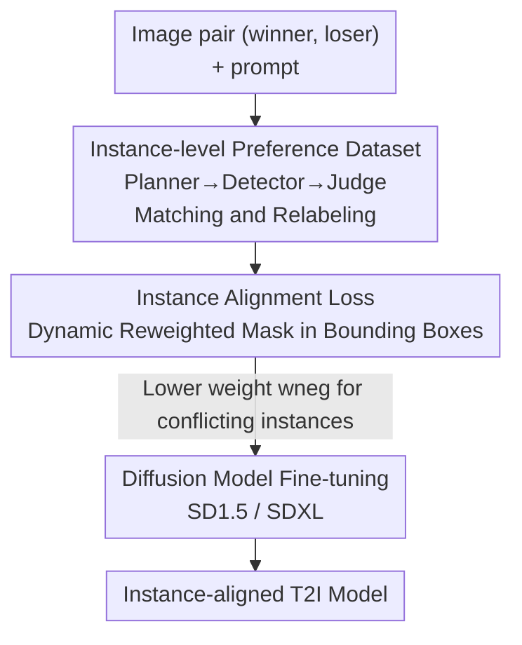

# Towards Fine-Grained Attribution: Instance-Aware Preference Optimization for Aligning Diffusion Models

**Conference**: CVPR 2026  
**Paper**: [CVF Open Access](https://openaccess.thecvf.com/content/CVPR2026/html/Sun_Towards_Fine-Grained_Attribution_Instance-Aware_Preference_Optimization_for_Aligning_Diffusion_Models_CVPR_2026_paper.html)  
**Area**: Diffusion Models / Preference Alignment  
**Keywords**: Diffusion Model Alignment, DPO, Instance-level Credit Assignment, Preference Optimization, Spatially Sparse Reward  

## TL;DR
To address the spatially sparse reward problem in DPO-based diffusion model alignment—where a single preference label is assigned to an entire image—IAPO utilizes a VLM and a detector to automatically annotate an instance-level preference dataset. By employing an instance alignment loss with a dynamically reweighted mask, it refines credit assignment from image-level granularity to individual object granularity, achieving SOTA performance on multiple benchmarks with a training efficiency 3.27x higher than InPO.

## Background & Motivation

**Background**: Currently, the mainstream approach for aligning text-to-image diffusion models with human feedback is Direct Preference Optimization (DPO). Given a prompt and a pair of images $(x_0^w, x_0^l)$ (human preferred winner/loser), DPO incorporates the Bradley-Terry preference model into the diffusion loss to directly optimize the model on preference data. This eliminates the need for explicit reward model training and has led to methods like Diffusion-DPO, KTO, and InPO.

**Limitations of Prior Work**: The supervisory signals in DPO are **image-level**, meaning a pair of images has only one win/lose label. However, an "overall preferred" image may contain instances of poor quality; conversely, a "globally rejected" image might contain objects that are actually better rendered. The paper provides a clear example: a winning image might have superior composition, but contains an eagle with four claws, whereas the losing image renders the "eagle" correctly. Spreading the positive preference signal uniformly across all pixels essentially rewards the incorrectly drawn eagle and punishes the correct one, leading to misaligned credit assignment.

**Key Challenge**: This is a **spatially sparse reward** problem. Existing improvements mostly focus on **temporal** credit assignment—attempting to distribute the image-level score across various diffusion timesteps (e.g., training latent reward models or training-free intermediate latent evaluation). However, they neglect the spatial sparsity inherent to images, where reward signals are mismatched across pixels or instances. Statistically, the authors found that instance pairs where the global preference conflicts with the instance preference account for approximately **46.3%** of the entire dataset—meaning nearly half of the supervisory signals are problematic.

**Goal**: To advance the alignment objective from image-level to instance-level, ensuring each instance receives a preference signal that matches its actual quality. This requires solving two sub-problems: (1) Where to obtain instance-level preference labels? (2) How to modify the DPO loss to accommodate instances of different sizes without introducing training bias?

**Key Insight**: Construct the first instance-level preference dataset (via auto-annotation) and utilize a **dynamically reweighted mask** to modulate the loss weight within detection boxes—lowering the weight in regions where instance preference conflicts with global preference to direct the model's attention toward features that truly determine human preference.

## Method

### Overall Architecture
IAPO is a two-stage framework. **Stage 1**: An automated annotation pipeline is run on Pick-a-Pic v2, employing Planner, Detector, and Judge roles to identify corresponding instances in each image pair, localize them with bounding boxes, and re-label them to build an instance-level preference dataset. **Stage 2**: Based on this fine-grained dataset, an instance alignment loss is designed using a dynamically reweighted mask to modulate pixel-wise diffusion DPO loss weights within detection boxes, amplifying signals for key instances and suppressing interference from conflicting ones.

### Key Designs

**1. Instance-level Preference Dataset: Auto-decoupling Global Labels using VLM and Detector**

The fundamental flaw of global labels is "ambiguous credit assignment"—a global signal is spread evenly across all visual elements. The authors address this by expanding the dataset from $\mathcal{D}=\{(x_0^w, x_0^l, c)\}$ to $\mathcal{D}=\{(x_0^w, x_0^l, c, \{(b_n^w, b_n^l, \rho_n)\}_{n=1}^N)\}$, where $b_n^w, b_n^l$ are the bounding boxes for the $n$-th instance in the winner/loser images, and $\rho_n$ is the instance-level preference: $\rho_n=0$ if the instance in the winner is better, and $\rho_n=1$ if the instance in the loser is actually better (conflicting with the global label).

Annotation is performed by three roles. The **Planner** (VLM) identifies shared salient instances; for example, if both images contain an eagle, it outputs `Matched Instance:[Eagle]`. The **Detector** (Grounding-DINO) receives the description and localizes the regions in both images. The **Judge** (VLM) compares the detected instance pairs by cropping them into patches and resizing them to eliminate background interference. Implementations use Qwen2.5-VL-7B for the Planner and Judge, and Grounding-DINO for the Detector. The pipeline auto-annotated **959,040** image pairs from Pick-a-Pic v2, producing **1,205,593** instance preference pairs, of which 558,352 pairs (approx. 46.3%) exhibited preference conflicts.

**2. Dynamic Reweighted Mask: Down-weighting "Conflicting Instances" within Bounding Boxes**

To modify the loss using these labels without introducing bias from varying instance sizes, the authors employ **spatially adaptive weighting**. Masks $M^w, M^l \in \mathbb{R}^{H\times W}$ are constructed using a hyperparameter $w_{neg}\ (\le 1)$. For regions where the $n$-th instance preference conflicts with the global preference ($\rho_n=1$), weights within boxes $b_n^w, b_n^l$ are set to $w_{neg}$ to penalize the mismatch; other regions are weighted as 1:

$$M_n^*(i,j) = \begin{cases} w_{neg} & \text{if } (i,j)\in b_n^* \text{ and } \rho_n=1 \\ 1 & \text{otherwise} \end{cases}$$

Weights are averaged for overlapping instances $M^* = \frac{1}{N}\sum_{n=1}^N M_n^*$, then normalized to unit mean $M^* = M^*/\mathbb{E}[M^*]$ to avoid loss scale mismatch between winner/loser due to resolution differences. This design modulates the learning direction pixel-wise, shifting gradient importance away from incorrect instances.

**3. Instance Alignment Loss: Incorporating Masks into Diffusion DPO**

Following InPO, DDIM inversion (under 10 steps) provides a precise approximation of intermediate states $x_t^*$. The instance-level alignment is achieved by applying the masks $M^w, M^l$ element-wise ($\odot$) to the noise prediction loss:

$$\mathcal{L}(\theta) = -\mathbb{E}\,\log\sigma\Big(-\beta T\omega(\lambda_t)\big[(\|\epsilon^w-\epsilon_\theta(x_t^w,t)\|_2^2-\|\epsilon^w-\epsilon_{ref}(x_t^w,t)\|_2^2)\odot M^w - (\|\epsilon^l-\epsilon_\theta(x_t^l,t)\|_2^2-\|\epsilon^l-\epsilon_{ref}(x_t^l,t)\|_2^2)\odot M^l\big]\Big)$$

This extends the Bradley-Terry preference paradigm directly to the instance level, distinguishing IAPO from methods like PatchDPO which rely on reference image similarity.

### Loss & Training
Backbones are SD1.5 and SDXL, trained on Pick-a-Pic v2 (58,960 unique prompts). SDXL uses the Adafactor optimizer, DDIM inversion (CFG=0, 10 steps), and gradient accumulation of 128 (effective batch size 1024 pairs). SD1.5 uses direct sampling of $\epsilon^*$ and gradient accumulation of 256. $\beta$ is set to 2000 for SD1.5 and 5000 for SDXL. Training spans 200–300 steps on 8x H800 GPUs.

## Key Experimental Results

### Main Results
Evaluated on Parti-Prompts, HPD v2, and Pick-a-Pic v2 using Aesthetic, PickScore, HPS, and CLIP scorers. IAPO outperforms baselines across nearly all metrics and datasets.

| Dataset / Metric (mean) | SD1.5 base | DPO | KTO | InPO | IAPO (Ours) |
|--------|------|------|------|------|------|
| HPD v2 · Aesthetic | 5.4338 | 5.5856 | 5.7249 | 5.8064 | **5.9261** |
| HPD v2 · PickScore | 20.8424 | 21.2972 | 21.5833 | 21.9131 | **22.0227** |
| HPD v2 · HPS | 26.8804 | 27.3898 | 28.3047 | 28.5003 | **28.6379** |
| Pick-a-Pic v2 · Aesthetic | 5.3211 | 5.4690 | 5.5845 | 5.6566 | **5.7842** |
| Parti-Prompts · Aesthetic | 5.3112 | 5.4524 | 5.5094 | 5.5681 | **5.7270** |

On SDXL, IAPO maintains a lead over InPO. The gain is smaller than on SD1.5, likely because SDXL already exceeds the quality of the models used to generate the Pick-a-Pic dataset.

### Ablation Study
Training efficiency is a major advantage: SOTA results were achieved in just 17.6 GPU hours on H800.

| Model | DPO | KTO | InPO | IAPO |
|------|------|------|------|------|
| PickScore ↑ | 21.05 | 21.20 | 21.49 | **21.58** |
| GPU hours ↓ | ~204.8 | ~1056.0 | ~57.6 | **~17.6** |

IAPO is 60.0× faster than KTO and 3.27× faster than InPO.

Ablation on $w_{neg}$ (Pick-a-Pic v2): $w_{neg}=1.0$ is equivalent to excluding instance-level data.

| $w_{neg}$ | Aesthetic | PickScore | HPS | CLIP |
|------|------|------|------|------|
| 1.0 (No Instance) | 5.73 | 21.52 | 27.76 | 34.66 |
| 0.5 | 5.76 | 21.53 | 27.75 | 34.75 |
| 0.0 | **5.78** | **21.58** | **27.85** | 34.70 |

### Key Findings
- Image quality metrics improve monotonically as $w_{neg}$ decreases, with $w_{neg}=0$ (completely nullifying weights in conflicting regions) performing best.
- The efficiency gain stems from precise learning signals: by not wasting gradients on mismatched instance regions, the model learns faster.
- SDXL gains are capped by the dataset quality rather than the method efficacy.

## Highlights & Insights
- **Isolating Spatially Sparse Rewards**: Unlike previous work focused on temporal credit assignment, this paper identifies image-specific spatial misalignment.
- **Minimalist yet Precise**: Modifying the loss with simple masks ($\odot M^*$) cleanly extends the Bradley-Terry paradigm to instance-level without over-complicating the framework.
- **Transferable Pipeline**: The Planner/Detector/Judge auto-annotation workflow is applicable to any preference task requiring fine-grained localization.
- **Efficiency Paradox**: Fine-grained attribution typically implies higher costs, but here it reduces training time by up to 12× compared to DPO by avoiding gradient noise from misaligned regions.

## Limitations & Future Work
- **Dataset Ceiling**: Pick-a-Pic v2 was generated by weaker models; a dataset tailored for stronger models like SDXL is needed.
- **Dependency on External Models**: Annotation quality relies on Qwen2.5-VL-7B and Grounding-DINO; biases or detection failures in these models affect the labels.
- **Foreground Focus**: The current mask only covers salient objects identified by the Planner; background and texture preferences remain image-level.
- **Extremity of $w_{neg}=0$**: Completely zeroing out weights for conflicting regions might discard useful information in more complex scenarios.

## Related Work & Insights
- **vs Diffusion-DPO / InPO**: IAPO adds a spatial mask to their frameworks; it can be viewed as an instance-level extension of InPO's temporal credit assignment.
- **vs Diffusion-KTO**: KTO changes the algorithmic form of preference modeling, while IAPO changes the granularity of supervision. IAPO is significantly more efficient.
- **vs PatchDPO**: PatchDPO is geared towards personalized reference-based generation, whereas IAPO performs general human preference alignment without needing references.

## Rating
- Novelty: ⭐⭐⭐⭐ First to define spatial sparse rewards and build an instance-level preference dataset.
- Experimental Thoroughness: ⭐⭐⭐⭐ Comprehensive cross-backbone results, though some ablation details are relegated to the appendix.
- Writing Quality: ⭐⭐⭐⭐ Clear motivation with intuitive examples (e.g., the four-clawed eagle).
- Value: ⭐⭐⭐⭐ Provides a reusable dataset and annotation paradigm while significantly reducing training costs.

<!-- RELATED:START -->

## Related Papers

- [\[AAAI 2026\] Margin-aware Preference Optimization for Aligning Diffusion Models without Reference](../../AAAI2026/image_generation/margin-aware_preference_optimization_for_aligning_diffusion_models_without_refer.md)
- [\[ICML 2025\] Smoothed Preference Optimization via ReNoise Inversion for Aligning Diffusion Models with Varied Human Preferences](../../ICML2025/image_generation/smoothed_preference_optimization_via_renoise_inversion_for_aligning_diffusion_mo.md)
- [\[CVPR 2026\] Fine-Grained GRPO for Precise Preference Alignment in Flow Models](fine-grained_grpo_for_precise_preference_alignment_in_flow_models.md)
- [\[CVPR 2026\] CRAFT: Aligning Diffusion Models with Fine-Tuning Is Easier Than You Think](craft_aligning_diffusion_models_with_finetuning_is_easier_than_you_think.md)
- [\[CVPR 2026\] CogniEdit: Dense Gradient Flow Optimization for Fine-Grained Image Editing](cogniedit_dense_gradient_flow_optimization_for_fine-grained_image_editing.md)

<!-- RELATED:END -->
## Related Papers

- [\[AAAI 2026\] Margin-aware Preference Optimization for Aligning Diffusion Models without Reference](../../AAAI2026/image_generation/margin-aware_preference_optimization_for_aligning_diffusion_models_without_refer.md)
- [\[ICML 2025\] Smoothed Preference Optimization via ReNoise Inversion for Aligning Diffusion Models with Varied Human Preferences](../../ICML2025/image_generation/smoothed_preference_optimization_via_renoise_inversion_for_aligning_diffusion_mo.md)
- [\[CVPR 2026\] Fine-Grained GRPO for Precise Preference Alignment in Flow Models](fine-grained_grpo_for_precise_preference_alignment_in_flow_models.md)
- [\[CVPR 2026\] CRAFT: Aligning Diffusion Models with Fine-Tuning Is Easier Than You Think](craft_aligning_diffusion_models_with_finetuning_is_easier_than_you_think.md)
- [\[CVPR 2026\] CogniEdit: Dense Gradient Flow Optimization for Fine-Grained Image Editing](cogniedit_dense_gradient_flow_optimization_for_fine-grained_image_editing.md)

<!-- RELATED:END -->
