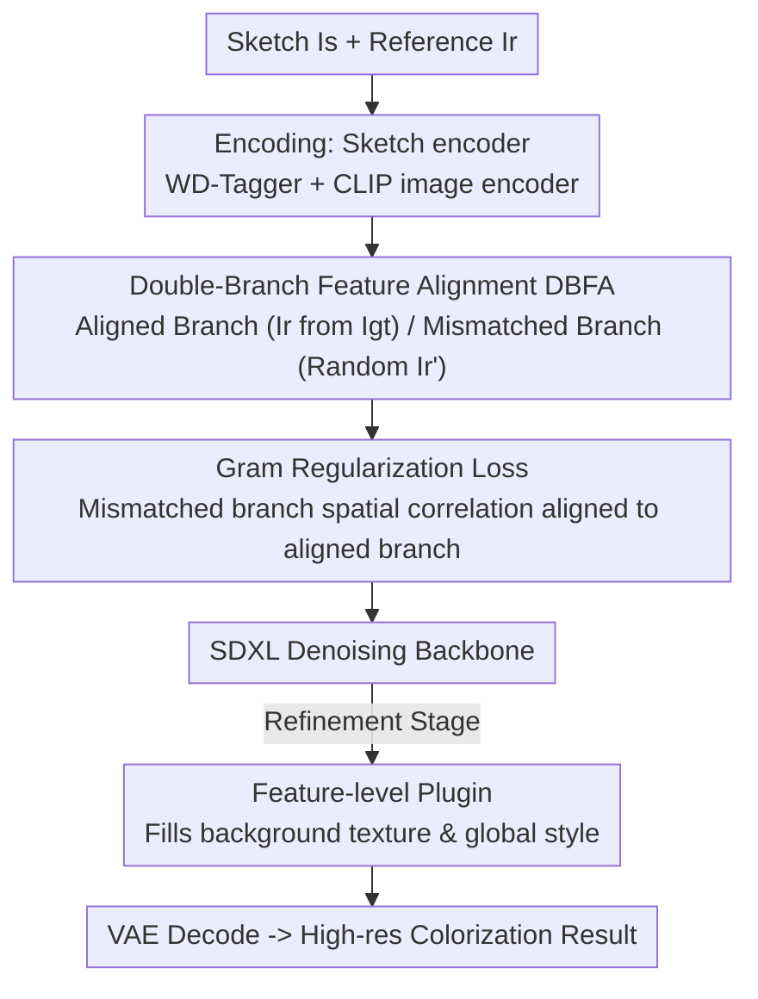

# Towards High-resolution and Disentangled Reference-based Sketch Colorization

**Conference**: CVPR 2026  
**Paper**: [CVF Open Access](https://openaccess.thecvf.com/content/CVPR2026/html/Yan_Towards_High-resolution_and_Disentangled_Reference-based_Sketch_Colorization_CVPR_2026_paper.html)  
**Code**: https://github.com/tellurionkanata/ColorizeDiffusionXL  
**Area**: Diffusion Models / Image Generation  
**Keywords**: Reference-based colorization, spatial entanglement, Gram regularization, distribution shift, SDXL

## TL;DR
To address the **spatial entanglement** (where the model erroneously copies the spatial structure of the reference image into the output) caused by the discrepancy between training and inference distributions in reference-based sketch colorization, this paper introduces a weight-sharing **Double-Branch Feature Alignment (DBFA)** architecture to explicitly model the training and inference states. By utilizing a **Gram regularization loss** to enforce consistent spatial correlation between the two branches, the proposed method fundamentally decouples "geometry from the sketch" and "color/style from the reference". Combined with an anime-specific WD-Tagger encoder and a low-level Plugin module, it achieves SOTA colorization quality and controllability at high resolutions of 1024~1280px.

## Background & Motivation

**Background**: Sketch colorization is a core task in animation/illustration automation, where the dominant paradigm has shifted from GANs to diffusion models. Among these, "reference-guided colorization" closely resembles the actual animation production pipeline—given a sketch and a color reference image, the model transfers the color scheme and texture of the reference to the sketch.

**Limitations of Prior Work**: Such methods have long suffered from **distribution shift**. During training, "semantically aligned triplets" are used—where the sketch $I_s$ and reference $I_r$ are both derived from the same ground-truth image $I_{gt}$, naturally matching in spatial structure. However, during inference, the user-provided sketch and reference are **arbitrarily paired, and their contents may be completely unrelated**. This systematic mismatch causes structural artifacts in the output, such as redundant objects, limb distortions, and color bleeding.

**Key Challenge**: The authors characterize the root cause as a **failure of conditional independence**. Ideally, the spatial structure of the output $X_{spatial}$ should **only depend on the sketch** $I_s$, i.e., $P(X_{spatial}\mid I_r, I_s)=P(X_{spatial}\mid I_s)$. However, on the aligned training data, the model takes a shortcut by learning that "the reference image can predict the output spatial structure", leading to $P(X_{spatial}\mid I_r, I_s)\neq P(X_{spatial}\mid I_s)$, which the authors term **spatial entanglement**. Worse yet, as training progresses (25K $\rightarrow$ 50K $\rightarrow$ 75K steps), the model increasingly relies on this spurious correlation, exacerbating the entanglement.

**Limitations of Existing Methods**: Prior works (using adjacent animation frames or applying deformation augmentation to the ground truth as references) merely **alleviate the symptoms of artifacts** without addressing the distribution issue itself. Even with mechanisms like split cross-attention that can suppress background entanglement, entanglement in the foreground and precise control remain unresolved.

**Core Idea**: Instead of patching artifacts, it is better to **directly minimize the distribution shift**—explicitly modeling the "training state (aligned)" and the "inference state (mismatched)" with two separate branches, and then forcing the internal spatial correlation of the mismatched branch to align with that of the aligned branch. This constrains the network to obtain geometric information solely from the sketch.

## Method

### Overall Architecture
The method uses SDXL as the denoising backbone (with weights initialized from the anime-specific AnimagineXL). The entire pipeline addresses one core problem: **making the output's geometry/segmentation depend solely on the sketch, and its color/style depend solely on the reference**. It consists of three components: (1) a **double-branch feature alignment (DBFA) + Gram regularization** training mechanism to fundamentally decouple geometry and style; (2) replacing SDXL's original CLIP-L text encoder with an anime-specific **WD-Tagger** to provide finer attribute control; and (3) a low-level **Plugin module** to supplement background texture and global style during the refinement stage. Training is split into two stages: the first stage trains the backbone + DBFA + Gram loss; the refinement stage freezes the rest of the parameters and only trains the Plugin module and the split cross-attention within the backbone.

### Key Designs

**1. Double-Branch Feature Alignment (DBFA): Fitting "Training State" and "Inference State" into a Single Training Step**

The pain point stems directly from distribution shift: training only exposes the model to cases where the reference is aligned with the sketch, while inference only involves mismatches, giving the model no chance to learn to "ignore the spatial structure of the reference". DBFA explicitly models these two distributions using **two weight-sharing branches**: the **semantically aligned branch** inputs the aligned reference $I_r$ derived from the ground truth (simulating the training state), while the **semantically mismatched branch** inputs an unrelated reference $I'_r$ **randomly sampled** from the dataset (simulating the inference state). The key insight is "**self-anchoring**"—performing two forward passes on the same sketch and the same noisy latent $z_t$ by only swapping the reference images, without requiring external networks like VGG, DINOv3, or older checkpoints to act as teachers. Since both branches share the same sketch, forcing their features to be consistent essentially compels the network to recognize that "my geometry can only come from the sketch and remains invariant to any color reference," structurally embedding the decoupling of geometry and style into the training.

**2. Gram Regularization Loss: Measuring "Whether Geometry is Contaminated by the Reference" via Spatial Correlation instead of Pixel Alignment**

Having two branches is not enough; a metric is needed to tell the network how the spatial structures of the two branches differ. The authors draw on the observation from DINOv3—**the Gram matrix $G(x)=xx^\top$ of a feature map semantically characterizes the spatial correlation between different patches** (i.e., "which block correlates with which block" in an attention sense). Since the essence of spatial entanglement is that the reference branch erroneously introduces semantic correlations, aligning the Gram matrices of the two branch features can eliminate this erroneous correlation:

$$L_{gram}=\sum_{l\in L}\left\|\,\mathrm{stop\_grad}\!\left(G(x^{(l)}_{aligned})\right)-G(x^{(l)}_{misaligned})\,\right\|_F^2$$

where $L$ represents the layers involved in the calculation (for efficiency, only the last transformer blocks at the **lowest resolution** of the U-Net encoder/decoder are used), and $\|\cdot\|_F$ is the Frobenius norm. `stop_grad` is the masterstroke: it **freezes the Gram matrix of the aligned branch as an anchor**, allowing only the mismatched branch to receive gradients—otherwise, the two branches would compromise with each other, leading to anchor drift and collapse onto the mismatched representation. Consequently, the mismatched branch is firmly pulled towards a fixed reference that "only looks at the sketch," stabilizing optimization. The total objective is $L=L_{diff}+\lambda L_{gram}$, where $\lambda$ remains 0 during the first 33% of training steps and is subsequently ramped up to 1 (since entanglement is mild in the early stage, applying regularization too early is unnecessary). The cost is a roughly 30% slower training speed and approximately 10% more VRAM usage.

**3. WD-Tagger Precise Attribute Control: Replacing Generalized CLIP-L with an Anime-Specific Tag Encoder**

SDXL originally uses dual text encoders, OpenCLIP-bigG and CLIP-L, which exhibit high semantic overlap and share style biases, making them insufficiently precise for controlling fine-grained anime attributes (hair color, clothing, background themes). The authors **replace CLIP-L with WD-Tagger**—a Swin Transformer v2-based network pre-trained on multi-label classification of large-scale anime images. It projects visual features into a **tag-aligned embedding**, yielding stronger semantic anchoring and cleaner clustering, thereby significantly boosting the backbone's capability to capture semantics from the sketch. Concurrently, OpenCLIP-bigG is retained (using its image encoder to provide lower-level visual representations more conducive to cross-style generalization). This dual-encoding design—"WD-Tagger for precise categorical control + OpenCLIP for broad visual transfer"—provides complementary control signals to the backbone. In the ablation study, WD-Tagger reduces the FID from 15.68 (Dual CLIP) to 13.79.

**4. Feature-level Plugin: Restoring Background Texture and Global Style in the Refinement Stage**

Embedding-level reference injection loses details, easily leading to blurry textures and inconsistent styles in background regions. Moreover, when the reference image lacks background content, Gram regularization can conversely increase background randomness (leading to arbitrary background generation). The Plugin is an **independent encoder** that learns feature-level representations of non-sketch regions (backgrounds) during the refinement stage, specifically transferring global style features. It is trained only in the refinement stage and executed only once at $t=0$ during inference, thus introducing virtually no inference overhead. It transforms the colorization from "controllable foreground, uncontrollable background" to stability in both foreground and background.

### Loss & Training
- Diffusion loss: $L_{diff}=\mathbb{E}_{\mathcal{E}(y),\epsilon,t,s,c}\left[\|\epsilon-\epsilon_\theta(z_t,t,s,c)\|_2^2\right]$.
- Total loss: $L=L_{diff}+\lambda L_{gram}$, where $\lambda$ is 0 during the first 33% of steps and then linearly increases to 1.
- Two stages: ① Train backbone + DBFA + Gram (70K steps); ② Refinement, train only the Plugin module + split cross-attention, freezing the rest (10K steps).
- Hardware/Data: 8×H100 (80GB) + DeepSpeed ZeRO-2, batch size 128, lr 1e-5, overall training time of 72 hours; dataset contains 6M high-resolution character/scene illustrations, with sketches jointly generated by 4 types of edge/line extractors.

## Key Experimental Results

### Main Results
On a 50K triplet validation set, with FID as the primary metric (FID does not require semantic/spatial alignment and is most suitable for this task), compared with recent SOTA methods. Except for MangaNinja, which is fixed at $512^2$, all others are evaluated at $1024^2$, with the Plugin disabled by default.

| Method | FID ↓ | PSNR ↑ | MS-SSIM ↑ | CLIP score ↑ |
|------|-------|--------|-----------|--------------|
| **Ours** | **8.28** | 28.83 | **0.70** | **0.912** |
| Yan et al. [44] | 12.09 | 28.44 | 0.61 | 0.896 |
| ColorizeDiff [45] | 13.42 | 28.04 | 0.57 | 0.891 |
| IP-Adapter-XL | 36.61 | 28.23 | 0.44 | 0.758 |
| IP-Adapter | 94.53 | 27.94 | 0.50 | 0.762 |
| T2I-Adapter | 94.98 | 27.97 | 0.28 | 0.613 |
| MangaNinja (512²) | 42.85 | **29.64** | 0.67 | 0.892 |

Ours comprehensively leads in FID, MS-SSIM, and CLIP score. In terms of PSNR, MangaNinja is the highest, while ours is second—the authors explain that this is because MangaNinja's generation capability and resolution are limited, preventing it from rendering complex backgrounds and vibrant colors. Consequently, its "close-to-average" output gains an advantage in PSNR (which is sensitive to MSE) but is not actually superior.

A user study (30 participants, 25 image sets, comparing ours vs. 6 competitors per set + 4 groups of competitor-to-competitor comparisons) shows that ours is preferred significantly in all 6 comparisons (Chi-square test $p<0.01$), with a preference rate of approximately 62% to 80%.

### Ablation Study
Taking "SDXL + Dual OpenCLIP + Diffusion Loss Only" as the baseline, components are progressively stacked.

| Configuration | FID ↓ | Description |
|------|-------|------|
| Dual CLIP (Baseline) | 15.68 | Incorrect eye colorization, weak overall segmentation guidance |
| + WD-Tagger | 13.79 | Improved attribute control and segmentation guidance |
| + WD-Tagger + Gram loss | See figure (lower) | Eliminates entanglement artifacts inside and outside the sketch |
| + Plugin | — | Enhanced background texture and global style consistency |

Note: The gains of the Gram loss are primarily demonstrated through visual representations of attention maps/Gram matrices and local FIDs (Figure 6 reports 5K-FID dropping from 12.14 to 10.48), rather than through the main table numbers. To isolate the effect of WD-Tagger, the authors deliberately turned off the Gram loss when evaluating WD-Tagger (as its decoupling property would suppress the embedding clustering introduced by WD-Tagger, interfering with observations).

### Key Findings
- **Gram loss is the main driver of decoupling**: Visualizations show that upon adding it, semantics within the sketch-guided region no longer drift, and artifacts outside the sketch are eliminated. This is key to turning "geometry depends solely on the sketch" from a slogan into a verifiable phenomenon.
- **WD-Tagger shows the most distinct advantage when the reference eyes are small and color schemes mismatch**: The baseline miscolors the eyes, whereas switching to WD-Tagger correctly restores the eye color and texture from the reference.
- **High PSNR does not equate to high quality**: MangaNinja's superior PSNR precisely exposes its limitation of "weak generative capability, leading to average-looking outputs," reminding us that PSNR is a misleading, secondary metric in this task.

## Highlights & Insights
- **Perspective shift from "patching artifacts" to "aligning distributions"**: Formalizing spatial entanglement as a failure of conditional independence and using two branches to explicitly accommodate the training and inference states is the most "aha" aspect of this paper. This elevates an issue historically treated as an engineering artifact to an optimizable distribution alignment problem.
- **Self-anchoring spares external teachers**: Using two forward passes within the same step by "only swapping reference images" to act as anchors for each other, coupled with `stop_grad` to prevent collapse, avoids relying on VGG, DINO, or older checkpoints. This approach is both lightweight and stable and can be transferred to any decoupling scenario where output invariance to a certain condition is desired.
- **Gram matrix as a spatial correlation probe**: Borrowing insights from DINOv3 to repurpose the Gram matrix from a "style metric" to a "spatial structure consistency metric" represents an incredibly clever reuse of a tool.
- **Domain-specific encoder replacing general CLIP**: In vertical domains like anime with mature tagging systems, utilizing multi-label classifiers like WD-Tagger as condition encoders proves more precise than generalized CLIP. This offers valuable insights for other vertical generation tasks with dedicated taggers.

## Limitations & Future Work
- **Strong anime-domain binding**: The backbone is derived from AnimagineXL, control relies on the anime-specific WD-Tagger, and the data is 6M anime illustrations; hence, the generalizability of the method to real photos or other art styles remains questionable.
- **Side effects of Gram loss require the Plugin to rescue**: When the reference lacks background content, Gram regularization increases background randomness, necessitating an additional Plugin module to rescue. This indicates that decoupling is not a "free lunch."
- **High training cost**: Training takes 72 hours on 8×H100 GPUs, and Gram loss adds 30% extra training time and 10% VRAM, setting a high bar for reproduction.
- **Inherent limitations of PSNR evaluation**: The authors themselves acknowledge that PSNR in this task rewards "mediocre outputs." The evaluation system still skews towards FID and user studies, lacking quantitative metrics that directly measure "controllability/degree of decoupling."

## Related Work & Insights
- **vs. Yan et al. [44] (split cross-attention)**: They employ split cross-attention to suppress **background** entanglement, but foreground entanglement and precise control remain unsolved. This paper uses DBFA + Gram loss to address both foreground and background comprehensively at the distribution level, achieving an FID of 8.28 vs. 12.09.
- **vs. MangaNinja [21]**: Specifically designed for clean-background character colorization with a fixed resolution of $512^2$ and trained on sliced animation frames, struggles with complex backgrounds and high resolution. This work supports 1024~1280px and handles complex backgrounds effortlessly. Its edge lies only in PSNR, which is caused by the average-looking outputs resulting from limited generative capabilities.
- **vs. Adapters like IP-Adapter / T2I-Adapter**: Fail to imitate the texture and color schemes of reference images at high resolution, yielding severe background artifacts (FID 36~95). This work comprehensively outperforms them in generative capability.
- **vs. Cobra [54]**: Highly sensitive to changes in sketch style, deteriorating significantly when the style changes (to ensure a fair comparison, the authors even had to reverse-extract sketches from their own results), highlighting the robustness of our method towards diverse input styles.

## Rating
- Novelty: ⭐⭐⭐⭐⭐ Formalizing spatial entanglement as distribution shift + self-anchoring double-branch + Gram regularization redefines the core nature of this task instead of just patching it.
- Experimental Thoroughness: ⭐⭐⭐⭐ Main table, ablation, user study, and cross-content validation are comprehensive, but quantitative metrics skew towards FID, lacking direct measures for the degree of decoupling.
- Writing Quality: ⭐⭐⭐⭐ Motivating derivations are clear, formulas and mechanisms are explained thoroughly, and theoretical formulation is solid.
- Value: ⭐⭐⭐⭐ Delivers tangible SOTA on anime colorization with open-source code; the decoupling paradigm is transferable, but it suffers from strong domain-binding and high training costs.

<!-- RELATED:START -->

## Related Papers

- [\[CVPR 2026\] From Sketch to Fresco: Efficient Diffusion Transformer with Progressive Resolution](from_sketch_to_fresco_efficient_diffusion_transformer_with_progressive_resolutio.md)
- [\[CVPR 2026\] Low-Resolution Editing is All You Need for High-Resolution Editing](low-resolution_editing_is_all_you_need_for_high-resolution_editing.md)
- [\[CVPR 2025\] Image Referenced Sketch Colorization Based on Animation Creation Workflow](../../CVPR2025/image_generation/image_referenced_sketch_colorization_based_on_animation_creation_workflow.md)
- [\[CVPR 2026\] Garments2Look: A Multi-Reference Dataset for High-Fidelity Outfit-Level Virtual Try-On with Clothing and Accessories](garments2look_a_multi-reference_dataset_for_high-fidelity_outfit-level_virtual_t.md)
- [\[CVPR 2026\] MultiCrafter: High-Fidelity Multi-Subject Generation via Disentangled Attention and Identity-Aware Preference Alignment](multicrafter_high-fidelity_multi-subject_generation_via_disentangled_attention_a.md)

<!-- RELATED:END -->
