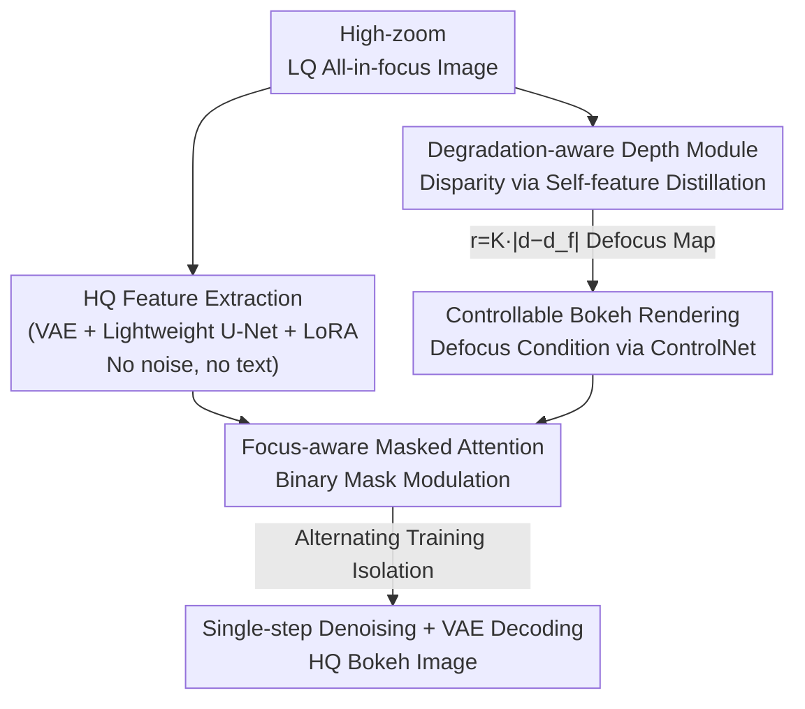

# Towards Photorealistic and Efficient Bokeh Rendering via Diffusion Framework

**Conference**: CVPR 2026  
**arXiv**: [2605.07429](https://arxiv.org/abs/2605.07429)  
**Code**: Yes (The paper states code and models available, links to be confirmed)  
**Area**: Diffusion Models / Computational Photography / Image Generation  
**Keywords**: Bokeh Rendering, Single-step Diffusion, Super-resolution, Focus-aware Attention, Depth Estimation

## TL;DR
MagicBokeh unifies "Super-resolution for high digital zoom" and "Bokeh rendering" within a single-step diffusion framework. It resolves optimization conflicts between the two tasks through an alternating training strategy and focus-aware masked attention, while employing a degradation-aware depth module to estimate reliable disparity maps from low-quality inputs. The model achieves more realistic bokeh than "SR followed by Bokeh" two-stage pipelines on real low-resolution phone photos with 0.1s-level speed.

## Background & Motivation
**Background**: Due to compact optical designs with small apertures, smartphones cannot hardware-拍 produce natural large-aperture blur. Consequently, bokeh rendering relies on computational photography. Existing methods fall into two categories: those simulating light scattering based on physical optics (e.g., Dr.Bokeh, BokehMe) and those learning from large-scale data (e.g., MPIB, EBokehNet, BokehDiff). Both produce visually acceptable blur and have been deployed in mobile devices.

**Limitations of Prior Work**: These methods share an implicit assumption: the input is a high-quality (HQ) all-in-focus image. However, when applied to photos taken at **high digital zoom**, the inputs are low-resolution, blurry, and noisy. This leads to amplified noise, blurred subject boundaries, and unrealistic texture synthesis. Furthermore, the "should-be-sharp" in-focus region remains blurry, degrading the overall visual quality.

**Key Challenge**: An intuitive remedy is a two-stage pipeline—using Real-world Image Super-Resolution (Real-ISR) to repair the image followed by bokeh rendering. However, this path has two flaws: (1) imperfect Real-ISR outputs cause error accumulation in subsequent bokeh rendering; (2) two separate model inferences are inefficient. The fundamental contradiction is that **Super-resolution (recovering high-frequency details of the in-focus subject) and Bokeh (blurring the background) are conflicting tasks**, and forcing them into a serial chain is both slow and mutually detrimental.

**Key Insight**: The authors noticed a key phenomenon: images produced by diffusion generative models (e.g., Stable Diffusion) inherently contain bokeh information, suggesting a "bokeh prior" in such models. Meanwhile, single-step diffusion is already powerful for Real-ISR. Combined, these suggest a unified diffusion framework could perform super-resolution and bokeh rendering simultaneously in one model, eliminating error accumulation with a single inference.

**Core Idea**: Integrate Real-ISR and bokeh rendering into a **unified single-step diffusion model**. Use alternating training and focus-aware masked attention to prevent the conflicting objectives from interfering within the same network, and use a degradation-aware depth module to ensure reliable disparity conditions from low-quality inputs.

## Method

### Overall Architecture
The input to MagicBokeh is a low-quality (LQ) all-in-focus photo from high zoom, and the output is a high-quality (HQ) bokeh photo. The network is based on SD2.1 but implemented as a **single-step, text-free** lightweight diffusion model. The framework consists of two main components: **HQ Feature Extraction** (recovering high-frequency details from LQ images, i.e., built-in Real-ISR) and **Controllable Bokeh Rendering** (blurring the background based on a user-specified focus on the recovered features).

The workflow is as follows: The LQ image is fed directly into the HQ Feature Extraction module (VAE encoder + pruned lightweight U-Net, both with LoRA) **without adding noise**. Simultaneously, the degradation-aware depth module estimates a disparity map from the LQ image, calculates a defocus map (per-pixel blur radius) using physical formulas, and injects it as a structural condition via ControlNet. The U-Net self-attention layers are modulated by focus-aware masked attention using a binary "in-focus/out-of-focus" mask, allowing SR to focus on the subject and Bokeh to focus on the background. After single-step denoising, the final bokeh image is decoded by the VAE.

The key to training conflicting tasks in one network lies in the **alternating training strategy**: decoupling SR and Bokeh into two phases. In each phase, only the respective LoRAs are unfrozen to ensure parameter isolation. The following diagram illustrates the component pipeline:

### Key Designs

**1. Unified Single-step Diffusion: One model for SR and Bokeh to eliminate two-stage error accumulation and redundant inference.**

To address the inefficiency and error accumulation of two-stage pipelines, the authors integrate Real-ISR directly into the bokeh pipeline. Three efficiency-driven trade-offs were made: first, the LQ image is used directly as input **without adding noise**. Recent diffusion-based ISR work suggests that avoiding noise eliminates sampling uncertainty and preserves semantic content. HQ features are recovered solely through LoRA fine-tuning of the VAE encoder and U-Net. Second, as text prompts offer limited benefit for HQ feature extraction but high overhead, the text encoder and all cross-attention layers are removed, making the model **prompt-free**. Third, the U-Net mid-stage module is pruned (block pruning), significantly improving speed without sacrificing perceptual quality. Inference for a 512×512 image takes only 0.1062s, an order of magnitude faster than two-stage methods (0.3–3s).

**2. Alternating Training Strategy: Decoupling SR and Bokeh into two phases to prevent task interference.**

End-to-end joint training on "LQ-HQ Bokeh pairs" leads to degradation in subject SR quality because Real-ISR (recovering high-frequencies) and Bokeh rendering (blurring) are conflicting goals. The solution is to decouple training into two alternating phases, preceded by a strong Real-ISR pre-training. **Bokeh Phase**: Uses LQ all-in-focus inputs and defocus maps as conditions to generate HQ bokeh images. During this phase, only the ControlNet and bokeh LoRAs in the focus-aware masked attention are trained. **Real-ISR Phase**: Uses LQ-HQ pairs with the defocus map set to **all zeros** (representing an all-in-focus condition). Only the SR LoRAs in the U-Net are trained. Alternating phases with isolated LoRAs minimize inter-task interference.

**3. Focus-aware Masked Attention: Modulating self-attention with focus cues to separate in-focus and out-of-focus processing.**

Even with alternating training, injecting bokeh conditions can still damage the recovery quality of in-focus regions. The authors leverage the fact that SD self-attention layers maintain global consistency and that modulation can enhance controllability. They modulate the attention map using focus cues derived from the defocus map:

$$\text{Attention}=\text{softmax}\!\left(\frac{\mathbf{Q}\mathbf{K}^{\top}+\mathcal{M}}{\sqrt{d}}\right)\mathbf{V}$$

where the focus attention mask $\mathcal{M}_{(x,y)}=0$ when the binary mask $\mathbf{M}_{(x,y)}=1$, and $-\infty$ otherwise. $\mathbf{M}$ is obtained by extracting the in-focus subject information from the defocus map and binarizing "same-region/different-region" (1 for same, 0 for different). This constrains self-attention to operate **only within each respective region**. The SR component focuses on reconstructing the in-focus subject, while the Bokeh component focuses on background blurring. In the Real-ISR phase, $\mathcal{M}$ is set to 0 to recover the entire image.

**4. Degradation-aware Depth Module: Self-feature distillation for accurate depth estimation from low-quality images.**

Bokeh rendering is driven by the defocus map calculated via $r=K\,|d-d_f|$, where $d$ is pixel disparity, $d_f$ is focus position, and $K$ controls intensity. Standard depth models (e.g., Depth Anything v2) perform well on HQ images but fail on LQ images. The authors propose a **self-feature distillation** framework: both teacher and student are initialized with Depth Anything v2. During training, the teacher receives HQ images while the student receives simulated LQ versions. Through feature distillation and output supervision, the student is forced to produce features and depth maps consistent with the HQ input, enabling robust disparity estimation directly from LQ inputs.

### Loss & Training
The HQ feature extraction utilizes L2 and LPIPS losses. Training follows the two-phase strategy: Super-resolution pre-training on LSDIR and 10,000 FFHQ faces (learning rate 5e-5, AdamW). HQ bokeh ground truth is generated via a custom ray-tracing-based thin-lens renderer. LQ-HQ pairs are synthesized using the Real-ESRGAN degradation pipeline and upsampled to 512×512. Alternating phase: Bokeh phase LR 5e-5, Real-ISR phase LR 5e-6. Training takes approximately 20 hours on 4 NVIDIA L40 GPUs. The depth module is distilled separately on a subset of 200,000 SA-1B images with LQ-HQ synthesis.

## Key Experimental Results

### Main Results
Evaluated on the EBB400-LQ benchmark (created from EBB400 with additional simulated high-zoom degradation). Compared against two-stage SOTA pipelines: SR using OSEDiff(*) / S3Diff(+) and Bokeh using BokehMe / Dr.Bokeh / BokehDiff. Timing measured on 512×512 inputs on an L40s.

| Method | PSNR ↑ | SSIM ↑ | LPIPS ↓ | DISTS ↓ | MUSIQ ↑ | MANIQA ↑ | FID ↓ | Time(s) ↓ |
|------|--------|--------|---------|---------|---------|----------|-------|-----------|
| BokehMe* | 23.51 | 0.8459 | 0.3106 | 0.1666 | 57.70 | 0.4219 | 72.98 | 0.1648 |
| Dr.Bokeh* | 23.39 | 0.8488 | 0.3132 | 0.1677 | 52.40 | 0.3934 | 73.38 | 2.4021 |
| BokehDiff* | 23.65 | 0.8459 | 0.3049 | 0.1713 | 59.24 | 0.4251 | 72.65 | 0.3376 |
| BokehMe+ | 23.75 | 0.8388 | 0.3138 | 0.1606 | 57.54 | 0.4137 | 72.25 | 0.7510 |
| Dr.Bokeh+ | 23.67 | 0.8430 | 0.3134 | 0.1687 | 52.63 | 0.3876 | 73.10 | 2.9883 |
| BokehDiff+ | 23.83 | 0.8397 | 0.3071 | 0.1735 | 59.36 | 0.4259 | 72.54 | 0.9238 |
| **MagicBokeh** | **24.23** | **0.8623** | **0.2786** | **0.1600** | 58.83 | 0.4138 | 72.43 | **0.1062** |

MagicBokeh leads in fidelity metrics (PSNR/SSIM/LPIPS/DISTS) and is the fastest method at 0.1062s (20–28x faster than the Dr.Bokeh series). Although slightly lower on some no-reference metrics (MUSIQ/MANIQA) compared to BokehDiff, the authors explain that BokehDiff often fails to estimate focus correctly, leaving regions sharp that should be blurred, which artificially inflates these metrics while yielding poor qualitative results.

**Real-world User Study**: 50 images were captured using an iPhone 13 Pro at 5×–15× zoom. 50 participants selected the best results. MagicBokeh received significantly higher human preference scores than two-stage methods.

### Ablation Study
Tested on EBB400-LQ: FAMA = Focus-aware Masked Attention, Strategy = Alternating Training Strategy, DA depth = Degradation-aware Depth Module.

| FAMA | Strategy | DA depth | PSNR ↑ | LPIPS ↓ | CLIP-IQA ↑ | NIQE ↓ | MUSIQ ↑ | MANIQA ↑ | FID ↓ |
|------|----------|----------|--------|---------|------------|--------|---------|----------|-------|
| ✗ | ✗ | ✗ | 24.21 | 0.2931 | 0.3743 | 6.0786 | 57.41 | 0.4038 | 73.25 |
| ✗ | ✓ | ✓ | 24.22 | 0.2798 | 0.4157 | 5.9068 | 58.10 | 0.4065 | 75.23 |
| ✓ | ✗ | ✓ | 24.20 | 0.2946 | 0.3781 | 5.7076 | 56.08 | 0.3956 | 73.04 |
| ✓ | ✓ | ✗ | 24.20 | 0.2784 | 0.4209 | 5.8035 | 58.80 | 0.4114 | 75.03 |
| **✓** | **✓** | **✓** | 24.23 | 0.2786 | **0.4229** | **5.6341** | **58.83** | **0.4138** | **72.43** |

### Key Findings
- **Metric Sensitivity**: PSNR remains stable across configurations, indicating that bokeh quality is better reflected by perceptual/no-reference metrics (CLIP-IQA, FID, etc.) than by pixel-level fidelity.
- **Impact of Training Strategy**: Removing the Strategy leads to the largest performance drop, confirming that decoupling conflicting tasks via phases is essential.
- **Role of FAMA**: FAMA is critical for cleanly separating the in-focus subject from the background, as evidenced by the high FID without it.
- **DA Depth Benefit**: While quantitative gains are modest, qualitative results show significantly more accurate depth estimation for LQ inputs and natural transitions.
- **Refocusing Application**: The method naturally generalizes to refocusing, allowing smooth focus shifts between foreground and background objects.

## Highlights & Insights
- **The "Unification" Paradigm**: Replacing a two-stage pipeline with a unified single-step diffusion model eliminates error accumulation and drastically improves efficiency (0.1s). This approach is transferable to other "restore-then-edit" tasks.
- **Managing Conflict via Parameter Isolation**: Instead of complex loss balancing, the use of alternating phases and isolated LoRAs effectively manages conflicting objectives.
- **Attention as a Task Router**: Using focus masks to partition self-attention provides a spatial task division without increasing parameters.
- **Robust Condition Synthesis**: The self-distillation for depth estimation ensures that the generative model is provided with reliable structural conditions even when the input is low-quality.

## Limitations & Future Work
- **Dependency on Synthetic Data**: Training relies on Real-ESRGAN synthesis, which may not fully cover real-world mobile artifacts like sensor noise and compression.
- **Simplified Bokeh Model**: The linear defocus model ($r=K|d-d_f|$) and thin-lens renderer may deviate from complex real-world lens characteristics (e.g., bokeh shapes, cat-eye effects).
- **Depth Bottleneck**: Accuracy still depends heavily on disparity estimation; complex occlusions or transparent objects remain challenging.
- **Future Directions**: Fine-tuning on real LQ-HQ bokeh pairs, upgrading to learnable kernels for bokeh spots, or end-to-end optimization of the depth module with the main network.

## Related Work & Insights
- **Comparison to SOTA Bokeh**: Unlike BokehMe or BokehDiff, which fail on LQ high-zoom inputs, MagicBokeh built-in SR ensures fidelity and speed in low-quality scenarios.
- **Comparison to AnytoBokeh**: While both use single-step diffusion, AnytoBokeh focuses on video consistency via MPI, whereas MagicBokeh focuses on high-zoom static images via task decoupling.
- **Insight**: The combination of ControlNet and masked attention provides a template for "region-specific controllable generation" where different areas of an image undergo different processing.

## Rating
- Novelty: ⭐⭐⭐⭐ Unifying SR and Bokeh via alternating training and FAMA is a robust innovation for high-zoom scenarios.
- Experimental Thoroughness: ⭐⭐⭐⭐ Comprehensive benchmarking, user studies, and ablations, though lacking quantitative evaluation on real-world HQ bokeh pairs.
- Writing Quality: ⭐⭐⭐⭐ Clear motivation, well-supported logic, and honest metric interpretation.
- Value: ⭐⭐⭐⭐ Significant engineering value for mobile photography with 0.1s inference.

<!-- RELATED:START -->

## Related Papers

- [\[CVPR 2026\] IntroSVG: Learning from Rendering Feedback for Text-to-SVG Generation via an Introspective Generator-Critic Framework](introsvg_learning_from_rendering_feedback_for_text-to-svg_generation_via_an_intr.md)
- [\[CVPR 2026\] RenderFlow: Single-Step Neural Rendering via Flow Matching](renderflow_single-step_neural_rendering_via_flow_matching.md)
- [\[CVPR 2026\] Ani3DHuman: Photorealistic 3D Human Animation with Self-guided Stochastic Sampling](ani3dhuman_photorealistic_3d_human_animation_with_self-guided_stochastic_samplin.md)
- [\[CVPR 2026\] Reviving ConvNeXt for Efficient Convolutional Diffusion Models](reviving_convnext_for_efficient_convolutional_diffusion_models.md)
- [\[CVPR 2025\] EasyCraft: A Robust and Efficient Framework for Automatic Avatar Crafting](../../CVPR2025/image_generation/easycraft_a_robust_and_efficient_framework_for_automatic_avatar_crafting.md)

<!-- RELATED:END -->
