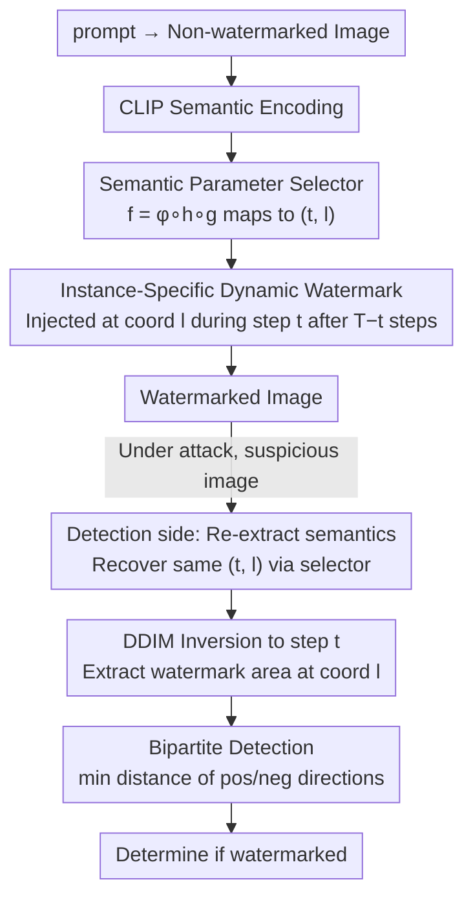

# Towards Robust Content Watermarking Against Removal and Forgery Attacks

**Conference**: CVPR 2026 Findings  
**arXiv**: [2604.06662](https://arxiv.org/abs/2604.06662)  
**Code**: None  
**Area**: Image Generation / Digital Watermarking  
**Keywords**: Content Watermarking, Diffusion Models, Removal Attacks, Forgery Attacks, Instance-specific Watermarking

## TL;DR

Proposes ISTS, an instance-specific bipartite detection watermarking method that dynamic selects injection time and location based on image semantics to resist removal and forgery attacks. A bipartite detection mechanism is designed to counter reverse latent representation attacks, achieving SOTA robustness in average and worst-case scenarios across three removal and three forgery attacks.

## Background & Motivation

1. **Background**: Content watermarking (e.g., Tree-Ring) is widely studied in text-to-image diffusion models, verifying image sources by embedding identity markers into the latent space during generation. These methods exhibit good robustness against common image transformations (rotation, cropping, compression, etc.).
2. **Limitations of Prior Work**: Recent studies (Müller et al., Yang et al., Jain et al.) reveal that existing watermarks are extremely fragile under removal and forgery attacks—detection AUC drops below 0.1 after removal (e.g., Gaussian-Shading), while forgery AUC approaches 1.0 (easy forgery). This implies watermarks can be both erased and forged, severely threatening the reliability of copyright protection.
3. **Key Challenge**: Existing methods use static, single-type watermark patterns (e.g., Tree-Ring fixed circular patterns at the center of Fourier space). This consistency inadvertently leaks structural features, allowing attackers to utilize proxy models to extract or replicate the watermark.
4. **Goal**: How to design a watermarking scheme that is robust to both removal and forgery attacks?
5. **Key Insight**: The critical insight is "Static Watermark = Information Leakage." If the watermark pattern and injection parameters differ for each image, attackers cannot extract universal watermark features from a single or a small set of reference images.
6. **Core Idea**: Instance-specific dynamic watermarking (selecting injection time and location based on semantics) + Bipartite detection (simultaneously checking positive and negative latent representations to block reverse optimization attack paths).

## Method

### Overall Architecture

The core problem ISTS aims to solve is that existing watermarks are both erasable and forgeable because they use the same fixed pattern for all images (e.g., Tree-Ring always places the same ring in the frequency center). This consistency is the leak—attackers only need to see a few watermarked images to infer the universal pattern. ISTS's approach is to make every image's watermark unique while ensuring precise matching during detection.

The entire pipeline is divided into generation and detection stages, symmetrically centered around a pair of parameters $(t, l)$ (injection time step and frequency coordinates). During generation, a prompt first produces an ordinary non-watermarked image, which is encoded into a semantic vector via CLIP. This vector is fed into a pre-trained selector to map the image's exclusive $(t, l)$. Then, $T-t$ DDIM denoising steps are run, the watermark is injected at coordinate $l$ at step $t$, and the remaining denoising produces the watermarked image. Detection operates in reverse: the suspicious image's semantic features are extracted to recover $(t, l)$, the image is inverted via DDIM to step $t$, the watermark region is extracted at coordinate $l$, and finally, bipartite detection determines the presence of the watermark. The key is that watermark injection barely alters image semantics, allowing the detection end to recover $(t, l)$ consistently with the generation end.

### Key Designs

**1. Semantic Parameter Selector: Establishing a deterministic mapping from image semantics to $(t, l)$ to align generation and detection parameters**

The prerequisite for the dynamic mechanism is that the same image must map to **identical** parameters at both generation and detection ends. Thus, the mapping must be deterministic, serving as the common entry point for dynamic injection and bipartite detection. ISTS decomposes this into a reproducible chain $f = \phi \circ h \circ g$: $g$ is the CLIP encoder extracting feature vectors from the non-watermarked image; $h$ is a classifier trained on these features; $\phi$ is a predefined modulo mapping that converts class labels into specific $(t, l)$. During training, non-watermarked images are generated in batches from a prompt set, features are extracted via CLIP, and K-Means is used to group them into $N$ clusters. Clustering naturally groups semantically similar images to the same parameter set, which is how the detection end stably recovers parameters. Subsequently, classifier $h$ is trained to learn the "feature → category" step as an inferable function. Any input image follows $g \to h \to \phi$ to obtain its exclusive, reproducible injection parameters.

**2. Instance-Specific Dynamic Watermarking: Differentiating watermark patterns and positions per image to sever the "extract universal pattern" attack path**

The most fatal vulnerability of static watermarking is reusability: attackers can extract a watermark pattern from a single reference image to forge it (Müller et al.), or average multiple watermarked images to reveal a common structure (Yang et al.). ISTS uses $(t, l)$ from the selector to bind "what the watermark looks like, at which step it is hidden, and where in the frequency domain it resides" to the image's own semantics. The dynamic patterns render "extracting patterns from reference images" ineffective because every image's pattern is different. Dynamic time steps prevent gradient-based optimization attacks from finding the correct direction, as the attacker cannot know at which step the watermark was injected. When averaging multiple images, the distinct watermark features cancel each other out, causing the averaging method to fail. The physical basis for this is that watermarks have minimal impact on semantics, so the watermarked and non-watermarked images occupy nearly the same position in CLIP space, allowing the detection end to recover parameters without the original image.

**3. Bipartite Detection: Blocking removal attacks that push latent representations in the opposite direction of the watermark**

Traditional detection only looks in one direction, measuring the unilateral distance between watermark $W$ and the inverted latent representation:

$$d = \frac{1}{|M|} \sum_{i \in M} |W_i - \mathcal{F}(z_T)_i|$$

The removal attack by Müller et al. exploits this by optimizing the latent representation toward the **opposite** direction of the watermark rather than erasing it, causing the unilateral distance to increase and detection to fail. ISTS counters this by symmetrizing the metric, calculating both directions and taking the smaller value:

$$d = \min\Big\{\tfrac{1}{|M|}\textstyle\sum_i |W_i - \mathcal{F}(z_T)_i|,\ \tfrac{1}{|M|}\textstyle\sum_i |W_i + \mathcal{F}(z_T)_i|\Big\}$$

For non-watermarked images, latent representations follow a standard Gaussian distribution; sign flipping does not change the distribution, so distances in both directions are statistically consistent, and the detection metric remains unchanged, avoiding false positives. For watermarked images, whether the attacker pushes it in the positive or negative direction, one side will always trigger a hit. The cost is merely calculating the distance twice and taking the minimum—virtually zero overhead—while effectively closing the entire reverse optimization attack surface.

### Loss & Training

The only component requiring training is the parameter selector, which involves one K-Means clustering and a simple classifier. The watermark injection and detection themselves do not introduce additional training, directly reusing the pre-trained diffusion model. Experiments use Stable-Diffusion-2-1-base, evaluating with 100 pairs for adversarial attack scenarios and 1000 pairs for non-adversarial scenarios.

## Key Experimental Results

### Main Results (Removal Attack Robustness)

| Watermarking Method | Original AUC | Imp-Removal | Avg-Removal | Avg AUC | Worst AUC |
|---------|----------|-------------|-------------|---------|---------|
| Tree-Ring | 1.000 | 0.267 | 0.527 | 0.589 | 0.267 |
| Gaussian-Shading | 1.000 | 0.000 | 0.371 | 0.457 | 0.000 |
| ROBIN | 1.000 | 0.082 | 0.742 | 0.595 | 0.082 |
| SEAL | 1.000 | 0.508 | 0.959 | 0.752 | 0.508 |
| **ISTS (Ours)** | 1.000 | **0.821** | **0.990** | **0.936** | **0.821** |

### Ablation Study

| Configuration | Imp-Removal AUC | Imp-Forgery AUC | Description |
|------|----------------|-----------------|------|
| Full ISTS | **0.821** | **0.634** | Synergy of three components |
| w/o Dynamic Pattern | ~0.71 | 0.72 | Fixed patterns easily forged |
| w/o Dynamic Step | Lower | Lower | Gradient attacks become traceable |
| w/o Bipartite Detection | ~0.71 | Neutral | Reverse latent attacks effective |

### Key Findings

- **Imp-Removal is the strongest removal attack**: While almost all existing methods drop below an AUC of 0.7, ISTS maintains 0.821 (a 20%+ improvement).
- **ISTS is optimal under forgery attacks**: Achieves 0.686 average AUC (lower is better) and 0.949 in the worst case, outperforming all baselines.
- **Dynamic patterns contribute most to anti-forgery**: Without them, Imp-Forgery AUC rises from 0.62 to 0.72 (easier to forge).
- **Bipartite detection contributes most to anti-removal**: Without it, Imp-Removal AUC drops from 0.82 to ~0.71.
- **No loss in image quality**: PSNR, SSIM, and LPIPS are comparable to ROBIN (the best baseline for quality), and CLIP-Score remains consistent.
- **Robustness to common image transformations**: Average AUC is 0.974 (vs. Tree-Ring 0.975), and the worst case is 0.933 (vs. Tree-Ring 0.928), staying on par with the best baselines.

## Highlights & Insights

- **The profound insight of "Static = Leakage"**: Although black-box attackers nominally do not know the watermark algorithm, consistent patterns in static watermarking actually provide attackers with additional priors. This observation reveals a general principle in security design: implementation details can become side channels.
- **Simple Elegance of Bipartite Detection**: By merely calculating distance twice and taking the minimum (almost zero extra cost), the reverse optimization attack path is blocked. This "symmetrized detection metric" approach is transferable to other distance-based security detection schemes.
- **Semantic Consistency Ensures Detection Reliability**: Leveraging the physical property that watermark injection has minimal impact on image semantics ensures that parameters recovered from watermarked images match those used during generation. This is an ingenious design that decouples adversarial robustness from functional correctness.

## Limitations & Future Work

- Requires generating a non-watermarked version for each image to extract semantic features, doubling generation costs.
- The parameter selector relies on the CLIP semantic consistency assumption, which may be broken by extreme image editing.
- Only verified on Stable-Diffusion-2-1-base; newer models like SDXL or FLUX have not been tested.
- The choice of K-Means cluster number $N$ and parameter mapping $\phi$ lacks theoretical guidance.
- Evaluations used 100 image pairs; the sample size is relatively small, potentially affecting statistical significance.
- Future work could explore adaptive dynamic strategies (e.g., adjusting subsequent watermark parameters based on attack detection signals).

## Related Work & Insights

- **vs Tree-Ring**: Tree-Ring injects fixed circular patterns in the frequency center; its static mode drops to AUC 0.267-0.527 under three removal attacks. ISTS maintains 0.821-0.990 after dynamization.
- **vs SEAL**: SEAL uses SimHash to control denoising randomness, showing some resistance to forgery (AUC 0.703) but being extremely fragile against common transformations like rotation, blur, and cropping (worst AUC 0.523). ISTS balances adversarial and general robustness.
- **vs RingID**: RingID has excellent general robustness (worst AUC 0.953) but fails almost completely under forgery attacks (Imp-Forgery AUC=1.0). ISTS provides protection in both aspects.

## Rating

- Novelty: ⭐⭐⭐⭐ The combination of instance-specific watermarking and bipartite detection effectively addresses the fundamental vulnerabilities of existing watermarks with a clear, theoretically supported approach.
- Experimental Thoroughness: ⭐⭐⭐⭐ Covers three removal + three forgery attacks + six image transformations with comprehensive average/worst-case analysis; however, the sample size is small and limited to one model.
- Writing Quality: ⭐⭐⭐⭐ Problem definitions and methodology motivations are clearly articulated with standard pseudocode and a rigorous threat model.
- Value: ⭐⭐⭐⭐ Systematically addresses the dual threats of watermark removal and forgery for the first time, holding practical significance for copyright protection in generative AI.

<!-- RELATED:START -->

## Related Papers

- [\[CVPR 2026\] Rel-Zero: Harnessing Patch-Pair Invariance for Robust Zero-Watermarking Against AI Editing](rel-zero_harnessing_patch-pair_invariance_for_robust_zero-watermarking_against_a.md)
- [\[ECCV 2024\] Robust-Wide: Robust Watermarking against Instruction-driven Image Editing](../../ECCV2024/image_generation/robust-wide_robust_watermarking_against_instruction-driven_image_editing.md)
- [\[CVPR 2026\] SPDMark: Selective Parameter Displacement for Robust Video Watermarking](spdmark_selective_parameter_displacement_for_robust_video_watermarking.md)
- [\[CVPR 2026\] Editing Away the Evidence: Diffusion-Based Image Manipulation and the Failure Modes of Robust Watermarking](editing_away_the_evidence_diffusion-based_image_manipulation_and_the_failure_mod.md)
- [\[AAAI 2026\] Creating Blank Canvas Against AI-Enabled Image Forgery](../../AAAI2026/image_generation/creating_blank_canvas_against_ai-enabled_image_forgery.md)

<!-- RELATED:END -->
