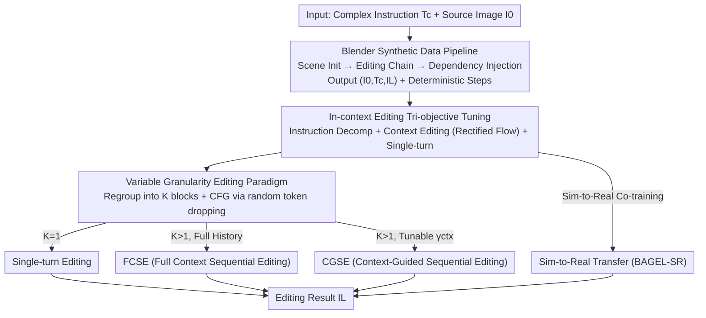

# Towards Robust Sequential Decomposition for Complex Image Editing

**Conference**: CVPR 2026  
**arXiv**: [2605.09233](https://arxiv.org/abs/2605.09233)  
**Code**: TBD  
**Area**: Image Editing / Diffusion Models / Unified Multimodal Models  
**Keywords**: Complex Instruction Editing, Sequential Decomposition, In-context Editing, Synthetic Data, Sim-to-Real  

## TL;DR
Addressing complex image editing where "multiple interdependent operations are packed into a single instruction," this work investigates "sequential decomposition" within an in-context editing framework. High-quality editing chains with decomposition labels are synthesized via Blender to fine-tune BAGEL. A Context-Guided Sequential Editing (CGSE) paradigm is designed to regulate the influence of "historical editing results," ensuring that performance improves with more decomposition steps and enabling successful sim-to-real transfer to real images through co-training.

## Background & Motivation
**Background**: Instruction-guided image editing has achieved high fidelity, yet most models and datasets target **single editing types** or **restricted regions**. Real-world requirements often involve **composite, multi-object, and interdependent** complex instructions, such as "move A, shift B forward, add D near C, and then replace E with F."

**Limitations of Prior Work**: Two naive approaches exist for complex instructions, both unreliable:

- **Single-turn Editing**: Execution of all edits at once. Models struggle to simultaneously "parse + execute" multiple operations, often missing edits or targeting wrong objects (e.g., Gemini 2.5 Flash Image failures in Fig. 1).
- **Sequential Editing**: Breaking complex instructions into simple sub-steps executed sequentially. While intuitively simpler, it suffers from severe **compounding errors** in practice—minor flaws in early steps are amplified, resulting in lower final fidelity.

**Key Challenge**: A trade-off exists between the **benefits (task simplification)** and **drawbacks (error accumulation)** of sequential decomposition. Zero-shot "hard decomposition" of complex instructions often leads to performance drops in SOTA models, meaning decomposition itself does not automatically yield gains.

**Goal**: To find a robust scheme where "decomposition gains > error accumulation costs," ensuring performance scales with the number of decomposition steps without collapsing, and enabling migration from controlled environments to real images.

**Key Insight**: Sequential editing is unified within an **in-context editing framework**. A multimodal model, conditioned on the "full historical context (all previous instructions + intermediate images)," alternately generates "decomposed instructions + corresponding edited images." The advantages of this unified perspective are: (1) a single model implements multiple editing paradigms for fair comparison; (2) each step is "informed" by historical context, allowing adaptation to intermediate results and opening spaces for new paradigms.

**Core Idea**: Instead of debating "whether to decompose," the focus shifts to **learning high-quality decomposition + designing a paradigm to regulate historical influence**. High-quality "deterministic, zero-degradation" decomposition supervision is synthesized using Blender. A tunable coefficient $\gamma_{ctx}$ treats "historical editing results" as an **independently controllable guidance term**, balancing context utilization against error accumulation.

## Method

### Overall Architecture
The method consists of three components: **Synthetic data generation → Tri-objective fine-tuning under the in-context editing framework → Multi-paradigm editing during inference (including sim-to-real co-training)**. Given a complex instruction $T_c$ and source image $I_0$, the framework sequentially generates an interleaved sequence $\langle T_c, I_0, T_1, I_1, \dots, T_L, I_L\rangle$, where $\{T_i\}$ are decomposed sub-instructions, $\{I_i\}_{i=1}^{L-1}$ are intermediate results, and $I_L$ is the final output.

Since accurate decomposition supervision is unavailable for real images, **procedural data generation** is performed in Blender. Atomic editing operations are applied to a randomly initialized room scene; the initial render serves as the source, the final as the target, and concatenated descriptions as the complex instruction. Intermediate renders provide **deterministic, zero-degradation** decomposition chains. After fine-tuning BAGEL on this data, the model can switch between three editing paradigms by appending "decomposition blocks $K$" and varying CFG combinations. Sim-to-real transfer is achieved by co-training synthetic data with real single-turn data.

### Key Designs

**1. Blender Synthetic Pipeline + Dependency Injection: Obtaining "Zero-degradation Supervision" via Deterministic Rendering**

A fatal issue in complex editing data is the lack of high-quality decomposition chains for real images. Using existing editing models to generate data caps quality at those models' failure modes. The authors utilize Blender to procedurally build scenes: given 3D assets and materials, an empty room is generated, textures are applied, and up to $N=9$ objects are placed collision-free via physics simulation. An editing chain of length $L$ $\{T_i\}_{i=1}^L$ (covering **10 atomic operations** across categories: local edits, background texture, and camera transformation) is applied. Intermediate renders serve as decomposition supervision $I_i$.

To create true complexity, the authors inject **inter-step dependencies**: (1) **Operational reference**: Subsequent instructions refer to objects by how they were previously modified (e.g., "the rotated object" instead of "the table"). (2) **Positional reference**: Targets for add/translate operations are specified relative to an object's **original position before movement** (e.g., "add a book to where the chair used to be"). 94K total chains were generated with $L$ ranging from 3 to 17.

**2. Tri-objective Fine-tuning: Developing "Decomposition" Skills in a Unified Model**

While multimodal unified models (BAGEL) support interleaved sequences, they do not inherently "decompose." Three objectives are used:

- **Instruction Decomposition $L_D$**: Autoregressively predicting sub-instructions between adjacent images.
$$L_D = -\sum_i \sum_j \log p_\theta\big(T_{i,j} \mid T_{i,<j}, T_{<i}, I_{<i}, T_c\big)$$
- **Context Editing $L_{ICE}$**: Training a velocity prediction network $v_\theta$ using rectified flow on intermediate and target images:
$$L_{ICE} = \mathbb{E}_{t, X_0, X_1}\big[\,\|(X_1 - X_0) - v_\theta(X_t, t, c)\|^2\,\big]$$
where $c = \{I_{<i}, T_{\le i}\}$. **Key Decoupling**: $T_c$ is **intentionally omitted** from this context to ensure the generation module relies solely on decomposed instructions.
- **Single-turn Editing**: Retaining basic editing capabilities with $c = (I_0, T_c)$.

**3. Variable Granularity Paradigms: Adjustable History Influence (FCSE → CGSE)**

To enable adjustable decomposition granularity, sequences are randomly regrouped into $K$ blocks ($1\le K\le L$) during training, with only the last image $I_{j+l-1}$ in each block retained. Appending $K$ to $T_c$ allows the model to decompose as needed.

- **FCSE (Full Context Sequential Editing)**: Computes guidance by fixing historical sequences and emphasizing the current sub-instruction $T_i$ and previous result $I_{i-1}$:
$$v_{\text{FCSE}} = v_\theta(X_t,t,\{T_{<i},I_{<i-1}\}) + \gamma_I\big(v_\theta(X_t,t,\{T_{<i},I_{<i}\}) - v_\theta(X_t,t,\{T_{<i},I_{<i-1}\})\big) + \gamma_T\big(v_\theta(X_t,t,\{T_{\le i},I_{<i}\}) - v_\theta(X_t,t,\{T_{<i},I_{<i}\})\big)$$
The issue with FCSE is that historical errors are "locked" into the conditions.

- **CGSE (Context-Guided Sequential Editing)**: The core improvement is extracting "historical results" from the condition and treating them as an independent guidance term with a tunable coefficient $\gamma_{ctx}$. It overlays "context guidance" on the base velocity $v_d$:
$$v_{\text{CGSE}} = v_d + \gamma_{ctx}\big(v_\theta(X_t,t,I_0,\{T_j\}_{j=1}^i,\{I_j\}_{j=m}^n) - v_d\big), \quad m\le n < i$$
$\gamma_{ctx}$ acts as a "history influence knob," allowing an explicit trade-off between the benefits of context and the costs of historical error. This makes CGSE significantly more robust than FCSE when increasing the number of decomposition steps.

**4. Sim-to-Real Co-training: Transferring "Identity Preservation" Capabilities**

Training only on synthetic data limits the model to synthetic scenes. The authors co-tune BAGEL on **synthetic sequences (with decomposition)** and **real single-turn pairs (Pico-Banana)** for 1000 steps. The synthetic data provides dense supervision for "keeping unedited regions unchanged," which transfers to real images, improving identity preservation and instruction following.

### Loss & Training
Total loss = Instruction Decomposition $L_D$ + Context Editing $L_{ICE}$ + Single-turn Editing. Key strategies: (a) Decoupling $T_c$ in $L_{ICE}$; (b) Random grouping into $K$ blocks and token dropping for CFG support; (c) Using only the **previous step result** for CGSE guidance during inference; (d) Mix of synthetic and real data for 1000-step sim-to-real co-training.

## Key Experimental Results

### Main Results
Evaluation used BAGEL on synthetic sequences (Independent vs. Dependent). Metrics: DINO-I / DINO-D (measuring similarity and editing direction) and **GPT-5 Score (0–10 rating for accuracy and redundancy)**.

Comparison on Dependent Chains (CGSE at $\gamma_{ctx}=2.5$):

| Dependent Chain | Paradigm | DINO-I ↑ | DINO-D ↑ | GPT-5 ↑ |
|-----------------|----------|----------|----------|---------|
| GPT-4o* | Single-turn | 0.579 | 0.388 | 3.77 |
| Gemini 2.5 Flash Image | Single-turn | 0.712 | 0.408 | 3.23 |
| BAGEL (Zero-shot) | Single-turn | 0.579 | 0.372 | 2.17 |
| BAGEL (Zero-shot) | Sequential | 0.552 | 0.382 | 2.03 |
| **BAGEL (Tuned)** | Single-turn | **0.791** | 0.578 | 3.91 |
| w/ FCSE (K=5) | Sequential | 0.723 | 0.509 | 4.13 |
| **w/ CGSE (K=3)** | Sequential | **0.779** | **0.555** | 4.04 |
| **w/ CGSE (K=5)** | Sequential | 0.762 | 0.533 | **4.14** |

Key Observations: (1) **Zero-shot decomposition hurts performance**—GPT-4o and BAGEL scores drop in sequential mode. (2) Tuned single-turn outperforms most baselines. (3) **CGSE achieves the best GPT-5 score** ($K=5$ at 4.14), with the 3-step version leading in similarity metrics.

### Sim-to-Real (Complex-Edit Benchmark, VLM Metrics: IF/IP/PQ)
Four models: Zero-Shot / R (Real only) / S (Synthetic only) / SR (Co-trained).

| Model | Paradigm | IF ↑ | IP ↑ | PQ ↑ |
|-------|----------|------|------|------|
| Zero-Shot | Single-turn | 7.88 | 5.22 | 5.96 |
| R | Single-turn | 8.20 | 6.00 | 7.77 |
| **SR** | Single-turn | 8.23 | 6.26 | 6.99 |
| **SR** | **CGSE (K=2, $\gamma_{ctx}=0.5$)** | **8.25** | **6.38** | 6.96 |

Conclusion: **Only SR co-training + CGSE allows "decomposition" to surpass single-turn performance** in real domains (IF 8.25, IP 6.38).

### Ablation Study
- **Paradigm**: Sequential paradigms > Single-turn after tuning; CGSE is the most robust.
- **Decomposition Steps ($K$)**: Both sequential paradigms peak at **$K=5$**, showing "more decomposition is better" if handled correctly.
- **Complexity (Ops 3–5 → >13)**: Scores drop across all paradigms as complexity rises, but sequential decomposition consistently maintains an advantage over single-turn.
- **FCSE Real Transfer**: FCSE performs **worse than single-turn** on real images due to sensitivity to historical context quality.

### Key Findings
- **Decomposition robustness**: In synthetic domains, $K=5$ is optimal, refuting the intuition that more steps equal more error, provided high-quality supervision and CGSE are used.
- **Source of CGSE robustness**: Unlike FCSE, CGSE uses $\gamma_{ctx}$ to balance context aid against error, showing higher resilience in similarity metrics.
- **Metric Sensitivity**: DINO metrics often penalize sequential editing due to sensitivity to minor artifacts, making semantic GPT-5/VLM scores more reliable.
- **Synthetic Value**: Dense supervision teaches the model identity preservation, which is the primary capability transferred to real domains.

## Highlights & Insights
- **Re-framing the decomposition problem**: Instead of "to decompose or not," the authors framed the problem as "how to decompose with high quality + regulate historical influence."
- **Graphics for Supervision**: Using Blender avoids the quality ceiling of generative models, providing deterministic, non-degrading long-chain supervision.
- **Dependency Injection**: Decouples "chain length" from "actual complexity," creating a rigorous complexity gradient for controlled study.
- **Unified ICE Framework**: Implementing multiple paradigms in one model ensures a clean, controlled methodology.

## Limitations & Future Work
- **Perceptual Quality (PQ)**: Synthetic tuning can degrade PQ; improving visual quality in sequential chains is left for future work.
- **Sim-to-Real Gap**: Real-domain gains peak at $K=2$ and do not scale as high as synthetic domains; textures and lighting diversity in synthesis remain bottlenecks.
- **Dependency Scope**: Only two types of dependencies were implemented; broader logical dependencies (temporal, conditional) require verification.
- **Evaluator Bias**: High reliance on GPT-5/VLM due to similarity metric distortion introduces potential costs and biases.

## Related Work & Insights
Compared to zero-shot baselines (GPT-4o, Gemini), which struggle with multiple operations, this method uses sequential execution to convert negative decomposition returns into positive gains. Unlike VINCE, which learns from video with masks, this work focuses on **inferring effective decomposition strategies** within an ICE framework. It surpasses standard pipelines that use LLMs to generate editing data by providing higher-quality, graphics-grounded labels.

## Rating
- Novelty: ⭐⭐⭐⭐ (Explicit parameterization of historical influence via CGSE is a strong solution).
- Experimental Thoroughness: ⭐⭐⭐⭐ (Detailed synthetic studies; sim-to-real subjective tests).
- Writing Quality: ⭐⭐⭐⭐ (Clear motivation and framework logic).
- Value: ⭐⭐⭐⭐ (Significant for complex editing and task decomposition in generative models).

## Rating
- Novelty: TBD
- Experimental Thoroughness: TBD
- Writing Quality: TBD
- Value: TBD

<!-- RELATED:START -->

## Related Papers

- [\[CVPR 2026\] FlowDC: Flow-Based Decoupling-Decay for Complex Image Editing](flowdc_flow-based_decoupling-decay_for_complex_image_editing.md)
- [\[CVPR 2026\] CompBench: Benchmarking Complex Instruction-guided Image Editing](compbench_benchmarking_complex_instruction-guided_image_editing.md)
- [\[ICML 2026\] Offline Multi-agent Reinforcement Learning via Sequential Score Decomposition](../../ICML2026/image_generation/offline_multi-agent_reinforcement_learning_via_sequential_score_decomposition.md)
- [\[CVPR 2026\] The Devil is in Attention Sharing: Improving Complex Non-rigid Image Editing Faithfulness via Attention Synergy](the_devil_is_in_attention_sharing_improving_complex_non-rigid_image_editing_fait.md)
- [\[CVPR 2026\] From Inpainting to Layer Decomposition: Repurposing Generative Inpainting Models for Image Layer Decomposition](from_inpainting_to_layer_decomposition_repurposing_generative_inpainting_models_.md)

<!-- RELATED:END -->
