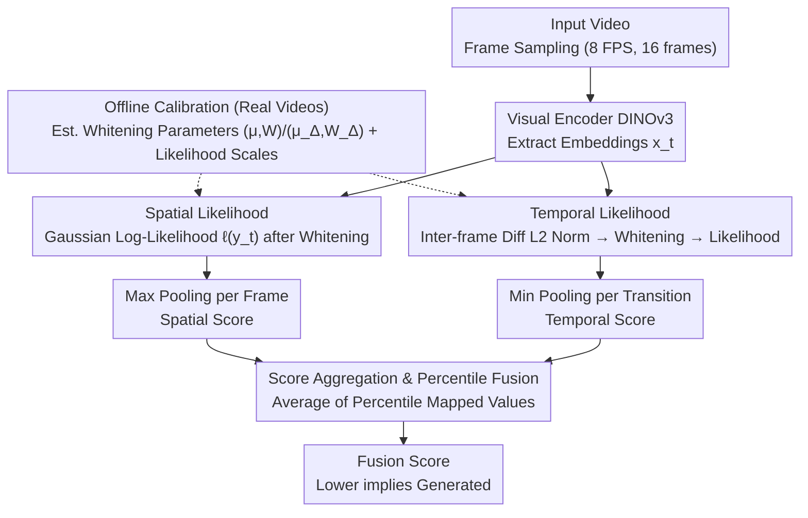

# Training-free Detection of Generated Videos via Spatial-Temporal Likelihoods

**Conference**: CVPR 2026  
**arXiv**: [2603.15026](https://arxiv.org/abs/2603.15026)  
**Code**: Available  
**Area**: Image Generation  
**Keywords**: Zero-shot detection, generated video detection, likelihood estimation, whitening transform, spatial-temporal modeling  

## TL;DR

STALL is proposed as a training-free, zero-shot generated video detector. By jointly modeling per-frame spatial likelihoods and inter-frame temporal likelihoods in a whitened embedding space, it achieves robust detection across various generative models using only real-video calibration.

## Background & Motivation

**1. Background**: Video generation technologies (e.g., Sora, Veo3) are advancing rapidly, capable of producing high-fidelity, long-duration realistic videos. However, these also introduce risks such as misinformation and fraud, making reliable generated video detection critical.

**2. Limitations of Prior Work**:
- **Image Detectors**: Process frames independently, completely ignoring temporal dynamics and failing to capture cross-frame artifacts like motion inconsistency.
- **Supervised Video Detectors**: Require large amounts of labeled training data and exhibit poor generalization to unseen generative models, which emerge continuously.
- **D3 (The only zero-shot video detector)**: Relies solely on temporal cues (second-order frame differences), ignores per-frame spatial information, and lacks a theoretical foundation.

**3. Key Challenge**: Using spatial or temporal information in isolation is insufficient—spatial detectors are blind to motion artifacts, while temporal detectors are blind to per-frame visual anomalies. A method for joint modeling is required.

**4. Goal**: Design a zero-shot (no generated samples, no training), theoretically grounded video detection method that leverages both spatial and temporal evidence.

**5. Key Insight**: High-dimensional visual embeddings approximately follow a Gaussian distribution after whitening (guaranteed by the Maxwell-Poincaré lemma). Thus, closed-form log-likelihood can serve as a measure of "authenticity." This logic is extended from images to video inter-frame transition vectors.

**6. Core Idea**: Calculate spatial likelihood for frame embeddings and temporal likelihood for normalized inter-frame differences. These are fused into a unified detection score via percentile normalization. Generated videos are captured when they deviate from the real data distribution in either spatial or temporal dimensions.

## Method

### Overall Architecture

The premise of STALL is straightforward: since a detector must capture both individual frame quality and inter-frame transitions, it quantifies these two types of evidence as "real-data-like" log-likelihoods and combines them for decision-making.

The method consists of two stages. During **offline calibration**, a batch of real videos (a calibration set, e.g., 33k videos from VATEX) is processed through a visual encoder (DINOv3) to extract frame embeddings. Spatial whitening parameters $(\mu, W)$ and temporal whitening parameters $(\mu_\Delta, W_\Delta)$ are estimated, and the resulting likelihood distributions are recorded as reference scales. During **online inference**, the spatial likelihood is calculated per frame, and the temporal likelihood is calculated for normalized differences between adjacent frames. These are aggregated into video-level scores and averaged after percentile alignment. Lower fusion scores indicate a higher probability of being a generated video. The process requires no learnable parameters and no generated samples in the calibration set.

### Key Designs

**1. Spatial Likelihood: Measuring per-frame authenticity via whitened Gaussian likelihood**

STALL builds upon the verified insight that although image detectors process frames independently, they can capture single-frame visual anomalies. Each frame embedding $x_t = E(f_t)$ undergoes a whitening transform $y_t = W(x_t - \mu)$, resulting in zero mean and identity covariance. Assuming whitened coordinates are approximately Gaussian, such that $y \sim \mathcal{N}(0, I_d)$, the log-likelihood is:

$$\ell(y) = -\tfrac{1}{2}\big(d\log(2\pi) + \|y\|_2^2\big).$$

This holds because prior work (e.g., ZED) proved via Anderson-Darling and D'Agostino-Pearson tests that CLIP/DINO embeddings are Gaussian after whitening. This paper extends this to video frames, verifying that DINOv3 frame embeddings satisfy the Gaussian hypothesis. Consequently, spatial likelihood is a theoretically-backed authenticity measure; $\|y\|^2$ increases and likelihood decreases as generated frames deviate statistically from the real distribution.

**2. Temporal Likelihood: Mapping inter-frame motion to a Gaussian framework**

Spatial info alone cannot detect cross-frame artifacts like motion inconsistency. The intuitive approach is to examine inter-frame differences $\Delta_t = x_{t+1} - x_t$, but their norms vary significantly across clips, violating Gaussianity. The key innovation is applying L2 normalization $\tilde{\Delta}_t = \Delta_t / \|\Delta_t\|$, projecting them onto a unit hypersphere to isolate motion **direction**. Since motion directions in natural videos exhibit no specific preference, these vectors are approximately uniformly distributed on the hypersphere. By the Maxwell-Poincaré lemma, low-dimensional projections of a high-dimensional uniform spherical distribution are approximately Gaussian. Applying whitening $z_t = W_\Delta(\tilde{\Delta}_t - \mu_\Delta)$ allows the same closed-form likelihood calculation. Generated videos often exhibit unnatural motion patterns that fall on the tails of the real motion distribution, leading to low temporal likelihood.

**3. Percentile Fusion: Combining evidence via complementary aggregation**

To synthesize a video-level decision from per-frame/per-transition likelihoods, STALL addresses the scale difference between spatial and temporal pathways. First, for aggregation, spatial likelihood uses **Max Pooling** while temporal likelihood uses **Min Pooling**. Analysis shows min-temporal and max-spatial have the lowest correlation and highest information complementarity. Second, to align scales, raw likelihoods of test videos are converted to percentile ranks relative to the calibration set $\text{perc}(s) = \frac{1}{n}\,|\{i : s_i \le s\}|$. Both paths are then mapped to the $[0,1]$ range, and the final score is the average $s_{\text{video}} = \tfrac{1}{2}(\text{perc}_{\text{sp}} + \text{perc}_{\text{temp}})$.

### Loss & Training

The method is completely **training-free**. The calibration phase involves only pure statistical estimation of mean, covariance, and whitening matrices. No learnable parameters exist during inference.

## Key Experimental Results

### Main Results

Zero-shot comparison with image detectors (AEROBLADE, RIGID, ZED) and video detectors (D3-L2, D3-cos) across three benchmarks using AUC:

| Benchmark | AEROBLADE | RIGID | ZED | D3 (L2) | D3 (cos) | **STALL** |
|------|-----------|-------|-----|---------|----------|-----------|
| VideoFeedback (11 models, avg) | 0.58 | 0.63 | 0.54 | 0.54 | 0.55 | **0.83** |
| GenVideo (10 models, avg) | 0.59 | 0.65 | 0.55 | 0.72 | 0.70 | **0.80** |
| ComGenVid (Sora+Veo3, avg) | 0.69 | 0.57 | 0.55 | 0.73 | 0.73 | **0.85** |
| **Average Across All** | 0.62 | 0.61 | 0.57 | 0.64 | 0.64 | **0.82** |

STALL achieves the highest average AUC across all benchmarks and is the **only method maintaining AUC > 0.5 for every single generator**, whereas other methods experience decision boundary reversals on particular models.

### Ablation Study

**Encoder Ablation** (Table 2, GenVideo benchmark):

| Encoder | DINOv3 | MobileNet-v3 | ResNet-18 | ViCLIP-L/14 | VideoMAE |
|--------|--------|-------------|-----------|-------------|---------|
| AUC | 0.81 | 0.82 | 0.79 | 0.59 | 0.61 |

Image encoders (even lightweight ones like MobileNet) perform excellently. Video encoders underperform because compressing the entire video into a single vector loses per-frame/per-transition statistical information.

**Calibration Set Size**: Results stabilize once the set exceeds 5k samples, with minimal standard deviation.

**Robustness Testing**: STALL maintains high performance under JPEG compression, Gaussian blur, cropping/scaling, and additive noise.

### Key Findings

1. **Spatial + Temporal are both essential**: ZED (spatial only) fails when temporal inconsistency dominates; D3 (temporal only) fails when spatial anomalies dominate. Joint modeling prevents these failure modes.
2. **Normalization is crucial for Temporal Likelihood**: Raw inter-frame differences are non-Gaussian; L2 normalization is required to satisfy the Gaussian properties derived from the Maxwell-Poincaré lemma.
3. **Efficiency**: Inference latency is only 0.49s per video (16 frames), comparable to the fastest method, D3.

## Highlights & Insights

- **Theory-driven**: Rather than a purely empirical approach, STALL uses Gaussian likelihoods and the Maxwell-Poincaré lemma to provide an interpretable and verifiable framework.
- **Simplicity**: No learnable parameters are required. The core involves only whitening, norm calculation, and percentile ranking.
- **Zero-shot Generalization**: Detects state-of-the-art models like Sora and Veo3 without any adaptation.
- **Percentile Fusion**: Naturally eliminates dimensional differences and ensures that anomalies in either spatial or temporal dimensions can trigger detection.

## Limitations & Future Work

1. **Static Video Degradation**: In videos with minimal inter-frame change, the temporal signal vanishes, causing the system to fallback to purely spatial detection.
2. **Calibration Dependence**: While robust to calibration set selection, it still requires real video samples; performance under extreme domain shifts (e.g., medical or satellite video) remains unknown.
3. **Deepfake Scenarios**: Designed for fully generated videos; it does not currently handle local manipulations or edits requiring pixel-level localization.
4. **Adaptive Attacks**: Potential for attackers to match spatial/temporal statistics to the real distribution to bypass detection.

## Related Work & Insights

- **ZED**: STALL's spatial likelihood inherits the whitening + Gaussian likelihood framework from ZED.
- **D3**: Relies on empirical assumptions of second-order differences. STALL surpasses D3 via first-order normalized differences and theoretical guarantees.
- **Maxwell-Poincaré Lemma**: Provides the rigorous foundation for the normalization step—projections of high-dimensional uniform spherical distributions are approximately Gaussian.

## Rating

⭐⭐⭐⭐ Theoretically elegant, experimentally solid, and highly effective despite its simplicity. A benchmark for zero-shot generated video detection. One star withheld for focus on fully generated content and lack of extensive adversarial robustness analysis.

<!-- RELATED:START -->

## Related Papers

- [\[CVPR 2026\] Object-WIPER: Training-Free Object and Associated Effect Removal in Videos](object-wiper_training-free_object_and_associated_effect_removal_in_videos.md)
- [\[CVPR 2026\] Diversity over Uniformity: Rethinking Representation in Generated Image Detection](diversity_over_uniformity_rethinking_representation_in_generated_image_detection.md)
- [\[CVPR 2026\] Just-in-Time: Training-Free Spatial Acceleration for Diffusion Transformers](just-in-time_training-free_spatial_acceleration_for_diffusion_transformers.md)
- [\[CVPR 2025\] A Bias-Free Training Paradigm for More General AI-generated Image Detection](../../CVPR2025/image_generation/a_bias-free_training_paradigm_for_more_general_ai-generated_image_detection.md)
- [\[CVPR 2026\] A Training-Free Style-Personalization via SVD-Based Feature Decomposition](a_training-free_style-personalization_via_svd-based_feature_decomposition.md)

<!-- RELATED:END -->
