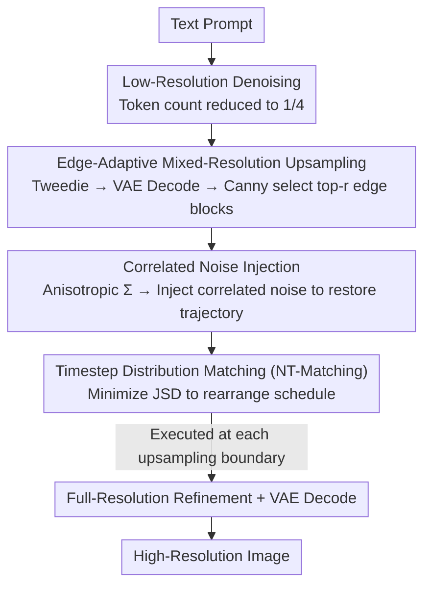

# Training-free Mixed-Resolution Latent Upsampling for Spatially Accelerated Diffusion Transformers

**Conference**: CVPR 2026  
**Paper**: [CVF Open Access](https://openaccess.thecvf.com/content/CVPR2026/html/Jeong_Training-free_Mixed_Resolution_Latent_Upsampling_for_Spatially_Accelerated_Diffusion_Transformers_CVPR_2026_paper.html)  
**Area**: Diffusion Models / Image Generation Acceleration  
**Keywords**: Diffusion Transformer, Spatial Acceleration, Latent Upsampling, Mixed-Resolution, Training-free

## TL;DR
To address the slow inference of Diffusion Transformers (DiT), this paper proposes RALU (Region-Adaptive Latent Upsampling), a training-free method. It performs initial denoising in a low-resolution latent space (1/4 tokens), applies early upsampling only to edge-prone regions, and uses NT-Matching to realign deviated noise and timestep distributions. It achieves a 7.0× speedup on FLUX, reaching up to 15.9× when combined with temporal acceleration and distillation, while maintaining nearly original image quality.

## Background & Motivation

**Background**: Diffusion Transformers (DiT) have achieved SOTA in image/video generation due to their scalability. However, Transformer complexity grows quadratically with the number of tokens, making high-resolution inference extremely slow. Existing training-free accelerations are mostly in the **temporal dimension**, saving computation across timesteps via feature caching (e.g., TeaCache, TaylorSeer, ToCa).

**Limitations of Prior Work**: Acceleration in the **spatial dimension** remains largely unexplored. Intuitively, reducing latent resolution by half in both width and height reduces tokens to 1/4, offering greater complexity reduction than temporal methods. However, a naive "low-res denoising followed by late upsampling" route introduces two types of artifacts: ① **aliasing artifacts** at high-frequency edges and ② **mismatching artifacts** caused by upsampling disrupting the flow trajectory distribution. Bottleneck Sampling, the only prior training-free spatial acceleration, suffers from significant quality degradation due to these artifacts. Other latent upsampling methods (e.g., Pyramidal Flow, Latent-SR) require additional training and cannot be directly applied to pre-trained large models.

**Key Challenge**: The authors clarify the contradiction through experiments: aliasing only occurs during **late** upsampling (when semantic structures are fixed and low-res latents cannot represent sharp boundaries); **early** upsampling ($t_\text{up}\le 0.3$) avoids aliasing but loses the computational benefits of low resolution. This creates a trade-off between "early upsampling vs. computational efficiency."

**Goal**: Achieve both spatial acceleration and artifact-free quality without training or modifying pre-trained models.

**Key Insight**: Two key observations (formulated as Remarks). First, aliasing occurs almost exclusively in **edge regions**—thus, it is sufficient to upsample only edge blocks early while keeping other regions at low resolution. Second, mismatching artifacts stem from anisotropic covariance and disrupted timestep sampling frequencies after upsampling. These can be eliminated by **analytically** matching the noise and timestep distributions back to the original model, which can be derived without training.

**Core Idea**: By combining "region-adaptive mixed-resolution upsampling" and "noise/timestep matching," the two types of spatial artifacts are decoupled and solved. This creates a pure inference-time framework that is orthogonal to existing temporal acceleration methods.

## Method

### Overall Architecture
RALU divides the generation process into three stages across two resolutions. **Stage 1**: Early denoising in a 1/4 token low-resolution latent space for primary computation saving. **Stage 2**: **Intermediate edge-adaptive upsampling**. The current clean latent is estimated, VAE decoded, and edges are detected to upsample only the top-$r$ blocks. The rest remain low-resolution, forming "mixed-resolution" latents. **Stage 3**: The remaining low-resolution blocks are upsampled to full resolution for final refinement. **NT-Matching** (correlated noise injection + timestep distribution matching) is executed at both upsampling boundaries to ensure latents stay on the original model's trajectory.

### Key Designs

**1. Edge-Adaptive Mixed-Resolution Upsampling: Investing high-res computation only where aliasing matters**

This design resolves the conflict between "saving computation" and "avoiding aliasing." The authors verified Remark 1: late upsampling ($t_\text{up}\ge 0.5$) using any interpolation (nearest, bilinear, bicubic, Lanczos) causes significant aliasing at high-frequency areas, whereas early upsampling ($t_\text{up}\le 0.3$) does not, as low-res latents lack the capacity to define sharp boundaries early on. Since aliasing is **local**, RALU upsamples only edge blocks early. At the end of Stage 1, it uses the **Tweedie formula** to estimate the clean latent $\hat{x}_0$ from the noisy latent, decodes it via VAE, and runs **Canny edge detection**. Blocks with the strongest edge signals (top-$r$ proportion, typically $r\approx 20\%\sim30\%$) are upsampled early. Remaining blocks stay low-res until Stage 3. This concentrated use of high-resolution ensures edges are sharp while most tokens benefit from low-res speed.

**2. Correlated Noise Injection: Analytically pulling deviated latent distributions back to the trajectory**

Upsampling disrupts the conditional distribution of flow matching. Under the original trajectory, $\hat{x}_t\mid x_1\sim\mathcal{N}(t x_1,(1-t)^2 I)$ is isotropic. After 2× nearest-neighbor upsampling, it becomes $\text{Up}(\hat{x}_t)\mid x_1\sim\mathcal{N}(t\,\text{Up}(x_1),(1-t)^2\Sigma)$, where $\Sigma$ is **anisotropic** (block diagonal). This mismatch causes global artifacts. RALU injects **correlated noise** $z\sim\mathcal{N}(0,\Sigma')$ to restore isotropy: let $a\,\text{Up}(\hat{x}_{e_k})+b\,z=\hat{x}_{s_{k+1}}$. Under the constraint $\Sigma'=I-c\Sigma$, the re-parameterization solved in closed-form with $\delta_k\equiv(1-e_k)/\sqrt{c}$ is:

$$s_{k+1}=\frac{e_k}{\delta_k+e_k},\quad a=\frac{1}{\delta_k+e_k},\quad b=\frac{\delta_k}{\delta_k+e_k}.$$

Critically, this is **training-free**. Unlike Pyramidal Flow ([22]), which learns parameters, RALU derives them analytically (details in supplementary materials, subject to原文 syntax).

**3. Timestep Distribution Matching (NT-Matching): Aligning sampling frequencies to eliminate mismatching artifacts**

Injecting noise shifts the process from $e_k$ to $s_{k+1}$, causing $[s_{k+1}, e_k]$ to be oversampled. This disrupts the original non-uniform timestep sampling frequency of flow matching, which Remark 2 identifies as the source of mismatching artifacts. NT-Matching aligns the "actual post-upsampling timestep distribution" with the "target scheduler distribution." The truncated PDF is $f_{h,s,e}(t)=f_h(t)/\big(F_h(e)-F_h(s)\big)$, where $f_h(t)=h/(1+(h-1)t)^2$ and $h$ is the shifting parameter. The target distribution $P_\text{target}(t)$ is the weighted sum of PDFs across all stages. The actual distribution $P(t)$ is controlled by independent shifting parameters $\{h_k\}$. By **minimizing the Jensen-Shannon Divergence (JSD) via numerical search**, the correlation coefficient $c$ and $\{h_k\}$ are determined analytically.

### Loss & Training
The framework is entirely **training-free and fine-tuning-free**, introducing no learnable parameters. Scheduling parameters like $c$ and $\{h_k\}$ are determined by a one-time numerical search to minimize JSD. The edge block ratio $r$ is a hyperparameter for the speed-quality trade-off (set to 0.2–0.3). Edge detection uses Canny in the image space.

## Key Experimental Results

Base models include FLUX.1-dev and SD3 Medium. Metrics include ImageReward, CLIP-IQA, NIQE, T2I-CompBench, and GenEval. Efficiency is measured by latency and TFLOPs on an A100 GPU.

### Main Results (Comparison at 7× Speedup on FLUX)

| Method | Acceleration | TFLOPs ↓ | Speed.↑ | ImageReward↑ | CLIP-IQA↑ | NIQE↓ | GenEval↑ |
|------|--------|---------|--------|-------------|----------|-------|---------|
| FLUX (50, Original) | - | 2991.0 | 1.00× | 1.095 | 0.707 | 6.75 | 0.698 |
| FLUX (7) | Temporal | 431.5 | 6.93× | 0.920 | 0.660 | 8.25 | 0.583 |
| TaylorSeer | Temporal | 431.7 | 6.83× | 0.660 | 0.646 | 9.43 | 0.446 |
| Bottleneck | Spatial | 431.5 | 6.93× | 0.792 | 0.631 | 8.71 | 0.672 |
| **RALU (Ours)** | Spatial | 426.0 | **7.02×** | **0.999** | **0.681** | **6.87** | **0.682** |

At aggressive 7× acceleration, temporal methods (e.g., TaylorSeer dropping to 0.660) and prior spatial methods like Bottleneck (0.792) show significant quality loss. RALU’s ImageReward (0.999) and NIQE (6.87) are significantly closer to the original model.

### Combined with Temporal Acceleration / Distillation Models

| Configuration | Acceleration | TFLOPs↓ | Speed.↑ | ImageReward↑ | GenEval↑ |
|------|--------|---------|--------|-------------|---------|
| RALU (5×) | S | 540.5 | 5.53× | 1.022 | 0.652 |
| + TaylorSeer (W=3) | S+T | 410.7 | 7.28× | 0.959 | 0.680 |
| + TaylorSeer (W=2) | S+T | 331.4 | 9.03× | 0.926 | 0.586 |
| FLUX.1-schnell (4 steps) | D | 252.9 | 11.83× | 1.055 | 0.688 |
| **+ RALU** | D+S | 187.9 | **15.91×** | 0.992 | 0.636 |

As a spatial method, RALU is orthogonal to temporal caching and distillation. Combined with TaylorSeer, it reaches 9.03×; combined with the distilled FLUX.1-schnell, it achieves 15.91× speedup with minimal quality loss.

### Ablation Study: JSD Effects of NT-Matching (FLUX 7×)

| JSD | ImageReward↑ | NIQE↓ | T2I-CompBench↑ |
|-----|-------------|-------|----------------|
| 0.026 (Optimized) | 0.999 | 6.51 | 0.633 |
| 0.030 | 0.972 | 6.60 | 0.571 |
| 0.035 | 0.981 | 6.53 | 0.569 |
| 0.040 | 0.966 | 6.80 | 0.565 |

### Key Findings
- **Effectiveness of NT-Matching depends on minimizing JSD**: Optimizing to JSD=0.026 yields the best quality and alignment; intentionally increasing JSD degrades all metrics, confirming that mismatching is caused by timestep distribution shifts.
- **Optimal upsampling ratio $r$**: Quality peaks at approximately $r=0.3$. $r=0.2\text{--}0.3$ is chosen as the quality-efficiency compromise.
- **Image-space edge detection is more accurate**: Running Canny on VAE-decoded images is more precise than Latent-space Sobel, with negligible overhead (~2.48 TFLOPs).
- **Superior artifact suppression**: At similar TFLOPs, RALU shows a significantly lower artifact rate compared to Bottleneck and naive upsampling.

## Highlights & Insights
- **Robustness in spatial acceleration**: While temporal caching saves a few steps, spatial resolution reduction offers much higher leverage. The orthogonality of RALU allows it to be applied on top of existing speedup methods for "free" extra speed.
- **Clean research paradigm**: By identifying two distinct types of artifacts and solving them individually, the method remains highly logical and avoids "black-box" tuning.
- **Purely analytical, zero training**: Turning "interpolation learning" into closed-form derivation + JSD minimization allows plug-and-play capability for any flow-based DiT.
- **Clever use of Tweedie + VAE**: Using an estimated clean image for edge detection ensures that "where aliasing might occur" is identified reliably.

## Limitations & Future Work
- **Underlying mechanism needs deeper theory**: Exactly how DiT processes mixed resolutions and how self-attention weights adapt remains an open question.
- **Empirical hyperparameters**: Thresholds like $r\approx0.2\text{--}0.3$ and $t_\text{up}\le0.3$ are experiment-driven and may need adjustment for different models or tasks.
- **Core derivation hidden in supplementary**: Key parameter derivations for $a, b, s_{k+1}$ are not in the main text.
- **Scope**: Only T2I was validated; performance on video/audio DiT or ultra-high resolutions (>1024) remains to be explored.

## Related Work & Insights
- **vs. Temporal Methods (TeaCache / TaylorSeer)**: These cache features over time but degrade quickly at aggressive speeds; RALU works on the spatial dimension and is orthogonal.
- **vs. Bottleneck Sampling**: Both are training-free spatial accelerations, but RALU handles aliasing and mismatching artifacts that Bottleneck ignores.
- **vs. Pyramidal Flow / Latent-SR**: These require training; RALU replaces training with analytical parameter derivation.
- **vs. Timestep Distillation (FLUX.1-schnell)**: Distillation reduces steps during training; RALU reduces resolution during inference. Together they achieve 15.9× acceleration.

## Rating
- Novelty: ⭐⭐⭐⭐⭐ Establishes a systematic spatial acceleration scheme for DiT with original components.
- Experimental Thoroughness: ⭐⭐⭐⭐ Extensive testing on FLUX/SD3 with multiple metrics and ablations; limited to T2I.
- Writing Quality: ⭐⭐⭐⭐⭐ Very clear problem diagnosis using Remarks; follows a strong logical chain.
- Value: ⭐⭐⭐⭐⭐ Training-free, plug-and-play, and orthogonal to existing methods; highly practical for deployment.

<!-- RELATED:START -->

## Related Papers

- [\[CVPR 2026\] Just-in-Time: Training-Free Spatial Acceleration for Diffusion Transformers](just-in-time_training-free_spatial_acceleration_for_diffusion_transformers.md)
- [\[CVPR 2026\] Region-Adaptive Sampling for Diffusion Transformers](region-adaptive_sampling_for_diffusion_transformers.md)
- [\[CVPR 2026\] Training-free, Perceptually Consistent Low-Resolution Previews with High-Resolution Image for Efficient Workflows of Diffusion Models](training-free_perceptually_consistent_low-resolution_previews.md)
- [\[CVPR 2026\] SketchDeco: Training-Free Latent Composition for Precise Sketch Colourisation](sketchdeco_training-free_latent_composition_for_precise_sketch_colourisation.md)
- [\[CVPR 2026\] PixelRush: Ultra-Fast, Training-Free High-Resolution Image Generation via One-step Diffusion](pixelrush_ultrafast_trainingfree_highresolution_im.md)

<!-- RELATED:END -->
