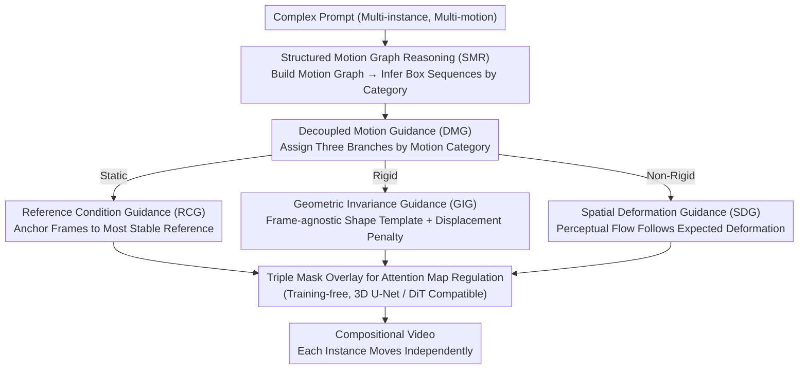

# Training-free Motion Factorization for Compositional Video Generation

**Conference**: CVPR 2026  
**arXiv**: [2603.09104](https://arxiv.org/abs/2603.09104)  
**Code**: To be released  
**Area**: Diffusion Models / Video Generation / Motion Control  
**Keywords**: Compositional Video Generation, Motion Factorization, Structured Reasoning, Decoupled Guidance, Training-free

## TL;DR

A motion factorization framework is proposed to decompose the motion of multiple instances in a scene into three categories: static, rigid, and non-rigid. It addresses semantic ambiguity in prompts through Structured Motion Graph Reasoning (SMR) and regulates the generation of these three motion types during the diffusion process via Decoupled Motion Guidance (DMG). Without additional training, it significantly improves motion diversity and fidelity on VideoCrafter-v2.0 and CogVideoX-2B.

## Background & Motivation

1. **Background**: Compositional Video Generation (CVG) aims to generate scenes with multiple instances and varied motions from complex prompts. Existing methods (e.g., LVD, VideoDirectorGPT) typically use LLMs to generate bounding box sequences to guide instance motion.
2. **Limitations of Prior Work**: (1) Motion semantic ambiguity—generating box sequences directly from text leads to fragmented motion paths and abnormal size changes; (2) Coarse motion guidance—uniform diffusion guidance fails to distinguish between different motion categories, resulting in converged and unnatural movements.
3. **Key Challenge**: Existing methods treat the motion of all instances equally, lacking modeling for the diversity of motion categories. Static objects, vehicles moving in straight lines, and dancing people require entirely different generation strategies.
4. **Goal**: How to enable video generation models to produce diverse motions corresponding to the motion category of each instance without training?
5. **Key Insight**: Decompose motion into three fundamental categories—static, rigid, and non-rigid—and design targeted reasoning and guidance strategies for each.
6. **Core Idea**: Motion factorization + planning before generation—use structured motion graphs to reason the motion representation for each instance, then use decoupled guidance branches to synthesize the three types of motion specifically.

## Method

### Overall Architecture

The core problem this paper addresses is: starting from a complex prompt describing multiple objects and motions, how to make the video generation model generate distinct motions for each object that match its category, rather than making everything move uniformly. The key observation is that a static lamppost, a car driving straight, and a dancing person naturally require three different generation strategies, yet existing methods treat them the same.

The framework follows a "plan-then-generate" two-step process. In the planning stage (SMR), the text prompt is translated into a structured motion graph, from which frame-by-frame bounding box sequences are derived for each instance as its motion representation. In the generation stage (DMG), after obtaining these boxes, the system assigns them to three specialized guidance branches based on the instance's motion category—appearance consistency for static, geometric invariance for rigid, and spatial deformation for non-rigid—each regulating the attention maps of the diffusion model. This process does not modify model weights and only operates at the attention level, making it directly applicable to both 3D U-Net (VideoCrafter) and DiT (CogVideoX) backbones.

### Key Designs

**1. Structured Motion Graph Reasoning (SMR): Decoupling "Text → Motion" Ambiguity**

Generating box sequences directly from prompts often produces fragmented trajectories due to semantic ambiguity. SMR first constructs a motion graph $\mathcal{R} = (\mathcal{V}, \mathcal{E})$: each instance is a node with motion attributes and category labels, while directed edges encode spatial relationships and dynamic interactions. With this graph as an intermediate representation, deriving box sequences becomes formulaic based on category: static instances lock the first frame $\mathcal{B}_f(v_n) = \mathcal{B}_1(v_n)$; rigid instances extrapolate via estimated velocity $\vec{u}$ and acceleration $\vec{a}$ using $\mathcal{B}_f = \mathcal{B}_{f-1} + \vec{u} + \frac{1}{2}\vec{a}$; non-rigid instances use boundary displacement vectors $\Delta_f(v_n)$ to characterize asymmetric transformation.

**2. Reference Condition Guidance (RCG, for Static Instances): Anchoring Frames to Eliminate Flicker**

Video diffusion models often produce "pseudo-flicker" in regions that should be static. RCG selects the "most stable frame" as a reference—the frame with the least feature variance $f^* = \arg\min_f \sum_{f'} D(\varphi(\mathbf{z}_f^t), \varphi(\mathbf{z}_{f'}^t))$—and uses a mask to force all frames of that instance to interact only with the reference frame:

$$\mathcal{G}_m[x,y,f,f'](v_n) = \mathbb{1}(f'=f^* \,\&\, (x,y) \in \mathcal{B}(v_n))$$

This essentially "copies and pastes" the static regions from the same reference frame at the attention level, blocking unwanted inter-frame variations.

**3. Geometric Invariance Guidance (GIG, for Rigid Instances): Creating a Frame-Agnostic Shape Template**

Rigid objects should translate without deforming, but unconstrained models often cause artifacts like a car "twisting" while driving. GIG uses k-means to extract the foreground from the box area and aggregates coarse masks across frames via pixel voting to create a frame-agnostic shape template. This is projected back as an alignment mask $\mathcal{M}_f$. A displacement penalty factor is added based on center distance to ensure smoothness:

$$\Gamma[f,f'] = \exp(-\alpha \cdot \|\mathbf{C}_f - \mathbf{C}_{f'}\|_2) + 1, \qquad \mathcal{G}_r = \mathcal{M} \cdot \mathcal{M}^\top \odot \Gamma$$

**4. Spatial Deformation Guidance (SDG, for Non-rigid Instances): Aligning Perceptual Flow with Expected Deformation**

For complex movements like dancing, simple translation is insufficient. SDG extracts a perceptual deformation field $\mathcal{D}_{\text{perc}}$ from diffusion features via nearest neighbor search and compares it with the expected box deformation field $\mathcal{D}_{\text{box}}$ (derived via bilinear interpolation of box corner shifts), applying a penalty to bridge the gap:

$$\Lambda[i,j] = \exp(-\alpha \cdot (\mathcal{D}_{\text{perc}}[i,j] - \mathcal{D}_{\text{box}}[i,j])) + 1, \qquad \mathcal{G}_{\text{nr}} = (\mathcal{M} \cdot \mathcal{M}^\top) \odot \Lambda$$

### Loss & Training

This method requires no additional training. For 3D U-Net architectures, noise embeddings are updated via gradient descent $\mathbf{z}^{t-1} \leftarrow \mathbf{z}^t - \nabla\mathcal{L}$, where $\mathcal{L} = 1 - \frac{\beta}{P}\sum(\mathbf{A} \odot (\mathcal{G}_m + \mathcal{G}_r + \mathcal{G}_{nr}))$. For DiT architectures, the masks are added as biases to the attention scores: $\mathbf{A} = \text{Softmax}(\frac{\mathbf{Q}\mathbf{K}^\top (1 + \beta \odot (\mathcal{G}_m + \mathcal{G}_r + \mathcal{G}_{nr}))}{\sqrt{d}})$.

## Key Experimental Results

### Main Results

Evaluated on CVGBench-m (1,665 samples) and CVGBench-p (994 samples):

| Model Setting | Subject Consis. | Background Consis. | Temporal Flicker. | Motion Smooth. | Dynamic Degree |
|---------|----------------|-------------------|-------------------|---------------|----------------|
| VideoCrafter-v2.0 (Base) | 97.68% | 97.28% | 96.28% | 98.16% | 33.11% |
| + A&R | 97.48% | 97.05% | 96.43% | 98.27% | 38.40% |
| + **Ours** | **98.40%** | **98.11%** | **97.39%** | **98.63%** | **82.21%** |
| CogVideoX-2B (Base) | 91.33% | 92.78% | 95.01% | 96.88% | 87.80% |
| + R&P | 91.00% | 90.85% | 95.07% | 96.96% | 91.02% |
| + **Ours** | **98.27%** | **97.73%** | **98.25%** | **98.74%** | **96.00%** |

### Ablation Study

Guidance branch ablation (VideoCrafter-v2.0):

| RCG | GIG | SDG | Subject Consis. | Dynamic Degree | Note |
|-----|-----|-----|----------------|---------------|------|
| ✗ | ✗ | ✗ | 97.48% | 38.40% | Semantic only |
| ✓ | ✗ | ✗ | 98.11% | 51.60% | Static guidance |
| ✗ | ✓ | ✗ | 98.07% | 53.60% | Rigid guidance |
| ✗ | ✗ | ✓ | 97.71% | 74.85% | Non-rigid guidance |
| ✓ | ✓ | ✓ | **98.40%** | **82.21%** | Full model |

### Key Findings

- **Significant Gain in Dynamic Degree**: On VideoCrafter-v2.0, it increased from 33.11% to 82.21% (+49.1 pp), indicating the framework effectively activates large-scale motions.
- **SDG Impact**: Non-rigid guidance (SDG) contributed the most to the dynamic degree.
- **SMR Criticality**: Removing SMR dropped Subject Consistency by 5.11% and Dynamic Degree by 7.79%, proving structured reasoning is vital for resolving ambiguity.
- **Architecture Agnosticism**: Effectiveness across 3D U-Net and DiT validates the generalizability of the attention-level regulation.

## Highlights & Insights

- **Elegant Motion Abstraction**: Decomposing complex motion into static, rigid, and non-rigid categories provides a simple yet powerful mathematical framework.
- **Motion Graph as Intermediate Representation**: Transforming "Text → Motion" into "Text → Graph → Motion" effectively leverages LLM reasoning while constraining its output to a structured format.
- **Attention-level Regulation**: Operating directly on attention maps/scores ensures the method is training-free and compatible with various backbones.

## Limitations & Future Work

- Failure to handle rare semantic concepts (e.g., "Dendroid") due to base model limitations.
- Poor performance on subtle emotional cues (e.g., "sad" expressions).
- Limited to 2D plane motion (bounding boxes); does not model depth or 3D rotation.
- Camera motion is not modeled.
- Future Work: Integrate reference images for rare concepts; model 3D bounding boxes and camera poses.

## Related Work & Insights

- **vs VideoTetris/Vico**: Those focus on semantic binding; this paper complementarily solves motion category diversity.
- **vs LVD/VideoDirectorGPT**: Those use uniform box guidance; this paper uses motion graphs and decoupled guidance for higher diversity.
- **vs FreeTraj/TrailBlazer**: This paper provides finer control by distinguishing between motion categories.

## Rating

- Novelty: ⭐⭐⭐⭐ 
- Experimental Thoroughness: ⭐⭐⭐⭐ 
- Writing Quality: ⭐⭐⭐⭐ 
- Value: ⭐⭐⭐⭐ 

<!-- RELATED:START -->

## Related Papers

- [\[CVPR 2026\] FlowMotion: Training-Free Flow Guidance for Video Motion Transfer](flowmotion_training-free_flow_guidance_for_video_motion_transfer.md)
- [\[CVPR 2026\] SWIFT: Sliding Window Reconstruction for Few-Shot Training-Free Generated Video Attribution](swift_sliding_window_reconstruction_for_few-shot_training-free_generated_video_a.md)
- [\[CVPR 2026\] SwitchCraft: Training-Free Multi-Event Video Generation with Attention Controls](switchcraft_training-free_multi-event_video_generation_with_attention_controls.md)
- [\[CVPR 2026\] FlowDirector: Training-Free Flow Steering for Precise Text-to-Video Editing](flowdirector_training-free_flow_steering_for_precise_text-to-video_editing.md)
- [\[AAAI 2026\] DreamRunner: Fine-Grained Compositional Story-to-Video Generation with Retrieval-Augmented Motion Adaptation](../../AAAI2026/video_generation/dreamrunner_fine-grained_compositional_story-to-video_genera.md)

<!-- RELATED:END -->
