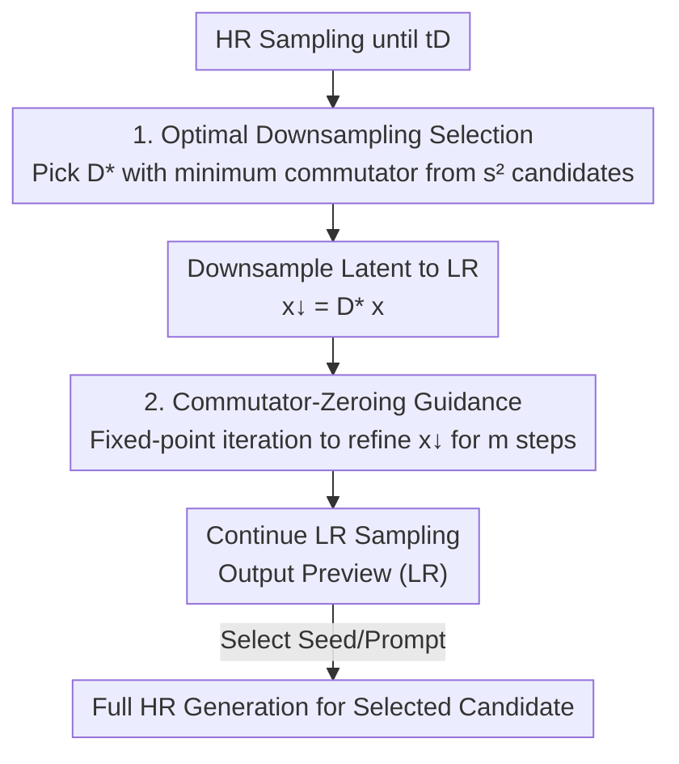

# Training-free, Perceptually Consistent Low-Resolution Previews with High-Resolution Image for Efficient Workflows of Diffusion Models

**Conference**: CVPR 2026  
**Paper**: [CVF OpenAccess](https://openaccess.thecvf.com/content/CVPR2026/html/Jeong_Training-free_Perceptually_Consistent_Low-Resolution_Previews_with_High-Resolution_Image_for_Efficient_CVPR_2026_paper.html)  
**Code**: None  
**Area**: Diffusion Models / Image Generation  
**Keywords**: Preview generation, flow matching, commutator condition, training-free, inference acceleration

## TL;DR
To alleviate the high-resolution (HR) computational burden during the user's "seed/prompt trial-and-error" stage, this paper proposes a **training-free** low-resolution (LR) "preview" generation method. The goal of "perceptual consistency between LR and HR" is reformulated as a **commutator-zero condition** between the flow matching model and the downsampling operator. This condition is approximately satisfied during sampling via "optimal downsampling matrix selection" and "commutator-zeroing guidance," saving up to 33% of computation while preserving composition and color consistency. When combined with temporal acceleration, it achieves a 3.05× speedup.

## Background & Motivation
**Background**: Diffusion/flow matching models (e.g., FLUX.1-dev, Stable Diffusion 3.5-Large) have become daily tools for designers. However, because these models produce diverse results from the same prompt, users often perform **repeated trials by changing seeds and prompts** to find the desired image. Generating a full HR image for every trial incurs significant computational costs for both users and service providers.

**Limitations of Prior Work**: Existing acceleration strategies are unsuitable for the "trial preview" scenario. ① **Caching-based methods** (∆-DiT, ToCa, TaylorSeer) reuse redundant features to predict future latents, providing only linear speedup with extra VRAM and potentially altering the perceptual appearance. ② **Spatial downsampling methods** (Bottleneck Sampling, RALU) directly downsample latents for quadratic speedup, but **direct latent manipulation disturbs representations**, leading to composition and color shifts, failing to faithfully represent the corresponding HR image.

**Key Challenge**: An intuitive solution is "generate LR then Super-Resolution (SR) to HR." However, the authors note (Fig. 2) that **details lost in the LR stage are amplified during SR**—fine structures like eyes or fur disappear in LR and cannot be recovered by SR. Thus, the "LR→SR" pipeline is inherently misaligned with "direct HR generation." The fundamental problem is that users need a **faithful preview** that "looks identical to the final HR image but at a lower resolution," rather than just an upscalable LR image.

**Goal**: Define a new task, **Preview Generation**, to generate a batch of LR candidates (Previews) that are **highly perceptually consistent** with their corresponding HR images. Users select promising candidates, and only the selected ones undergo the full HR sampling process.

**Key Insight**: The authors observe that **early denoising steps primarily determine the global layout**. The strategy is to sample in HR space normally until a time step $t_D$ (forming the global structure), then downsample to LR to continue—allowing LR to inherit the globally consistent representation formed early on.

**Core Idea**: Formalize "consistency between the downsampled LR trajectory and the HR trajectory" as the **commutativity** of the downsampling operator $D$ and the flow matching velocity field $v_\theta$, i.e., the commutator $[D, v_\theta]=0$. Training-free methods are then used to approximate this condition.

## Method

### Overall Architecture
The method centers on a core hypothesis: if one samples in HR space until $t_D$ (where $t_D/N\approx0.3$ and global layout is formed) and then downsamples the latent using operator $D$ to continue in LR, the LR endpoint $x_1^{\downarrow}$ will approximate the downsampled HR endpoint $Dx_1$, provided $D$ and $v_\theta$ are **approximately commutative**.

Specifically, the downsampling trajectory satisfies $dx_t^{\downarrow}=Dv_\theta(x_t,t)\,dt$. The ideal **consistency condition** is $x_1^{\downarrow}=Dx_1$. Using $v_\theta(Dx_t,t)$ to replace $Dv_\theta(x_t,t)$ for acceleration requires the **commutator condition**:

$$[D, v_\theta](x_t,t)\triangleq Dv_\theta(x_t,t)-v_\theta(Dx_t,t)\overset{?}{=}0.$$

Empirically (Tab. 1), flow matching models do not satisfy this: the L2 norm of the commutator is as high as $111.03$ on FLUX.1-dev. The authors minimize this norm by manipulating two variables—selecting $D$ (Sec. 3.3) and adjusting $x_t$ (Sec. 3.4). The pipeline is a **single-branch serial process with a temporal switch**: HR sampling → Optimal matrix downsampling at $t_D$ → Commutator-zeroing guidance for $m$ steps → Final LR sampling.

### Key Designs

**1. Optimal Downsampling Matrix Selection: Choosing $D^*$ with the smallest commutator**

Tab. 1 shows that arbitrary downsampling (e.g., nearest neighbor) results in a large commutator. Optimizing $D$ as a continuous variable would introduce noise correlation (due to non-binary weights) and be computationally expensive. The solution is to **choose from a discrete set of mutually exclusive candidates**: for each $s\times s$ block, downsampling $D_{s\times s}$ selects one of $s^2$ elements. Aggregating these yields $s^2$ non-overlapping global operators:

$$D_k\triangleq\Big(\bigoplus_{i=1}^{h/s}\bigoplus_{j=1}^{w/s}D_{s\times s,k}^{(i,j)}\Big)\Pi,\quad k\in\{1,\dots,s^2\},$$

where $\Pi$ is a permutation matrix and $\bigoplus$ denotes the direct sum. The optimal $D^*$ is chosen from $\mathcal D_{down}=\{D_1,\dots,D_{s^2}\}$ to minimize the commutator norm:

$$D^*=\arg\min_{i=1,\dots,s^2}\|[D_i,v_\theta](x_t,t)\|.$$

This is efficient because all $s^2$ candidates share a single $v_\theta(x_t,t)$ forward pass. The cost is negligible, and the binary/exclusive structure avoids noise correlation.

**2. Commutator-Zeroing Guidance: Refine $x_t^\downarrow$ using forward-only fixed-point iteration**

While $D^*$ reduces the commutator, $x_t$ must also be refined. To avoid expensive backpropagation, the authors propose a **forward-only** update rule:

$$x_t^{\downarrow,k+1}=x_t^{\downarrow,k}+\alpha\cdot\big(D^*v_\theta(x_t,t)-v_\theta(x_t^{\downarrow,k},t)\big).$$

To save computation, the authors leverage a property of rectified flow: **the velocity field is approximately constant within a local neighborhood**, $v_\theta(x_{t_0},t)\approx v_\theta(x_{t_0+\Delta t},t+\Delta t)$. They **reuse $v_\theta(x_{t_D},t_D)$** calculated at the downsampling moment to replace the HR term at step $t$:

$$x_t^{\downarrow,k+1}=x_t^{\downarrow,k}+\alpha\cdot\big(\underbrace{D^*v_\theta(x_{t_D},t_D)}_{\text{Reused, }Eq.(11)}-v_\theta(x_t^{\downarrow,k},t)\big).$$

Each update requires only one **cheap LR forward pass** $v_\theta(x_t^\downarrow,t)$. This is limited to $m$ steps after $t_D$ with one iteration per step ($k=1$). Wilcoxon signed-rank tests confirm that without guidance, the commutator norm increases significantly ($p=9.62\times10^{-38}$), whereas with guidance, it decreases significantly ($p=3.38\times10^{-25}$).

### Loss & Training
The method is entirely **training-free**. Key hyperparameters: NFE $N=30$, downsampling step $D=10$ ($t_D/N\approx0.3$), guidance steps $m=5$, step size $\alpha=0.04$ for FLUX and $\alpha=0.01$ for SD3.5.

## Key Experimental Results

### Main Results
Evaluated on **PixArt-Eval30K** (5K prompts) at $512\times512$. Metrics include PIQE (quality), DreamSim↓/DiffSim↑ (perceptual similarity), and PSNR↑/FSIM↑ (low-level similarity).

| Model / Method | Speed↑ | PIQE↓ | DreamSim↓ | DiffSim↑ | PSNR(dB)↑ | FSIM↑ |
|--------|--------|-------|-----------|----------|-----------|-------|
| FLUX.1-dev (NFE=20) | 1.49× | 34.78 | 7.25 | 0.8686 | 20.633 | **0.8268** |
| FLUX Low-res (Direct 512) | 2.99× | 29.11 | 21.02 | 0.7352 | 11.936 | 0.6147 |
| FLUX Naïve Down. | 1.75× | 31.71 | 9.20 | 0.8584 | 18.221 | 0.7375 |
| **FLUX Ours** | 1.53× | **28.55** | **6.83** | **0.8721** | **21.182** | 0.7953 |
| SD3.5-L (NFE=20) | 1.49× | 36.28 | 15.61 | 0.7893 | 13.496 | 0.6782 |
| SD3.5-L Direct Low-res | 2.88× | 31.95 | 28.46 | 0.6538 | 8.318 | 0.5517 |
| SD3.5-L Naïve Down. | 1.72× | **29.75** | 14.81 | 0.7956 | 13.858 | 0.6919 |
| **SD3.5-L Ours** | 1.50× | 31.55 | **13.47** | **0.8117** | **14.457** | **0.7408** |

"Direct low-res" generation is fastest but has extremely high DreamSim scores (21–28), indicating poor alignment with HR. Ours achieves the best perceptual similarity and PSNR across both models.

### Orthogonal Combination with Temporal Acceleration
Ours (spatial) is orthogonal to caching-based temporal acceleration like TaylorSeer:

| Method | Speed↑ | PIQE↓ | DreamSim↓ | PSNR(dB)↑ |
|------|--------|-------|-----------|-----------|
| FLUX.1-dev (NFE=10) | 2.95× | 32.82 | 16.97 | 16.427 |
| Taylor only | 3.21× | 28.10 | 9.17 | 18.667 |
| **Ours + Taylor** | 3.05× | **27.47** | **7.79** | **19.953** |

At a similar speedup to reducing NFE, the combined version significantly improves quality and consistency, reaching **3.05× acceleration**.

### Ablation Study
$\arg\min$ selection of the commutator norm is the optimal strategy. Adding guidance (CG) improved PSNR from 19.115 to 20.962 and reduced DreamSim from 8.56 to 7.05, confirming its critical role.

## Highlights & Insights
- **Reformulating "perceptual consistency" as an algebraic condition**: Framing the goal as $[D, v_\theta]=0$ allows optimization to shift from subjective quality to a computable scalar norm.
- **Efficient guidance via rectified flow properties**: Reusing $v_\theta(x_{t_D}, t_D)$ allows for iterative refinement with zero extra HR forward passes.
- **Discrete mutually exclusive candidates**: Selecting from $s^2$ candidates avoids the noise correlation inherent in continuous weights and simplifies optimization to a single-pass evaluation.
- **Orthogonality**: The method can be stacked with temporal acceleration methods for a synergistic >3× speedup.

## Limitations & Future Work
- **Empirical assumptions**: Compliance ($x_1^\downarrow=Dx_1$) and commutator-zero conditions are not strictly satisfied by models; the method only approximates them.
- **Standalone acceleration is moderate**: Standalone speedup is ~1.5×, lower than direct LR generation (~3×); its real strength lies in consistency.
- **Warping requires correction**: Operations like translation/warping introduce noise correlation, requiring additional correction mechanisms to be used within this framework.

## Related Work & Insights
- **vs. Caching methods**: Caching (e.g., TaylorSeer) works on the **temporal** axis; this work works on the **spatial** axis. They are complementary.
- **vs. Earlier spatial downsampling**: Previous methods (e.g., Bottleneck Sampling) disturb latent representations; this work uses the commutator condition to ensure faithful alignment.
- **vs. LR→SR**: SR cannot recover details already lost in LR; this method ensures the LR is a faithful representation of the HR from the start.

## Rating
- **Novelty**: ⭐⭐⭐⭐⭐ High. Innovative algebraic formulation of consistency.
- **Experimental Thoroughness**: ⭐⭐⭐⭐ Solid. Comprehensive multi-model/metric evaluation.
- **Writing Quality**: ⭐⭐⭐⭐ Good. Logical progression from theory to design.
- **Value**: ⭐⭐⭐⭐ Significant. Training-free and orthogonal implementation makes it highly practical.

<!-- RELATED:START -->

## Related Papers

- [\[CVPR 2026\] Low-Resolution Editing is All You Need for High-Resolution Editing](low-resolution_editing_is_all_you_need_for_high-resolution_editing.md)
- [\[CVPR 2026\] PixelRush: Ultra-Fast, Training-Free High-Resolution Image Generation via One-step Diffusion](pixelrush_ultrafast_trainingfree_highresolution_im.md)
- [\[CVPR 2026\] Efficient and Training-Free Single-Image Diffusion Models](efficient_and_training-free_single-image_diffusion_models.md)
- [\[CVPR 2026\] Training-free Mixed-Resolution Latent Upsampling for Spatially Accelerated Diffusion Transformers](training-free_mixed-resolution_latent_upsampling_for_spatially_accelerated_diffu.md)
- [\[CVPR 2026\] From Sketch to Fresco: Efficient Diffusion Transformer with Progressive Resolution](from_sketch_to_fresco_efficient_diffusion_transformer_with_progressive_resolutio.md)

<!-- RELATED:END -->
