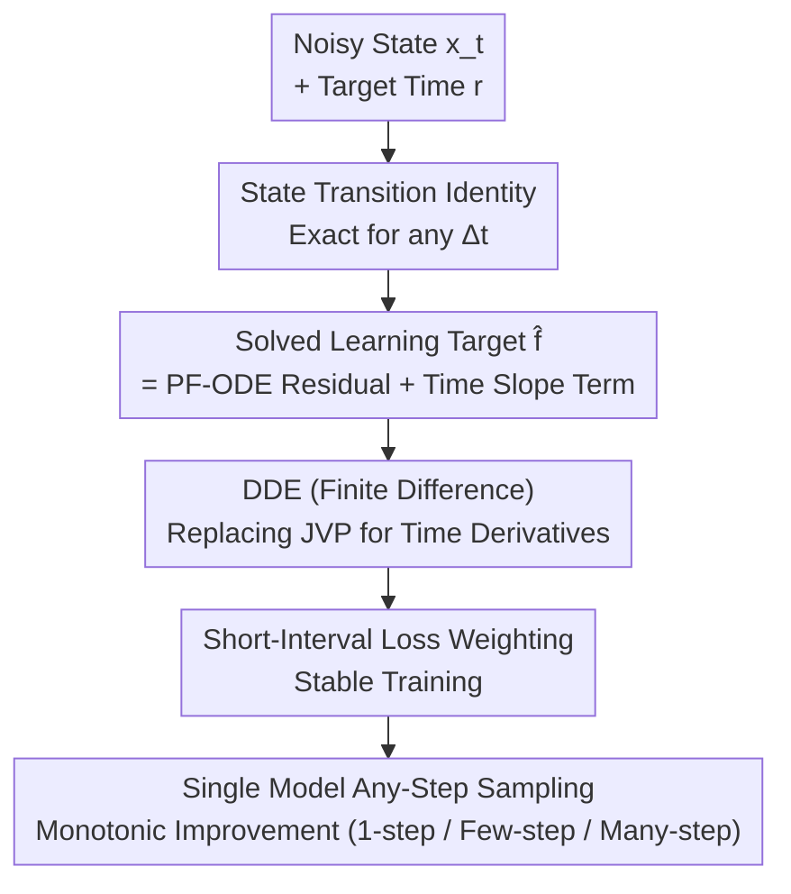

# Transition Models: Rethinking the Generative Learning Objective

**Conference**: CVPR 2026  
**Paper**: [CVF Open Access](https://openaccess.thecvf.com/content/CVPR2026/html/Wang_Transition_Models_Rethinking_the_Generative_Learning_Objective_CVPR_2026_paper.html)  
**Code**: https://github.com/WZDTHU/TiM  
**Area**: Diffusion Models / Image Generation  
**Keywords**: State Transition, Any-step Sampling, PF-ODE, Consistency Models, Generative Objective

## TL;DR
TiM generalizes the "infinitesimal step" PF-ODE supervision of diffusion models into a **state transition identity that holds exactly for any time interval $\Delta t$**. This allows an 865M small model to both perform 1-step generation and improve monotonically with increased sampling steps, outperforming SD3.5 (8B) and FLUX.1 (12B) despite its significantly smaller parameter count on GenEval.

## Background & Motivation

**Background**: Current visual generation is dominated by two paradigms. One is Diffusion/Flow models, which perform step-by-step denoising via numerical integration of PF-ODE (Probability Flow Ordinary Differential Equation), offering extremely high quality but requiring dozens or hundreds of Function Evaluations (NFE), making them slow and expensive. The other is few-step generators—Consistency Models (CM), Shortcut, MeanFlow, and various distillation methods—which directly learn a "large-step" endpoint mapping, enabling generation in just a few steps.

**Limitations of Prior Work**: Few-step methods suffer from a **quality ceiling**. By averaging the velocity of the entire trajectory into a shortcut, they lose fine-grained local dynamics. Consequently, increasing sampling steps does not lead to improvement; instead, performance saturates or even degrades (the schedule is often fragile). Conversely, diffusion models suffer from exploding discretization errors as step counts decrease, leading to a sharp drop in quality in the few-step regime.

**Key Challenge**: The authors point out that the root of this trade-off **lies not in the network architecture, but in the "supervision granularity" of the learning objective**. Local supervision (PF-ODE, modeling infinitesimal dynamics) is accurate as $\Delta t \to 0$ and scales to many steps, but fails at few steps. Finite interval supervision (CM, modeling fixed interval mappings) is strong at few steps but offers no gain with more steps—unless complex multi-interval objectives are used. Each granularity has inherent flaws, forcing a choice between "high fidelity but slow" and "efficient but capped."

**Goal**: To find a unified learning objective that enables a single model to act as both a strong few-step generator and an accurate integrator that improves with more steps, encompassing 1-step, few-step, and many-step regimes in one model.

**Key Insight**: Instead of approximating a differential equation (local) or fitting a statistical mapping (endpoint), the model should directly learn the **transition between any two states $x_t \to x_r$**. When the model learns transitions for all intervals, it learns the **solution manifold** of the entire generation process itself, rather than local tangents or endpoints of specific trajectories on that manifold.

**Core Idea**: Treat the first-order state transition formula in diffusion—which only holds as $\Delta t \to 0$—as an **identity that must hold exactly for any $\Delta t$** to constrain the network, thereby deriving a new training objective: Transition Models (TiM).

## Method

### Overall Architecture
Like diffusion models, TiM takes a noisy state $x_t = \alpha_t x + \sigma_t \varepsilon$ as input, but the network also receives a target time $r$: $f_\theta(x_t, t, r)$. Its task is to transition $x_t$ to any earlier state $x_r$ ($r < t$) in a single step. The pipeline begins with the first-order state transition formula, elevating it from an "approximation" to an "exact identity for any interval." By taking the derivative with respect to $t$, a **product-derivative invariant** (State Transition Identity) is obtained. The learning target $\hat f$ is then solved from this identity. To enable large-scale training, the expensive and FSDP-incompatible JVP is replaced by Differential Derivation Equation (DDE) finite differences for calculating time derivatives, complemented by a short-interval-biased loss weighting to stabilize training. During sampling, TiM can jump from noise to data in one step ($r=0$) or refine $[T, 0]$ over multiple segments, consistently improving with more steps.

### Key Designs

**1. State Transition Identity: Elevating "Approximation" to an "Exact Constraint for Any Interval"**

Diffusion models use a first-order state transition approximation: predicted $\hat x, \hat\varepsilon$ can push the current state to any earlier state $x_r = A_{t,r}x_t + B_{t,r}f_\theta(x_t, t, r)$, where $A_{t,r} = \frac{\alpha_r\hat\sigma_t-\sigma_r\hat\alpha_t}{\hat\sigma_t\alpha_t-\hat\alpha_t\sigma_t}$ and $B_{t,r} = \frac{\sigma_r\alpha_t-\alpha_r\sigma_t}{\hat\sigma_t\alpha_t-\hat\alpha_t\sigma_t}$. Diffusion models only satisfy this in the limit $\Delta t \to 0$, leading to failure for large steps. TiM's key step is **requiring this to hold for any $\Delta t$**: since $x_r$ should be the same regardless of the starting $t$ for a given $r$, the derivative of $x_r$ with respect to $t$ must be 0. Differentiating both sides with respect to $t$ yields:

$$\frac{d\big(B_{t,r}\cdot(\hat\alpha_t x+\hat\sigma_t\varepsilon-f_{\theta,t,r})\big)}{dt}=0.$$

Defining the instantaneous residual $h(t) = \hat\alpha_t x + \hat\sigma_t \varepsilon - f_{\theta,t,r}$, we get the State Transition Identity: $\frac{d}{dt}(B_{t,r}h(t)) = 0$. This imposes a triple constraint: **Trajectory Consistency** (the weighted residual $B_{t,r}h(t)$ is constant for $t > r$, implying direct mapping $t \to r$ equals the composition of intermediate steps $(t \to s) \circ (s \to r)$, which is what CM lacks and makes TiM robust to sampling schedules); **Boundary Degradation** (as $r \to t$, $B_{t,r} \to 0$, and the identity naturally reverts to standard PF-ODE supervision, ensuring full compatibility with diffusion); and the next design's time slope matching.

**2. Time Slope Matching: Constraining both Value and Rate of Change**

Expanding the identity via the product rule: $(\frac{d}{dt}B_{t,r})h(t) + B_{t,r}(\frac{d}{dt}h(t)) = 0$. Standard diffusion training only forces the **value** of the residual toward zero ($h(t) \to 0$), whereas TiM's objective adds the **time slope** $\frac{d}{dt}h(t)$ of the residual, minimizing their joint term. This higher-order supervision forces the model to learn a smoother solution manifold, maintaining trajectory coherence during large-step sampling and stability during fine-step refinement. Solving for the actual network target $\hat f$ yields:

$$\hat f=\hat\alpha_t x+\hat\sigma_t\varepsilon+\frac{B_{t,r}}{\,dB_{t,r}/dt\,}\Big(\tfrac{d\hat\alpha_t}{dt}x+\tfrac{d\hat\sigma_t}{dt}\varepsilon-\tfrac{df_{\theta^-,t,r}}{dt}\Big),$$

where $\theta^-$ denotes network parameters with stopped gradients. This target is naturally Transport-Agnostic—given any set of continuously differentiable coefficients $(\alpha_t, \sigma_t, \hat\alpha_t, \hat\sigma_t)$ (OT-FM, TrigFlow, EDM, VP/VE-SDE), the same identity holds, decoupling transition learning from specific transports.

**3. DDE (Differential Derivation Equation): Efficient Time Derivatives for Large-Scale Training**

The target $\hat f$ contains a bottleneck: the network's time derivative $\frac{df_{\theta^-,t,r}}{dt}$. While MeanFlow/sCM use Jacobian-Vector Products (JVP), JVP is both slow and **dependent on backward-mode autodiff, making it inherently incompatible with FlashAttention and FSDP**, which are essential for billion-parameter pre-training. TiM adopts DDE, a forward-only finite difference approximation:

$$\frac{df_{\theta^-,t,r}}{dt} \approx \frac{f_{\theta^-}(x_{t+\epsilon}, t+\epsilon, r) - f_{\theta^-}(x_{t-\epsilon}, t-\epsilon, r)}{2\epsilon}.$$

DDE only requires forward passes, making it ~2x faster than JVP (with better FID: 24.14 vs. 48.29 at NFE=1) and natively compatible with FSDP. This was the engineering key for TiM to become the first model of its kind to undergo billion-parameter pre-training from scratch. To suppress gradient variance at large intervals ($\Delta t \to t$), TiM uses a short-interval-biased weighting $w(t,r) = (\sigma_{\text{data}} + \tan(t) - \tan(r))^{-1/2}$, stretching the time axis in tangent space. The final objective is $\mathbb{E}_{x,\varepsilon,t,r}\big[w(t,r) \cdot d(f_\theta(x_t,t,r) - \hat f)\big]$.

### Loss & Training
The final objective is the equation above. The network regresses to dynamic target $\hat f$ with $w(t,r)$ weighting. $(t,r)$ are sampled randomly to cover arbitrary intervals. DDE calculates time derivatives (Algorithm 1 in the paper). ImageNet-256 uses SD-VAE, and text-to-image uses DC-AE latent space with 33M public images. The 865M model was trained on 16 A100s for ~30 days in BF16.

## Key Experimental Results

### Main Results
With only 865M parameters, TiM matches or outperforms industrial models ten times its size across any number of steps on GenEval and DPGBench.

| Model | Params | NFE | GenEval↑ | DPGBench↑ |
|------|------|-----|----------|-----------|
| SD3.5-Large | 8B | 128 | 0.69 | 83.99 |
| FLUX.1-Dev | 12B | 128 | 0.65 | 83.57 |
| FLUX.1-Schnell (Distilled) | 12B | 8 | 0.67 | 84.94 |
| SANA-Sprint (Distilled) | 1.6B | 8 | 0.72 | 81.55 |
| **TiM (Ours)** | 865M | 1 | 0.67 | 74.93 |
| **TiM (Ours)** | 865M | 8 | 0.76 | 81.30 |
| **TiM (Ours)** | 865M | 128 | **0.83** | 81.62 |

At 1-step, TiM already matches FLUX.1-Schnell's 8-step performance. At 128-step, its score of 0.83 exceeds SD3.5-Large (8B). On MJHQ30K, TiM at 8-NFE achieves an FID of 5.28, superior to FLUX.1-Schnell (7.94) and SD3.5-Large (14.68).

### Monotonicity (Key Highlight)
Tested whether quality improves monotonically with NFE—a property few-step models lack.

| Model | NFE=1 | NFE=8 | NFE=32 | NFE=128 |
|------|-------|-------|--------|---------|
| SD3.5-Turbo (Distilled) | 0.50 | 0.66 | 0.70 | 0.70 (Saturated) |
| FLUX.1-Schnell (Distilled) | 0.68 | 0.67 | 0.63 | 0.58 (Degraded) |
| SD3.5-Large (Diffusion) | 0.00 | 0.50 | 0.69 | 0.70 |
| FLUX.1-Dev (Diffusion) | 0.00 | 0.40 | 0.64 | 0.65 |
| **TiM (Ours)** | **0.67** | **0.76** | **0.80** | **0.83** |

While FLUX.1-Schnell drops from 0.68 to 0.58 (worse with more steps), TiM climbs monotonically with a much higher starting point, successfully combining few-step performance with many-step refinement.

### Ablation Study
Derivative calculation comparison (TiM-B/4, A100-40G, BF16, batch 256):

| Config | FID (NFE=1) | FID (NFE=8) | Latency (ms) | Memory (GiB) | FSDP Support |
|------|-----------|-----------|---------|-----------|-----------|
| JVP | 48.29 | 213.14 | 49.75 | 18.11 | No |
| **DDE** | **24.14** | **110.08** | **49.91** | **17.99** | **Yes** |

### Key Findings
- **Trajectory consistency from the identity is the source of monotonicity**: By enforcing "Direct Jump = Composed Intermediate Steps," extra steps stay on the same trajectory rather than drifting, avoiding saturation or degradation.
- **DDE is a scaling necessity, not just a minor optimization**: JVP leads to a poor FID of 213 at NFE=8 and cannot use FSDP/FlashAttention. Forward finite differences are ~2x faster, halve FID, and enable billion-parameter pre-training from scratch.
- **High-resolution generalization**: Using a native-resolution strategy, TiM at 8-NFE yields a GenEval score of 0.39 at 4096×4096, whereas FLUX.1-Schnell collapses at resolutions above 2048.

## Highlights & Insights
- Identifying "supervision granularity" as the true root cause of the few-step vs. many-step trade-off (rather than architecture) is a profound insight. Generalizing to an identity for any $\Delta t$ incorporates both local PF-ODE (as $r\to t$) and finite-interval consistency ($r=0$) as special cases of one constraint.
- The product-derivative invariant $\frac{d}{dt}(B_{t,r}h(t))=0$ is elegant: upgrading "residual to zero" to "weighted residual as constant" naturally introduces high-order time slope terms, which is cleaner than multi-interval consistency objectives.
- The DDE engineering insight is transferable: any method requiring network derivatives w.r.t. time/conditions but bottlenecked by JVP (like MeanFlow/sCM) can adopt symmetric finite differences at the cost of a small $\epsilon$ discretization error.

## Limitations & Future Work
- DDE is a finite difference approximation; precision depends on step size $\epsilon$. There is insufficient discussion on the sensitivity or adaptive strategies for $\epsilon$.
- The weighting function $w(t,r)$ involves $\tan$, which may pose numerical risks as $t$ approaches interval boundaries. This weighting is empirical, and theoretical optimality is not proven.
- Primarily validated on images (T2I + class-guided). While the identity is transport-agnostic, its effectiveness on more complex dynamics like video or 3D remains to be tested.
- On DPGBench, TiM (81.6) did not outperform FLUX.1-Schnell (84.9); absolute few-step quality in certain metrics still lags behind, especially for fine-grained attributes/counting in 1-step mode.

## Related Work & Insights
- **vs. Consistency Models / MeanFlow / Shortcut**: These learn fixed endpoint mappings or average velocities, losing local dynamics and causing multi-step saturation. TiM learns exact transitions for any interval with inherent consistency, allowing monotonic refinement and training from scratch.
- **vs. Distilled Generators (SD-Turbo, DMD, LCM, PCM)**: These depend on teacher models and expensive pipelines, often stagnating with more steps. TiM is the first to support any-step, monotonic improvement from scratch without a teacher.
- **vs. Standard Diffusion (DDPM/EDM/Flow Matching)**: Diffusion is a special case of TiM as $r \to t$. TiM generalizes infinitesimal supervision to finite intervals, fixing the collapse in the few-step regime.

## Rating
- Novelty: ⭐⭐⭐⭐⭐ Elegant unification of local and endpoint supervision via a transition identity for arbitrary intervals.
- Experimental Thoroughness: ⭐⭐⭐⭐ Coverage of multiple benchmarks, monotonicity, DDE ablation, and 4K resolution; internal ablation on $\epsilon$ is slightly lacking.
- Writing Quality: ⭐⭐⭐⭐⭐ Very logical flow from problem diagnosis to mathematical derivation to engineering implementation.
- Value: ⭐⭐⭐⭐⭐ An 865M model outperforming 8B/12B models with monotonic refinement; DDE enables large-scale training for this class of models.

<!-- RELATED:START -->

## Related Papers

- [\[CVPR 2026\] OntoAug: Rethinking Generative Data Augmentation via Ontology Guidance](ontoaug_rethinking_generative_data_augmentation_via_ontology_guidance.md)
- [\[CVPR 2026\] LoFA: Learning to Predict Personalized Prior for Fast Adaptation of Visual Generative Models](lofa_learning_to_predict_personalized_prior_for_fast_adaptation_of_visual_genera.md)
- [\[ICLR 2026\] Pareto-Conditioned Diffusion Models for Offline Multi-Objective Optimization](../../ICLR2026/image_generation/pareto-conditioned_diffusion_models_for_offline_multi-objective_optimization.md)
- [\[CVPR 2026\] PhyCo: Learning Controllable Physical Priors for Generative Motion](phyco_learning_controllable_physical_priors_for_generative_motion.md)
- [\[CVPR 2026\] CTCal: Rethinking Text-to-Image Diffusion Models via Cross-Timestep Self-Calibration](ctcal_rethinking_text-to-image_diffusion_models_via_cross-timestep_self-calibrat.md)

<!-- RELATED:END -->
