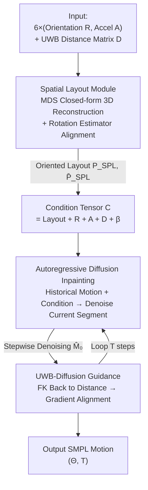

# Ultra Diffusion Poser: Diffusion-Based Human Motion Tracking From Sparse Inertial Sensors and Ranging-Based Between-Sensor Distances

**Conference**: CVPR 2026  
**arXiv**: [2606.02153](https://arxiv.org/abs/2606.02153)  
**Code**: https://github.com/eth-siplab/UltraDiffusionPoser (Available)  
**Area**: Human Pose Estimation / Wearable MoCap / Diffusion Models  
**Keywords**: Sparse Inertial MoCap, UWB Ranging, Diffusion Models, Multidimensional Scaling, Classifier Guidance

## TL;DR
This work upgrades UWB ranging between 6 IMUs from "extra features" to "geometric constraints." It first uses Multidimensional Scaling (MDS) to reconstruct 3D sensor layouts from pairwise distances as diffusion conditions, then employs forward kinematics during denoising sampling to align predicted poses with sensor distances via guidance, reducing joint position error in sparse inertial pose estimation by up to 22%.

## Background & Motivation

**Background**: Wearable IMU-based human motion capture is a lightweight alternative to camera solutions, but reaching the accuracy of commercial systems like Xsens/Noitom usually requires 17–19 sensors. Recent research focuses on "sparse inertial" configurations (DIP, TIP, PIP, PNP, etc.) using only 6 IMUs. To counter inherent IMU drift, recent works (UIP, UMotion, GIP) introduce Ultra-Wideband (UWB) ranging to provide **drift-free** pairwise distances between sensors as additional constraints.

**Limitations of Prior Work**: IMUs only provide acceleration and angular velocity; integration inevitably leads to drift, and there are no absolute observations between frames or body segments, making drift correction extremely difficult. While UWB helps, **existing IMU+UWB methods only treat pairwise distances as auxiliary input scalar features fed into the network**. They neither exploit the full 3D sensor spatial layout reconstructible from these distances nor enforce the output poses to satisfy these distances during inference—leading to poses that violate physical measurements (e.g., predicted wrist distance of 70 cm while UWB measures 90 cm).

**Key Challenge**: UWB distances are inherently **rigid geometric constraints** on sensor positions. However, when treated as soft features, models lose the informative prior of "distance → 3D layout" and allow predictions to violate constraints during sampling. Hard-coding these constraints into frame-wise pose optimization often introduces infeasible joint angles, jitter, and unnatural poses.

**Goal**: (1) Explicitly convert pairwise distances into 3D sensor layouts as conditions; (2) Softly pull poses toward satisfying UWB distances during diffusion sampling while maintaining smooth, natural motion.

**Key Insight**: The authors observe that since UWB provides a pairwise distance matrix, classic Multidimensional Scaling (MDS) can reconstruct a set of 3D points (the sensor layout) from distances in a closed-form solution. This is a much more informative condition than raw distance scalars. Furthermore, diffusion models are naturally suited for "under-constrained pose completion," and their classifier guidance mechanism can inject the external goal of "satisfying distances" during sampling.

**Core Idea**: Use MDS to analytically reconstruct UWB distances into 3D sensor layouts as diffusion conditions (Spatial Layout Module), then use in-loop forward kinematics to guide pose alignment with measured distances during the denoising process (UWB-Diffusion Guidance).

## Method

### Overall Architecture
UDP (Ultra Diffusion Poser) is a **fully learnable autoregressive diffusion-inpainting model**. The input is a sequence of length $N$: global orientations $\mathbf{R}_t\in\mathbb{R}^{k\times3\times3}$ for 6 sensors per frame, global accelerations $\mathbf{A}_t\in\mathbb{R}^{k\times3}$, and a pairwise UWB distance matrix $\mathbf{D}_t\in\mathbb{R}^{k\times k}$ ($k=6$). The output is SMPL human motion $(\Theta,\mathbf{T})$—local rotations for 24 joints and global translation.

The pipeline consists of three stages: ① The **Spatial Layout Module (SPL)** reconstructs a set of orientation-less 3D points from the distance matrix via MDS per frame, then uses an end-to-end trained Rotation Estimator to orient them and retain mirrored versions, obtaining oriented 3D sensor layouts $(P_{SPL},\bar P_{SPL})$. ② This layout, along with IMU data, UWB, and body shape $\beta$, forms the condition tensor $\bm{\mathcal{C}}$, fed into the **Autoregressive Diffusion Inpainting Model**. This model uses "previously predicted motion + current conditions" to denoise the current motion segment, ensuring long-sequence smoothness. ③ In each step of the denoising sampling, **UWB-Diffusion Guidance** maps the predicted pose back to sensor distances via Forward Kinematics (FK), compares them with measured UWB distances, and uses the gradient to push the mean toward "satisfying distances."

### Key Designs

**1. Spatial Layout Module: Upgrading UWB Ranging from Scalar Features to 3D Geometric Priors**

To address the weakness of treating distances as auxiliary scalars, SPL reconstructs the pairwise distance matrix $\mathbf{D}_t$ into 3D sensor coordinates. Using classical Metric MDS, the goal is to find 3D points $x_i$ such that their pairwise distances approximate the measured $d_{ij}$, minimizing $\sum_{i<j}(\lvert x_i-x_j\rvert^2 - d_{ij})^2$. This has a **closed-form solution** in Euclidean space: obtain the Gram matrix $\mathbf{B}=-\tfrac12\mathbf{H}\mathbf{D}^{(2)}\mathbf{H}$ (where $\mathbf{H}=\mathbf{I}-\tfrac1k\mathbf{1}\mathbf{1}^\top$ and $\mathbf{D}^{(2)}$ is the squared distance matrix), then perform SVD on $\mathbf{B}$ and take the top three eigenvectors/eigenvalues to get $\mathbf{X}_{\text{MDS}}=\mathbf{U}_3\mathbf{\Sigma}_3^{1/2}$.

However, MDS solutions are invariant to **translation, rotation, and reflection**, causing temporal discontinuity. SPL normalizes each frame's layout into a standard frame: pelvis at the origin, root-head aligned with the y-axis (standing upright), and left wrist in the positive XY plane (forward-facing). It eliminates frame-wise reflection via thresholding rules (flipping if $\lVert X_{t-1}-X_t\rVert_2^2 > c$) to ensure consistency. Since the entire sequence could still be mirrored, the authors retain both layout $X$ and its mirror $\bar X$. A final **Rotation Estimator (3-layer LSTM)**, trained end-to-end with the diffusion model, takes $(X,\bar X,\mathbf{R},\mathbf{A},\mathbf{D})$ to predict rotation $R_{MDS}$ and point-wise residuals $P_{res}$, aligning the layout and correcting MDS bias: $P_{SPL}=R_{MDS}X+P_{res}$, $\bar P_{SPL}=R_{MDS}\bar X+P_{res}$. This oriented layout describes the spatial positions of the head, pelvis, wrists, and knees, providing far more information than raw distance scalars.

**2. Autoregressive Diffusion Inpainting Model: Ensuring Temporal Smoothness**

To treat motion as a generation problem while maintaining long-sequence continuity, the authors adopt DDPM-style diffusion inpainting. Motion is represented as $\mathcal{M}\in\mathbb{R}^{N\times147}=[\Theta^{6D},\mathbf{T}]$ (joint rotations in 6D + translation). Each segment is normalized to a standard frame with the root starting at $(0,\text{root height},0)$ to mitigate representation drift. The denoiser $D_\theta$ predicts clean motion $\hat{\mathcal{M}}_0=D_\theta(\mathcal{M}_t,\mathcal{M}_{hist},\bm{\mathcal{C}},t)$ at each step, where $\mathcal{M}_{hist}$ is the previous $N_H$ frames of predicted motion. Conditions $\bm{\mathcal{C}}\in\mathbb{R}^{N\times154}=[P_{SPL},\bar P_{SPL},\mathbf{R},\mathbf{A},\mathbf{D},\beta]$. Specifically, noisy motion, history, and conditions are projected into a shared embedding space; conditions are added to the noisy motion and concatenated with the history, marked by a learnable history token $h_e$. The diffusion step $t$ is encoded via MLP and prepended, forming a sequence $S$ of length $1+N_H+N$ for LSTM denoising. Inference rolls autoregressively with Gaussian smoothing ($\sigma=2$). Unlike DiffusionPoser, UDP **does not require slow FK losses during training**; it learns effectively from the conditions and auxiliary losses alone.

**3. UWB-Diffusion Guidance: Pose Alignment via FK in the Sampling Loop**

Even with strong 3D layout conditions, denoising results may still violate pairwise distances $\mathbf{D}$. Post-hoc frame-wise optimization often causes unnatural poses. The authors borrow from **classifier guidance**: in standard sampling, $\mathcal{M}_{t-1}$ is sampled from a Gaussian with mean $\mu_t$. By shifting the mean along the gradient of a function $\epsilon$ that encourages desired properties, sampling is guided toward preferred predictions. Here, $\epsilon$ is the UWB consistency loss. After predicting $\hat{\mathcal{M}}_0$ at each step, **in-loop Forward Kinematics** calculates sensor positions from SMPL poses to get predicted distances $\hat d_{ij}$:

$$\epsilon_{uwb}=\sum_{i<j}\lVert \hat d_{ij}(\hat{\mathcal{M}}_0)-d_{ij}\rVert^2$$

The mean is updated as $\tilde\mu_t=\mu_t(\mathcal{M}_t,\hat{\mathcal{M}}_0)-\lambda\,\Sigma_t\,\nabla\epsilon_{uwb}$, where $\lambda$ is the guidance scale. Since UWB provides inter-body constraints independent of global position, the gradient for root translation is zeroed. Integrating FK into the sampling loop (rather than post-optimization) allows corrections to occur flexibly during denoising, maintaining smoothness without the jitter typical of frame-wise post-optimization.

### Loss & Training
The primary loss is the standard diffusion loss $\mathcal{L}_{\text{simple}}=\mathbb{E}_{q(x_t|x_0)}[\lVert x_0-D_\theta(x_t,t,\bm{\mathcal{C}})\rVert_2^2]$. Auxiliary losses include: translation loss $\mathcal{L}_{tran}=\lVert \mathbf{T}^{pred}-\mathbf{T}^{gt}\rVert_2$, SMPL joint angle loss $\mathcal{L}_{smpl}=\lvert\Theta_{6d}^{pred}-\Theta_{6d}^{gt}\rvert$, and a velocity loss $\mathcal{L}_{vel}=(\lVert\mathbf{T}_n^{pred}-\mathbf{T}_{n-1}^{pred}\rVert_2-\lVert\mathbf{T}_n^{gt}-\mathbf{T}_{n-1}^{gt}\rVert_2)^2$ to encourage active translation. The Rotation Estimator is trained end-to-end with the diffusion model using the AMASS dataset protocol.

## Key Experimental Results

Metrics: **SIP** (Global angle error for shoulders/hips, °), **GAE** (Average global angle error for all joints, °), **JPE** (Root-aligned joint position error, cm), **Jitter** (Mean magnitude of jerk for global joint positions, m/s³).

### Main Results

DIP-IMU Test Set (GT Jitter = 1.830):

| Model | UWB | SIP(°)↓ | GAE(°)↓ | JPE(cm)↓ | Jitter |
|------|-----|---------|---------|----------|--------|
| TIP | ✗ | 17.07 | 10.51 | 5.82 | 0.882 |
| PIP | ✗ | 15.02 | 8.78 | 5.12 | 0.240 |
| PNP | ✗ | 13.71 | 8.75 | 4.98 | 0.260 |
| GlobalPose | ✗ | 13.55 | 8.47 | 4.65 | 0.260 |
| DynaIP | ✗ | 14.41 | **7.12** | 5.03 | - |
| UMotion | ✓ | 15.05 | 10.41 | 4.38 | 0.216 |
| UIP | ✓ | 13.20 | 8.23 | 5.05 | 0.240 |
| **UDP (Ours)** | ✓ | **10.39** | 8.19 | **3.42** | **0.125** |

Cross-dataset Comparison (SIP / JPE in °/cm):

| Dataset | Metric | Prev. SOTA (IMU+UWB) | UDP | Note |
|--------|------|------|------|------|
| DanceDB | JPE | 5.19 (UMotion) | **4.67** | SIP 11.79 also lowest |
| TotalCapture | JPE | 4.83 (UMotion) | **3.76** | SIP 8.95 lowest |
| GIP-DB (Zero-shot) | JPE | 9.45 (GIP) | **8.86** | Modern low-noise UWB |
| GIP-DB (Finetuned) | JPE | 8.70 (GIP) | **6.68** | Significant lead |
| UIP-DB (Zero-shot) | JPE | 10.65 (UIP) | 11.72 | Only case not leading (UWB noise > 17cm) |
| UIP-DB (Finetuned) | JPE | 10.65 (UIP) | **9.04** | Surpasses after finetuning |

Key Findings: UDP achieves the lowest JPE in almost all settings, with up to 22% improvement over the previous best and 35% over IMU-only methods. It produces smooth motion with the lowest jitter without requiring physical optimizers like PIP/PNP. Its only weakness is zero-shot performance on the noisy UIP-DB (17.5 cm UWB error), where UDP's deep dependence on UWB makes it more sensitive.

### Ablation Study (TotalCapture)

| Configuration | SIP(°)↓ | GAE(°)↓ | JPE(cm)↓ | Note |
|------|---------|---------|----------|------|
| w/o SPL & UWB Guidance | 10.22 | 10.79 | 4.39 | JPE +17% without both modules |
| w/o SPL | 9.58 | 10.45 | 4.03 | SIP +7% |
| w/o UWB Guidance | 9.46 | 10.46 | 4.05 | JPE +7% |
| w/o RotEstimator | 9.11 | 10.45 | 3.92 | Replaced with raw MDS layout |
| **UDP (Full)** | **8.95** | **10.19** | **3.76** | — |

## Highlights & Insights
- **Reinterpreting "Measurement Noise" as "Geometric Constraint"**: Instead of feeding UWB distances as features, this work uses MDS to reconstruct the 3D layout—extracting more informative conditions from the same input via a closed-form geometric approach.
- **"Soft Physical Constraints" via Diffusion Guidance**: Integrating FK into the sampling loop and using distance consistency gradients allows for flexible correction without jitter or infeasible joint angles typical of post-optimization. This "in-loop FK guidance" is potentially transferable to any constrained motion generation task (e.g., hand-object interaction).
- **Engineering MDS Ambiguity**: The use of a normalized frame, reflection thresholding, and learnable rotation estimation elegantly resolves the rotation/reflection invariance of MDS, allowing classical geometry to reside within an end-to-end deep pipeline.

## Limitations & Future Work
- **Sensitivity to High UWB Noise**: Because distance is deeply coupled into the architecture, it is sensitive to large UWB errors (>17 cm). Future work could incorporate measurement uncertainty into the layout module or guidance loss.
- **Lack of Hard Physical Constraints**: While smooth, UDP does not explicitly model physics (e.g., foot sliding, ground penetration). Physical optimizers still hold the advantage for scene-consistent multi-frame dynamics.
- **Fixed Sensor Configuration**: Like previous works, it is currently locked to a specific 6-IMU layout. Generalizing to arbitrary sensor counts would be more practical.

## Related Work & Insights
- **vs UIP**: UIP introduced IMU+UWB fusion but treated distances as auxiliary features and did not enforce them during inference. UDP leads significantly in low-noise scenarios; UIP is more robust in zero-shot high-noise cases due to its "softer" feature treatment.
- **vs UMotion**: UMotion uses Kalman filtering for UWB noise, requiring manual parameter tuning and failing to estimate global translation. UDP is fully learnable and generates global translation with lower jitter.
- **vs DiffusionPoser**: UDP moves FK from the training loss to the sampling guidance, enabling faster training and more significant performance gains.

## Rating
- Novelty: ⭐⭐⭐⭐⭐ Upgrading UWB ranging to geometric constraints through MDS reconstruction and in-loop guidance is a clear and effective paradigm shift.
- Experimental Thoroughness: ⭐⭐⭐⭐⭐ Covers 5 datasets, zero-shot/finetuning, noise sensitivity, and fine-grained ablations.
- Writing Quality: ⭐⭐⭐⭐ Clear methodology, though engineering details on MDS reflection/mirroring require careful reading.
- Value: ⭐⭐⭐⭐ Significantly pushes the SOTA for sparse inertial MoCap in modern UWB settings.

<!-- RELATED:START -->

## Related Papers

- [\[CVPR 2026\] Guiding Token-Sparse Diffusion Models](guiding_token-sparse_diffusion_models.md)
- [\[CVPR 2026\] Stability-Driven Motion Generation for Object-Guided Human-Human Co-Manipulation](stability-driven_motion_generation_for_object-guided_human-human_co-manipulation.md)
- [\[CVPR 2026\] Leveraging Multispectral Sensors for Color Correction in Mobile Cameras](leveraging_multispectral_sensors_for_color_correction_in_mobile_cameras.md)
- [\[ICCV 2025\] Less is More: Improving Motion Diffusion Models with Sparse Keyframes](../../ICCV2025/image_generation/less_is_more_improving_motion_diffusion_models_with_sparse_keyframes.md)
- [\[CVPR 2026\] StreamAvatar: Streaming Diffusion Models for Real-Time Interactive Human Avatars](streamavatar_streaming_diffusion_models_for_real-time_interactive_human_avatars.md)

<!-- RELATED:END -->
