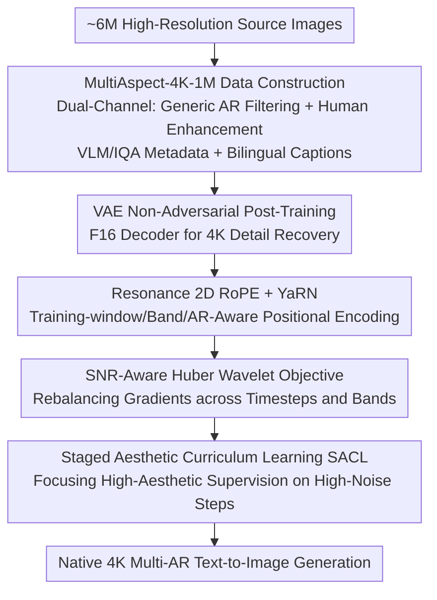

# UltraFlux: Data-Model Co-Design for High-quality Native 4K Text-to-Image Generation across Diverse Aspect Ratios

**Conference**: CVPR 2026  
**Paper**: [CVF Open Access](https://openaccess.thecvf.com/content/CVPR2026/html/Ye_UltraFlux_Data-Model_Co-Design_for_High-quality_Native_4K_Text-to-Image_Generation_across_CVPR_2026_paper.html)  
**Code**: Project Page https://w2genai-lab.github.io/UltraFlux/ (committed to open-sourcing data/weights/training & inference code)  
**Area**: Image Generation / Diffusion Models  
**Keywords**: Native 4K Generation, Multi-Aspect Ratio, Diffusion Transformer, 2D RoPE Extrapolation, Data-Model Co-Design

## TL;DR
UltraFlux approaches native 4K scaling of the Flux DiT from a "data-model co-design" perspective. It first constructs a million-scale dataset with diverse aspect ratios (ARs) containing VLM/IQA metadata (MultiAspect-4K-1M). On the model side, it simultaneously refines the positional encoding (Resonance 2D RoPE + YaRN), the VAE (non-adversarial post-training), the training objective (SNR-Aware Huber Wavelet Loss), and the training schedule (Staged Aesthetic Curriculum Learning). This allows UltraFlux to consistently outperform open-source 4K baselines on benchmarks like Aesthetic-Eval@4096, and approach or partially exceed the closed-source Seedream 4.0 when paired with an LLM prompt refiner.

## Background & Motivation

**Background**: Diffusion Transformers (DiTs, such as Flux, PixArt-Σ, Sana) can produce high-quality text-to-image generation around 1K resolution, driven by efficient backbones, token compression, and carefully tuned training pipelines.

**Limitations of Prior Work**: Directly scaling these systems to native 4096×4096 while supporting diverse aspect ratios (ARs) is not as simple as merely enlarging the resolution. The authors empirically observe three **coupled** failures: (i) position representation and AR extrapolation—the 2D rotary positional encoding calibrated on a single training window exhibits phase shift and aliasing when resolution/AR changes significantly, manifesting as ghosting, shifting, and banding; (ii) high-frequency fidelity under VAE compression—higher downsampling factors improve throughput but easily wash out fine structures that dominate 4K visual perception; (iii) 4K perceptual optimization—gradients are severely imbalanced across different timesteps and frequency bands, and standard training objectives mismatch the statistical properties of the 4K latent space.

**Key Challenge**: These three factors are not orthogonal, isolated engineering choices, but **jointly** determine whether the model can maintain stability and detail under native 4K and multi-AR conditions. The choices of positional scheme, VAE compression ratio, and training objective constrain each other—altering any single component in isolation "leaves substantial quality on the table." Furthermore, data is a bottleneck: public 4K datasets are typically limited to $10^4$–$10^5$ images, heavily biased towards near-square ARs and landscapes, filtered via early CLIP aesthetic predictors, and lack the structured metadata required for modern 4K training.

**Goal**: Build a unified framework that simultaneously provides four components: (i) a large-scale, multi-AR, content-diverse, VLM-curated 4K corpus with rich metadata; (ii) an efficient, non-adversarial VAE post-training scheme to improve 4K reconstruction; (iii) an SNR-aware wavelet objective matching 4K statistical properties paired with staged aesthetic curricula; (iv) a training-window-aware, band-aware, and AR-aware positional encoding.

**Key Insight**: Since the failures are coupled, rather than addressing them in isolation, one should treat the data and model sides as a **co-design space** to optimize jointly. Additionally, it is crucial to deliberately distinguish between "native 4K training" and "low-resolution generation + post-upscaling" regimes—the latter confounds high-frequency fidelity with positional extrapolation, whereas the former forces the backbone to directly learn long-range dependencies and spatial alignment across different ARs.

**Core Idea**: In one sentence—**keep the Flux architecture unchanged, and upgrade it to a native 4K multi-AR generator by relying on "the right dataset + four lightweight but targeted modifications aimed at 4K bottlenecks."**

## Method

### Overall Architecture
The main pipeline of UltraFlux is "data-model co-design": On the left, a dual-channel pipeline filters approximately 6M high-resolution images to construct **MultiAspect-4K-1M**—a corpus of 1 million native/near-4K images with balanced AR distributions, bilingual captions, and VLM/IQA metadata. On the right, **without redesigning the DiT architecture**, the core Flux Transformer is retained, and targeted operations are performed on the three bottlenecks hindering 4K performance (VAE, position representation, and training objectives/strategies). Specifically, on the model side, four components are chained together: an F16 VAE is post-trained to recover fine details (while maintaining high compression efficiency), Resonance 2D RoPE + YaRN is introduced to stabilize attention under different resolutions/ARs, and finally, an SNR-Aware Huber Wavelet Loss along with Staged Aesthetic Curriculum Learning (SACL) is applied to focus learning on high-frequency structures and high-aesthetic samples. These lightweight modifications collectively transform Flux into a high-fidelity, practical, and efficient 4K generator.

### Key Designs

**1. MultiAspect-4K-1M: Filling the Gap of "Multi-AR, High-Quality, Human-Present" 4K Corpora via a Dual-Channel Pipeline + VLM Metadata**

To address the three major gaps of public 4K data (small scale, squared-AR bias, landscape-dominated content, and reliance on simple CLIP aesthetic scores), the authors construct a dual-channel pipeline. First, images undergo an NSFW safety filter, followed by resolution filtering—requiring a total pixel count of at least $3840\times2160$ **without any resizing**, preserving the native AR. This naturally retains a wide spectrum of ARs (1:1, 16:9, 3:2, 4:3, 9:16, etc.) to facilitate transparent auditing. Next, "quality" and "aesthetics" are decoupled: quality is assessed using the LLM-based scorer Q-Align, while aesthetics are evaluated via ArtiMuse, an MLLM evaluator that provides numerical scores alongside expert-like explanations. Simultaneously, two interpretable classical signals—flatness and Shannon entropy—act as guardrails to filter out low-texture/oversmoothed images that VLMs might overlook, thereby preserving high frequencies. The second channel specifically reinforces human-centric content: human-related queries retrieve candidates, which then pass through the same Q-Align/ArtiMuse filters and are enhanced via Shannon entropy to filter out low-texture portraits. Crucially, a promptable open-vocabulary detector, YOLOE, is employed to require "structured evidence of human presence," achieving better recall and precision than fixed-category detectors. Passing subsets are tagged with a "character" label and merged into the main pool. Finally, Gemini-2.5-Flash generates detailed English captions, which are translated into Chinese using Hunyuan-MT-7B to obtain bilingual captions. The resulting 1 million images each contain resolution/AR, Q-Align, ArtiMuse, flatness/entropy, bilingual captions, and character labels. These fields serve as both analysis labels and stratified sampling keys, directly supporting "data slicing based on training regimes" (e.g., extracting high-detail or high-aesthetic subsets). Scale-wise, this corpus expands the dataset from 12k (Aesthetic-4K) to 1.007 million images, average caption length rises from 31 tokens to 125.1 tokens, and it uniquely provides bilingual captions.

**2. Resonance 2D RoPE + YaRN: Elevating Rotary Position Embeddings to be Training-Window, Band, and AR-Aware to Eliminate Ghosting and Banding in Multi-AR 4K Extrapolation**

Official Flux allocates rotary frequency spectrums along the height and width axes independently, where the frequency is only scaled by a global NTK factor. This is neither adaptive to the inference size $H\times W$ nor handled at the band level; phase grows purely linearly with position, leading to instability under native 2K/4K multi-AR. Inspired by Resonance RoPE in LLMs, the authors re-interpret the 2D rotary spectrum over a **finite training window**. Let the training window length along a certain axis be $L_a$ (in patches), and the frequency of the $k$-th component be $\omega^{(a)}_k$. Its number of completed cycles within the window is defined as $r^{(a)}_k = L_a \omega^{(a)}_k / (2\pi)$, which is then **rounded to the nearest non-zero integer**: $\hat r^{(a)}_k = \max(1, \lfloor r^{(a)}_k + \tfrac12\rfloor)$. The frequency is replaced with the integer-cycle projection: $\hat\omega^{(a)}_k = 2\pi \hat r^{(a)}_k / L_a$. Consequently, each rotary band becomes a "standing wave" completing an integer number of cycles over $[0, L_a]$, achieving phase matching at $p_a=0$ and $p_a=L_a$. In contrast, many bands in the original Flux spectrum complete fractional cycles within the training window, accumulating half-period phase errors when scaling resolution or shifting ARs, which manifests as spatial drift and fine banding. On top of this, YaRN is applied to make the extrapolation **band-aware**: given an inference length $L'_a$ and an extrapolation scale $s_a = L'_a/L_a \ge 1$, a linear ramp $\gamma(r;\alpha,\beta)$ interpolates each band between the "position-interpolation scaling" and "no scaling" regimes:

$$\omega^{(a)}_{k,\text{yarn}} = \big(1 - \gamma(\hat r^{(a)}_k;\alpha,\beta)\big)\frac{\hat\omega^{(a)}_k}{s_a} + \gamma(\hat r^{(a)}_k;\alpha,\beta)\,\hat\omega^{(a)}_k.$$

Specifically, frequencies are first mapped to the resonance modes of the finite window, and then the axial cycle count $\hat r^{(a)}_k$ determines how much each band scales under the given extrapolation factor. Compared to Flux's "fixed spectrum + single global NTK," this approach makes the positional encoding training-window-aware, band-aware, and AR-aware, stabilizing 2K/4K multi-AR inference with virtually zero extra overhead.

**3. SNR-Aware Huber Wavelet Loss: Stabilizing Wavelet-Space Learning with SNR-Adaptive Robust Loss to Mitigate Frequency Imbalance, Timestep Imbalance, and Cross-Scale Energy Coupling**

Even with wavelet objectives (e.g., Diffusion-4K), standard L2 training based on the VAE latent space under native 4K suffers from three coupled ailments: (i) frequency imbalance—wavelet coefficients of natural images are heavy-tailed, and large high-frequency residuals (textures, edges, micro-geometry) are aggressively penalized by quadratic loss, leading to oversmoothed details; (ii) timestep imbalance—gradients concentrate at extremely low or high noise levels, making intermediate timesteps inefficiently utilized; (iii) cross-scale energy coupling—low-frequency bands dominate the latent space norm, leaving high-frequency errors (which dictate 4K visual perception) with disproportionately small gradients. The authors design an objective that simultaneously satisfies four properties: robust and smooth (Pseudo-Huber penalty, acting like L2 near zero and L1 in the tails), SNR-aware (adaptive threshold $c(t)$ is small at high noise and increases when signals dominate), frequency-aware (residual measured in orthonormal wavelet space to decouple high and low-frequency bands), and time-rebalanced (Min-SNR weighting to emphasize intermediate SNR timesteps). For flow matching (FM) linear interpolation $z_t = (1-t)z + t\varepsilon$, the model predicts the velocity field $v_\theta$, yielding the data prediction $\hat z_\theta = z_t - t\,v_\theta$. The linear path factor and Min-SNR are combined into a single weight $\omega(t) = \frac{t}{1-t}\min\{\mathrm{SNR}(t),\gamma\}^\beta$ (where $\mathrm{SNR}(t)=(1-t)^2/t^2$). A 1-level orthonormal DWT $W(\cdot)$ computes residuals in the wavelet space $R_\theta = W(\hat z_\theta) - W(z)$. The threshold schedule varies with SNR: $c(t) = c_{\min} + (c_{\max}-c_{\min})(\min\{\mathrm{SNR}(t),\gamma\}/\gamma)^\alpha$, resulting in the final objective:

$$L(\theta) = \mathbb{E}_{z,\varepsilon,t}\big[\omega(t)\,\ell_{\text{Huber}}(R_\theta; c(t))\big].$$

This serves as a plug-and-play replacement for the standard flow matching loss—reverting to the original FM objective as $c(t)\to\infty$ and $\beta=0$.

**4. Staged Aesthetic Curriculum Learning (SACL): Injecting "High-Aesthetic Supervision" Precisely into High-Noise Steps Where the Model Relies Most heavily on Priors**

Different timesteps in diffusion correspond to different tasks—high-noise steps shape global structure, while low-noise steps refine local details. In contrast, existing aesthetic post-training typically distributes high-aesthetic priors **uniformly** across all timesteps, whereas timestep curriculum learning often only tunes sampling under a fixed data distribution. SACL decouples and pairs the noise axis and data axis into two simple stages: Stage 1 fine-tunes on the entire MultiAspect-4K-1M dataset using standard timestep sampling covering the whole diffusion interval, equipping the backbone with a broad 4K prior across diverse ARs, contents, and noise levels. Stage 2 **restricts training to the high-noise band** (timesteps above a certain threshold, where the model relies most on generative priors) **and limits the dataset to images in the top 5% of ArtiMuse aesthetic scores**. This concentrates the remaining computation on the "most underdetermined and difficult" phase of the sampling process, sculpting it with ultra-high aesthetic supervision. The intuition is that Stage 1 learns the general 4K prior, while Stage 2 steers the global generative prior toward high-aesthetic modes in the most uncertain regions, achieving significant gains in 4K aesthetics and alignment at a moderate training cost.

### Loss & Training
The core training objective is the SNR-Aware Huber Wavelet Loss $L(\theta)$ described above. The VAE post-training phase retains three losses (wavelet, perceptual, and L2) while **removing the adversarial discriminator** (as the GAN loss saturates quickly, introduces instability, and offers little benefit to perceptual quality). A high-detail subset filtered by flatness is utilized—requiring only ~4k update steps on several hundred thousand fine-detail images to obtain most of the reconstruction gains, thereby avoiding days of GAN training and tens of millions of samples. Overall training proceeds in two stages via SACL, and the ablation evaluates SNR-HW under a unified fine-tuning schedule of "500K data & 10K steps".

## Key Experimental Results

### Main Results
On the Aesthetic-Eval@4096 benchmark at 4096×4096 resolution, UltraFlux is compared against ScaleCrafter, FouriScale (training-free high-resolution scaling), Sana (native 4K foundation model), and Diffusion-4K (Flux-based native 4K training). UltraFlux achieves the best or tied-best performance in FID, HPSv3, ArtiMuse, and MUSIQ.

| Method | FID ↓ | HPSv3 ↑ | PickScore ↑ | ArtiMuse ↑ | CLIP ↑ | Q-Align ↑ | MUSIQ ↑ |
|------|-------|---------|-------------|------------|--------|-----------|---------|
| ScaleCrafter | 164.02 | 6.83 | 21.68 | 67.88 | 33.36 | 4.30 | 38.21 |
| FouriScale | 164.71 | 11.19 | 21.86 | 65.87 | 33.11 | 4.50 | 38.96 |
| Sana | 144.17 | 10.83 | **23.18** | 63.72 | **35.49** | **4.89** | 45.08 |
| Diffusion-4K | 152.43 | 8.92 | 21.88 | 63.76 | 33.00 | 4.69 | 27.51 |
| **UltraFlux** | **143.11** | **11.47** | 22.69 | **68.36** | 34.62 | 4.85 | **46.13** |

On non-square ARs (compared with Sana, where 2:1=4096×2048 and 1:2=2048×4096), UltraFlux dominates almost across the board:

| Setting | FID ↓ | HPSv3 ↑ | ArtiMuse ↑ | Q-Align ↑ |
|------|-------|---------|------------|-----------|
| Sana (2:1) | 150.35 | 9.01 | 63.61 | 4.80 |
| UltraFlux (2:1) | **147.53** | **9.91** | **64.81** | **4.86** |
| Sana (1:2) | 149.41 | 11.40 | **66.95** | 4.85 |
| UltraFlux (1:2) | **143.71** | **12.51** | 66.41 | **4.89** |

Under more extreme wide aspect ratios (16:9=5120×2880, 2.39:1=5952×2496), UltraFlux significantly outperforms Sana on FID, HPSv3, and ArtiMuse (e.g., 16:9 ArtiMuse 67.22 vs 63.02, FID 142.43 vs 153.31). In Gemini-2.5-Flash preference evaluation, UltraFlux is preferred by 70–82% on visual appeal and 60–89% on prompt alignment.

Compared to the closed-source Seedream 4.0 (both equipped with LLM prompt refiners, and UltraFlux uses GPT-4O as the front end, at 4096×4096):

| Method | FID ↓ | HPSv3 ↑ | PickScore ↑ | ArtiMuse ↑ | CLIP ↑ | Q-Align ↑ | MUSIQ ↑ |
|------|-------|---------|-------------|------------|--------|-----------|---------|
| Seedream 4.0 | **132.87** | 11.98 | **23.52** | **69.83** | **35.26** | 4.71 | 30.21 |
| UltraFlux w. Refiner | 147.06 | **12.03** | 23.25 | 68.75 | 34.50 | **4.93** | **45.93** |

UltraFlux achieves a slightly higher HPSv3 than Seedream (12.03 vs 11.98), and significantly outperforms it on Q-Align and MUSIQ (which better reflect semantic alignment and perceptual quality). This demonstrates that an open-source model trained on only 1 million images can closely match or even partially exceed a leading closed-source 4K generator when paired with a prompt refiner.

### Ablation Study
Starting from the baseline of Flux + post-trained F16 VAE, components are added sequentially (evaluated under a unified 500K data & 10K steps schedule):

| Configuration | FID ↓ | HPSv3 ↑ | ArtiMuse ↑ | Description |
|------|-------|---------|------------|------|
| Flux + F16 VAE (base) | 151.40 | 9.22 | 66.39 | Baseline |
| + SNR-HW | 148.81 | 9.70 | 67.23 | Replacing with SNR-Aware Wavelet Objective |
| + SNR-HW + SACL | 147.32 | 10.30 | 67.31 | Adding Staged Aesthetic Curriculum Learning |
| + SNR-HW + SACL + Resonance 2D RoPE w. YaRN | **146.93** | **10.91** | **68.13** | Complete UltraFlux |

### Key Findings
- The three model-side components provide **complementary** contributions rather than redundant scaling: as each component is added, FID monotonically decreases, while HPSv3 and ArtiMuse monotonically increase, indicating that the training objective, curriculum, and positional encoding address different bottlenecks.
- Replacing the standard latent-space regression loss with SNR-HW immediately yields consistent gains across all metrics, validating that "SNR-aware wavelet supervision" balances high-frequency details and stable optimization better than pure L2.
- SACL primarily drives human preference and aesthetic scores (HPSv3 9.70 $\to$ 10.30), demonstrating that enhanced text-to-image alignment is particularly beneficial for native 4K.
- The engineering insights from VAE post-training are highly practical: removing the GAN term and filtering a high-detail subset using flatness yields most of the reconstruction gains within ~4k steps on several hundred thousand images, bypassing days of GAN training.

## Highlights & Insights
- **Sober diagnosis of "coupled failures $\to$ co-design"**: The authors clearly identify that positional encoding, VAE compression, and training objectives are coupled at 4K, meaning addressing any single component in isolation wastes quality potential. Unifying these separate 4K techniques into a single cohesive recipe is the most valuable perspective of this paper.
- **Porting length-extrapolation techniques (Resonance RoPE / YaRN) from LLMs to 2D image grids**: Interpreting and eliminating ghosting/banding in multi-AR extrapolation via "integer-cycle rounding $\to$ standing wave $\to$ band-aware scaling" is a trick that can be directly applied to other high-resolution DiTs.
- **Dataset metadata as the "co-design interface"**: Tagging every image with Q-Align, ArtiMuse, flatness, entropy, AR, and bilingual captions makes "slicing data by regime" (high detail, high aesthetics, specific AR) a controllable operation rather than an ad-hoc trial—a key factor for the successful execution of data-model co-design.
- **SACL coupling the "noise axis × data axis"**: Feeding the top 5% of aesthetic images exclusively at high-noise steps, rather than distributing the aesthetic prior uniformly across all timesteps, is an elegant strategy that can be generalized to any diffusion post-training where different timesteps handle distinct tasks.

## Limitations & Future Work
- The comparison with closed-source Seedream 4.0 relies on their respective prompt refiners (UltraFlux uses GPT-4O). Several metrics, such as FID, PickScore, and CLIP, still lag behind, with "competitive performance" primarily reflected in HPSv3, Q-Align, and MUSIQ; conclusions might fluctuate under different configurations or evaluation protocols. ⚠️ Refer to the original paper for definitive results.
- Evaluations rely heavily on VLMs/LMMs as judges (ArtiMuse, Q-Align, Gemini preference). Such metrics may inherently favor specific styles, and their alignment with real human preferences warrants cautious interpretation.
- The method assumes a "fixed Flux architecture + targeted modifications" premise, and the gains of the four modules are verified on this specific Flux F16 VAE backbone; generalizability to other DiT backbones has not been fully explored.
- The sensitivity of multiple hyperparameters (e.g., YaRN's $\alpha, \beta$, Huber's $c_{\min}/c_{\max}/\gamma/\beta$, SACL's high-noise threshold and top 5% ratio) is not systematically analyzed in the main text, meaning reproduction might require additional tuning.

## Related Work & Insights
- **vs. Training-free high-resolution scaling (ScaleCrafter / FouriScale / HiDiffusion)**: These methods modify inference-time computations (window attention, Fourier low-pass guidance) to upscale 1K models to 4K without retraining, but they largely retain the original positional scheme, solving multi-AR extrapolation stability only halfway. UltraFlux directly performs native 4K training and modifies the positional encoding to address extrapolation fundamentally.
- **vs. Lightweight adaptation (LSRNA / Self-Cascade)**: These methods use latent-space super-resolution or self-cascading to sharpen details post-hoc on fixed backbones, reducing the cost of high-res transfer. However, as post-processing adapters, they do not resolve the fundamental trade-off between VAE compression and 4K reconstruction fidelity. UltraFlux tackles this trade-off directly via VAE post-training.
- **vs. Native 4K training (Diffusion-4K / Sana / PixArt-Σ)**: They demonstrate that carefully designed backbones make 4K training feasible, but often treat spatial robustness, VAE compression, and loss design as independent choices. UltraFlux optimizes them jointly and couples them with a larger, multi-AR, metadata-enriched corpus.
- **vs. Diffusion-4K's wavelet loss**: This work further introduces Pseudo-Huber robustness, SNR-adaptive thresholds, and Min-SNR time-rebalancing in the wavelet space, specifically addressing the issue where large, heavy-tailed high-frequency residuals are over-penalized by standard quadratic loss.

## Rating
- **Novelty**: ⭐⭐⭐⭐ While individual components are mostly adapted or combined from existing concepts (YaRN, wavelet loss, aesthetic post-training), the holistic perspective of "data-model co-design to cure coupled failures" and their systematic integration is a solid contribution.
- **Experimental Thoroughness**: ⭐⭐⭐⭐⭐ It includes diverse evaluations spanning square/multi-AR/extreme-wide resolutions, dual-line comparisons against open-source and closed-source models, step-by-step ablations, and VLM preference evaluations. The numerical data and tables are highly consistent.
- **Writing Quality**: ⭐⭐⭐⭐ Clear diagnostic process, complete formulas, and concrete motivations. A few symbols (e.g., subscripts) are slightly messy due to PDF extraction, but the logical flow is solid.
- **Value**: ⭐⭐⭐⭐⭐ With the promise of open-sourcing data, weights, and code, this work provides a valuable, end-to-end reproducible recipe and a large-scale dataset for the native 4K multi-AR text-to-image community.

<!-- RELATED:START -->

## Related Papers

- [\[CVPR 2026\] PosterReward: Unlocking Accurate Evaluation for High-Quality Graphic Design Generation](posterreward_unlocking_accurate_evaluation_for_high-quality_graphic_design_gener.md)
- [\[ICLR 2026\] Scaling Group Inference for Diverse and High-Quality Generation](../../ICLR2026/image_generation/scaling_group_inference_for_diverse_and_high-quality_generation.md)
- [\[CVPR 2026\] Frequency-Aware Flow Matching for High-Quality Image Generation](freqflow_frequency_aware_flow_matching.md)
- [\[CVPR 2026\] Mixture of Style Experts for Diverse Image Stylization](mixture_of_style_experts_for_diverse_image_stylization.md)
- [\[CVPR 2026\] Aligning Multi-Character Narrative Image Generation with Multi-Aspect Human Preferences](aligning_multi-character_narrative_image_generation_with_multi-aspect_human_pref.md)

<!-- RELATED:END -->
