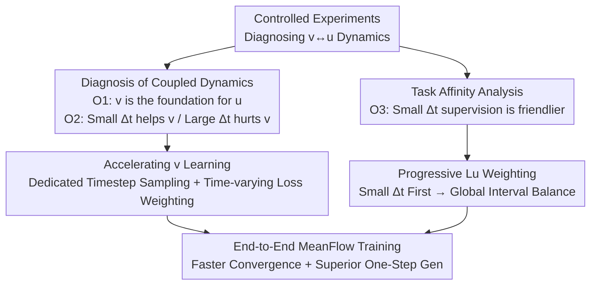

# Understanding, Accelerating, and Improving MeanFlow Training

**Conference**: CVPR 2026  
**Paper**: [CVF Open Access](https://openaccess.thecvf.com/content/CVPR2026/html/Kim_Understanding_Accelerating_and_Improving_MeanFlow_Training_CVPR_2026_paper.html)  
**Code**: https://github.com/seahl0119/ImprovedMeanFlow  
**Area**: Image Generation / Few-step Generation / Flow Matching  
**Keywords**: MeanFlow, Few-step Generation, Instantaneous Velocity, Average Velocity, Training Dynamics

## TL;DR
This paper dissects the training dynamics of MeanFlow when simultaneously learning "instantaneous velocity $v$ and average velocity $u$" through controlled experiments. It discovers that $v$ must be established first, and that $u$ supervision at small time intervals $\Delta t$ is beneficial while large intervals are detrimental. Based on this, a training scheme featuring "accelerated $v$ formation + progressive $L_u$ weighting (prioritizing small intervals and gradually transitioning to interval balance)" is designed. Using the same DiT-XL backbone, it reduces the 1-NFE FID on ImageNet $256 \times 256$ from 3.43 to 2.87 and achieves approximately 2.5× convergence acceleration.

## Background & Motivation
**Background**: Diffusion models and Flow Matching achieve state-of-the-art results in image/video/3D generation but require expensive multi-step sampling. To compress inference to one or a few steps, early methods relied on distilling few-step "student" models from multi-step "teacher" models, necessitating complex and fragile two-stage training, synthetic data, or teacher-student cascades. Consistency Models initiated the end-to-end training route for few-step generators, but a significant gap remains compared to multi-step diffusion.

**Limitations of Prior Work**: MeanFlow is a leading approach in this line—it enables a single network to learn both instantaneous velocity $v$ (velocity field at a single moment) and average velocity $u$ (integrated velocity over a time interval), coupling them via the MeanFlow identity. This allows a one-step update $z_r = z_t-(t-r)\,u_\theta(z_t,r,t)$ to replace multi-step solvers. However, MeanFlow training is expensive, and understanding of "why it works" remains shallow: how these two coupled velocity fields influence and coordinate with each other during training to achieve high-quality one-step generation has not been clearly explained.

**Key Challenge**: Standard MeanFlow uses the same fixed loss and sampling scheme from start to finish, completely ignoring the complex dependencies between $v$ and $u$. This "one-size-fits-all" objective interferes with the early formation of a reasonable $v$, and a poorly established $v$ further hinders the learning of $u$, resulting in slow training that fails to reach the potential upper bound of the model or data.

**Goal**: To clarify the training dynamics of $v \leftrightarrow u$ (Understanding) and, based on this, design a training strategy that accelerates convergence and improves one-step generation quality (Accelerating + Improving), while maintaining the simplicity of end-to-end, single-stage training.

**Key Insight**: Instead of modifying the MeanFlow objective function (a key difference from concurrent works like AlphaFlow or CMT, which soften objectives or use multiple stages), the authors use controlled experiments to measure the interaction between $v$-loss, $u$-loss, and varying time intervals $\Delta t$, translating empirical observations into a "training curriculum."

**Core Idea**: A curriculum of "building the foundation before the structure"—intensively training instantaneous velocity $v$ and applying average velocity supervision only on small $\Delta t$ in the early stages, then gradually spreading the weight to large $\Delta t$ (the part truly needed for one-step generation) as training progresses.

## Method
The method consists of two parts: an **analysis** (deriving three observations about training dynamics via controlled experiments) and **training improvements** (two plug-and-play components) based on those observations. The overall framework follows the "Analysis $\rightarrow$ Curriculum" logic chain.

### Overall Architecture
The authors first conduct controlled experiments using DiT-B/4 on ImageNet $256 \times 256$ to obtain three core observations: (O1) Instantaneous velocity $v$ must be established early as it serves as the foundation for learning average velocity $u$; if $v$ is poorly formed or contaminated, the learning of $u$ collapses. (O2) The time interval $\Delta t = t - r$ of $u$ supervision determines its impact on $v$: small $\Delta t$ helps form and refine $v$, while large $\Delta t$ damages existing $v$. (O3) Task affinity analysis indicates that using small-interval supervision as a baseline creates a friendlier initialization for the subsequent learning of large-interval $u$ required for one-step generation.

Standard MeanFlow ignores these facts, using standard $v$-loss and training $u$ across the entire $\Delta t$ range from the beginning, leading to inefficiency. This paper proposes a unified training strategy with two synergistic components: ① Rapidly forming $v$ using established diffusion/flow training acceleration techniques; ② Applying progressive weighting to $L_u$, favoring small $\Delta t$ early on and transitioning to uniform weighting across all $\Delta t$ as training progresses. Both components persist throughout training without introducing extra stages, maintaining an end-to-end approach.

### Key Designs

**1. Diagnosing $v \leftrightarrow u$ Coupled Dynamics: Proving the "Foundation" Hypothesis and Quantifying Interval Effects**

To determine the order and interaction of $v$ and $u$, two symmetrical experiments were designed. Forward: Two-stage training—pre-training with only $v$-loss, then switching to $u$-loss fine-tuning. With $u$ fine-tuning fixed at 60 epochs and $v$ pre-training varied across $\{0, 5, 10, 15, 20\}$ epochs (and varied allocation under a fixed 80-epoch budget), $u$ quality was measured by 1-NFE FID. Results showed that more $v$ pre-training led to more stable and accurate $u$ learning; even with fixed total compute, early investment in $v$ was more efficient. Reverse: Purposefully contaminating $v$ during MeanFlow training by injecting Gaussian noise into the target velocity of $v$-loss (scaled by $k \cdot \|v_t(z_t \mid \epsilon)\|$). Even minimal noise ($k=0.03$) caused severe degradation in $u$ learning. Together, these confirm the mathematical structure—$u$ is the time integral of $v$ ($u(z_t,r,t) \triangleq \frac{1}{t-r} \int_r^t v_t(z_\tau,\tau) \, d\tau$); without a stable $v$, $u$ cannot be effectively learned. This is O1.

Quantifying the role of $\Delta t$ (O2): Starting from either "40 epochs of $v$ pre-training" or "random initialization," $u$-loss fine-tuning was performed for 40 epochs, but $\Delta t$ was restricted to one of four bins: $[0.1, 0.3]$, $[0.3, 0.5]$, $[0.5, 0.7]$, or $[0.7, 0.9]$. The resulting $v$ was extracted via $v(z_t,t) = u_\theta(z_t,t,t)$ and evaluated with 32-NFE FID. Findings were symmetrical: small $\Delta t \in [0.1, 0.3]$ supervision could both construct a usable $v$ from scratch (FID comparable to 40 epochs of pure $v$ pre-training) and further refine an existing $v$. Conversely, large $\Delta t$ supervision neither built $v$ effectively nor preserved a pre-trained $v$. This establishes the first training commandment: suppress large $\Delta t$ supervision in early stages.

**2. Task Affinity Analysis (TAS) to Lock Curriculum Order**

O1 suggests building $v$ early, and O2 suggests small $\Delta t$ helps $v$. Thus, there are two paths for the early stage: pure $v$-loss or $u$-loss with small $\Delta t$. Which better prepares the model for subsequent large $\Delta t$ learning? The authors used Task Affinity Score (TAS) to judge. TAS measures how smoothly two tasks can be trained jointly with minimal conflict. TAS between $v$-loss and various $\Delta t$ bins of $u$-loss was calculated under three initializations: random; Strategy 1 (pure $v$-loss pre-training); and Strategy 2 (small $\Delta t \in [0.1, 0.3]$ $u$-loss pre-training). Both pre-training strategies yielded higher TAS than random initialization, but Strategy 2 (small $\Delta t$) showed stronger affinity for the large $\Delta t$ intervals needed for one-step generation. This is O3: rather than just learning $v$, introducing small $\Delta t$ supervision early provides a friendlier initialization for expanding $u$ to large intervals. These three observations define the curriculum: Early = Establish $v$ + Small Intervals; Late = Smooth transition to Large Intervals.

**3. Accelerating $v$ Learning: Dedicated Timestep Sampling + Time-varying Loss Weighting**

Implementing O1 requires forming $v$ quickly. The authors adapt established acceleration techniques from diffusion/flow training: dedicated timestep sampling, which replaces the base sampling of $t$ with a customized distribution $p_{\text{acc}}(t)$, and time-varying loss weighting, which applies a time-dependent weight $\alpha(t)$ to the $v$-loss term, i.e., $\alpha(t) \cdot L_v(z_t,t)$. Representative methods were chosen for each: MinSNR for loss weighting and DTD for timestep sampling—with DTD ultimately selected as the primary driver (see Key Findings for reasoning).

**4. Progressive $L_u$ Weighting: Small Interval Priority to Uniform Balance**

Implementing O2 and O3 requires the "interval distribution" of $u$ supervision to evolve. The authors apply a weight to $L_u(z_t,r,t)$:

$$\beta(\Delta t, s) = 1 - s + \lambda s\,(1-\Delta t),$$

where $s \in [0, 1]$ represents training progress (using a linear schedule $s = 1 - i/T$, where $i$ is the current iteration and $T$ is the total iterations). At the start ($s=1$), $\beta(\Delta t, 1) = \lambda(1-\Delta t)$, favoring small $\Delta t$. At convergence ($s=0$), $\beta(\Delta t, 0) = 1$, treating all intervals equally. To keep the initial expected weight constant, $\lambda = 1/\mathbb{E}_{\Delta t}[1-\Delta t]$. The scheduling speed can be controlled via $s = 1 - (i/T)^k$, where $k > 1$ is slower and $k < 1$ is faster; experiments showed linear $k=1$ is optimal. This term ensures early weights are on small intervals (consolidating $v$ and warming up for large intervals) while smoothly opening up to large intervals—the lifeblood of few-step inference.

### Loss & Training
The base objective remains the unified MeanFlow loss, split into instantaneous and average velocity terms based on whether $t=r$:

$$L_{MF} = \mathbb{E}_{x,\epsilon,t,r} \big[ L_u(z_t,r,t) \cdot \mathbb{I}(t \neq r) + L_v(z_t,t) \cdot \mathbb{I}(t = r) \big].$$

This paper's modifications are layered on top: the $v$ term is replaced with $\alpha(t) \cdot L_v(z_t,t)$ and combined with the sampling distribution $p_{\text{acc}}(t)$, while the $u$ term is multiplied by $\beta(\Delta t, s)$. Both are plug-and-play, keeping the MeanFlow objective intact and remaining compatible with MeanFlow's original stabilization tricks (adaptive loss normalization, CFG blending, etc.). Experiments follow the original MeanFlow setup, training on ImageNet $256 \times 256$ with the DiT architecture and evaluating 1-NFE / 2-NFE FID with 50K samples.

## Key Experimental Results

### Main Results
ImageNet $256 \times 256$ class-conditional generation, 1-NFE / 2-NFE FID (lower is better), 240 epochs (unless noted):

| Model / Setting | Params | 1-NFE FID | 2-NFE FID |
| :--- | :--- | :--- | :--- |
| MeanFlow-B/4 | 131M | 11.58 | 7.85 |
| + Ours w MinSNR | 131M | **9.87** | **7.08** |
| MeanFlow-L/2 | 459M | 3.84 | 3.35 |
| + Ours w DTD | 459M | **3.47** | **3.24** |
| MeanFlow-XL/2 | 676M | 3.43 | 2.93 |
| + Ours w DTD | 676M | **2.87** | **2.64** |

On DiT-XL, the 1-NFE FID was reduced from 3.43 to 2.87 (approx. 16% relative improvement), and 2-NFE from 2.93 to 2.64, significantly narrowing the gap with multi-step diffusion (e.g., SiT-XL/2 at 2.06). Regarding convergence speed, DiT-XL/2, L/2, and M/2 achieved speedups of approximately 2.5×, 2.3×, and 2.1× respectively; DiT-XL at 120 epochs matched the sample quality of vanilla MeanFlow at 240 epochs.

### Ablation Study
Component ablation (DiT-B/4, 1-NFE / 2-NFE FID):

| Configuration | 1-NFE FID | 2-NFE FID | Description |
| :--- | :--- | :--- | :--- |
| MeanFlow-B/4 (vanilla) | 11.58 | 7.85 | Baseline |
| + MinSNR | 10.57 | 7.38 | Only v-acceleration (weighting) |
| + DTD | 10.96 | 7.55 | Only v-acceleration (sampling) |
| + $L_u$ weighting | 10.98 | 7.58 | Only progressive $u$ weighting |
| + MinSNR + $L_u$ weighting | **9.87** | **7.08** | Full (Best) |
| + DTD + $L_u$ weighting | 10.20 | 7.31 | Full |

Both components individual improve upon vanilla results, but the combination achieves the best performance (9.87), confirming that they are complementary: the acceleration component builds the $v$ foundation quickly, while progressive weighting drives effective $u$ learning.

### Key Findings
- **Both components are necessary and complementary**: Only accelerating $v$ or only using progressive weighting results in minor improvements; combining them causes a quantum leap (11.58 $\rightarrow$ 9.87), validating the "v-foundation then u-interval" logic.
- **DTD (sampling) is a better primary driver than MinSNR (weighting)**: While MinSNR is stronger on the small DiT-B/4 model, its advantage diminishes on L/2 and M/2. This is because MeanFlow includes adaptive weighting via loss norm normalization, which MinSNR-style weighting can interfere with, reducing cross-scale robustness. DTD, which only modifies the sampling distribution, has better compatibility.
- **Linear scheduling is sufficient**: $k=1$ outperforms both slower ($k < 1$) and faster ($k > 1$) transitions, indicating that a smooth, uniform transition from small-to-large intervals is the "sweet spot."
- **Acceleration improves underlying $v$ quality**: Using $u_\theta(z_t,t,t)$ as the instantaneous velocity for 32/64/128-NFE multi-step generation shows this method consistently outperforms standard MeanFlow, directly verifying that the training strategy learns a higher-quality velocity field rather than just overfitting few-step metrics.
- **Robust to CFG configurations**: Stable improvements were observed across various $\omega$ and $\kappa$ settings for DiT-L/XL.

## Highlights & Insights
- **Robust "Diagnostics before Improvement" Paradigm**: The greatest value of this paper is not a new module, but the systematic dissection of the $v \leftrightarrow u$ causal relationship in the MeanFlow "black box" through clean controlled experiments, which are then almost directly translated into a training curriculum. This methodology is transferable to any coupled multi-objective generative training.
- **Modifying Curriculum, Not Objectives**: Both components are plug-and-play weighting/sampling modifications that do not touch the MeanFlow objective itself. This allows for zero-cost integration into existing implementations, contrasting with concurrent works like AlphaFlow (modified objective) or CMT (multi-stage).
- **Using $u_\theta(z_t,t,t)$ as a diagnostic probe**: Reverting the average velocity network to $r=t$ to read the instantaneous velocity is a simple yet effective tool for quantifying $v$ quality.
- **Counter-intuitive Insight on $\Delta t$**: While intuition might suggest training on all intervals is more comprehensive, experiments show that large intervals early on actively destroy the learned $v$. This self-destructive dynamic is a root cause of MeanFlow's inefficiency.

## Limitations & Future Work
- **Borrowed Acceleration Techniques**: $p_{\text{acc}}(t)$ and $\alpha(t)$ are taken directly from existing diffusion acceleration methods like MinSNR/DTD; the contribution lies in their targeted application and pairing with progressive weighting rather than the acceleration mechanism itself.
- **Small Model Observations**: Most core dynamics conclusions were derived from DiT-B/4 on ImageNet 256. Whether the "double-edged nature of $\Delta t$" and TAS ordering hold true on much larger models or more complex datasets remains to be verified.
- **Simple Scheduling Form**: The progressive weight uses a fixed linear $s = 1 - i/T$, and the preference for $\Delta t$ is modeled linearly by $1 - \Delta t$. More optimal, data-adaptive curricula (e.g., switching based on real-time $v$ quality) were not explored.
- **Task Generalizability**: The method was only validated on ImageNet class-conditional generation, leaving text-to-image, video, and 3D generation to future observation.

## Related Work & Insights
- **vs. MeanFlow [18]**: MeanFlow provides a stable end-to-end framework for learning $v$ and $u$ but ignores training dynamics. This paper retains the objective while improving the curriculum, pushing convergence and quality (3.43 $\rightarrow$ 2.87).
- **vs. AlphaFlow [79]**: AlphaFlow replaces the MeanFlow objective with a softened version; this paper improves training strategy without changing the objective, maintaining higher simplicity.
- **vs. CMT [30]**: CMT breaks learning into multiple stages; this paper adheres to end-to-end, single-stage training, using progressive weighting to smoothly transition the curriculum.
- **vs. Consistency Models [66] / Shortcut [16] / IMM [85]**: While these are explorations in end-to-end few-step generation, a gap with multi-step diffusion persists. This paper narrows the gap and demonstrates significant untapped potential in few-step generator training efficiency.

## Rating
- Novelty: ⭐⭐⭐⭐ Not a new module, but the perspective and findings from dissecting the $v \leftrightarrow u$ dynamics via controlled experiments are solid and enlightening.
- Experimental Thoroughness: ⭐⭐⭐⭐ Multi-scale (B/M/L/XL) validation plus extensive ablations on components/scheduling/CFG/multi-step support the conclusions, though primary observations rely on small models.
- Writing Quality: ⭐⭐⭐⭐⭐ The "three observations $\rightarrow$ two components" logic is clear, and the connection between analysis and method is tight.
- Value: ⭐⭐⭐⭐ A plug-and-play, zero-cost enhancement that speeds up MeanFlow by 2.5× and improves FID is highly practical for few-step generation.

<!-- RELATED:START -->

## Related Papers

- [\[ICLR 2026\] AlphaFlow: Understanding and Improving MeanFlow Models](../../ICLR2026/image_generation/alphaflow_understanding_and_improving_meanflow_models.md)
- [\[CVPR 2026\] MeanFlow Transformers with Representation Autoencoders](meanflow_transformers_with_representation_autoencoders.md)
- [\[CVPR 2026\] Temporal Equilibrium MeanFlow: Bridging the Scale Gap for One-Step Generation](temporal_equilibrium_meanflow_bridging_the_scale_gap_for_one-step_generation.md)
- [\[CVPR 2026\] D2C: Accelerating Diffusion Model Training under Minimal Budgets via Condensation](d2c_diffusion_dataset_condensation.md)
- [\[CVPR 2026\] VDE: Training-Free Accelerating Rectified Flow Model via Velocity Decomposition and Estimation](vde_training-free_accelerating_rectified_flow_model_via_velocity_decomposition_a.md)

<!-- RELATED:END -->
