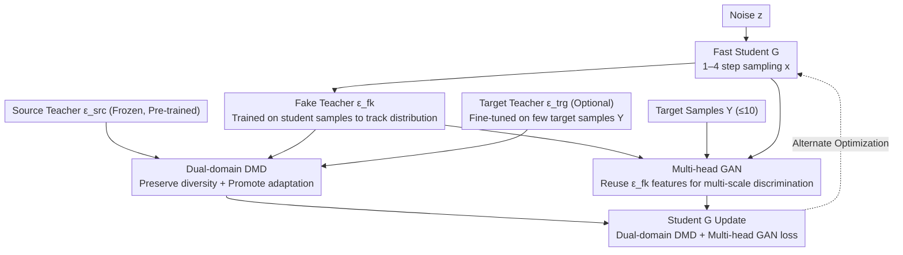

# Uni-DAD: Unified Distillation and Adaptation of Diffusion Models for Few-step Few-shot Image Generation

**Conference**: CVPR 2026  
**arXiv**: [2511.18281](https://arxiv.org/abs/2511.18281)  
**Code**: [GitHub](https://github.com/yaramohamadi/uni-DAD)  
**Area**: Image Generation  
**Keywords**: Diffusion Model Distillation, Few-shot Image Generation, Domain Adaptation, GAN, Distribution Matching Distillation  

## TL;DR

Uni-DAD is proposed as the first method to unify diffusion model distillation and adaptation into a single-stage pipeline. By employing a dual-domain DMD loss and a multi-head GAN loss, it achieves high-quality and diverse generation in few-shot domains with only 1–4 sampling steps.

## Background & Motivation

Diffusion Models (DMs) excel in image generation but face two major bottlenecks: (1) sampling requires hundreds to thousands of iterations, leading to slow inference; (2) the slow sampling issue persists even after adapting pre-trained models to new domains (e.g., few-shot scenarios).
Existing solutions typically follow two-stage pipelines:

- **Distill-then-Adapt**: First distill the teacher into a few-step student, then fine-tune it to the target domain. This is computationally friendly, but the student's adaptation capacity tends to saturate, leading to over-smoothed outputs.
- **Adapt-then-Distill**: First fine-tune the teacher to the target domain, then distill. While quality is higher, the student is bound by the performance of the adapted teacher, and it is prone to overfitting in few-shot scenarios.

Both schemes are non-end-to-end and risk losing source domain diversity during training. The authors argue that **distillation and adaptation do not need to be separated** and can be completed simultaneously in a single stage.

## Method

### Overall Architecture

Uni-DAD merges the distillation and domain adaptation of diffusion models into a single-stage process. It compresses a frozen source domain teacher $\epsilon^{\text{src}}$ (pre-trained on large-scale source data, $T \sim 1000$ steps) directly into a fast student generator $G$ ($1 \leq \text{NFE} \leq 4$), while simultaneously adapting it to a target distribution $p^{\text{trg}}(y)$ represented by a few samples $Y$ ($|Y| \leq 10$). Three sets of models are optimized alternately: the student $G$ is updated using dual-domain DMD and multi-head GAN generator losses; the fake teacher $\epsilon^{\text{fk}}$ and multi-head discriminator $D$ track the student distribution and distinguish real target samples from student generations; and an optional target teacher $\epsilon^{\text{trg}}$ is fine-tuned on target samples to provide target domain score guidance.

### Key Designs

**1. Dual-domain Distribution Matching Distillation (Dual-domain DMD): Preserving Diversity and Promoting Adaptation**

Common two-stage schemes often lose source domain diversity, resulting in over-smoothed outputs. DMD minimizes the KL divergence between the student distribution $p^{\text{fk}}$ and the teacher distribution $p^{\text{src}}$, with gradients approximated via noise estimation:

$$\nabla_{\theta} \mathcal{L}_{\text{DMD}^{\text{src}}} \approx \mathbb{E}_{t,z}\left[\omega_t \left(\epsilon^{\text{fk}}(x_t) - \epsilon^{\text{src}}(x_t)\right) \frac{dG_\theta}{d\theta}\right]$$

where $x = G(z),\; z \sim \mathcal{N}(0,I)$, $t \sim \mathcal{U}\{0.02T, 0.98T\}$, $\epsilon^{\text{fk}}$ is the fake teacher tracking the student's output, and $\epsilon^{\text{src}}$ is the frozen source teacher. Uni-DAD extends this to a dual-domain approach, aligning the student to both source and target domains simultaneously:

$$\nabla_{\theta} \mathcal{L}_{\text{DMD}}^{\text{trg}+\text{src}} = (1-a)\nabla_{\theta}\mathcal{L}_{\text{DMD}^{\text{src}}} + a\nabla_{\theta}\mathcal{L}_{\text{DMD}^{\text{trg}}}$$

The weighting factor $a \in [0,1]$ controls the influence: the source term preserves diversity (pose, background, expression), while the target term guides structural adaptation. Small $a$ is used when target structures are close to the source (e.g., $a=0.25$ for Babies), while large $a$ is used for significant structural differences (e.g., $a=0.75$ for MetFaces). Weight normalization is handled by:

$$\omega_t = \frac{\sigma_t \cdot H \cdot S}{\|\epsilon - \epsilon^{\text{fk}}(x_t)\|_1}$$

where $H$ is the number of channels and $S$ is the number of spatial locations, ensuring balanced contributions across time steps.

**2. Fake Teacher and Target Teacher: Tracking Student vs. Monitoring Target**

Dual-domain DMD requires two reference frames. The fake teacher $\epsilon^{\text{fk}}$ is initialized with $\epsilon^{\text{src}}$ weights and continuously trained on student samples to track the evolving student distribution:

$$\mathcal{L}_{\text{fk}}(\phi) = \mathbb{E}_{t,z}\left[\|\epsilon^{\text{fk}}_\phi(x_t) - \epsilon\|_2^2\right]$$

During training, gradients are not backpropagated through $G$; $x$ is treated as fixed. The target teacher $\epsilon^{\text{trg}}$ (optional) is initialized from $\epsilon^{\text{src}}$ and fine-tuned on target samples $Y$:

$$\mathcal{L}_{\text{trg}}(\eta) = \mathbb{E}_{t,\epsilon,y}\left[\|\epsilon^{\text{trg}}_\eta(y_t) - \epsilon\|_2^2\right]$$

This teacher compensates for structural information in the target domain when it differs significantly from the source.

**3. Multi-head GAN Loss: Feature Reuse for Few-shot Overfitting Resistance**

Score distillation alone may lack visual fidelity for target domain $Y$, and $|Y| \leq 10$ easily leads to overfitting and mode collapse. The multi-head GAN reuses the encoder and intermediate blocks of the fake teacher $\epsilon^{\text{fk}}$ as feature extractors. A linear classification head is attached after each block $b \in \mathcal{B}$ for multi-scale discrimination:

$$D^b(\cdot) = \sigma\left(h^b(f^b(\cdot))\right)$$

$$\mathcal{L}_{\text{GAN}}^G(\theta) = -\mathbb{E}_{t,z}\sum_{b \in \mathcal{B}} \log\left(D^b_\theta(x_t)\right)$$

$$\mathcal{L}_{\text{GAN}}^D(\psi,\phi) = -\mathbb{E}_{t,y}\sum_{b \in \mathcal{B}} \log\left(D^b(y_t)\right) - \mathbb{E}_{t,z}\sum_{b \in \mathcal{B}} \log\left(1 - D^b(x_t)\right)$$

Multi-scale comparison is more stable than a single-head approach in few-shot scenarios, effectively mitigating overfitting without introducing additional feature extraction networks.

### Loss & Training

The total student loss is a weighted sum of the dual-domain DMD and multi-head GAN generator terms:

$$\mathcal{L}_G(\theta) = \mathcal{L}_{\text{DMD}}^{\text{trg}+\text{src}}(\theta) + \lambda_{\text{GAN}}^G \mathcal{L}_{\text{GAN}}^G(\theta)$$

The fake teacher and discriminator side is optimized via:

$$\mathcal{L}_{\text{fk}+D}(\phi,\psi) = \mathcal{L}_{\text{fk}}(\phi) + \lambda_{\text{GAN}}^D \mathcal{L}_{\text{GAN}}^D(\psi,\phi)$$

In each iteration, $\epsilon^{\text{fk}} + D$ is updated 5–10 times, while $G$ and $\epsilon^{\text{trg}}$ are updated once to ensure the fake teacher keeps pace with the student's changing output distribution. Hyperparameters: $\lambda_{\text{GAN}}^G = 0.01$, $\lambda_{\text{GAN}}^D = 0.03$, learning rate $2 \times 10^{-6}$, batch size 1, and bf16 mixed precision.

## Main Results

### Main Results: Few-shot Image Generation (FSIG)

The source model is a guided-DDPM pre-trained on FFHQ (70K diverse faces), adapted to 10-shot target domains at 256×256 resolution.

| Method | NFE↓ | Single-stage | Babies FID↓ | Sunglasses FID↓ | MetFaces FID↓ | Cats FID↓ | Babies LPIPS↑ | Sunglasses LPIPS↑ |
|------|------|--------|-------------|-----------------|---------------|-----------|---------------|-------------------|
| DDPM-PA | 1000 | ✓ | 48.92 | 34.75 | — | — | 0.59 | 0.60 |
| CRDI | 25 | ✓ | 48.52 | 24.62 | 121.36 | 220.95 | 0.52 | 0.50 |
| FT | 25 | ✓ | 57.06 | 37.86 | 72.99 | 61.62 | 0.32 | 0.48 |
| DMD2-FT | 3 | ✗ | 140.27 | 77.49 | 129.26 | 89.32 | 0.08 | 0.20 |
| FT-DMD2 | 3 | ✗ | 57.11 | 41.85 | 63.25 | 51.85 | 0.42 | 0.42 |
| **Uni-DAD (no $\epsilon^{\text{trg}}$)** | **3** | **✓** | **47.38** | **22.57** | 72.18 | 199.91 | 0.45 | 0.51 |
| **Uni-DAD** | **3** | **✓** | **45.09** | **24.45** | **58.13** | **55.32** | 0.46 | 0.54 |

### Main Results: Subject-driven Personalization (SDP)

The source model is SDv1.5, evaluated on the DreamBooth benchmark (30 subjects, 25 prompts) at 512×512 resolution.

| Method | NFE↓ | DINO↑ | CLIP-I↑ | CLIP-T↑ | Intra-LPIPS↑ | Inter-LPIPS↑ |
|------|------|-------|---------|---------|-------------|-------------|
| FT (DreamBooth) | 2×50 | 0.58 | 0.77 | 0.32 | 0.67 | 0.73 |
| Turbo-PSO (SDXL) | 4 | 0.50 | 0.70 | 0.30 | 0.42 | 0.60 |
| DMD2-FT | 1 | 0.20 | 0.61 | 0.26 | 0.58 | 0.70 |
| FT-DMD2 | 1 | 0.57 | 0.75 | 0.25 | 0.22 | 0.25 |
| **Uni-DAD** | **1** | **0.47** | **0.73** | **0.29** | **0.51** | **0.59** |

### Ablation Study

**Ablation of NFE and target set size (FID↓, Babies / MetFaces):**

| Method | NFE | 1-shot B | 1-shot M | 5-shot B | 5-shot M | 10-shot B | 10-shot M |
|------|-----|----------|----------|----------|----------|-----------|-----------|
| CRDI | 25 | 105.51 | 145.10 | 51.71 | 126.34 | 48.52 | 121.36 |
| Uni-DAD | 4 | 72.38 | 95.44 | 45.86 | 81.85 | 41.39 | 59.49 |
| Uni-DAD | 3 | 90.33 | 90.29 | 52.73 | 83.69 | 45.09 | 58.13 |
| Uni-DAD | 1 | 109.55 | 132.79 | 93.52 | 103.84 | 98.52 | 89.03 |

**Component Ablation (FID↓):**

| Combination | DMD$^{\text{src}}$ | DMD$^{\text{trg}}$ | GAN$^{\text{Mh}}$ | Babies | MetFaces |
|------|----|----|----|----|-----|
| GAN-only | — | — | ✓ | 56.90 | 80.14 |
| DMD-only (src) | ✓ | — | — | 110.39 | 68.05 |
| DMD$^{\text{src}}$ + GAN$^{\text{Mh}}$ | ✓ | — | ✓ | 47.38 | 64.13 |
| All Components | ✓ | ✓ | ✓ | **45.09** | **58.13** |

### Key Findings

1. **Single-stage superiority**: Uni-DAD outperforms non-distilled methods requiring 25–1000 steps with only 3 steps, while maintaining comparable diversity (Intra-LPIPS).
2. **Failure of DMD2-FT**: Fine-tuning after distillation negates distillation gains, causing FID to spike and LPIPS to drop, resulting in over-smoothed outputs.
3. **Multi-head GAN is crucial**: Multi-head discrimination is more stable than single-head in few-shot settings, significantly lowering FID (e.g., Babies: 56.90 vs 130.34).
4. **Role of Target Teacher**: For distributions similar to the source (Babies), the target teacher is not required; for distant domains (MetFaces), it significantly improves FID (72.18→58.13).
5. **100× Inference Acceleration**: In SDP scenarios, NFE is reduced from 100 to 1 while maintaining comparable quality.
6. **Lower Training Cost**: Single-stage requires 2.2–2.8 GPU·h compared to 3.0 GPU·h for two-stage; inferring 5K images takes 4.2 minutes vs 35–63 minutes.

## Highlights & Insights

- **First single-stage distillation + adaptation framework**: Simplifies the process and avoids complexity and information loss inherent in two-stage pipelines.
- **Effective dual-domain DMD design**: Preserves source diversity while promoting target adaptation, with flexibility provided by the factor $a$.
- **Feature reuse for multi-head GAN**: Leverages existing encoder features to suppress few-shot overfitting without extra networks.
- **Checkpoint agnostic**: Can be initialized with pre-distilled students or pre-adapted teachers, offering high flexibility.
- **Validated across benchmarks and backbones**: Effectiveness demonstrated on both guided-DDPM (FSIG) and SDv1.5 (SDP).

## Limitations & Future Work

- Hyperparameter sensitivity and overfitting risks associated with GAN training in few-shot settings persist.
- The weighting factor $a$ requires manual setting based on domain distance, lacking an adaptive scheduling mechanism.
- Training costs remain higher than pure adaptation methods, though lower than two-stage pipelines.
- Verified only on 256×256 and 512×512 resolutions; not yet extended to larger backbones like SDXL or DiT.
- Does not cover other modalities like video or audio.

## Rating

| Dimension | Score |
|------|------|
| Novelty | ⭐⭐⭐⭐ |
| Technical Depth | ⭐⭐⭐⭐ |
| Experimental Thoroughness | ⭐⭐⭐⭐⭐ |
| Writing Quality | ⭐⭐⭐⭐ |
| Value | ⭐⭐⭐⭐ |
| Overall | ⭐⭐⭐⭐ |

<!-- RELATED:START -->

## Related Papers

- [\[CVPR 2026\] BiFM: Bidirectional Flow Matching for Few-Step Image Editing and Generation](bifm_bidirectional_flow_matching_for_few-step_image_editing_and_generation.md)
- [\[CVPR 2026\] FlowSteer: Guiding Few-Step Image Synthesis with Authentic Trajectories](flowsteer_guiding_few-step_image_synthesis_with_authentic_trajectories.md)
- [\[CVPR 2026\] Few-Step Diffusion Sampling Through Instance-Aware Discretizations](few-step_diffusion_sampling_through_instance-aware_discretizations.md)
- [\[CVPR 2026\] DUO-VSR: Dual-Stream Distillation for One-Step Video Super-Resolution](duo-vsr_dual-stream_distillation_for_one-step_video_super-resolution.md)
- [\[CVPR 2026\] Beyond Patches: Global-aware Autoregressive Model for Multimodal Few-Shot Font Generation](beyond_patches_global-aware_autoregressive_model_for_multimodal_few-shot_font_ge.md)

<!-- RELATED:END -->
