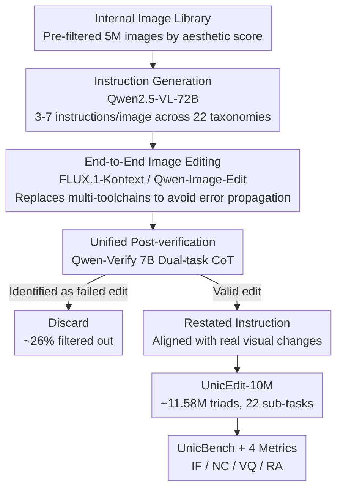

# UnicEdit-10M: A Dataset and Benchmark Breaking the Scale-Quality Barrier via Unified Verification for Reasoning-Enriched Edits

**Conference**: CVPR 2026  
**Paper**: [CVF Open Access](https://openaccess.thecvf.com/content/CVPR2026/html/Ye_UnicEdit-10M_A_Dataset_and_Benchmark_Breaking_the_Scale-Quality_Barrier_via_CVPR_2026_paper.html)  
**Code**: Yes (Project Page / GitHub provided in the paper, please refer to the original paper for specific addresses ⚠️)  
**Area**: Image Generation / Instruction-based Image Editing / Datasets & Benchmarks  
**Keywords**: Instruction-based Image Editing, Large-scale Datasets, Post-verification, Expert Verification Model, Reasoning Editing Benchmark

## TL;DR
The authors construct UnicEdit-10M, a 10-million-scale (actually around 11.58M) instruction-based image editing dataset, using a lightweight pipeline of "end-to-end editing + unified post-verification". They train a 7B dual-task expert model, Qwen-Verify, to perform low-cost failure filtering and instruction restatement. Accompanying this, they propose UnicBench, a benchmark covering both basic editing and complex reasoning-based editing, along with a set of fine-grained metrics, systematically diagnosing the shortcomings of mainstream editing models.

## Background & Motivation

**Background**: Instruction-based image editing has been rapidly developing thanks to diffusion models. Closed-source models (such as GPT-4o, Nano Banana, Seedream 4.0) can understand nuanced instructions and produce semantically consistent editing results, defining the performance ceiling. However, the gap between open-source and closed-source models continues to widen.

**Limitations of Prior Work**: The gap mainly stems from two missing components: the lack of large-scale, high-quality open training data, and the lack of a comprehensive benchmark capable of diagnosing the weaknesses of models across various editing behaviors. Existing open-source datasets fall into a "scale vs. quality" trade-off: manual annotations (e.g., MagicBrush) have high quality but are limited to the scale of tens of thousands; automated pipelines (e.g., SEED-Data-Edit, ImgEdit) can scale to millions or tens of millions but introduce systematic noise like instruction mismatches and editing failures.

**Key Challenge**: The authors attribute this problem to three technical root causes: (1) **Error propagation in complex toolchains**: For automated pipelines that chain multiple tools together, small early errors propagate and amplify into obvious artifacts downstream; (2) **Inadequate or too narrow post-verification**: Some methods only perform simple failure detection without correcting semantic mismatches, while others only use the GPT-4o API to rewrite instructions while ignoring image quality, both of which are highly expensive; (3) **Blind spots in evaluated complex edits**: Existing benchmarks lean heavily toward object/attribute-level modifications, lacking systematic testing for spatial reasoning and knowledge-driven editing. Furthermore, VLM-based metrics often ignore unexpected changes in non-edited regions and are overly sensitive to style variations.

**Goal**: This is decomposed into three objectives: constructing a dataset that is both large-scale and clean, while also covering complex edits; making quality control "affordable" at the 10-million scale; and establishing a benchmark that exposes weaknesses in complex reasoning and spatial capabilities.

**Key Insight**: Instead of continuing to stack toolchains and remedy errors post-hoc, it is better to directly generate images using a single end-to-end editing model (bypassing error propagation) and then utilize a **unified** post-verification phase to simultaneously achieve "failure filtering + instruction restatement", distilling this expensive process into a small expert model.

**Core Idea**: Replace "multi-toolchains + one-dimensional post-verification + heavy API calls" with "end-to-end editing + unified post-verification + 7B expert model Qwen-Verify". This keeps quality control costs down to a scalable level while maintaining high quality, and extends the evaluation to complex reasoning edits using UnicBench.

## Method

### Overall Architecture

The data pipeline of UnicEdit-10M is a three-stage workflow: **(1) Dataset preparation / instruction generation** $\rightarrow$ **(2) Image editing** $\rightarrow$ **(3) Post-verification (failure filtering + instruction restating)**. The input is a large-scale internal image library pre-filtered by aesthetic scores. In the middle, multiple instructions are automatically generated for each source image, and the end-to-end editing model synthesizes the edited images, resulting in triads of $\langle\text{original image}, \text{instruction}, \text{edited image}\rangle$. Finally, all triads undergo a unified post-verification step where the expert model determines if the edit is valid and rewrites instructions into versions precisely aligned with the actual visual modifications, yielding the final high-quality dataset. The core of quality control is distilling this post-verification step from "querying 72B LLM / GPT-4o APIs" into a 7B expert model, Qwen-Verify. Apart from the dataset, the authors present a separate benchmark, UnicBench, along with four fine-grained metrics for model diagnostics.

### Key Designs

**1. Replacing Multi-Toolchains with End-to-End Editing: Stopping Error Propagation at the Source**

Existing automated pipelines (such as UltraEdit, ImgEdit, Step1X-Edit) chain visual modules like detection, segmentation, and inpainting into a long sequence. Once an early module fails, the error amplifies along the chain into downstream artifacts. The authors' approach is: after instructions are generated, each $\langle\text{original image}, \text{instruction}\rangle$ pair is directly fed into an end-to-end editing model (using two open-source SOTAs: FLUX.1-Kontext and Qwen-Image-Edit) for single-step image generation, avoiding the invocation of intermediate tools. To adapt to different input dimensions, source images are center-cropped and resized under a quality-check condition: images requiring more than 20% of their content to be cropped are directly discarded to prevent heavy content loss. This replaces "multi-stage error accumulation" with "single-model single-step inference", concentrating failures into a single stage that can be readily captured by post-verification rather than dispersing them across the toolchain.

**2. Unified Post-Verification: CoT to Perform Failure Filtering and Instruction Restating Simultaneously**

Automated image generation inevitably introduces noise, and the authors categorize three major types of failures: **Edit Failure** (the edited image is virtually identical to the source image), **Instruction-Image Misalignment** (executed unintended edits or failed to follow instructions), and others (quality degradation, anatomical errors, etc.). Past post-verification methods were often "one-dimensional"—either only detecting failures without correcting errors, or only rewriting instructions without checking image quality. This paper merges both tasks into **a single Chain-of-Thought (CoT) driven unified pipeline**: first, fine-grained captions are generated for both the original and edited images to expose detailed differences; then, visual differences are analyzed to determine if a valid edit took place; for valid edits, the instruction is rewritten to precisely match the actual modifications; finally, a structured JSON containing an `is_changed` boolean flag and the restated instruction is outputted. This ensures that filtering and correction share the same understanding of visual differences, avoiding disconnects where "filtering claims success, but the instruction does not align."

**3. Qwen-Verify: Distilling Expensive 72B/GPT-4o Post-Verification into a 7B Dual-Task Expert**

Directly using Qwen2.5-VL-72B for post-verification is effective but computationally expensive, and restating instructions is prone to hallucination. The authors train a 7B expert model, Qwen-Verify, to simultaneously undertake both "failure detection + instruction restating" tasks, employing a two-stage training strategy to refine a standard VLM into a reliable verifier. The training data is split into three failure-mode categories: **Normal** (high-quality, instruction-aligned triads), **No Edit** (no discernible differences before and after), and **Hallucination** (correct target but incorrect description of actions/attributes). In the first stage, SFT is conducted using approximately 200k Normal and No Edit samples to equip the model with the foundational capability of "distinguishing failures / writing accurate instructions for successful samples". In the second stage, preference alignment is executed on around 20k samples across all three categories—the Hallucination set is first generated with GPT-4o and then human-audited to construct preference pairs. The key innovation is **D2PO (Differential Direct Preference Optimization)**: while traditional DPO treats visual input as a static context, D2PO conditions the policy on a dynamically computed **visual differential context**. A visual encoder $V$ is defined to extract latent representations of the images before and after editing, $c_v = V(I_o, I_e)$, which encodes the transformation from $I_o$ to $I_e$. Under the preference set $D = \{(I_o, I_e, p_w, p_l)\}$ (where $p_w$ is the preferred corrected instruction and $p_l$ is the hallucinated instruction), and assuming a latent reward $r(p, c_v)$, the Bradley-Terry model yields $P(p_w \succ p_l \mid c_v) = \sigma(r(p_w, c_v) - r(p_l, c_v))$. D2PO bypasses explicit reward modeling and reparameterizes via policy probabilities, defining the policy advantage function as:

$$A_{\pi_\theta, \pi_{ref}}(p, c_v) = \beta \log \frac{\pi_\theta(p \mid c_v)}{\pi_{ref}(p \mid c_v)}$$

where $\pi_\theta$ is the trainable policy, $\pi_{ref}$ is the frozen SFT copy, and $\beta$ controls the divergence. The optimization objective is to maximize the advantage margin:

$$L_{D2PO} = -\mathbb{E}_{(c_v, p_w, p_l) \sim D}\big[\log \sigma\big(A_{\pi_\theta, \pi_{ref}}(p_w, c_v) - A_{\pi_\theta, \pi_{ref}}(p_l, c_v)\big)\big]$$

This incorporates "what was visually edited" into the model's scoring, thereby aligning the model with human judgment on "precise and faithful descriptions of edits". ⚠️ Equation notation is transcribed from OCR in the original text, please refer to the original paper.

**4. UnicBench and Fine-grained Metrics: Expanding Evaluation from Basic to Complex Reasoning Edits**

To address evaluation blind spots, the authors build UnicBench using a hybrid pipeline of "VLM generation + human review and rewriting" based on both real and synthetic images. It inherits the same 22-class taxonomy as the training data, with 50 test samples per class, explicitly covering complex edits like spatial perspective changes, multi-object coordination, and knowledge-driven reasoning. Regarding metrics, they point out defects in VIEScore (SC is insensitive to unexpected modifications in non-edited regions, and PQ favors naturalness but underestimates stylized output, with both struggling at reasoning/geometrically complex edits). Consequently, they propose four specialized metrics: **IF (Instruction Following)**, which uses cross-modal alignment scores from VLMs to measure instruction compliance; **NC (Non-edit Consistency)**, which penalizes unexpected changes outside the edited regions; **VQ (Visual Quality)**, which performs instruction-conditioned naturalness/coherence evaluations; and **RA (Reasoning Accuracy)**, tailored for knowledge-intensive edits—where a VLM first infers the "expected result" specifications from instructions and original images (each sample provides reasoning points containing targets/operations/expected changes to guide the verifier's attention), and then checks whether the edited image achieves it. Each metric is scored 0–10, and the final score is the **geometric mean** of all relevant metrics:

$$\text{Score} = \Big(\prod_{m \in M} m\Big)^{1/|M|}$$

For basic edits, $M=\{IF, NC, VQ\}$; for complex edits, $M=\{IF, NC, VQ, RA\}$. The geometric mean ensures that a severe failure in any single dimension (including 0 score) drags down the overall score, which better reflects "one-veto-system" failures than an arithmetic mean.

### Loss & Training
Qwen-Verify is trained on Qwen2.5-VL-7B in two stages: ① SFT (approx. 200k Normal+No Edit) to build the base; ② D2PO preference alignment (approx. 20k, three types of samples) optimizing the $L_{D2PO}$ objective mentioned above. All data are manually verified and corrected to ensure high fidelity.

## Key Experimental Results

### Dataset Quality Comparison (Table 2)
Scored by GPT-4o using the X2Edit protocol on 1K random triads (average of three runs):

| Dataset | VIEScore-SC ↑ | VIEScore-PQ ↑ | Overall ↑ | Aesthetic-Source ↑ | Aesthetic-Edited ↑ |
|--------|------|------|------|------|------|
| SEED-Data-Edit | 5.79 | 6.34 | 5.00 | 5.72 | 5.74 |
| ImgEdit | 6.32 | 7.88 | 6.25 | 6.49 | 7.03 |
| X2Edit | 7.35 | 7.28 | 6.87 | 7.52 | 7.54 |
| NHR-Edit | **8.32** | 7.94 | 7.78 | 7.35 | 7.42 |
| GPT-Image-Edit-1.5M | 8.68 | 7.16 | 7.75 | 6.23 | 7.59 |
| Nano-consistent-150k | 7.92 | 8.00 | 7.75 | 6.81 | 7.40 |
| **Ours (UnicEdit-10M)** | 8.45 | **8.20** | **8.08** | **8.00** | **7.76** |

UnicEdit-10M scores the highest PQ and Overall, with aesthetic scores significantly leading all competitors. While the SC score is high alongside GPT-Image-Edit-1.5M (which also utilizes instruction restating steps), the differences in face consistency are notable: UnicEdit achieves 0.89 vs GPT-Image-Edit-1.5M at 0.3025, demonstrating that our pipeline maintains critical subject details better.

### Data Volume across Pipeline Stages (Table 3)

| Processing Stage | Method | Variation Rate (%) | Data Volume |
|------|------|------|------|
| Initial Images | Internal Image Library | - | 5,001,199 |
| Instruction Generation | Qwen2.5-VL-72B | +447.26 | 22,368,563 |
| Edit Generation | FLUX / Qwen | −30.03 | 15,651,530 |
| Failure Filtering | Qwen-Verify | −25.97 | 11,586,583 |
| Instruction Restating | Qwen-Verify | - | 11,586,583 |
| Final Data | - | - | 11,586,583 |

The post-verification filters out approximately 26% of failed edits. ⚠️ Although the dataset is named "10M", the final total is around 11.58 million (composed of four major categories: Scene 3.063M / Attribute 3.529M / Object 3.242M / Reasoning 1.746M). The name is an approximation; please refer to the original paper for precise statistics.

### Model Evaluation on UnicBench (Table 4, Excerpt Overall-EN)

| Model | IF | NC | VQ | RA | Overall |
|------|------|------|------|------|------|
| Instruct-Pix2Pix | 2.85 | 4.10 | 3.97 | 1.96 | 2.92 |
| OmniGen2 | 6.25 | 7.50 | 6.49 | 5.12 | 6.12 |
| FLUX.1-Kontext | 6.78 | **8.47** | 7.36 | 5.50 | 6.80 |
| Qwen-Image-Edit (Best Open-source) | **8.21** | 8.03 | **8.07** | **6.45** | **7.73** |
| Nano Banana | 7.98 | 8.98 | 8.20 | 6.87 | 7.88 |
| Seedream 4.0 | 8.38 | 8.72 | 8.07 | 7.60 | 8.04 |
| GPT-Image-1 (Best Overall) | **9.16** | 7.84 | **8.68** | **8.34** | **8.35** |

Closed-source models generally outperform open-source models; GPT-Image-1 claims the top spot, followed by Seedream 4.0 (with notable NC scores). Among open-source models, Qwen-Image-Edit is the strongest. Nearly all models drop matching points on RA—indicating that complex reasoning and knowledge-intensive editing present a universal bottleneck. This conversely justifies the value of generating such data through our dataset and pipeline.

### Expert Model Comparison (Table 5)

| Model | Normal Acc.↑ | No Edit Acc.↑ | Hallucination Acc.↑ |
|------|------|------|------|
| Qwen2.5-VL-7B | 4.39 | 4.84 | 3.95 |
| Qwen2.5-VL-72B | 5.25 | 9.60 | 6.12 |
| Qwen2.5-VL-7B + SFT | 5.62 | 9.40 | 5.47 |
| **Qwen-Verify** | **6.32** | **9.80** | **6.22** |

Qwen-Verify outperforms all baselines on all three metrics, including the 72B model which has 10x more parameters. SFT already elevates the 7B model close to 72B levels, and D2PO further boosts performance, particularly on Hallucination accuracy (5.47 $\rightarrow$ 6.22).

### Key Findings
- **RA is a universal bottleneck**: While everyone does well on basic instructions, scores plummet across the board on complex reasoning/knowledge-driven edits (RA), showing this is a shared weak spot for both open and closed-source models.
- **Dual-task design is highly effective**: Optimizing failure detection coupled with instruction rewriting helps the model capture fine-grained semantic differences; the 7B expert outperforms the 72B model at a fraction of the cost.
- **SSIM is unsuited for semantic post-verification**: Traditional SSIM is insensitive to semantically meaningful but visually subtle changes, while being overly sensitive to tiny pixel flickers inherent to generative processes, severely lagging behind Qwen-Verify.
- **NC metric fills the blind spot of VIEScore**: In cases of unintended edits (such as mistakenly deleting persons or changing text), VIEScore still assigns high SC scores. By decomposing evaluation into IF + NC, the NC metric correctly identifies and penalizes unwanted changes outside the edited region.

## Highlights & Insights
- **Post-verification as a first-class citizen**: Rather than considering the job done once images are generated, the authors unify failure filtering and instruction restating into a cohesive CoT pipeline and distill it into a 7B expert. This makes quality control at the 10-million scale financially affordable for the first time, serving as the key to combining scale and quality.
- **Differential conditioning in D2PO**: Shifting DPO's condition from static images to the "before-and-after latent difference" $c_v$ aligns preference optimization directly with "what was actually edited". This is highly effective for tasks heavily dependent on visual differences like instruction restating, offering insights that can transfer to any preference learning involving visual variations between image pairs.
- **Instruction restating = Rewriting inputs via outputs**: Editing first, then having the verifier rewrite instructions to align with the actual edits, effectively calibrates "inputs" using "outputs." This naturally enhances instruction-image alignment (key to their high SC score) and is a clever trick for denoising synthetic datasets.
- **Geometric mean for the final score**: Using the geometric mean instead of an arithmetic mean ensures that a near-zero score in any single dimension severely penalizes the overall score. This forces models to strive for balanced capability across IF/NC/VQ/RA instead of relying on one strong dimension to inflate an average score.

## Limitations & Future Work
- **"10M" is an approximation**: The actual final count is around 11.58M, which readers should note when looking at statistics. Furthermore, the distribution across the four categories is polarized (reasoning tasks only account for 1.746M, which happens to be the most scarce yet desired class of edits).
- **Quality upper bound is capped by upstream models**: Since edits are generated by FLUX.1-Kontext / Qwen-Image-Edit, and instructions by Qwen2.5-VL-72B, the dataset ceiling is bound by the capabilities of these open-source models; end-to-end synthesis might also introduce distribution shifts compared to real-world edits.
- **Evaluation still relies on VLMs as judges**: IF/NC/VQ/RA are scored using a VLM (gpt-4.1). Biases in judges and sensitivity to styles might not be fully eliminated; RA also depends on human-provided reasoning points to execute properly, bringing annotation costs when scaling to new tasks.
- **Training Qwen-Verify relies on human effort**: SFT/DPO data require manual screening and calibration, and correcting Hallucinations requires GPT-4o plus human verification. The "cost efficiency" of the expert model is established upon an upfront one-time investment in manual labor.

## Related Work & Insights
- **vs Multi-toolchain pipelines (UltraEdit / ImgEdit / Step1X-Edit)**: These scale up by gluing various visual modules together but suffer from error propagation. This work uses end-to-end editing coupled with unified post-verification to mitigate cumulative errors at the source and centralize error correction.
- **vs End-to-end synthesis (InstructPix2Pix / HQ-Edit)**: While they avoid error propagation, they lack explicit quality verification and are prone to distribution shift. This work supplements this with a specialized post-verification expert model.
- **vs One-dimensional post-verification (NHR-Edit handles only filtering / GPT-Image-Edit-1.5M handles only restating through GPT-4o)**: This work unifies filtering and restating while distilling it into a 7B model to trim costs. It shows significant detail preservation advantage with face consistency at 0.89 vs 0.30.
- **vs Existing Benchmarks (GEdit-Bench / ImgEditBench / KRIS-Bench)**: The first two major in basic edits and suffer from insensitivity to non-edited changes; KRIS-Bench focuses on reasoning but lacks basic tasks. UnicBench encompasses both basic and complex edits, utilizing NC/RA to cover previous blind spots.

## Rating
- Novelty: ⭐⭐⭐⭐ End-to-end + unified post-verification + D2PO expert model is a solid combination; individual innovations (such as D2PO) are moderate but the engineering integration is high
- Experimental Thoroughness: ⭐⭐⭐⭐⭐ Complete across dataset quality, pipeline stages, expert models, 12+ model benchmarks, and metric comparisons
- Writing Quality: ⭐⭐⭐⭐ Clear categorization of the three motivating factors; complete figures and tables. Note that some OCR formula transcriptions require verification against the original paper
- Value: ⭐⭐⭐⭐⭐ A 10M-level open-source dataset, a diagnostic benchmark, and a reusable low-cost verification model provide direct and practical value to bridge the gap between open and closed-source models

<!-- RELATED:START -->

## Related Papers

- [\[CVPR 2026\] Pico-Banana-400K: A Large-Scale Dataset for Text-Guided Image Editing](pico-banana-400k_a_large-scale_dataset_for_text-guided_image_editing.md)
- [\[ICLR 2026\] FLUX-Reason-6M & PRISM-Bench: A Million-Scale Text-to-Image Reasoning Dataset and Comprehensive Benchmark](../../ICLR2026/image_generation/flux-reason-6m_prism-bench_a_million-scale_text-to-image_reasoning_dataset_and_c.md)
- [\[CVPR 2026\] UniVerse: Empower Unified Generation with Reasoning and Knowledge](universe_empower_unified_generation_with_reasoning_and_knowledge.md)
- [\[CVPR 2026\] BioVITA: Biological Dataset, Model, and Benchmark for Visual-Textual-Acoustic Alignment](biovita_biological_dataset_model_and_benchmark_for_visual-textual-acoustic_align.md)
- [\[CVPR 2026\] VINS-120K: Ultra High-Resolution Image Editing with A Large-Scale Dataset](vins-120k_ultra_high-resolution_image_editing_with_a_large-scale_dataset.md)

<!-- RELATED:END -->
