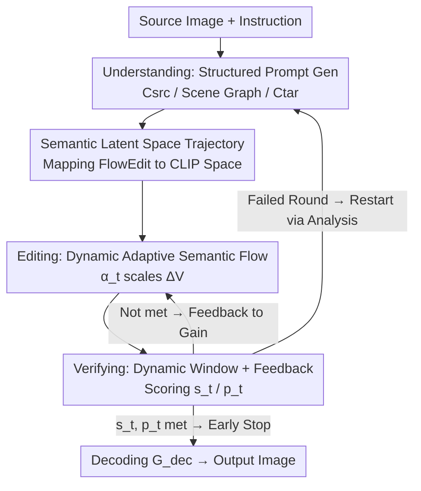

# UniEdit-I: Training-free Image Editing for Unified VLM via Iterative Understanding, Editing and Verifying

**Conference**: CVPR 2026  
**Paper**: [CVF Open Access](https://openaccess.thecvf.com/content/CVPR2026/html/Bai_UniEdit-I_Training-free_Image_Editing_for_Unified_VLM_via_Iterative_Understanding_CVPR_2026_paper.html)  
**Area**: Image Generation / Image Editing  
**Keywords**: Training-free image editing, Unified VLM, Closed-loop feedback, Semantic latent space, FlowEdit

## TL;DR
UniEdit-I utilizes the semantic latent space (CLIP features) of unified Vision-Language Models (VLMs) as an editable canvas and introduces an "Understanding-Editing-Verifying" (UEV) closed loop. By using the VLM to parse instructions, traverse FlowEdit trajectories in the CLIP space, and provide real-time feedback to dynamically adjust editing intensity or determine early stopping/retries, it achieves state-of-the-art open-source performance on GEdit-Bench, approaching GPT-4o, **without any fine-tuning or structural modifications**.

## Background & Motivation

**Background**: Unified VLMs (e.g., BLIP3-o, BAGEL, Step1X-Edit) aim to integrate high-level semantic understanding with pixel-level generation from diffusion models to achieve mutual enhancement. In image editing, mainstream approaches rely on diffusion models: either using inversion to map images back to noise followed by resampling, or employing attention manipulation/optimization-based editing. Recently, FlowEdit proposed constructing continuous trajectories from source to target in pixel or VAE latent space without inversion.

**Limitations of Prior Work**: These editing methods are typically **decoupled and open-loop**, performing static transformations along a pre-set fixed trajectory without dynamic feedback between semantic interpretation and visual generation. Consequently, editing intensity depends on manual tuning of the window $[n_{max}, n_{min}]$, often leading to over-editing or under-editing. Furthermore, while FlowEdit makes intermediate states "visible" (each step is an image), intermediate frames in pixel/VAE space are often plagued by ghosting, object deformation, and unnatural textures (Fig. 2 in the paper). VLMs cannot provide stable or reliable feedback on these corrupted images, meaning "observability" does not equate to "closed-loop capability."

**Key Challenge**: There is a fundamental **representation gap** within unified VLMs—the understanding side uses high-level, language-aligned semantic encoders (CLIP/SigLIP), while the generation side uses low-level, pixel-preserving autoencoders (VAE). This misalignment decouples semantic interpretation from visual generation; even if the VLM acts as both generator and judge, there is no shared space recognized by both.

**Goal**: To enable the unified VLM to act not just as an "after-the-fact evaluator" but as a **real-time, self-correcting closed-loop editor** by embedding its judgmental capabilities into the editing process itself, while remaining training-free and preserving the original architecture.

**Key Insight**: Drawing inspiration from Representation Autoencoder (RAE) and BLIP3-o, the authors propose performing diffusion modeling directly on the high-level features of pretrained semantic encoders. A key observation is that **editing in the semantic latent space (CLIP features) modifies "conceptual representations" rather than pixels**, ensuring that every intermediate state is both semantically coherent and visually reasonable (clean, no ghosting). This transforms the "visible but noisy" intermediate frames of FlowEdit into "clean and judgeable" frames, establishing the prerequisite for a closed loop.

**Core Idea**: Migrate the entire editing trajectory into the CLIP semantic latent space of the unified VLM and wrap it in an "Understanding-Editing-Verifying" loop. This allows the frozen VLM to serve as both the editor and the real-time judge, using its own multi-dimensional semantic feedback to dynamically regulate editing intensity and determine when to stop or restart.

## Method

### Overall Architecture

The input to UniEdit-I consists of a source image $I_{src}$ and an editing instruction $q$, while the output is the edited image $I_{out}$. The entire pipeline is driven by a **UEV (Understanding–Editing–Verifying) closed loop** operating within the CLIP feature space of BLIP3-o:

1.  **Understanding**: The VLM parses the source image and instruction into a structured source description $C_{src}$ and scene graph $G$, and subsequently derives a target description $C_{tar}$ and scene graph $G_{tar}$ based on minimal modifications.
2.  **Editing**: The inversion-free ODE trajectory of FlowEdit is **migrated to the CLIP semantic space**. Starting from the source CLIP features $Z_{src}$, the process iterates backwards in time, calculating the semantic velocity difference $\Delta V(t_i)$ under source/target conditions. Instead of fixed intensity, an adaptive gain $\alpha_t$ scales $\Delta V$ every $k=5$ steps based on verification feedback.
3.  **Verifying**: Current latent variables are decoded into images and fed back to the VLM to produce a global alignment score $s_t$ and a task completion score $p_t$. These scores adjust the gain for the editing module and determine whether to stop early or restart the cycle based on discrepancy analysis. Finally, the optimal latent $Z_{edit}$ is restored to a pixel image via the decoder $G_{dec}$.

### Key Designs

**1. Editing in the CLIP Semantic Latent Space: Replacing "Noisy" Trajectories with "Judgeable" Ones**

This foundation addresses the issue of VLM feedback instability caused by noisy intermediate frames in pixel/VAE space. The authors re-interpret the inversion-free ODE formula of FlowEdit for the CLIP feature space of BLIP3-o. This is feasible because the BLIP3-o generation process treats CLIP features $\hat{X}_1$ as an intermediate representation (text generates visual queries $Q_{cond}$, diffusion Transformer $D_\theta$ synthesizes CLIP features, and $G_{dec}$ decodes them). Thus, the CLIP space is a "native editable and decodable" canvas. Specifically, source features $Z_{src}$ are extracted, and starting from $Z^{UE}_{t_{nmax}} = Z_{src}$, noise-sharing probes are constructed:

$$Z_{src}(t_i) = (1-\lambda(t_i))Z_{src} + \lambda(t_i)\epsilon(t_i), \quad Z_{tar}(t_i) = Z_{edit}(t_i) + Z_{src}(t_i) - Z_{src}$$

The semantic velocity difference is calculated as $\Delta V(t_i) = V(Z^{tar}_{t_i}, t_i, C_{tar}) - V(Z^{src}_{t_i}, t_i, C_{src})$, and Euler integration proceeds as $Z^{UE}_{t_{i-1}} = Z^{UE}_{t_i} + (t_{i-1}-t_i)\cdot\alpha_{t_i}\cdot\Delta V(t_i)$. This is effective because modifying conceptual representations ensures that every decoded $Z^{UE}_t$ is clean and free of ghosting, enabling reliable VLM scoring.

**2. Understanding: Structured Prompt Generation for Minimal Actionable Changes**

To address vague instructions and unintended changes to irrelevant regions, UniEdit-I uses the VLM to generate structured outputs: a scene-aware source description $C_{src}$ (guided by edit types $\tau$ like "attribute change") and a scene graph $G$. It then performs **token-level minimal modification** on $C_{src}$ to obtain $C_{tar}$, while updating $G$ to $G_{tar}$. This $\{C_{src}, C_{tar}, G_{tar}\}$ triplet serves as structured semantic supervision, ensuring that only specified elements are modified while preserving the rest of the scene.

**3. Editing: Dynamic Adaptive Semantic Flow via Real-time Progress**

Unlike FlowEdit's uniform intensity, UniEdit-I adjusts gain every $k=5$ steps based on feedback:

$$\alpha_t = \alpha_{base}\cdot\sigma(\kappa_1\Delta s_t)\cdot(1-p_t)$$

Where $\alpha_{base}=1.0$, $\Delta s_t$ is the **improvement** in semantic alignment, and $p_t\in[0,1]$ is the task completion score. The sigmoid function $\sigma(\cdot)$ amplifies gain when alignment improves ($\Delta s_t>0$) and suppresses it otherwise. This combination realizes **coarse-to-fine** editing (strong semantic push early, gentle refinement later) purely driven by feedback rather than preset windows.

**4. Verifying: Dynamic Window and Dual-layer Feedback**

The verification module decodes $I_t = G_{dec}(Z^{UE}_t)$ every $k$ steps to produce $s_t$ (CLIP-Sim with $C_{tar}$) and $p_t$ (VLM completion score). This enables: ① **In-trajectory Early Stopping**: If $s_t > 0.85$ and $p_t > 0.9$ for two consecutive points, denoising stops. ② **Cross-round Retry**: If the final output fails thresholds, the VLM performs gap analysis to generate a corrective instruction $q_{new}$, and the UEV loop restarts from the best intermediate latent $Z^{UE}_{t^*}$.

## Key Experimental Results

Experiments use **BLIP3-o-8B** as the unified VLM with $T=30$ diffusion steps and a maximum of 3 UEV iterations. Metrics are reported on the GEdit-Bench English subset using the VIEScore system (Semantic Quality SQ, Perceptual Quality PQ, Overall O).

### Main Results

On GEdit-Bench-EN, UniEdit-I achieves the best open-source overall score while being **completely training-free**, surpassing models like Step1X-Edit and OmniGen2, and approaching the proprietary GPT-4o.

| Type | Model | G_SC ↑ | G_PQ ↑ | G_O ↑ |
|------|------|--------|--------|-------|
| Private | GPT-4o | 7.85 | 7.62 | 7.53 |
| Open | Instruct-Pix2Pix | 3.58 | 5.49 | 3.68 |
| Open | OmniGen | 5.96 | 5.89 | 5.06 |
| Open | Step1X-Edit | 7.09 | 6.76 | 6.70 |
| Open | BAGEL | 7.36 | 6.83 | 6.52 |
| Open | OmniGen2 | 7.16 | 6.77 | 6.41 |
| Open | **UniEdit-I (Ours)** | 7.16 | **7.40** | **7.06** |

Notably, the Perceptual Quality (PQ) of 7.40 is the highest among open-source methods, validating the visual benefits of clean intermediate frames in semantic space.

### Ablation Study

**Gain Strategy Ablation** (within CLIP space + dynamic window):

| Strategy | SQ ↑ | PQ ↑ | O ↑ |
|----------|------|------|-----|
| Fixed Gain ($\alpha_t=1.0$, i.e., FlowEdit) | 5.87 | 7.39 | 5.66 |
| Linear Decay ($\alpha_t=1.0-0.03t$) | 6.16 | 7.42 | 5.97 |
| Dynamic (w/o $p_t$, only $\Delta s_t$) | 6.73 | 7.38 | 6.77 |
| **Full Dynamic (Ours)** | **7.16** | 7.40 | **7.06** |

**Semantic vs VAE Space** (100 sample average):

| Latent Space | Artifact Score ↑ | Feedback Stability ↓ |
|--------|-----------|-------------|
| VAE (FLUX) | 5.35 ± 1.02 | 0.063 |
| CLIP (BLIP3-o) | **8.10 ± 0.53** | **0.025** |

> ⚠️ According to the table (CLIP std=0.025 vs VAE std=0.063), the semantic space is more stable. The core conclusion supports that the CLIP space provides more reliable feedback.

### Key Findings
- **Task completion score $p_t$ is crucial**: Removing it drops the score from O=7.06 to 6.77 due to occasional over-editing.
- **Semantic space is necessary for closed-loop**: The artifact score for CLIP (8.10) is significantly higher than VAE (5.35), making stable feedback possible.
- **Efficient Convergence**: 97.6% of samples reach optimal output within the first denoising trajectory, with early stopping significantly reducing redundant steps.
- **Task Adaptability**: The system can handle abstract instructions or composite edits simply by adjusting verification prompts without algorithmic changes.

## Highlights & Insights
- **Embedding Evaluation into the Generation Loop**: This is the most innovative aspect—shifting the VLM from a passive evaluator to an active conductor. This "reflective generation" paradigm can potentially extend to video or 3D editing.
- **Semantic Space Dividends**: Operating in CLIP space yields both high perceptual quality and control stability, solving two problems with one structural shift.
- **Zero-training Plug-and-Play**: It leverages the frozen BLIP3-o and prompt engineering to outperform trained open-source editors, making it highly portable.

## Limitations & Future Work
- **Bias Inheritance**: The method is limited by the underlying BLIP3-o semantic representation; poor coverage of fine-grained or rare concepts directly impacts performance.
- **Architectural Dependency**: The approach relies on models where semantic features are natively decodable. Its applicability to pure discrete-token AR architectures remains unverified.
- **Self-Confirmation Bias**: Since the scores come from the same frozen VLM used for editing, if the base model has biased "self-evaluation," early stopping might misfire.

## Related Work & Insights
- **vs FlowEdit**: While FlowEdit uses fixed-gain open-loop editing in VAE space with ghosting artifacts, UniEdit-I moves the ODE to CLIP space and introduces dynamic feedback for a self-correcting closed loop.
- **vs Step1X-Edit / BAGEL**: While others rely on large-scale paired editing data, UniEdit-I is the first to achieve superior results **training-free**, treating the VLM as an active agent.
- **vs RAE / BLIP3-o**: While prior work proved semantic space is viable for generation, UniEdit-I further demonstrates that it is a *requirement* for reliable closed-loop image editing.

## Rating
- Novelty: ⭐⭐⭐⭐⭐ 
- Experimental Thoroughness: ⭐⭐⭐⭐ 
- Writing Quality: ⭐⭐⭐⭐ 
- Value: ⭐⭐⭐⭐⭐ 

<!-- RELATED:START -->

## Related Papers

- [\[CVPR 2026\] Dynamic-eDiTor: Training-Free Text-Driven 4D Scene Editing with Multimodal Diffusion Transformer](dynamic-editor_training-free_text-driven_4d_scene_editing_with_multimodal_diffus.md)
- [\[CVPR 2026\] HP-Edit: A Human-Preference Post-Training Framework for Image Editing](hp-edit_a_human-preference_post-training_framework_for_image_editing.md)
- [\[CVPR 2026\] Language-Free Generative Editing from One Visual Example](language-free_generative_editing_from_one_visual_example.md)
- [\[ICLR 2026\] Training-Free Reward-Guided Image Editing via Trajectory Optimal Control](../../ICLR2026/image_generation/training-free_reward-guided_image_editing_via_trajectory_optimal_control.md)
- [\[CVPR 2026\] Understanding, Accelerating, and Improving MeanFlow Training](understanding_accelerating_and_improving_meanflow_training.md)

<!-- RELATED:END -->
